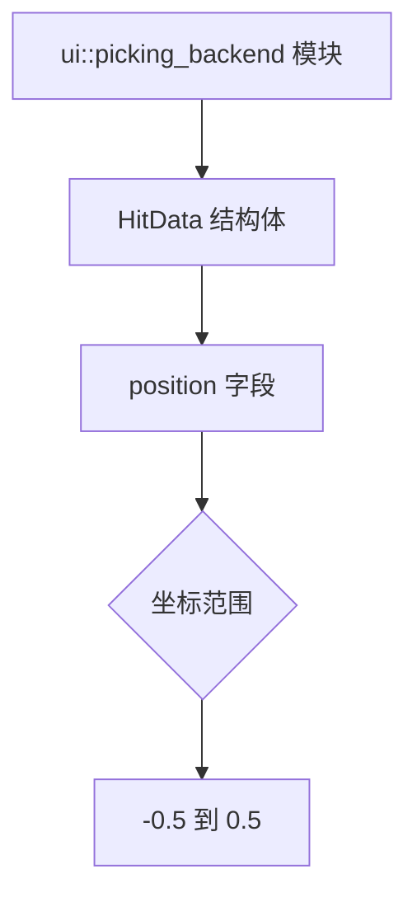

+++
title = "#20465 Update documentation of HitData coordinates range in ui::picking_backend"
date = "2025-08-09T00:00:00"
draft = false
template = "pull_request_page.html"
in_search_index = false

[extra]
current_language = "zh-cn"
available_languages = {"en" = { name = "English", url = "/pull_request/bevy/2025-08/pr-20465-en-20250809" }, "zh-cn" = { name = "中文", url = "/pull_request/bevy/2025-08/pr-20465-zh-cn-20250809" }}
+++

## PR #20465: Update documentation of HitData coordinates range in ui::picking_backend

### 基本信息
- **标题**: Update documentation of HitData coordinates range in ui::picking_backend
- **PR 链接**: https://github.com/bevyengine/bevy/pull/20465
- **作者**: gwafotapa
- **状态**: 已合并
- **标签**: C-Docs, D-Trivial, A-UI, S-Ready-For-Final-Review, A-Picking
- **创建时间**: 2025-08-08T15:16:55Z
- **合并时间**: 2025-08-09T22:01:26Z
- **合并人**: alice-i-cecile

### 描述翻译
`HitData` 的坐标范围现在介于 `-0.5` 和 `0.5` 之间。`ui::picking_backend` 模块的文档仍然记录着旧值 `0.0` 和 `1.0`。

### PR 技术分析

#### 问题背景
在 Bevy 引擎的 UI 拾取系统(picking system)中，`HitData` 结构体用于存储用户交互命中的位置数据。该结构体的 `position` 字段表示相对于 UI 节点的标准化坐标。某次重构后，坐标范围从 `[0.0, 1.0]` 变更为 `[-0.5, 0.5]`，但相关模块文档未同步更新。这导致文档与实际实现存在分歧，可能引发以下问题：

1. 开发者根据文档实现的扩展功能会出现坐标计算错误
2. 新贡献者可能因文档过时产生理解偏差
3. 调试过程中出现预期外的坐标值会增加排查成本

#### 解决方案
PR 采用最小化修改策略，仅更新 `picking_backend.rs` 中的三行文档注释。修改方案直接替换坐标描述：
- 旧范围：`(0.,0.,0.)`（左上角）到 `(1., 1., 0.)`（右下角）
- 新范围：`(-0.5, -0.5, 0.)`（左上角）到 `(0.5, 0.5, 0.)`（右下角）

这种改动无需修改任何逻辑代码，但能确保文档准确反映当前实现。由于是纯文档更新，不影响运行时行为，因此风险极低。

#### 技术实现
修改集中体现在 `crates/bevy_ui/src/picking_backend.rs` 文件的注释更新。关键变化是将坐标范围描述从旧标准迁移到新标准：

```rust
// 修改前：
// - The `position` reported in `HitData` is normalized relative to the node, with `(0.,0.,0.)` at
//   the top left and `(1., 1., 0.)` in the bottom right. Coordinates are relative to the entire
//   node, not just the visible region. This backend does not provide a `normal`.

// 修改后：
// - The `position` reported in `HitData` is normalized relative to the node, with
//   `(-0.5, -0.5, 0.)` at the top left and `(0.5, 0.5, 0.)` in the bottom right. Coordinates are
//   relative to the entire node, not just the visible region. This backend does not provide a `normal`.
```

#### 技术要点
1. **坐标系转换意义**：新坐标系将原点置于节点中心，符合常见图形API规范（如OpenGL/Vulkan的NDC空间）
2. **兼容性考虑**：文档更新不破坏现有API，仅修正说明文字
3. **维护成本**：微小的修改显著降低后续开发者的认知负担
4. **质量保证**：即使简单文档更新也经过PR审查流程（由alice-i-cecile合并）

#### 影响分析
- **正向影响**：消除文档与实现的差异，提升API可预测性
- **维护影响**：减少因文档过时导致的issue和咨询
- **风险控制**：纯文本修改无运行时影响，无需回归测试

### 可视化关系


### 关键文件变更
**文件路径**: `crates/bevy_ui/src/picking_backend.rs`  
**变更说明**: 更新 `HitData.position` 的坐标范围文档，与当前实现保持一致  

```rust
// 修改前:
// - The `position` reported in `HitData` is normalized relative to the node, with `(0.,0.,0.)` at
//   the top left and `(1., 1., 0.)` in the bottom right. Coordinates are relative to the entire
//   node, not just the visible region. This backend does not provide a `normal`.

// 修改后:
// - The `position` reported in `HitData` is normalized relative to the node, with
//   `(-0.5, -0.5, 0.)` at the top left and `(0.5, 0.5, 0.)` in the bottom right. Coordinates are
//   relative to the entire node, not just the visible region. This backend does not provide a `normal`.
```

### 扩展阅读
1. [Bevy UI 坐标系统文档](https://docs.rs/bevy_ui/latest/bevy_ui/entity/index.html)
2. [PR #19868 - 原始坐标变更](https://github.com/bevyengine/bevy/pull/19868)
3. [标准化设备坐标(NDC)概念](https://learnopengl.com/Getting-started/Coordinate-Systems)