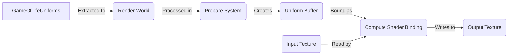

+++
title = "#20466 Update Game of Life compute example to include a uniform buffer variable"
date = "2025-08-11T00:00:00"
draft = false
template = "pull_request_page.html"
in_search_index = true

[taxonomies]
list_display = ["show"]

[extra]
current_language = "en"
available_languages = {"en" = { name = "English", url = "/pull_request/bevy/2025-08/pr-20466-en-20250811" }, "zh-cn" = { name = "中文", url = "/pull_request/bevy/2025-08/pr-20466-zh-cn-20250811" }}
labels = ["A-Rendering", "C-Examples", "X-Contentious"]
+++

## Analysis of PR #20466: Update Game of Life compute example to include a uniform buffer variable

### Basic Information
- **Title**: Update Game of Life compute example to include a uniform buffer variable  
- **PR Link**: https://github.com/bevyengine/bevy/pull/20466  
- **Author**: dontgetfoundout  
- **Status**: MERGED  
- **Labels**: A-Rendering, C-Examples, S-Ready-For-Final-Review, X-Contentious  
- **Created**: 2025-08-09T02:25:52Z  
- **Merged**: 2025-08-11T23:11:40Z  
- **Merged By**: alice-i-cecile  

### Description Translation
The original description is in English and is preserved exactly as-is:

# Objective  
It is currently a little unclear how to use uniform buffers in compute shaders. The other examples of uniform buffers in the Bevy examples and codebase either are built on Materials or use `DynamicUniformBuffer`s created from a `ViewNode`. Neither of these are a great fit for use in a compute shader.  

## Solution  
Update the compute shader example to pass a uniform buffer to the shader that determines the color for alive cells.  

## Discussion Topics  
- Is this the right way to pass this data to the shader?  
- Should we be encouraging use of uniform buffers in compute shaders at all? Some in the community prefer the ergonomics of storage buffers in most (all?) compute shader cases. Do we want to push users to use storage buffers instead?  
- I took the idea to use color as the input from IceSentry on Discord, but this did require me to change the texture format to support non-red colors. Does this undermine the goals of the shader example? Is this the wrong texture format?  

## Testing  
- Did you test these changes? If so, how?  
  - The changes were manually validated with a number of different `LinearRgba` values for `alive_color`  
- Are there any parts that need more testing?  
- How can other people (reviewers) test your changes? Is there anything specific they need to know?  
  - `cargo run --example compute_shader_game_of_life`  
  - Color can be set using `alive_color` property on `GameOfLifeUniforms`  
- If relevant, what platforms did you test these changes on, and are there any important ones you can't test?  
  - Manually validated on Windows and WASM (WebGPU) targets  
    - WASM WebGL2 doesn't appear to support textures in compute shaders  

---  

## Showcase  
  

### The Story of This Pull Request

#### The Problem and Context
The existing Bevy compute shader examples lacked a clear demonstration of how to use uniform buffers in compute shaders. Existing implementations either relied on Material systems or DynamicUniformBuffers tied to ViewNodes, neither of which are suitable for pure compute shader workflows. This gap made it difficult for developers to understand how to pass uniform data directly to compute shaders, a common requirement for GPU computation tasks.

#### The Solution Approach
The solution introduces a uniform buffer to pass configuration data (specifically alive cell color) to the Game of Life compute shader. This required:
1. Changing texture formats to support RGBA color data
2. Adding a uniform buffer binding to the shader
3. Creating corresponding Rust structs and buffer management
4. Maintaining backward compatibility by storing cell state in the alpha channel

The author considered alternative approaches like storage buffers but chose uniforms as they're simpler for small, frequently updated data. The color parameter was added to demonstrate practical usage while maintaining the simulation's core logic.

#### The Implementation
The implementation modifies both the shader code and Rust example. The shader now uses RGBA textures instead of single-channel textures, storing cell state in the alpha channel while using RGB for display color. A new uniform buffer struct holds the alive color configuration.

In the Rust code:
1. Texture format changed from R32Float to Rgba32Float
2. Added GameOfLifeUniforms resource with alive_color field
3. Created uniform buffer binding in the layout
4. Updated bind groups to include the uniform buffer
5. Added buffer upload logic to the prepare system

#### Technical Insights
Key technical aspects:
- **Texture Format Change**: Required to support color data (RGBA32Float instead of R32Float)
- **State Preservation**: Cell state maintained in alpha channel to avoid breaking simulation logic
- **Uniform Buffer Usage**: Demonstrates buffer creation, writing, and binding
- **Resource Extraction**: Uses ExtractResourcePlugin for uniform data
- **Cross-Platform Considerations**: Tested on Windows and WebGPU (WASM)

The uniform buffer approach is optimal for small, frequently updated data (<4KB). For larger datasets, storage buffers would be more appropriate, as acknowledged in the code comments.

#### The Impact
These changes:
1. Provide a clear reference for uniform buffer usage in compute shaders
2. Demonstrate proper resource extraction and buffer management
3. Maintain backward compatibility with existing simulation logic
4. Improve visual customization through color parameters
5. Validate WebGPU compatibility for the pattern

The solution balances educational value with practical implementation, though it intentionally leaves open questions about alternative buffer types to encourage community discussion.

### Visual Representation



### Key Files Changed

#### 1. `assets/shaders/game_of_life.wgsl`
**Changes**: Added uniform buffer support and modified texture formats  
**Purpose**: Enable color configuration and maintain cell state in alpha channel  

```wgsl
// Before:
@group(0) @binding(0) var input: texture_storage_2d<r32float, read>;
@group(0) @binding(1) var output: texture_storage_2d<r32float, write>;

fn is_alive(location: vec2<i32>, offset_x: i32, offset_y: i32) -> i32 {
    let value: vec4<f32> = textureLoad(input, location + vec2<i32>(offset_x, offset_y));
    return i32(value.x);
}

// After:
@group(0) @binding(0) var input: texture_storage_2d<rgba32float, read>;
@group(0) @binding(1) var output: texture_storage_2d<rgba32float, write>;
@group(0) @binding(2) var<uniform> config: GameOfLifeUniforms;

struct GameOfLifeUniforms {
    alive_color: vec4<f32>,
}

fn is_alive(location: vec2<i32>, offset_x: i32, offset_y: i32) -> i32 {
    let value: vec4<f32> = textureLoad(input, location + vec2<i32>(offset_x, offset_y));
    return i32(value.a);
}
```

#### 2. `examples/shader/compute_shader_game_of_life.rs`
**Changes**: Added uniform buffer handling and updated texture formats  
**Purpose**: Create and manage uniform buffer resources  

```rust
// Before:
let mut image = Image::new_target_texture(SIZE.0, SIZE.1, TextureFormat::R32Float);

// After:
let mut image = Image::new_target_texture(SIZE.0, SIZE.1, TextureFormat::Rgba32Float);

// Added resource:
#[derive(Resource, Clone, ExtractResource, ShaderType)]
struct GameOfLifeUniforms {
    alive_color: LinearRgba,
}

// In prepare_bind_group:
let mut uniform_buffer = UniformBuffer::from(game_of_life_uniforms.into_inner());
uniform_buffer.write_buffer(&render_device, &queue);

// Updated bind group layout:
&BindGroupLayoutEntries::sequential(
    ShaderStages::COMPUTE,
    (
        texture_storage_2d(TextureFormat::Rgba32Float, StorageTextureAccess::ReadOnly),
        texture_storage_2d(TextureFormat::Rgba32Float, StorageTextureAccess::WriteOnly),
        uniform_buffer::<GameOfLifeUniforms>(false),
    ),
),
```

### Further Reading
1. [WGSL Uniform Buffer Documentation](https://gpuweb.github.io/gpuweb/wgsl/#uniform-buffer)  
2. [Bevy Render Pipeline Guide](https://bevyengine.org/learn/book/rendering/)  
3. [WebGPU Buffer Usage Best Practices](https://webgpufundamentals.org/webgpu/lessons/webgpu-uniforms.html)  
4. [Comparison of Uniform vs Storage Buffers](https://github.com/gpuweb/gpuweb/wiki/Buffer-Usage)  

### Full Code Diff
```diff
diff --git a/assets/shaders/game_of_life.wgsl b/assets/shaders/game_of_life.wgsl
index 0eb5e32e6ec56..7ad264fc33f7a 100644
--- a/assets/shaders/game_of_life.wgsl
+++ b/assets/shaders/game_of_life.wgsl
@@ -4,9 +4,15 @@
 // Two textures are needed for the game of life as each pixel of step N depends on the state of its
 // neighbors at step N-1.
 
-@group(0) @binding(0) var input: texture_storage_2d<r32float, read>;
+@group(0) @binding(0) var input: texture_storage_2d<rgba32float, read>;
 
-@group(0) @binding(1) var output: texture_storage_2d<r32float, write>;
+@group(0) @binding(1) var output: texture_storage_2d<rgba32float, write>;
+
+@group(0) @binding(2) var<uniform> config: GameOfLifeUniforms;
+
+struct GameOfLifeUniforms {
+    alive_color: vec4<f32>,
+}
 
 fn hash(value: u32) -> u32 {
     var state = value;
@@ -29,14 +35,15 @@ fn init(@builtin(global_invocation_id) invocation_id: vec3<u32>, @builtin(num_wo
 
     let randomNumber = randomFloat((invocation_id.y << 16u) | invocation_id.x);
     let alive = randomNumber > 0.9;
-    let color = vec4<f32>(f32(alive));
+    // Use alpha channel to keep track of cell's state
+    let color = vec4(config.alive_color.rgb, f32(alive));
 
     textureStore(output, location, color);
 }
 
 fn is_alive(location: vec2<i32>, offset_x: i32, offset_y: i32) -> i32 {
     let value: vec4<f32> = textureLoad(input, location + vec2<i32>(offset_x, offset_y));
-    return i32(value.x);
+    return i32(value.a);
 }
 
 fn count_alive(location: vec2<i32>) -> i32 {
@@ -65,7 +72,7 @@ fn update(@builtin(global_invocation_id) invocation_id: vec3<u32>) {
     } else {
         alive = false;
     }
-    let color = vec4<f32>(f32(alive));
+    let color = vec4(config.alive_color.rgb, f32(alive));
 
     textureStore(output, location, color);
 }
diff --git a/examples/shader/compute_shader_game_of_life.rs b/examples/shader/compute_shader_game_of_life.rs
index a11767f06ff0d..fb157e3091f2c 100644
--- a/examples/shader/compute_shader_game_of_life.rs
+++ b/examples/shader/compute_shader_game_of_life.rs
@@ -9,8 +9,11 @@ use bevy::{
         extract_resource::{ExtractResource, ExtractResourcePlugin},
         render_asset::{RenderAssetUsages, RenderAssets},
         render_graph::{self, RenderGraph, RenderLabel},
-        render_resource::{binding_types::texture_storage_2d, *},
-        renderer::{RenderContext, RenderDevice},
+        render_resource::{
+            binding_types::{texture_storage_2d, uniform_buffer},
+            *,
+        },
+        renderer::{RenderContext, RenderDevice, RenderQueue},
         texture::GpuImage,
         Render, RenderApp, RenderStartup, RenderSystems,
     },
@@ -51,7 +54,7 @@ fn main() {
 }
 
 fn setup(mut commands: Commands, mut images: ResMut<Assets<Image>>) {
-    let mut image = Image::new_target_texture(SIZE.0, SIZE.1, TextureFormat::R32Float);
+    let mut image = Image::new_target_texture(SIZE.0, SIZE.1, TextureFormat::Rgba32Float);
     image.asset_usage = RenderAssetUsages::RENDER_WORLD;
     image.texture_descriptor.usage =
         TextureUsages::COPY_DST | TextureUsages::STORAGE_BINDING | TextureUsages::TEXTURE_BINDING;
@@ -72,6 +75,10 @@ fn setup(mut commands: Commands, mut images: ResMut<Assets<Image>>) {
         texture_a: image0,
         texture_b: image1,
     });
+
+    commands.insert_resource(GameOfLifeUniforms {
+        alive_color: LinearRgba::RED,
+    });
 }
 
 // Switch texture to display every frame to show the one that was written to most recently.
@@ -92,7 +99,10 @@ impl Plugin for GameOfLifeComputePlugin {
     fn build(&self, app: &mut App) {
         // Extract the game of life image resource from the main world into the render world
         // for operation on by the compute shader and display on the sprite.
-        app.add_plugins(ExtractResourcePlugin::<GameOfLifeImages>::default());
+        app.add_plugins((
+            ExtractResourcePlugin::<GameOfLifeImages>::default(),
+            ExtractResourcePlugin::<GameOfLifeUniforms>::default(),
+        ));
         let render_app = app.sub_app_mut(RenderApp);
         render_app
             .add_systems(RenderStartup, init_game_of_life_pipeline)
@@ -113,6 +123,11 @@ struct GameOfLifeImages {
     texture_b: Handle<Image>,
 }
 
+#[derive(Resource, Clone, ExtractResource, ShaderType)]
+struct GameOfLifeUniforms {
+    alive_color: LinearRgba,
+}
+
 #[derive(Resource)]
 struct GameOfLifeImageBindGroups([BindGroup; 2]);
 
@@ -121,19 +136,35 @@ fn prepare_bind_group(
     pipeline: Res<GameOfLifePipeline>,
     gpu_images: Res<RenderAssets<GpuImage>>,
     game_of_life_images: Res<GameOfLifeImages>,
+    game_of_life_uniforms: Res<GameOfLifeUniforms>,
     render_device: Res<RenderDevice>,
+    queue: Res<RenderQueue>,
 ) {
     let view_a = gpu_images.get(&game_of_life_images.texture_a).unwrap();
     let view_b = gpu_images.get(&game_of_life_images.texture_b).unwrap();
+
+    // Uniform buffer is used here to demonstrate how to set up a uniform in a compute shader
+    // Alternatives such as storage buffers or push constants may be more suitable for your use case
+    let mut uniform_buffer = UniformBuffer::from(game_of_life_uniforms.into_inner());
+    uniform_buffer.write_buffer(&render_device, &queue);
+
     let bind_group_0 = render_device.create_bind_group(
         None,
         &pipeline.texture_bind_group_layout,
-        &BindGroupEntries::sequential((&view_a.texture_view, &view_b.texture_view)),
+        &BindGroupEntries::sequential((
+            &view_a.texture_view,
+            &view_b.texture_view,
+            &uniform_buffer,
+        )),
     );
     let bind_group_1 = render_device.create_bind_group(
         None,
         &pipeline.texture_bind_group_layout,
-        &BindGroupEntries::sequential((&view_b.texture_view, &view_a.texture_view)),
+        &BindGroupEntries::sequential((
+            &view_b.texture_view,
+            &view_a.texture_view,
+            &uniform_buffer,
+        )),
     );
     commands.insert_resource(GameOfLifeImageBindGroups([bind_group_0, bind_group_1]));
 }
@@ -156,8 +187,9 @@ fn init_game_of_life_pipeline(
         &BindGroupLayoutEntries::sequential(
             ShaderStages::COMPUTE,
             (
-                texture_storage_2d(TextureFormat::R32Float, StorageTextureAccess::ReadOnly),
-                texture_storage_2d(TextureFormat::R32Float, StorageTextureAccess::WriteOnly),
+                texture_storage_2d(TextureFormat::Rgba32Float, StorageTextureAccess::ReadOnly),
+                texture_storage_2d(TextureFormat::Rgba32Float, StorageTextureAccess::WriteOnly),
+                uniform_buffer::<GameOfLifeUniforms>(false),
             ),
         ),
     );
```