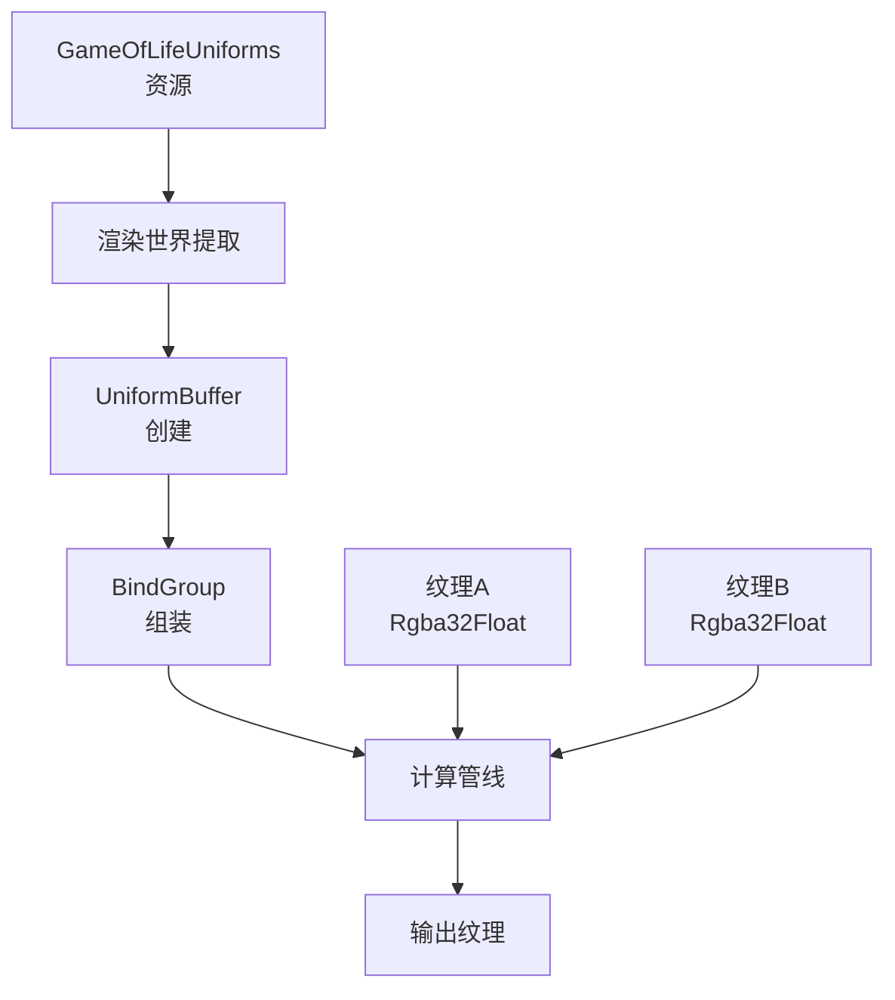

+++
title = "#20466 Update Game of Life compute example to include a uniform buffer variable"
date = "2025-08-11T00:00:00"
draft = false
template = "pull_request_page.html"
in_search_index = false

[extra]
current_language = "zh-cn"
available_languages = {"en" = { name = "English", url = "/pull_request/bevy/2025-08/pr-20466-en-20250811" }, "zh-cn" = { name = "中文", url = "/pull_request/bevy/2025-08/pr-20466-zh-cn-20250811" }}
labels = ["A-Rendering", "C-Examples", "X-Contentious"]
+++

# PR 分析报告：在 Game of Life 计算示例中添加 uniform buffer 变量

## Basic Information
- **Title**: Update Game of Life compute example to include a uniform buffer variable
- **PR Link**: https://github.com/bevyengine/bevy/pull/20466
- **Author**: dontgetfoundout
- **Status**: MERGED
- **Labels**: A-Rendering, C-Examples, S-Ready-For-Final-Review, X-Contentious
- **Created**: 2025-08-09T02:25:52Z
- **Merged**: 2025-08-11T23:11:40Z
- **Merged By**: alice-i-cecile

## Description Translation
**目标**  
目前在使用计算着色器中的 uniform buffer 方面还不够清晰。Bevy 示例和代码库中的其他 uniform buffer 示例要么基于 Materials 构建，要么使用从 `ViewNode` 创建的 `DynamicUniformBuffer`。这两种方法都不太适合在计算着色器中使用。

**解决方案**  
更新计算着色器示例，传递一个 uniform buffer 到着色器，用于确定活细胞的颜色。

**讨论主题**  
- 这是传递数据到着色器的正确方式吗？
- 我们是否应该鼓励在计算着色器中使用 uniform buffer？社区中有些人更喜欢在大多数（所有？）计算着色器场景中使用 storage buffer 的 ergonomics。我们是否应该引导用户使用 storage buffer 替代？
- 在 Discord 上从 IceSentry 获得了使用颜色作为输入的想法，但这需要我更改纹理格式以支持非红色。这是否破坏了着色器示例的目标？这是错误的纹理格式吗？

**测试**  
- 是否测试了这些更改？如果是，如何测试的？
  - 使用多个不同的 `alive_color` 的 `LinearRgba` 值进行了手动验证
- 是否有部分需要更多测试？
- 其他人（审阅者）如何测试你的更改？他们需要了解什么具体信息？
  - `cargo run --example compute_shader_game_of_life`
  - 颜色可以通过 `GameOfLifeUniforms` 的 `alive_color` 属性设置
- 如果相关，你在哪些平台上测试了这些更改，有哪些重要平台无法测试？
  - 在 Windows 和 WASM (WebGPU) 目标上进行了手动验证
    - WASM WebGL2 似乎不支持计算着色器中的纹理

---

**效果展示**  


## The Story of This Pull Request

### 问题和背景
在 Bevy 中，计算着色器使用 uniform buffer 的文档和示例存在缺口。现有示例主要面向材质系统或视图节点，不适用于纯计算着色器场景。Game of Life 计算示例作为关键教学资源，缺乏展示如何传递配置参数到计算着色器的标准方法，这对开发者学习计算管线构成障碍。

### 解决方案设计
PR 通过扩展 Game of Life 示例，引入 uniform buffer 传递活细胞颜色参数。核心设计决策包括：
1. 使用 alpha 通道存储细胞状态（0/1），RGB 通道存储颜色
2. 选择 `Rgba32Float` 纹理格式支持颜色数据
3. 采用 uniform buffer 而非 storage buffer 或 push constants，因其更适合小规模常量数据

替代方案考虑过 storage buffer，但 uniform buffer 对配置参数更符合 WebGPU 最佳实践。纹理格式变更是必要妥协，使示例能展示完整数据流。

### 实现细节
#### 着色器改造
```wgsl
// 添加 uniform buffer 定义
@group(0) @binding(2) var<uniform> config: GameOfLifeUniforms;

struct GameOfLifeUniforms {
    alive_color: vec4<f32>,
}

// 初始化时使用 uniform 颜色
let color = vec4(config.alive_color.rgb, f32(alive));

// 检测细胞状态改为读取 alpha 通道
fn is_alive(location: vec2<i32>, offset_x: i32, offset_y: i32) -> i32 {
    let value: vec4<f32> = textureLoad(input, location + vec2<i32>(offset_x, offset_y));
    return i32(value.a); // 从 .x 改为 .a
}
```
着色器改造关键点：
- 新增 binding point 2 用于 uniform buffer
- 细胞状态存储从单通道(R)迁移到 alpha 通道
- 所有 texture store/load 操作适配新格式

#### Rust 端实现
```rust
// 新增 uniform 资源
#[derive(Resource, Clone, ExtractResource, ShaderType)]
struct GameOfLifeUniforms {
    alive_color: LinearRgba,
}

// 管线初始化添加 uniform buffer binding
&BindGroupLayoutEntries::sequential(
    ShaderStages::COMPUTE,
    (
        texture_storage_2d(TextureFormat::Rgba32Float, ...),
        texture_storage_2d(TextureFormat::Rgba32Float, ...),
        uniform_buffer::<GameOfLifeUniforms>(false), // 新增
    ),
);

// 准备 bind group 时写入 uniform
let mut uniform_buffer = UniformBuffer::from(game_of_life_uniforms.into_inner());
uniform_buffer.write_buffer(&render_device, &queue);

// bind group 包含 uniform
&BindGroupEntries::sequential((
    &view_a.texture_view,
    &view_b.texture_view,
    &uniform_buffer, // 新增
));
```
主要变更：
1. 新增 `GameOfLifeUniforms` 资源并实现提取逻辑
2. 管线布局添加 uniform buffer binding point
3. 准备 bind group 时创建并写入 uniform buffer
4. 纹理格式从 `R32Float` 改为 `Rgba32Float`

### 技术权衡
1. **纹理格式变更**：原示例使用单通道纹理，改为 RGBA 使内存占用增加 4 倍，但这是支持颜色参数的必要代价
2. **状态存储策略**：使用 alpha 通道而非单独纹理，简化了管线复杂度
3. **buffer 类型选择**：uniform buffer 适合小数据，若需频繁更新大块数据应考虑 storage buffer
4. **平台兼容性**：明确 WebGL2 不支持计算着色器纹理操作，避免用户困惑

### 影响和验证
此修改：
1. 提供标准化的 uniform buffer 使用示例
2. 展示计算管线参数传递完整流程
3. 保持后向兼容（默认仍为红色）
4. 经 Windows/WASM 验证，支持运行时修改颜色：
```rust
commands.insert_resource(GameOfLifeUniforms {
    alive_color: LinearRgba::GREEN, // 可动态修改
});
```

## Visual Representation



## Key Files Changed

### `assets/shaders/game_of_life.wgsl` (+12/-5)
**修改目的**：适配 uniform buffer 和颜色支持，重构细胞状态存储方式  
```wgsl
// 关键变更前：
@group(0) @binding(0) var input: texture_storage_2d<r32float, read>;
@group(0) @binding(1) var output: texture_storage_2d<r32float, write>;
...
let color = vec4<f32>(f32(alive)); // 单通道存储

// 关键变更后：
@group(0) @binding(0) var input: texture_storage_2d<rgba32float, read>;
@group(0) @binding(1) var output: texture_storage_2d<rgba32float, write>;
@group(0) @binding(2) var<uniform> config: GameOfLifeUniforms; // 新增 uniform

struct GameOfLifeUniforms {
    alive_color: vec4<f32>,
}

// 使用 alpha 通道存储状态，RGB 来自 uniform
let color = vec4(config.alive_color.rgb, f32(alive));
```

### `examples/shader/compute_shader_game_of_life.rs` (+40/-8)
**修改目的**：实现 uniform buffer 的创建、管理和绑定  
```rust
// 新增 uniform 资源定义
#[derive(Resource, Clone, ExtractResource, ShaderType)]
struct GameOfLifeUniforms {
    alive_color: LinearRgba,
}

// 初始化时创建资源
commands.insert_resource(GameOfLifeUniforms {
    alive_color: LinearRgba::RED,
});

// 管线布局添加 uniform binding
&BindGroupLayoutEntries::sequential(
    ...
    uniform_buffer::<GameOfLifeUniforms>(false), // 新增 binding
);

// 准备 bind group 时写入 uniform
let mut uniform_buffer = UniformBuffer::from(game_of_life_uniforms.into_inner());
uniform_buffer.write_buffer(&render_device, &queue);

// bind group 包含 uniform buffer
&BindGroupEntries::sequential((
    &view_a.texture_view,
    &view_b.texture_view,
    &uniform_buffer, // 新增
));
```

## Further Reading
1. [WGSL Uniform Buffer 规范](https://www.w3.org/TR/WGSL/#uniform-buffer)
2. [Bevy 渲染管线架构](https://bevyengine.org/learn/book/next/render-architecture/)
3. [WebGPU Buffer 使用最佳实践](https://web.dev/gpu-compute/)
4. [计算着色器优化技巧](https://github.com/gpuweb/gpuweb/wiki/Implementation-Status#compute-pipeline)