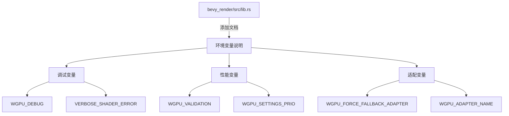

+++
title = "#20469 add module doc to bevy_render"
date = "2025-08-09T00:00:00"
draft = false
template = "pull_request_page.html"
in_search_index = false

[extra]
current_language = "zh-cn"
available_languages = {"en" = { name = "English", url = "/pull_request/bevy/2025-08/pr-20469-en-20250809" }, "zh-cn" = { name = "中文", url = "/pull_request/bevy/2025-08/pr-20469-zh-cn-20250809" }}
labels = ["C-Docs", "A-Rendering"]
+++

# add module doc to bevy_render

## Basic Information
- **Title**: add module doc to bevy_render
- **PR Link**: https://github.com/bevyengine/bevy/pull/20469
- **Author**: atlv24
- **Status**: MERGED
- **Labels**: C-Docs, A-Rendering, S-Ready-For-Final-Review
- **Created**: 2025-08-09T03:18:31Z
- **Merged**: 2025-08-09T18:03:40Z
- **Merged By**: alice-i-cecile

## Description Translation
# Objective

- 目前没有关于环境变量的文档

## Solution

- 在 bevy_render 的模块文档（目前不存在）中添加文档

## Testing

- 

## The Story of This Pull Request

### 问题背景
在开发 bevy_render 模块时，开发人员发现缺少关于控制渲染行为的環境變量 (environment variables) 的文档。这些变量对调试和配置渲染行为至关重要，特别是在处理图形适配器选择、验证层启用、着色器错误输出等方面。没有集中文档会导致开发者需要搜索源代码或外部文档才能了解可用选项，降低了开发效率。

### 解决方案
开发者选择在 bevy_render 的模块级文档中添加明确说明，这是最直接的解决方案。模块文档位于 crate 入口点 (`lib.rs`)，是开发者查找渲染系统信息的自然位置。该方案不需要修改任何功能代码，只需添加文档注释。

### 实现细节
在 `bevy_render/src/lib.rs` 文件顶部添加了 Rust 文档注释（`//!`），列出了七个关键環境變量及其作用：
```rust
//! # Useful Environment Variables
//!
//! Both `bevy_render` and `wgpu` have a number of environment variable options for changing the runtime behavior
//! of both crates. Many of these may be useful in development or release environments.
//!
//! - `WGPU_DEBUG=1` enables debug labels, which can be useful in release builds.
//! - `WGPU_VALIDATION=0` disables validation layers. This can help with particularly spammy errors.
//! - `WGPU_FORCE_FALLBACK_ADAPTER=1` attempts to force software rendering. This typically matches what is used in CI.
//! - `WGPU_ADAPTER_NAME` allows selecting a specific adapter by name.
//! - `WGPU_SETTINGS_PRIO=webgl2` uses webgl2 limits.
//! - `WGPU_SETTINGS_PRIO=compatibility` uses webgpu limits.
//! - `VERBOSE_SHADER_ERROR=1` prints more detailed information about WGSL compilation errors, such as shader defs and shader entrypoint.
```
文档分为两部分：
1. 总体说明：指出这些变量同时影响 bevy_render 和 wgpu，适用于开发和发布环境
2. 具体变量列表：每个条目明确说明变量名和效果，例如：
   - `WGPU_DEBUG=1` 在发布构建中启用调试标签
   - `VERBOSE_SHADER_ERROR=1` 输出更详细的 WGSL 着色器编译错误

### 技术考量
文档位置选择在模块顶部符合 Rust 惯例，确保开发者通过 `cargo doc` 或直接查看代码时能立即发现这些信息。变量选择基于实际开发需求：
- 调试辅助 (`WGPU_DEBUG`, `VERBOSE_SHADER_ERROR`)
- 性能调优 (`WGPU_VALIDATION`, `WGPU_SETTINGS_PRIO`)
- 环境适配 (`WGPU_FORCE_FALLBACK_ADAPTER`, `WGPU_ADAPTER_NAME`)

### 影响
此修改显著改善了开发者体验：
1. 集中化文档：无需在多个来源查找环境变量信息
2. 降低调试门槛：明确列出常用调试变量（如详细着色器错误输出）
3. 兼容性指导：明确说明如何切换渲染后端（WebGL2/WGPU）
4. 零运行时开销：纯文档修改不影响性能

## Visual Representation



## Key Files Changed

### `crates/bevy_render/src/lib.rs`
**修改原因**：作为渲染系统的入口文件，是放置模块级文档的理想位置  
**修改内容**：在文件顶部添加13行文档注释

```rust
// 修改前：
#![expect(missing_docs, reason = "Not all docs are written yet, see #3492.")]
#![expect(unsafe_code, reason = "Unsafe code is used to improve performance.")]
#![cfg_attr(

// 修改后：
//! # Useful Environment Variables
//!
//! Both `bevy_render` and `wgpu` have a number of environment variable options for changing the runtime behavior
//! of both crates. Many of these may be useful in development or release environments.
//!
//! - `WGPU_DEBUG=1` enables debug labels, which can be useful in release builds.
//! - `WGPU_VALIDATION=0` disables validation layers. This can help with particularly spammy errors.
//! - `WGPU_FORCE_FALLBACK_ADAPTER=1` attempts to force software rendering. This typically matches what is used in CI.
//! - `WGPU_ADAPTER_NAME` allows selecting a specific adapter by name.
//! - `WGPU_SETTINGS_PRIO=webgl2` uses webgl2 limits.
//! - `WGPU_SETTINGS_PRIO=compatibility` uses webgpu limits.
//! - `VERBOSE_SHADER_ERROR=1` prints more detailed information about WGSL compilation errors, such as shader defs and shader entrypoint.

#![expect(missing_docs, reason = "Not all docs are written yet, see #3492.")]
#![expect(unsafe_code, reason = "Unsafe code is used to improve performance.")]
#
2. [Bevy 渲染架构概览](https://bevyengine.org/learn/book/getting-started/rendering/)
3. [Rust 文档注释最佳实践](https://doc.rust-lang.org/rustdoc/how-to-write-documentation.html)