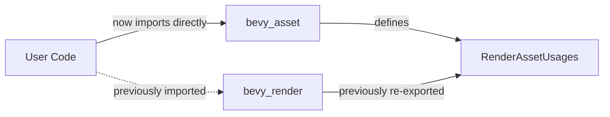

+++
title = "#20470 stop re-exporting RenderAssetUsages from bevy_render"
date = "2025-08-09T00:00:00"
draft = false
template = "pull_request_page.html"
in_search_index = true

[taxonomies]
list_display = ["show"]

[extra]
current_language = "en"
available_languages = {"en" = { name = "English", url = "/pull_request/bevy/2025-08/pr-20470-en-20250809" }, "zh-cn" = { name = "中文", url = "/pull_request/bevy/2025-08/pr-20470-zh-cn-20250809" }}
labels = ["D-Trivial", "A-Rendering", "A-Assets", "C-Code-Quality"]
+++

## stop re-exporting RenderAssetUsages from bevy_render

### Basic Information
- **Title**: stop re-exporting RenderAssetUsages from bevy_render
- **PR Link**: https://github.com/bevyengine/bevy/pull/20470
- **Author**: atlv24
- **Status**: MERGED
- **Labels**: D-Trivial, A-Rendering, A-Assets, C-Code-Quality, S-Ready-For-Final-Review, M-Needs-Migration-Guide
- **Created**: 2025-08-09T06:39:55Z
- **Merged**: 2025-08-09T07:54:02Z
- **Merged By**: james7132

### Description Translation
# Objective

- I believe I left this here to ease migration in the previous release, but shouldn't be re-exported long-term.

## Solution

- yeet

## Testing

- ci

### The Story of This Pull Request

#### The Problem and Context
During a previous Bevy release cycle, `RenderAssetUsages` was temporarily re-exported from `bevy_render` to simplify migration for users. This type actually belongs in the `bevy_asset` crate where it's defined. Long-term re-exports create maintenance overhead and violate API boundaries. They can cause confusion about where functionality originates and create implicit dependencies between crates. The core issue was that this temporary convenience measure needed removal to maintain clean crate boundaries.

#### The Solution Approach
The solution was straightforward: remove the re-export while preserving internal functionality. Since `bevy_render` still uses `RenderAssetUsages` internally, we needed to:
1. Convert the public re-export to a private import
2. Update documentation to guide users to the correct import location
3. Add migration notes since this breaks existing import paths

No alternatives were considered since the re-export was explicitly temporary. The engineering decision prioritized API cleanliness over short-term convenience.

#### The Implementation
The implementation consisted of two coordinated changes:

1. In `erased_render_asset.rs`, the public re-export was converted to a private import:
```diff
- pub use bevy_asset::RenderAssetUsages;
+ use bevy_asset::RenderAssetUsages;
```
This maintains internal usage while removing it from `bevy_render`'s public API.

2. The migration guide was updated to explicitly document the change:
```diff
+ RenderAssetUsages is no longer re-exported by `bevy_render`. Import it from `bevy_asset` instead.
```
This provides immediate visibility for users migrating between versions.

#### Technical Insights
This change demonstrates proper management of public API surfaces. Key technical points:
- **Crate boundaries**: Each crate should only expose its own core functionality
- **Deprecation strategy**: Temporary re-exports can ease transitions but must be removed
- **Documentation**: Breaking changes require clear migration paths
- **Minimal impact**: Internal usage patterns remain unchanged

The change affects import paths but not runtime behavior. Compile-time checks ensure all internal references remain valid.

#### The Impact
- **Code quality**: Reduces public API surface area of `bevy_render`
- **Maintainability**: Eliminates an unnecessary cross-crate dependency
- **User impact**: Breaking change mitigated by clear documentation
- **Technical debt**: Addresses temporary migration code that outlived its purpose

The CI pipeline validated that all internal usage remained functional after the change.

### Visual Representation



### Key Files Changed

#### `crates/bevy_render/src/erased_render_asset.rs`
**Change**: Converted public re-export to private import  
**Purpose**: Remove type from public API while maintaining internal usage  
**Diff**:
```diff
- pub use bevy_asset::RenderAssetUsages;
+ use bevy_asset::RenderAssetUsages;
```

#### `release-content/migration-guides/bevy_render_reorganization.md`
**Change**: Added migration note about removed re-export  
**Purpose**: Document breaking change for users  
**Diff**:
```diff
@@ -20,3 +20,5 @@ Import them directly or from `bevy::mesh` now, as the re-exports will be removed
 
 Image types have been moved to a new crate, `bevy_image`, but continue to be re-exported by `bevy_render` for now.
 Import them directly or from `bevy::image` now, as the re-exports will be removed.
+
+RenderAssetUsages is no longer re-exported by `bevy_render`. Import it from `bevy_asset` instead.
```

### Further Reading
1. [Rust API Guidelines on Re-exports](https://rust-lang.github.io/api-guidelines/)
2. [Bevy Engine API Documentation](https://docs.rs/bevy/latest/bevy/)
3. [Semantic Versioning and Breaking Changes](https://semver.org/)