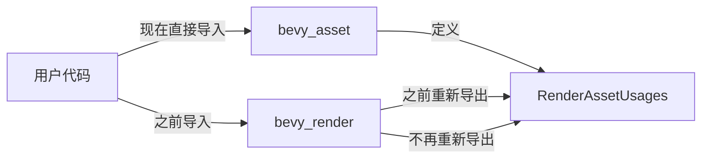

+++
title = "#20470 stop re-exporting RenderAssetUsages from bevy_render"
date = "2025-08-09T00:00:00"
draft = false
template = "pull_request_page.html"
in_search_index = false

[extra]
current_language = "zh-cn"
available_languages = {"en" = { name = "English", url = "/pull_request/bevy/2025-08/pr-20470-en-20250809" }, "zh-cn" = { name = "中文", url = "/pull_request/bevy/2025-08/pr-20470-zh-cn-20250809" }}
labels = ["D-Trivial", "A-Rendering", "A-Assets", "C-Code-Quality"]
+++

# PR分析报告：停止从bevy_render重新导出RenderAssetUsages

## Basic Information
- **Title**: stop re-exporting RenderAssetUsages from bevy_render
- **PR Link**: https://github.com/bevyengine/bevy/pull/20470
- **Author**: atlv24
- **Status**: MERGED
- **Labels**: D-Trivial, A-Rendering, A-Assets, C-Code-Quality, S-Ready-For-Final-Review, M-Needs-Migration-Guide
- **Created**: 2025-08-09T06:39:55Z
- **Merged**: 2025-08-09T07:54:02Z
- **Merged By**: james7132

## Description Translation
# 目标

- 我认为在之前的版本中留下这个重新导出是为了简化迁移，但不应该长期保留。

## 解决方案

- 移除

## 测试

- CI

## The Story of This Pull Request

### 问题背景
在Bevy渲染系统的重构过程中，`RenderAssetUsages`类型最初通过`bevy_render`模块重新导出，目的是简化从旧版本迁移的过程。这种临时措施允许用户直接从`bevy_render`导入该类型，而不是从其实际定义模块`bevy_asset`导入。虽然这在短期内降低了迁移成本，但长期来看：
1. 违反了模块边界原则，使类型来源不清晰
2. 增加了API维护的复杂度
3. 可能导致用户依赖非规范的导入路径

### 解决方案
PR采取了直接而简单的处理方式：
1. 将`bevy_render`中的重新导出从公有(`pub use`)改为私有(`use`)
2. 在迁移指南中明确说明变更
3. 依赖CI确保变更不会破坏现有功能

核心工程决策基于：
- **API简洁性**：保持模块职责单一，避免不必要的重新导出
- **长期可维护性**：消除临时解决方案的技术债务
- **迁移友好性**：通过文档明确指导用户调整

### 技术实现
变更集中在两个关键位置：
1. 渲染资产处理模块中修改导入可见性
2. 迁移文档中添加明确说明

这些修改虽然简单，但体现了良好的API设计原则：
- 模块应仅暴露其核心职责相关的类型
- 临时迁移辅助措施应有明确的生命周期
- 破坏性变更必须配套迁移指南

### 影响与启示
主要技术影响：
1. **用户端**：需要将`RenderAssetUsages`的导入路径从`bevy_render`改为`bevy_asset`
2. **代码质量**：提升模块内聚性，减少隐式依赖
3. **维护成本**：消除特殊处理逻辑

关键技术启示：
- 临时迁移方案应有明确的移除计划
- 类型导出应反映真实的模块依赖关系
- 简单直接的解决方案往往最有效

## Visual Representation



## Key Files Changed

### 1. `crates/bevy_render/src/erased_render_asset.rs`
**变更原因**：停止公有重新导出`RenderAssetUsages`类型  
**关键修改**：
```rust
// Before:
pub use bevy_asset::RenderAssetUsages;

// After:
use bevy_asset::RenderAssetUsages;
```
**影响**：
- 外部模块无法再通过`bevy_render`访问`RenderAssetUsages`
- 内部使用不受影响，因为仍是私有导入

### 2. `release-content/migration-guides/bevy_render_reorganization.md`
**变更原因**：通知用户导入路径变更  
**关键修改**：
```markdown
@@ -20,3 +20,5 @@ Import them directly or from `bevy::mesh` now, as the re-exports will be removed
 
 Image types have been moved to a new crate, `bevy_image`, but continue to be re-exported by `bevy_render` for now.
 Import them directly or from `bevy::image` now, as the re-exports will be removed.
+
+RenderAssetUsages is no longer re-exported by `bevy_render`. Import it from `bevy_asset` instead.
```
**影响**：提供明确的迁移指导，减少升级时的困惑

## Further Reading
1. [Rust模块系统最佳实践](https://doc.rust-lang.org/book/ch07-02-defining-modules-to-control-scope-and-privacy.html)
2. [Bevy资产系统文档](https://docs.rs/bevy_asset/latest/bevy_asset/)
3. [Semantic版本控制指南](https://semver.org/)

## Full Code Diff
```diff
diff --git a/crates/bevy_render/src/erased_render_asset.rs b/crates/bevy_render/src/erased_render_asset.rs
index ac2423990b8c7..ecdaeb91599cc 100644
--- a/crates/bevy_render/src/erased_render_asset.rs
+++ b/crates/bevy_render/src/erased_render_asset.rs
@@ -3,7 +3,7 @@ use crate::{
     RenderSystems, Res,
 };
 use bevy_app::{App, Plugin, SubApp};
-pub use bevy_asset::RenderAssetUsages;
+use bevy_asset::RenderAssetUsages;
 use bevy_asset::{Asset, AssetEvent, AssetId, Assets, UntypedAssetId};
 use bevy_ecs::{
     prelude::{Commands, EventReader, IntoScheduleConfigs, ResMut, Resource},
diff --git a/release-content/migration-guides/bevy_render_reorganization.md b/release-content/migration-guides/bevy_render_reorganization.md
index 4b44be1e26ade..69630c6d5a92c 100644
--- a/release-content/migration-guides/bevy_render_reorganization.md
+++ b/release-content/migration-guides/bevy_render_reorganization.md
@@ -20,3 +20,5 @@ Import them directly or from `bevy::mesh` now, as the re-exports will be removed
 
 Image types have been moved to a new crate, `bevy_image`, but continue to be re-exported by `bevy_render` for now.
 Import them directly or from `bevy::image` now, as the re-exports will be removed.
+
+RenderAssetUsages is no longer re-exported by `bevy_render`. Import it from `bevy_asset` instead.
```