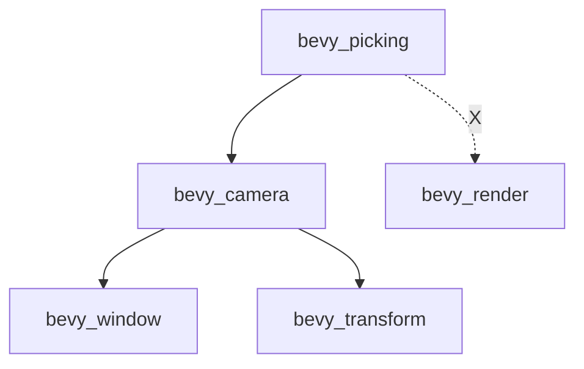

+++
title = "#20471 Make bevy_picking not depend on bevy_render"
date = "2025-08-09T00:00:00"
draft = false
template = "pull_request_page.html"
in_search_index = true

[taxonomies]
list_display = ["show"]

[extra]
current_language = "en"
available_languages = {"en" = { name = "English", url = "/pull_request/bevy/2025-08/pr-20471-en-20250809" }, "zh-cn" = { name = "中文", url = "/pull_request/bevy/2025-08/pr-20471-zh-cn-20250809" }}
labels = ["A-Rendering"]
+++

# Analysis of PR #20471: Make bevy_picking not depend on bevy_render

## Basic Information
- **Title**: Make bevy_picking not depend on bevy_render
- **PR Link**: https://github.com/bevyengine/bevy/pull/20471
- **Author**: atlv24
- **Status**: MERGED
- **Labels**: A-Rendering, S-Ready-For-Final-Review
- **Created**: 2025-08-09T07:41:10Z
- **Merged**: 2025-08-09T18:05:04Z
- **Merged By**: alice-i-cecile

## Description Translation
**Objective**
- Reduce compilation time by eliminating bevy_render dependency when only bevy_picking is needed

**Solution**
- Move NormalizedRenderTarget to bevy_camera where it belongs after the camera split
- Remove bevy_render dependency from bevy_picking

**Testing**
- cargo check --examples

## The Story of This Pull Request

### The Problem and Context
The bevy_picking crate had a direct dependency on bevy_render, primarily to use types like `NormalizedRenderTarget` and `RenderTarget`. This dependency forced developers to compile the entire bevy_render crate even when they only needed picking functionality. Since bevy_render is one of Bevy's heaviest crates, this significantly impacted compilation times for projects that didn't require rendering capabilities.

This dependency was particularly problematic because:
1. bevy_render contains complex rendering logic and GPU-related code
2. Compilation times directly impact developer productivity
3. The dependency graph was unnecessarily heavy for picking-only use cases

The core issue stemmed from an earlier reorganization where camera-related functionality was split into bevy_camera, but `NormalizedRenderTarget` remained in bevy_render.

### The Solution Approach
The solution involved two main technical changes:
1. **Move camera-related types**: Relocate `NormalizedRenderTarget` and its normalization method to bevy_camera where they logically belong
2. **Update dependencies**: Remove bevy_render from bevy_picking's dependencies and replace it with bevy_camera

The approach maintained backward compatibility by:
- Keeping type signatures consistent
- Preserving all public APIs
- Moving rather than redesigning the types

No alternatives were seriously considered since the dependency was clearly misplaced after the earlier camera split. The solution directly addresses the root cause by placing camera-related types in the camera crate.

### The Implementation
The implementation required coordinated changes across multiple crates. First, `NormalizedRenderTarget` and its associated methods were moved from bevy_render to bevy_camera:

```rust
// In bevy_camera/src/camera.rs
impl RenderTarget {
    pub fn normalize(&self, primary_window: Option<Entity>) -> Option<NormalizedRenderTarget> {
        match self {
            RenderTarget::Window(window_ref) => window_ref
                .normalize(primary_window)
                .map(NormalizedRenderTarget::Window),
            RenderTarget::Image(handle) => Some(NormalizedRenderTarget::Image(handle.clone())),
            RenderTarget::TextureView(id) => Some(NormalizedRenderTarget::TextureView(*id)),
        }
    }
}

#[derive(Debug, Clone, Reflect, PartialEq, Eq, Hash, PartialOrd, Ord, From)]
#[reflect(Clone, PartialEq, Hash)]
pub enum NormalizedRenderTarget {
    Window(NormalizedWindowRef),
    Image(ImageRenderTarget),
    TextureView(ManualTextureViewHandle),
}
```

In bevy_render, the `ToNormalizedRenderTarget` trait was removed and replaced with an extension trait for the moved type:

```rust
// In bevy_render/src/camera.rs
pub trait NormalizedRenderTargetExt {
    fn get_texture_view<'a>(...);
    fn get_texture_format<'a>(...);
    // ... other methods
}

impl NormalizedRenderTargetExt for NormalizedRenderTarget {
    // Implementation...
}
```

The bevy_picking crate was updated to depend on bevy_camera instead of bevy_render:

```toml
# In bevy_picking/Cargo.toml
bevy_camera = { path = "../bevy_camera", version = "0.17.0-dev" }
# bevy_render dependency removed
```

All imports in bevy_picking were updated to reference bevy_camera instead of bevy_render:

```rust
// Typical change throughout bevy_picking
use bevy_camera::Camera; 
// Instead of: use bevy_render::camera::Camera;
```

### Technical Insights
The changes demonstrate several important technical considerations:
1. **Dependency minimization**: The PR shows how to reduce crate dependencies by moving types to more appropriate locations
2. **Type relocation pattern**: The approach preserves APIs while moving implementations, minimizing breaking changes
3. **Extension traits**: Using traits to extend functionality of moved types maintains backward compatibility

The PR also handles visibility types correctly. Since `InheritedVisibility` and `ViewVisibility` were already moved to bevy_camera in a previous reorganization, the PR consistently updates all visibility references to use bevy_camera.

### The Impact
These changes provide concrete benefits:
1. **Faster compilation**: Projects using bevy_picking without rendering see reduced compile times
2. **Cleaner dependencies**: The dependency graph is more logical and maintainable
3. **Continued API stability**: Existing code using these types continues to work unchanged

The changes affect multiple systems but are contained through careful type relocation and trait implementations. The migration path is straightforward since imports are the primary change required.

## Visual Representation



## Key Files Changed

### `crates/bevy_camera/src/camera.rs` (+32/-2)
**Purpose**: Add NormalizedRenderTarget and normalization method  
**Key changes**:
```rust
impl RenderTarget {
    pub fn normalize(&self, primary_window: Option<Entity>) -> Option<NormalizedRenderTarget> {
        // Implementation...
    }
}

pub enum NormalizedRenderTarget {
    Window(NormalizedWindowRef),
    Image(ImageRenderTarget),
    TextureView(ManualTextureViewHandle),
}
```

### `crates/bevy_render/src/camera.rs` (+0/-37)
**Purpose**: Remove now-redundant camera normalization code  
**Key changes**:
```rust
// Removed:
pub trait ToNormalizedRenderTarget { ... }
impl ToNormalizedRenderTarget for RenderTarget { ... }
pub enum NormalizedRenderTarget { ... }
```

### `crates/bevy_picking/Cargo.toml` (+1/-1)
**Purpose**: Switch dependency from bevy_render to bevy_camera  
**Key changes**:
```toml
bevy_camera = { path = "../bevy_camera", version = "0.17.0-dev" }
# Removed: bevy_render dependency
```

### `crates/bevy_picking/src/backend.rs` (+3/-3)
**Purpose**: Update type references and documentation  
**Key changes**:
```rust
// Before:
// use bevy_render::camera::Camera

// After:
use bevy_camera::Camera

// Updated docs:
/// Set the order of this group of picks. Normally, this is the
/// [`bevy_camera::Camera::order`].
```

### `crates/bevy_picking/src/events.rs` (+9/-9)
**Purpose**: Update type imports and documentation  
**Key changes**:
```rust
// Before:
// use bevy_render::camera::NormalizedRenderTarget

// After:
use bevy_camera::NormalizedRenderTarget

// Updated docs:
/// using methods on [`Camera`](bevy_camera::Camera) to convert...
```

## Further Reading
1. [Bevy Engine ECS documentation](https://bevyengine.org/learn/book/introduction/)
2. [Rust Performance Optimization Patterns](https://rust-unofficial.github.io/patterns/performance.html)
3. [Cargo Dependency Management](https://doc.rust-lang.org/cargo/reference/specifying-dependencies.html)