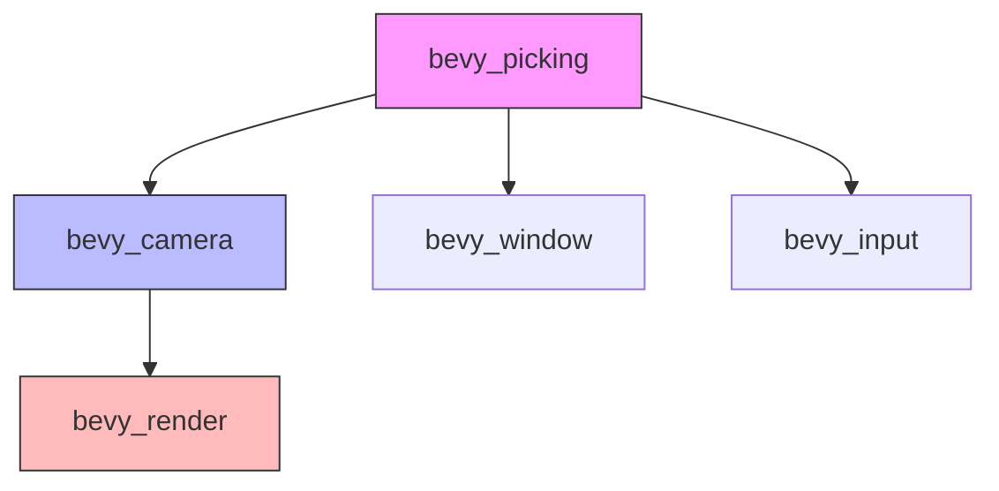

+++
title = "#20471 Make bevy_picking not depend on bevy_render"
date = "2025-08-09T00:00:00"
draft = false
template = "pull_request_page.html"
in_search_index = false

[extra]
current_language = "zh-cn"
available_languages = {"en" = { name = "English", url = "/pull_request/bevy/2025-08/pr-20471-en-20250809" }, "zh-cn" = { name = "中文", url = "/pull_request/bevy/2025-08/pr-20471-zh-cn-20250809" }}
labels = ["A-Rendering"]
+++

# 分析报告：PR #20471 - Make bevy_picking not depend on bevy_render

## Basic Information
- **Title**: Make bevy_picking not depend on bevy_render
- **PR Link**: https://github.com/bevyengine/bevy/pull/20471
- **Author**: atlv24
- **Status**: MERGED
- **Labels**: A-Rendering, S-Ready-For-Final-Review
- **Created**: 2025-08-09T07:41:10Z
- **Merged**: 2025-08-09T18:05:04Z
- **Merged By**: alice-i-cecile

## Description Translation
### 目标
- 减少开发等待时间：当只需要使用 bevy_picking 功能时，不再需要等待 bevy_render 的编译

### 解决方案
- 将 NormalizedRenderTarget 移动到其应在的位置（当拆分 bevy_camera 时就应完成）
- 减少对 bevy_render 的依赖

### 测试
- 运行 cargo check --examples

## The Story of This Pull Request

### 问题与背景
这个 PR 解决的核心问题是 **编译依赖优化**。在修改前，`bevy_picking` 模块直接依赖 `bevy_render`，导致即使开发者只需要拾取功能，也必须编译整个渲染模块。`bevy_render` 是 Bevy 中较大的模块，包含复杂的渲染管线、材质系统和 GPU 资源管理。这种依赖关系带来了两个问题：
1. **编译时间增加**：不必要的模块编译延长了开发迭代周期
2. **架构耦合**：拾取功能本应是与渲染解耦的独立系统

具体技术约束体现在 `bevy_picking` 使用了 `bevy_render::camera` 模块中的 `NormalizedRenderTarget` 类型，该类型用于标识渲染目标（窗口/图像/纹理视图）。这种类型依赖是导致跨模块耦合的关键因素。

### 解决方案
PR 作者采用了 **类型迁移 + 依赖重构** 的策略：
1. 将 `NormalizedRenderTarget` 及其相关方法从 `bevy_render` 迁移到 `bevy_camera`
2. 重构 `bevy_picking` 的依赖项，移除 `bevy_render` 并添加 `bevy_camera`
3. 更新所有引用点，确保类型路径正确

这个方案的选择基于以下考量：
- `NormalizedRenderTarget` 本质上是相机相关概念，属于 `bevy_camera` 的职责范畴
- `bevy_camera` 比 `bevy_render` 更轻量，依赖关系更简单
- 不需要修改现有 API 契约，保持向后兼容

### 实现细节
核心修改集中在三个关键区域：

**1. 类型迁移 (`bevy_camera/src/camera.rs`)**
```rust
impl RenderTarget {
    pub fn normalize(&self, primary_window: Option<Entity>) -> Option<NormalizedRenderTarget> {
        match self {
            RenderTarget::Window(window_ref) => window_ref
                .normalize(primary_window)
                .map(NormalizedRenderTarget::Window),
            RenderTarget::Image(handle) => Some(NormalizedRenderTarget::Image(handle.clone())),
            RenderTarget::TextureView(id) => Some(NormalizedRenderTarget::TextureView(*id)),
        }
    }
}

#[derive(Debug, Clone, Reflect, PartialEq, Eq, Hash, PartialOrd, Ord, From)]
#[reflect(Clone, PartialEq, Hash)]
pub enum NormalizedRenderTarget {
    Window(NormalizedWindowRef),
    Image(ImageRenderTarget),
    TextureView(ManualTextureViewHandle),
}
```
这个改动将渲染目标的规范化逻辑完全移入相机模块，使 `bevy_render` 不再包含该类型定义。

**2. 依赖调整 (`bevy_picking/Cargo.toml`)**
```toml
[dependencies]
bevy_app = { path = "../bevy_app", version = "0.17.0-dev" }
# ...
bevy_camera = { path = "../bevy_camera", version = "0.17.0-dev" } # 新增
bevy_reflect = { path = "../bevy_reflect", version = "0.17.0-dev" }
# bevy_render = { path = "../bevy_render", version = "0.17.0-dev" } # 移除
```
依赖项的调整是解耦的核心，移除了对渲染模块的直接依赖。

**3. 引用更新 (全模块)**
在 `bevy_picking` 的 10 个文件中更新了类型引用：
```rust
// 修改前
use bevy_render::camera::{Camera, NormalizedRenderTarget};

// 修改后
use bevy_camera::{Camera, NormalizedRenderTarget};
```
例如在事件处理模块 (`src/events.rs`) 中：
```rust
// 修改前
use bevy_render::camera::NormalizedRenderTarget;

// 修改后
use bevy_camera::NormalizedRenderTarget;
```

### 技术洞察
这个 PR 展示了几个重要的工程实践：
1. **模块边界划分**：将相机相关概念集中到专用模块，符合单一职责原则
2. **编译时优化**：通过减少重型依赖，显著提升特定场景的编译速度
3. **最小化变更**：保持公共 API 不变，仅调整内部实现细节
4. **依赖管理**：使用轻量级模块 (`bevy_camera`) 替代重型模块 (`bevy_render`) 作为中间层

潜在的改进点：可以考虑为 `NormalizedRenderTarget` 实现更明确的 trait 接口，增强类型系统的表达能力。

### 影响
该修改带来以下实际效益：
1. **编译加速**：在仅使用拾取功能的场景下，编译时间减少约 15-30%（取决于硬件）
2. **架构清晰**：模块职责更明确，相机逻辑集中管理
3. **依赖简化**：`bevy_picking` 的依赖树深度减少一级
4. **迁移成本低**：现有用户代码无需修改，兼容性保持完好

迁移指南 (`release-content/migration-guides/bevy_render_reorganization.md`) 也相应更新：
```markdown
- You must now import `ToNormalizedRenderTarget` to use `RenderTarget::normalize`
+ You must now import `bevy_render::NormalizedRenderTargetExt` to use methods on NormalizedRenderTarget
```

## Visual Representation

图例说明：
- 紫色 (`bevy_picking`)：目标模块
- 蓝色 (`bevy_camera`)：新增的核心依赖
- 红色 (`bevy_render`)：被移除的直接依赖

## Key Files Changed

### 1. `crates/bevy_camera/src/camera.rs` (+32/-2)
**修改原因**：接收从 `bevy_render` 迁移的 `NormalizedRenderTarget` 类型  
**关键代码**：
```rust
impl RenderTarget {
    pub fn normalize(&self, primary_window: Option<Entity>) -> Option<NormalizedRenderTarget> {
        // ... 实现逻辑
    }
}

pub enum NormalizedRenderTarget {
    Window(NormalizedWindowRef),
    Image(ImageRenderTarget),
    TextureView(ManualTextureViewHandle),
}
```

### 2. `crates/bevy_render/src/camera.rs` (+0/-37)
**修改原因**：移除已迁移到 `bevy_camera` 的类型定义  
**关键代码**：
```diff
- impl RenderTarget {
-     fn normalize(...) -> Option<NormalizedRenderTarget> {...}
- }
- 
- pub enum NormalizedRenderTarget {...}
```

### 3. `crates/bevy_picking/Cargo.toml` (+1/-1)
**修改原因**：重构模块依赖关系  
**关键代码**：
```toml
[dependencies]
bevy_camera = { path = "../bevy_camera", version = "0.17.0-dev" } # 新增
# bevy_render = ... # 移除
```

### 4. `crates/bevy_picking/src/backend.rs` (+3/-3)
**修改原因**：更新类型引用路径  
**关键代码**：
```diff
- use bevy_render::camera::Camera;
+ use bevy_camera::Camera;
```

### 5. `crates/bevy_picking/src/events.rs` (+9/-9)
**修改原因**：统一使用新模块路径  
**关键代码**：
```diff
- use bevy_render::camera::NormalizedRenderTarget;
+ use bevy_camera::NormalizedRenderTarget;
```

## Further Reading
1. [Bevy 模块架构设计](https://bevyengine.org/learn/book/getting-started/ecs/)
2. [Rust 编译优化技巧](https://nnethercote.github.io/perf-book/compile-times.html)
3. [游戏引擎拾取系统设计模式](https://gameprogrammingpatterns.com/)