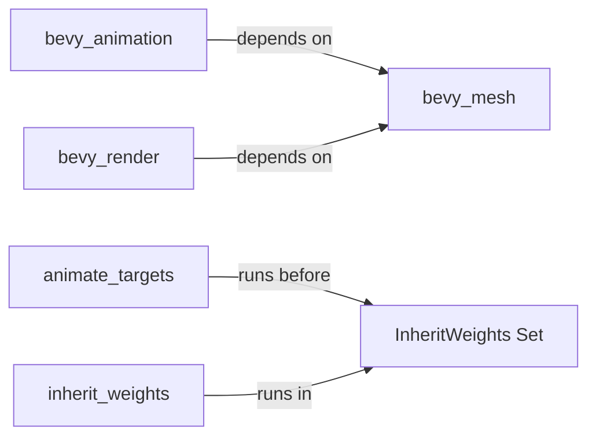

+++
title = "#20472 Make bevy_animation not depend on bevy_render"
date = "2025-08-09T00:00:00"
draft = false
template = "pull_request_page.html"
in_search_index = true

[taxonomies]
list_display = ["show"]

[extra]
current_language = "en"
available_languages = {"en" = { name = "English", url = "/pull_request/bevy/2025-08/pr-20472-en-20250809" }, "zh-cn" = { name = "中文", url = "/pull_request/bevy/2025-08/pr-20472-zh-cn-20250809" }}
labels = ["A-Rendering", "C-Dependencies", "C-Performance", "A-Animation"]
+++

# Make bevy_animation not depend on bevy_render

## Basic Information
- **Title**: Make bevy_animation not depend on bevy_render
- **PR Link**: https://github.com/bevyengine/bevy/pull/20472
- **Author**: atlv24
- **Status**: MERGED
- **Labels**: A-Rendering, C-Dependencies, C-Performance, S-Ready-For-Final-Review, A-Animation
- **Created**: 2025-08-09T08:01:50Z
- **Merged**: 2025-08-09T18:05:04Z
- **Merged By**: alice-i-cecile

## Description Translation
# Objective

- recognize this holy gift and celebrate this chance to be alive and breathing 30% more this fall by not waiting for bevy_render to compile when you use bevy_animation

## Solution

- use a SystemSet to decouple a system ordering dependency

## Testing

- cargo check --examples

## The Story of This Pull Request

### The Problem and Context
The `bevy_animation` crate had a direct dependency on `bevy_render` solely for scheduling purposes. Specifically, the animation system needed to run before `bevy_render::mesh::inherit_weights` to ensure proper ordering of skinning calculations. This dependency forced developers to compile the entire rendering stack when working on animation features, significantly increasing iteration times. Since `bevy_render` is one of Bevy's heaviest crates (containing GPU-related logic and dependencies), this was a major pain point for animation-focused development.

### The Solution Approach
The solution replaces the direct system reference with an indirection through a SystemSet defined in `bevy_mesh`. By creating a dedicated `InheritWeights` system set:
1. `bevy_animation` can reference this set without importing `bevy_render`
2. The weight inheritance system in `bevy_render` registers itself to this set
3. The existing execution order is preserved through set-based ordering

This approach maintains the critical ordering constraint while breaking the compile-time dependency chain. `bevy_mesh` was chosen as the definition point because it's already a common dependency between both crates and contains related mesh functionality.

### The Implementation
The key changes occur in four files:

1. **Dependency removal**: The `bevy_render` dependency is removed from `bevy_animation`'s Cargo.toml, eliminating the forced compilation of rendering code during animation development.

2. **SystemSet definition**: A new `InheritWeights` system set is defined in `bevy_mesh` to serve as an ordering anchor point:
```rust
/// `bevy_render::mesh::inherit_weights` runs in this `SystemSet`
#[derive(Debug, Hash, PartialEq, Eq, Clone, SystemSet)]
pub struct InheritWeights;
```

3. **Ordering adjustment**: In `bevy_animation`, the system ordering is updated to reference the new set instead of the concrete system:
```rust
animate_targets
    .before(bevy_mesh::InheritWeights)
```

4. **System registration**: The weight inheritance system in `bevy_render` is modified to register itself with the new set:
```rust
app.add_systems(PostUpdate, inherit_weights.in_set(InheritWeights));
```

### Technical Insights
This change leverages Bevy's system sets for cross-crate scheduling without introducing direct dependencies. The approach maintains the existing execution order while reducing coupling:
- **Compilation impact**: Removing `bevy_render` from `bevy_animation`'s dependencies significantly reduces compile times for animation work
- **Architectural cleanliness**: Systems are now ordered through a well-defined contract (the system set) rather than concrete references
- **Zero-cost abstraction**: The system set adds no runtime overhead while providing clearer scheduling semantics

### The Impact
The primary impact is faster iteration times for animation development. By removing the `bevy_render` dependency:
- Compilation times for `bevy_animation` are reduced by avoiding rendering stack compilation
- Cleaner separation of concerns between animation and rendering systems
- The change is backwards-compatible as execution order remains identical
- No functional changes to skinning or animation behavior

Testing was performed with `cargo check --examples` to verify no breakages occurred from the dependency restructuring.

## Visual Representation



## Key Files Changed

1. **crates/bevy_animation/Cargo.toml**
   - Removed `bevy_render` dependency to reduce compilation overhead
   
   Diff:
   ```diff
   -bevy_render = { path = "../bevy_render", version = "0.17.0-dev" }
   ```

2. **crates/bevy_animation/src/lib.rs**
   - Updated system ordering to use new system set instead of concrete system
   
   Before:
   ```rust
   animate_targets
       .before(bevy_render::mesh::inherit_weights)
   ```
   
   After:
   ```rust
   animate_targets
       .before(bevy_mesh::InheritWeights)
   ```

3. **crates/bevy_mesh/src/lib.rs**
   - Defined new system set for cross-crate scheduling
   
   Added:
   ```rust
   /// `bevy_render::mesh::inherit_weights` runs in this `SystemSet`
   #[derive(Debug, Hash, PartialEq, Eq, Clone, SystemSet)]
   pub struct InheritWeights;
   ```

4. **crates/bevy_render/src/mesh/mod.rs**
   - Registered system to run in the new system set
   
   Before:
   ```rust
   app.add_systems(PostUpdate, inherit_weights);
   ```
   
   After:
   ```rust
   app.add_systems(PostUpdate, inherit_weights.in_set(InheritWeights));
   ```

## Further Reading
- [Bevy System Sets Documentation](https://docs.rs/bevy_ecs/latest/bevy_ecs/schedule/trait.SystemSet.html)
- [Bevy Dependency Graph Example](https://github.com/bevyengine/bevy/blob/main/examples/ecs/system_sets.rs)
- [Cargo Workspace Optimization Techniques](https://doc.rust-lang.org/cargo/reference/workspaces.html)