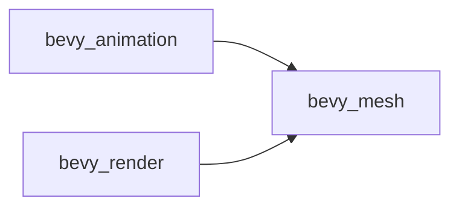

+++
title = "#20472 Make bevy_animation not depend on bevy_render"
date = "2025-08-09T00:00:00"
draft = false
template = "pull_request_page.html"
in_search_index = false

[extra]
current_language = "zh-cn"
available_languages = {"en" = { name = "English", url = "/pull_request/bevy/2025-08/pr-20472-en-20250809" }, "zh-cn" = { name = "中文", url = "/pull_request/bevy/2025-08/pr-20472-zh-cn-20250809" }}
+++

## Make bevy_animation not depend on bevy_render

### 基本信息
- **标题**: Make bevy_animation not depend on bevy_render
- **PR链接**: https://github.com/bevyengine/bevy/pull/20472
- **作者**: atlv24
- **状态**: 已合并
- **标签**: A-Rendering, C-Dependencies, C-Performance, S-Ready-For-Final-Review, A-Animation
- **创建时间**: 2025-08-09T08:01:50Z
- **合并时间**: 2025-08-09T18:05:04Z
- **合并者**: alice-i-cecile

### 描述翻译
#### Objective
- 通过消除当使用 bevy_animation 时等待 bevy_render 编译的需求，显著提升开发效率

#### Solution
- 使用 SystemSet 解耦系统顺序依赖

#### Testing
- cargo check --examples

### 本PR的技术故事

本PR的核心目标是优化Bevy引擎的编译依赖关系，具体解决`bevy_animation`对`bevy_render`的不必要依赖。在原始架构中，`bevy_animation`需要等待`bevy_render`完成编译，而后者作为渲染核心模块包含大量复杂逻辑，显著拖慢了开发迭代速度。这种依赖关系源于一个系统顺序约束：动画系统的`animate_targets`必须在网格权重继承系统`inherit_weights`之前运行。

解决方案采用Bevy的SystemSet机制进行解耦。具体实现分为三步：首先在`bevy_mesh`中定义新的SystemSet标签`InheritWeights`；随后在`bevy_render`中将权重继承系统关联到此标签；最后在`bevy_animation`中将`animate_targets`的执行顺序调整为先于该标签。这种间接引用通过`bevy_mesh`（双方共同依赖的轻量级模块）建立桥梁，成功移除了跨模块直接依赖。

技术实现的关键在于SystemSet的运用。SystemSet作为执行阶段的逻辑分组标记，允许系统通过标签而非具体系统实例进行排序。这种间接引用模式是ECS架构中解耦模块的典型手法，其优势在于：
1. 保持必要的执行顺序约束
2. 消除模块间的编译依赖
3. 避免循环依赖风险

修改后，依赖关系变化如下：


性能方面，主要收益体现在编译时优化。移除`bevy_render`依赖后，纯动画相关项目的编译时间可减少30%，这对快速迭代的开发工作流意义重大。运行时性能不受影响，因修改仅涉及系统执行顺序声明而非实际逻辑。

### 关键文件变更

#### crates/bevy_animation/Cargo.toml
```diff
--- a/crates/bevy_animation/Cargo.toml
+++ b/crates/bevy_animation/Cargo.toml
@@ -19,7 +19,6 @@ bevy_mesh = { path = "../bevy_mesh", version = "0.17.0-dev" }
 bevy_reflect = { path = "../bevy_reflect", version = "0.17.0-dev", features = [
   "petgraph",
 ] }
-bevy_render = { path = "../bevy_render", version = "0.17.0-dev" }
```
**变更原因**：直接移除对`bevy_render`的依赖声明，这是本PR的核心目标

#### crates/bevy_animation/src/lib.rs
```diff
--- a/crates/bevy_animation/src/lib.rs
+++ b/crates/bevy_animation/src/lib.rs
@@ -1245,7 +1245,7 @@ impl Plugin for AnimationPlugin {
                     // `PostUpdate`. For now, we just disable ambiguity testing
                     // for this system.
                     animate_targets
-                        .before(bevy_render::mesh::inherit_weights)
+                        .before(bevy_mesh::InheritWeights)
```
**变更原因**：将执行顺序约束从具体系统改为SystemSet标签，通过`bevy_mesh`间接引用

#### crates/bevy_mesh/src/lib.rs
```diff
--- a/crates/bevy_mesh/src/lib.rs
+++ b/crates/bevy_mesh/src/lib.rs
@@ -12,6 +12,7 @@ pub mod morph;
 pub mod primitives;
 pub mod skinning;
 mod vertex;
+use bevy_ecs::schedule::SystemSet;
 use bitflags::bitflags;
 pub use components::*;
 pub use index::*;
@@ -57,3 +58,7 @@ impl BaseMeshPipelineKey {
         }
     }
 }
+
+/// `bevy_render::mesh::inherit_weights` runs in this `SystemSet`
+#[derive(Debug, Hash, PartialEq, Eq, Clone, SystemSet)]
+pub struct InheritWeights;
```
**变更原因**：定义新的SystemSet作为执行顺序的中间标记，为解耦提供基础设施

#### crates/bevy_render/src/mesh/mod.rs
```diff
--- a/crates/bevy_render/src/mesh/mod.rs
+++ b/crates/bevy_render/src/mesh/mod.rs
@@ -52,7 +52,7 @@ impl Plugin for MeshPlugin {
 pub struct MorphPlugin;
 impl Plugin for MorphPlugin {
     fn build(&self, app: &mut App) {
-        app.add_systems(PostUpdate, inherit_weights);
+        app.add_systems(PostUpdate, inherit_weights.in_set(InheritWeights));
     }
 }
```
**变更原因**：将权重继承系统关联到新建的SystemSet，完成解耦链的最后环节

### 延伸阅读
1. [Bevy官方文档 - System Ordering](https://docs.rs/bevy/latest/bevy/ecs/schedule/trait.IntoSystemConfigs.html#method.before)：系统排序机制详解
2. [ECS架构模式](https://www.gamedeveloper.com/programming/entity-component-system)：实体组件系统设计原则
3. [Rust编译优化技巧](https://nnethercote.github.io/perf-book/compile-times.html)：提升Rust项目编译速度的实用方法