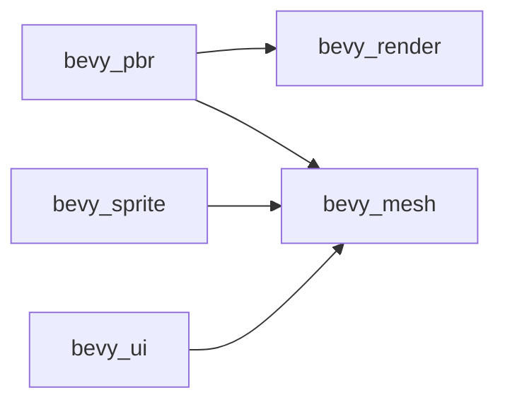

+++
title = "#20473 Stop using mesh re-exports in-repo and add bevy_mesh prelude"
date = "2025-08-09T00:00:00"
draft = false
template = "pull_request_page.html"
in_search_index = true

[taxonomies]
list_display = ["show"]

[extra]
current_language = "en"
available_languages = {"en" = { name = "English", url = "/pull_request/bevy/2025-08/pr-20473-en-20250809" }, "zh-cn" = { name = "中文", url = "/pull_request/bevy/2025-08/pr-20473-zh-cn-20250809" }}
labels = ["A-Rendering", "C-Dependencies", "C-Code-Quality"]
+++

# Stop using mesh re-exports in-repo and add bevy_mesh prelude

## Basic Information
- **Title**: Stop using mesh re-exports in-repo and add bevy_mesh prelude
- **PR Link**: https://github.com/bevyengine/bevy/pull/20473
- **Author**: atlv24
- **Status**: MERGED
- **Labels**: A-Rendering, C-Dependencies, C-Code-Quality, S-Ready-For-Final-Review
- **Created**: 2025-08-09T09:05:19Z
- **Merged**: 2025-08-09T18:05:04Z
- **Merged By**: alice-i-cecile

## Description Translation
# Objective

- prepare to remove bevy_mesh re-export from bevy_render. This will be done in 0.18, but we might as well prepare for it now.

## Solution

- Add a prelude and use bevy_mesh directly. After this pr and #20471, we will be ready.

## Testing

- cargo check --examples

## The Story of This Pull Request

This PR addresses technical debt in Bevy's rendering architecture by preparing for the removal of `bevy_mesh` re-exports from `bevy_render`. The re-export pattern was causing unnecessary coupling between crates and complicating dependency management. The changes systematically replace all internal uses of `bevy_render::mesh` with direct imports from `bevy_mesh`, while establishing a new prelude module to maintain developer ergonomics.

The core problem stems from historical design decisions where `bevy_render` re-exported `bevy_mesh` types. This created an implicit dependency that made it difficult to modify mesh-related functionality independently. As Bevy's architecture evolved, this pattern became increasingly problematic for maintenance and clear separation of concerns. The solution involves decoupling these crates by making all internal code use `bevy_mesh` directly.

The implementation required coordinated changes across the codebase. First, `bevy_mesh` was added as an explicit dependency in several crates' `Cargo.toml` files that previously relied on the re-export. For example:

```diff
# crates/bevy_pbr/Cargo.toml
[dependencies]
+ bevy_mesh = { path = "../bevy_mesh", version = "0.17.0-dev" }
```

Next, a prelude module was created in `bevy_mesh` to provide ergonomic access to common types:

```rust
// crates/bevy_mesh/src/lib.rs
pub mod prelude {
    #[doc(hidden)]
    pub use crate::{
        morph::MorphWeights, primitives::MeshBuilder, primitives::Meshable, Mesh, Mesh2d, Mesh3d,
    };
}
```

This prelude was then integrated into Bevy's internal prelude system:

```diff
// crates/bevy_internal/src/prelude.rs
+#[cfg(feature = "bevy_image")]
+pub use crate::mesh::prelude::*;
```

The bulk of the changes involve updating import paths throughout the codebase. Previously, modules accessed mesh types through `bevy_render::mesh`. These were systematically replaced with direct imports from `bevy_mesh`. For example:

```diff
// crates/bevy_pbr/src/decal/forward.rs
-use bevy_render::mesh::{Mesh, Mesh3d, MeshBuilder, MeshVertexBufferLayoutRef, Meshable};
+use bevy_mesh::{Mesh, Mesh3d, MeshBuilder, MeshVertexBufferLayoutRef, Meshable};
```

Special attention was paid to vertex buffer layouts and mesh traits. The `VertexBufferLayout` type was moved from `bevy_render` to `bevy_mesh`, requiring updates in rendering pipelines:

```diff
// crates/bevy_ui_render/src/pipeline.rs
-use bevy_render::render_resource::VertexBufferLayout;
+use bevy_mesh::VertexBufferLayout;
```

Mesh processing systems were updated to use the new direct imports. This included skinning systems:

```diff
// crates/bevy_pbr/src/render/skin.rs
-use bevy_render::mesh::skinning::{SkinnedMesh, SkinnedMeshInverseBindposes};
+use bevy_mesh::skinning::{SkinnedMesh, SkinnedMeshInverseBindposes};
```

Examples and tests were updated to reflect these changes. Custom mesh examples now import directly from `bevy_mesh`:

```diff
// examples/3d/custom_skinned_mesh.rs
-use bevy::render::mesh::skinning::{SkinnedMesh, SkinnedMeshInverseBindposes};
+use bevy::mesh::skinning::{SkinnedMesh, SkinnedMeshInverseBindposes};
```

The changes maintain identical functionality while improving architectural clarity. By eliminating the re-exports, this PR reduces coupling between `bevy_render` and `bevy_mesh`, making it easier to modify mesh handling independently. The prelude module ensures developers can still access common types conveniently.

Performance remains unaffected since this is purely an import restructuring. The main impact is on code maintainability - future changes to mesh systems will be easier to implement without navigating indirect dependencies. This work completes the groundwork for fully removing the re-export in Bevy 0.18.

## Visual Representation



## Key Files Changed

1. `crates/bevy_mesh/src/lib.rs`
   - Added prelude module for ergonomic imports
   
```diff
+pub mod prelude {
+    #[doc(hidden)]
+    pub use crate::{
+        morph::MorphWeights, primitives::MeshBuilder, primitives::Meshable, Mesh, Mesh2d, Mesh3d,
+    };
+}
```

2. `crates/bevy_pbr/src/prepass/mod.rs`
   - Replaced render::mesh imports with bevy_mesh
   - Reorganized imports for clarity

```diff
-use bevy_render::{
-    mesh::allocator::MeshAllocator,
-    // ...
-};
+use bevy_mesh::{Mesh, Mesh3d, MeshVertexBufferLayoutRef};
```

3. `crates/bevy_pbr/src/render/mesh.rs`
   - Updated skinning and mesh imports
   - Maintained identical functionality

```diff
-use bevy_render::mesh::skinning::{SkinnedMesh, SkinnedMeshInverseBindposes};
+use bevy_mesh::skinning::{SkinnedMesh, SkinnedMeshInverseBindposes};
```

4. `tests/3d/test_invalid_skinned_mesh.rs`
   - Updated mesh import paths

```diff
-use bevy::render::mesh::skinning::{SkinnedMesh, SkinnedMeshInverseBindposes};
+use bevy::mesh::skinning::{SkinnedMesh, SkinnedMeshInverseBindposes};
```

5. `examples/animation/custom_skinned_mesh.rs`
   - Changed import paths for direct mesh access

```diff
-use bevy::render::mesh::skinning::{SkinnedMesh, SkinnedMeshInverseBindposes};
+use bevy::mesh::skinning::{SkinnedMesh, SkinnedMeshInverseBindposes};
```

## Further Reading
- [Bevy's Module Structure Documentation](https://github.com/bevyengine/bevy/blob/main/docs/plugins_guidelines.md#module-organization)
- [Rust Prelude Pattern](https://doc.rust-lang.org/std/prelude/index.html)
- [Dependency Management in Cargo](https://doc.rust-lang.org/cargo/guide/dependencies.html)