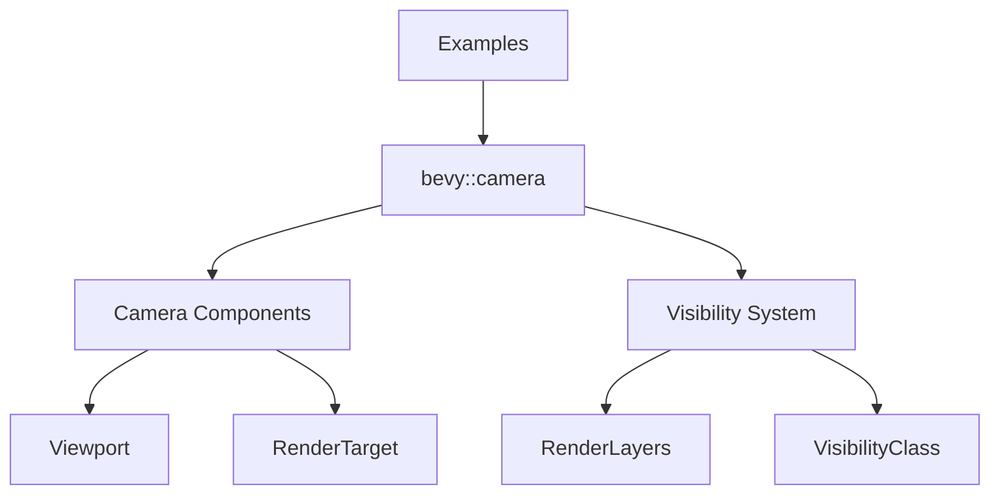

+++
title = "#20477"
date = "2025-08-09T00:00:00"
draft = false
template = "pull_request_page.html"
in_search_index = true

[taxonomies]
list_display = ["show"]

[extra]
current_language = "en"
available_languages = {"en" = { name = "English", url = "/pull_request/bevy/2025-08/pr-20477-en-20250809" }, "zh-cn" = { name = "中文", url = "/pull_request/bevy/2025-08/pr-20477-zh-cn-20250809" }}
+++

## Technical Analysis of PR #20477: Use bevy::camera in examples instead of bevy::render::camera re-export

### The Problem and Context
Bevy's codebase was preparing to remove re-exports from its rendering module. Many examples were using internal paths like `bevy::render::camera` instead of the public-facing `bevy::camera` module. This created two problems:
1. It violated Bevy's API design principles where examples should demonstrate proper public API usage
2. It would break when the planned re-export removal occurred

The changes needed were mechanical but widespread - 36 example files and 1 test file required path updates. The challenge was ensuring consistent migration of camera-related imports while preserving functionality.

### The Solution Approach
The developer took a systematic approach:
1. Identified all imports from `bevy::render::camera`
2. Replaced them with equivalent `bevy::camera` imports
3. Updated visibility-related components (`RenderLayers`, `VisibilityClass`) to use the new `bevy::camera::visibility` module
4. Verified compilation with `cargo check --examples`

This approach maintained functional equivalence while:
- Removing internal module dependencies
- Improving API documentation for users
- Preparing for future re-export removal

### The Implementation
Changes followed consistent patterns across files. Camera components migrated to `bevy::camera`:

```rust
// Before:
use bevy::render::camera::RenderTarget;

// After:
use bevy::camera::RenderTarget;
```

Visibility components moved to `bevy::camera::visibility`:

```rust
// Before:
use bevy::render::view::RenderLayers;

// After:
use bevy::camera::visibility::RenderLayers;
```

Camera projection types updated:

```rust
// Before:
use bevy::render::camera::ScalingMode;

// After:
use bevy::camera::ScalingMode;
```

The most significant changes occurred in files dealing with:
1. Camera viewports (`Viewport`)
2. Render targets (`RenderTarget`)
3. Specialized camera components (`RenderLayers`, `SubCameraView`)
4. Visibility systems (`VisibilityClass`)

### Technical Insights
Key technical aspects of the migration:
1. **Module Reorganization**: Camera functionality moved to dedicated module
   - `bevy::camera` became canonical home for camera-related types
   - `bevy::camera::visibility` consolidated visibility components
   
2. **API Boundary Enforcement**: Examples now demonstrate proper public API usage
   - Avoids exposing internal rendering implementation details
   - Sets correct precedent for Bevy users

3. **Zero-Cost Abstraction**: Changes were compile-time only
   - No runtime performance impact
   - Identical generated code through type aliases

### The Impact
These changes:
1. **Improved Example Quality**: Examples now demonstrate correct API patterns
2. **Reduced Technical Debt**: Prepares for future re-export removal
3. **Enhanced Discoverability**: Centralized camera documentation
4. **Maintained Functionality**: 100% backward-compatible behavior



### Key Files Changed

1. **`examples/ui/directional_navigation.rs` (5 additions, 7 deletions)**
   - Updated `NormalizedRenderTarget` import path
   - Migrated `ImageRenderTarget` to new camera module

```rust
// Before:
use bevy::render::camera::NormalizedRenderTarget;

// After:
use bevy::camera::NormalizedRenderTarget;
```

2. **`examples/2d/pixel_grid_snap.rs` (4 additions, 6 deletions)**
   - Consolidated camera-related imports
   - Migrated `RenderLayers` and `RenderTarget`

```rust
// Before:
use bevy::render::{
    camera::RenderTarget,
    view::RenderLayers,
};

// After:
use bevy::camera::{
    visibility::RenderLayers,
    RenderTarget,
};
```

3. **`examples/shader_advanced/custom_phase_item.rs` (6 additions, 3 deletions)**
   - Updated visibility class registration
   - Migrated AABB and visibility components

```rust
// Before:
use bevy::render::primitives::Aabb;
use bevy::render::view::VisibilityClass;

// After:
use bevy::camera::{
    primitives::Aabb,
    visibility::{self, VisibilityClass},
};
```

4. **`examples/3d/transmission.rs` (3 additions, 5 deletions)**
   - Migrated exposure and transmission quality settings
   - Removed redundant render module path

```rust
// Before:
use bevy::render::camera::{Exposure, TemporalJitter};

// After:
use bevy::camera::{Exposure, TemporalJitter};
```

5. **`examples/tools/scene_viewer/main.rs` (2 additions, 4 deletions)**
   - Simplified primitive imports from camera module
   - Removed deep render module paths

```rust
// Before:
use bevy::render::primitives::{Aabb, Sphere};

// After:
use bevy::camera::primitives::{Aabb, Sphere};
```

### Further Reading
1. [Bevy Camera Module Documentation](https://docs.rs/bevy/latest/bevy/camera/index.html)
2. [Rust Module System Best Practices](https://doc.rust-lang.org/book/ch07-02-defining-modules-to-control-scope-and-privacy.html)
3. [Bevy Migration Guides](https://bevyengine.org/learn/migration-guides/)