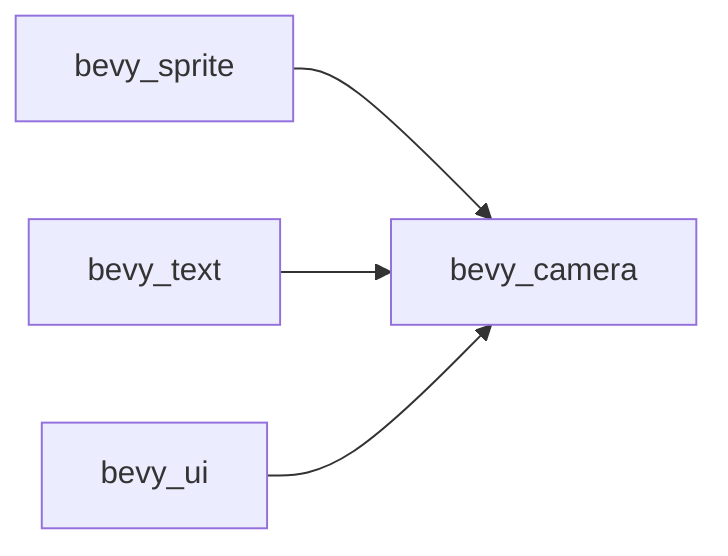

+++
title = "#20478 Use bevy_camera in ui, sprite, text instead of bevy_render::camera re-export"
date = "2025-08-09T00:00:00"
draft = false
template = "pull_request_page.html"
in_search_index = true

[taxonomies]
list_display = ["show"]

[extra]
current_language = "en"
available_languages = {"en" = { name = "English", url = "/pull_request/bevy/2025-08/pr-20478-en-20250809" }, "zh-cn" = { name = "中文", url = "/pull_request/bevy/2025-08/pr-20478-zh-cn-20250809" }}
labels = ["D-Trivial", "A-Rendering", "C-Code-Quality"]
+++

## Technical Report: Refactoring Camera Dependencies in Bevy UI, Sprite, and Text Modules

### Basic Information
- **Title**: Use bevy_camera in ui, sprite, text instead of bevy_render::camera re-export
- **PR Link**: https://github.com/bevyengine/bevy/pull/20478
- **Author**: atlv24
- **Status**: MERGED
- **Labels**: D-Trivial, A-Rendering, C-Code-Quality, S-Ready-For-Final-Review
- **Created**: 2025-08-09T20:29:00Z
- **Merged**: 2025-08-09T21:35:58Z
- **Merged By**: alice-i-cecile

### Description Translation
**Objective**

- Prepare for removing re-exports

**Solution**

- Replace `bevy_render::camera` re-exports with direct `bevy_camera` imports in UI, sprite, and text modules

**Testing**

- `cargo check --examples`

### The Story of This Pull Request

#### The Problem and Context
Bevy's rendering architecture had a dependency pattern where camera-related functionality was re-exported through `bevy_render::camera`. This created indirect dependencies between UI/sprite/text systems and the renderer. The architectural goal was to decouple camera systems from the renderer to improve modularity and prepare for future changes where camera functionality might be used independently of rendering.

The main challenges were:
1. Tight coupling between camera logic and rendering systems
2. Difficulty in removing deprecated re-exports without breaking dependent crates
3. Inconsistent import patterns across the codebase

#### The Solution Approach
The solution involved directly importing camera-related types from the `bevy_camera` crate instead of through `bevy_render` re-exports. This required:
1. Adding explicit dependencies on `bevy_camera` to affected crates
2. Updating import paths throughout UI, sprite, and text systems
3. Maintaining identical functionality through type aliases and consistent APIs

Key decisions included:
- Prioritizing mechanical find/replace operations for straightforward path updates
- Handling more complex cases like `ViewVisibility` and `VisibilitySystems` with targeted imports
- Preserving all existing functionality and behavior during the transition

#### The Implementation
The changes were implemented through systematic updates across 24 files in three main crates:

1. **Dependency Management**  
   Added explicit `bevy_camera` dependencies to `Cargo.toml` files:
   ```toml
   # crates/bevy_sprite/Cargo.toml
   bevy_camera = { path = "../bevy_camera", version = "0.17.0-dev" }
   ```

2. **Import Path Refactoring**  
   Updated import paths from `bevy_render::camera` and `bevy_render::view` to direct `bevy_camera` imports:
   ```rust
   // Before:
   use bevy_render::camera::extract_cameras;
   use bevy_render::view::ViewVisibility;
   
   // After:
   use bevy_camera::visibility::ViewVisibility;
   ```

3. **Component System Updates**  
   Modified component systems to use directly imported types:
   ```rust
   // crates/bevy_sprite/src/sprite.rs
   // Before:
   #[component(on_add = view::add_visibility_class::<Sprite>)]
   
   // After:
   #[component(on_add = visibility::add_visibility_class::<Sprite>)]
   ```

4. **Camera System Integration**  
   Updated camera-related systems to use `bevy_camera` primitives:
   ```rust
   // crates/bevy_text/src/text2d.rs
   use bevy_camera::primitives::Aabb;
   use bevy_camera::visibility::{ViewVisibility, VisibilityClass};
   ```

#### Technical Insights
The refactoring demonstrates several important patterns:
1. **Dependency Inversion**: By removing renderer-mediated access to camera systems, we achieve cleaner separation of concerns
2. **Gradual Deprecation**: Prepares for future removal of re-exports without breaking changes
3. **Cross-Crate Consistency**: Establishes a standardized pattern for accessing camera functionality

Performance considerations were minimal since this is a compile-time dependency change rather than a runtime logic modification. The changes are primarily structural with no algorithmic impact.

#### The Impact
The changes provide several concrete benefits:
1. **Reduced Coupling**: UI/sprite/text systems now depend directly on camera interfaces rather than through renderer intermediaries
2. **Improved Maintainability**: Clearer import paths make the codebase easier to navigate and reason about
3. **Preparation for Future Changes**: Enables removal of camera re-exports from `bevy_render`
4. **Consistent Architecture**: Aligns with Bevy's modular design principles

The changes affect multiple rendering-adjacent systems but maintain complete backward compatibility with existing APIs and functionality.

### Visual Representation



This diagram shows the new direct dependencies between UI/sprite/text crates and the camera system, eliminating the previous indirect dependency through `bevy_render`.

### Key Files Changed

1. **`crates/bevy_sprite/src/mesh2d/material.rs` (+9/-12)**  
   Updated camera and visibility imports to use `bevy_camera` directly:
   ```rust
   // Before:
   use bevy_render::camera::extract_cameras;
   use bevy_render::view::ViewVisibility;
   
   // After:
   use bevy_camera::visibility::ViewVisibility;
   use bevy_render::{
       camera::extract_cameras,
       // ... other render-specific imports
   };
   ```
   This centralizes camera-related functionality while keeping render-specific logic separate.

2. **`crates/bevy_sprite/src/lib.rs` (+7/-7)**  
   Replaced renderer camera primitives with direct camera imports:
   ```rust
   // Before:
   use bevy_render::primitives::{Aabb, MeshAabb};
   
   // After:
   use bevy_camera::primitives::{Aabb, MeshAabb as _};
   ```
   The `MeshAabb as _` rename maintains compatibility while using the camera version.

3. **`crates/bevy_text/src/text2d.rs` (+6/-7)**  
   Updated text rendering to use camera visibility systems:
   ```rust
   // Before:
   use bevy_render::view::{Visibility, VisibilityClass};
   
   // After:
   use bevy_camera::visibility::{
       self, ViewVisibility, Visibility, VisibilityClass
   };
   ```
   Ensures text rendering properly integrates with camera visibility calculations.

4. **`crates/bevy_ui/src/ui_node.rs` (+3/-6)**  
   Modified camera target specification:
   ```rust
   // Before:
   use bevy_render::camera::{Camera, RenderTarget};
   
   // After:
   use bevy_camera::{Camera, RenderTarget};
   ```
   Maintains identical functionality with clearer dependency structure.

### Further Reading
1. [Bevy Camera Crate Documentation](https://docs.rs/bevy_camera/latest/bevy_camera/)
2. [Bevy Modular Architecture RFC](https://github.com/bevyengine/rfcs/blob/main/rfcs/1-render-modularization.md)
3. [Rust Visibility and Privacy System](https://doc.rust-lang.org/reference/visibility-and-privacy.html)