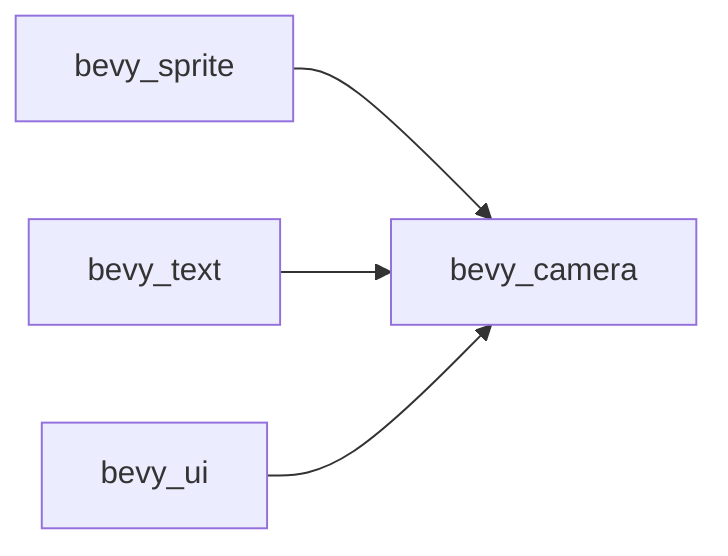

+++
title = "#20478 Use bevy_camera in ui, sprite, text instead of bevy_render::camera re-export"
date = "2025-08-09T00:00:00"
draft = false
template = "pull_request_page.html"
in_search_index = false

[extra]
current_language = "zh-cn"
available_languages = {"en" = { name = "English", url = "/pull_request/bevy/2025-08/pr-20478-en-20250809" }, "zh-cn" = { name = "中文", url = "/pull_request/bevy/2025-08/pr-20478-zh-cn-20250809" }}
+++

# 技术报告：PR #20478 - Use bevy_camera in ui, sprite, text instead of bevy_render::camera re-export

## 基本信息
- **标题**: Use bevy_camera in ui, sprite, text instead of bevy_render::camera re-export
- **PR链接**: https://github.com/bevyengine/bevy/pull/20478
- **作者**: atlv24
- **状态**: 已合并
- **标签**: D-Trivial, A-Rendering, C-Code-Quality, S-Ready-For-Final-Review
- **创建时间**: 2025-08-09T20:29:00Z
- **合并时间**: 2025-08-09T21:35:58Z
- **合并者**: alice-i-cecile

## 描述翻译
### 目标
- 为移除重新导出（re-exports）做准备

### 解决方案
- 标题（指PR标题所描述的内容）

### 测试
- cargo check --examples

## PR技术分析

### 问题背景
Bevy引擎的渲染模块存在相机相关功能的重新导出（re-export）问题。具体来说，多个模块（ui/sprite/text）通过`bevy_render::camera`路径访问相机功能，而不是直接使用专门的`bevy_camera` crate。这种设计导致：
1. 模块边界模糊，增加维护复杂度
2. 依赖关系不清晰
3. 未来移除重新导出时会产生连锁问题

### 解决方案
PR的核心策略是将相机相关功能的引用路径统一迁移到`bevy_camera` crate，具体实现包含三个关键步骤：

1. **添加依赖** - 在相关crate的Cargo.toml中添加`bevy_camera`依赖：
```diff
# crates/bevy_sprite/Cargo.toml
[dependencies]
+ bevy_camera = { path = "../bevy_camera", version = "0.17.0-dev" }
```

2. **路径替换** - 将`bevy_render::camera`和`bevy_render::view`的引用替换为`bevy_camera`中的对应模块：
```diff
// crates/bevy_sprite/src/lib.rs
- use bevy_render::{
-   primitives::{Aabb, MeshAabb},
-   view::{NoFrustumCulling, VisibilitySystems},
- };
+ use bevy_camera::{
+   primitives::{Aabb, MeshAabb as _},
+   visibility::{NoFrustumCulling, VisibilitySystems},
+ };
```

3. **功能重组** - 将相机相关的可见性系统和组件迁移到`bevy_camera::visibility`模块：
```diff
// crates/bevy_ui/src/ui_node.rs
- use bevy_render::view::Visibility;
+ use bevy_camera::visibility::Visibility;
```

### 技术实现细节
迁移过程保持功能不变，主要涉及以下类型的修改：

**1. 可见性系统重构**  
将可见性相关的逻辑集中到`bevy_camera::visibility`模块：
```diff
// crates/bevy_text/src/text2d.rs
- use bevy_render::view::{self, Visibility, VisibilityClass};
+ use bevy_camera::visibility::{
+   self, NoFrustumCulling, ViewVisibility, Visibility, VisibilityClass
+ };
```

**2. 相机组件迁移**  
相机特定组件如`Camera2d`迁移到专用模块：
```diff
// crates/bevy_sprite/src/mesh2d/mesh.rs
- use bevy_core_pipeline::core_2d::Camera2d;
+ use bevy_camera::{visibility::ViewVisibility, Camera2d};
```

**3. 渲染目标处理**  
更新渲染目标相关的类型引用：
```diff
// crates/bevy_ui/src/ui_node.rs
- use bevy_render::camera::RenderTarget;
+ use bevy_camera::RenderTarget;
```

### 技术影响
1. **依赖关系优化**：
   - 减少模块间耦合
   - 明确`bevy_camera`作为相机功能的单一来源
   
2. **代码质量提升**：
   - 消除不必要的重新导出
   - 提高类型系统清晰度

3. **未来维护性**：
   - 为完全移除重新导出奠定基础
   - 降低未来重构的迁移成本

### 验证方式
PR使用标准工程验证流程：
```bash
cargo check --examples
```
确保所有示例项目编译通过，验证修改未引入破坏性变更。

## 组件关系图



## 关键文件变更

### 1. `crates/bevy_sprite/src/mesh2d/material.rs`
**变更原因**：统一可见性系统导入路径  
**代码示例**：
```diff
- use bevy_render::view::RenderVisibleEntities;
- use bevy_render::RenderStartup;
+ use bevy_camera::visibility::ViewVisibility;
  use bevy_render::{
+     camera::extract_cameras,
      render_asset::{
          prepare_assets, PrepareAssetError, RenderAsset, RenderAssetPlugin, RenderAssets,
      },
      render_phase::{
-         AddRenderCommand, BinnedRenderPhaseType, DrawFunctions, PhaseItem, PhaseItemExtraIndex,
-         RenderCommand, RenderCommandResult, SetItemPipeline, TrackedRenderPass,
-         ViewBinnedRenderPhases, ViewSortedRenderPhases,
+         AddRenderCommand, BinnedRenderPhaseType, DrawFunctionId, DrawFunctions, InputUniformIndex,
+         PhaseItem, PhaseItemExtraIndex, RenderCommand, RenderCommandResult, SetItemPipeline,
+         TrackedRenderPass, ViewBinnedRenderPhases, ViewSortedRenderPhases,
      },
```

### 2. `crates/bevy_sprite/src/lib.rs`
**变更原因**：重构相机基础类型导入  
**代码示例**：
```diff
+ use bevy_camera::{
+     primitives::{Aabb, MeshAabb as _},
+     visibility::{NoFrustumCulling, VisibilitySystems},
+ };
  pub use mesh2d::*;
- use bevy_render::{
-     primitives::{Aabb, MeshAabb},
-     view::{NoFrustumCulling, VisibilitySystems},
- };
```

### 3. `crates/bevy_text/src/text2d.rs`
**变更原因**：迁移文本渲染的可见性逻辑  
**代码示例**：
```diff
- use bevy_render::view::{self, Visibility, VisibilityClass};
- use bevy_render::{
-     primitives::Aabb,
-     view::{NoFrustumCulling, ViewVisibility},
- };
+ use bevy_camera::primitives::Aabb;
+ use bevy_camera::visibility::{
+     self, NoFrustumCulling, ViewVisibility, Visibility, VisibilityClass,
+ };
```

### 4. `crates/bevy_sprite/src/mesh2d/mesh.rs`
**变更原因**：更新2D网格的相机依赖  
**代码示例**：
```diff
+ use bevy_camera::{visibility::ViewVisibility, Camera2d};
  use bevy_render::{load_shader_library, RenderStartup};
- use bevy_core_pipeline::core_2d::{AlphaMask2d, Camera2d, Opaque2d, Transparent2d, CORE_2D_DEPTH_FORMAT};
+ use bevy_core_pipeline::core_2d::{AlphaMask2d, Opaque2d, Transparent2d, CORE_2D_DEPTH_FORMAT};
```

### 5. `crates/bevy_ui/src/ui_node.rs`
**变更原因**：统一UI节点的相机引用  
**代码示例**：
```diff
- use bevy_render::{
-     camera::{Camera, RenderTarget},
-     view::Visibility,
- };
+ use bevy_camera::{visibility::Visibility, Camera, RenderTarget};
```

## 延伸阅读
1. [Bevy模块系统设计指南](https://bevyengine.org/learn/book-best-practices/modular-design/)
2. [Rust重新导出模式](https://doc.rust-lang.org/book/ch07-04-bringing-paths-into-scope-with-the-use-keyword.html#re-exporting-names-with-pub-use)
3. [Bevy渲染架构概览](https://bevyengine.org/learn/book-getting-started/rendering/)