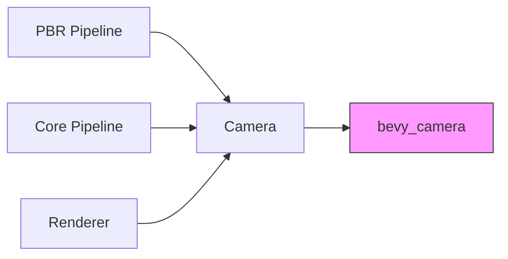

+++
title = "#20479 Use bevy_camera in pbr, core pipelines, render instead of bevy_render::camera re-export"
date = "2025-08-09T00:00:00"
draft = false
template = "pull_request_page.html"
in_search_index = true

[taxonomies]
list_display = ["show"]

[extra]
current_language = "en"
available_languages = {"en" = { name = "English", url = "/pull_request/bevy/2025-08/pr-20479-en-20250809" }, "zh-cn" = { name = "中文", url = "/pull_request/bevy/2025-08/pr-20479-zh-cn-20250809" }}
labels = ["A-Rendering"]
+++

# Technical Analysis of PR #20479: Use bevy_camera in pbr, core pipelines, render instead of bevy_render::camera re-export

## Basic Information
- **Title**: Use bevy_camera in pbr, core pipelines, render instead of bevy_render::camera re-export
- **PR Link**: https://github.com/bevyengine/bevy/pull/20479
- **Author**: atlv24
- **Status**: MERGED
- **Labels**: A-Rendering, S-Ready-For-Final-Review
- **Created**: 2025-08-09T20:54:23Z
- **Merged**: 2025-08-09T21:39:04Z
- **Merged By**: alice-i-cecile

## Description Translation
# Objective

- Prepare for removing re-exports

## Solution

- title

## Testing

- cargo check --examples

## The Story of This Pull Request

### The Problem and Context
Bevy's rendering system had accumulated technical debt through re-exports of camera-related functionality. Specifically, `bevy_render` was re-exporting types from `bevy_camera`, creating an unnecessary indirection layer. This pattern made the codebase harder to navigate and maintain, as developers had to remember which module actually owned the camera functionality. The architectural inconsistency also complicated efforts to clean up module boundaries and reduce dependencies between crates.

The immediate technical constraint was preparing for the planned removal of these re-exports. Without addressing these imports first, removing the re-exports would break compilation across multiple rendering subsystems. This change was necessary to enable future architectural improvements in Bevy's camera system.

### The Solution Approach
The solution involved systematically replacing all instances of `bevy_render::camera` imports with direct imports from `bevy_camera` throughout the rendering pipeline. The developer took a straightforward approach:
1. Identify all files using re-exported camera functionality
2. Replace import paths to reference `bevy_camera` directly
3. Ensure camera-related types (like `Camera`, `Projection`, and view components) are sourced from the correct module
4. Maintain identical functionality through import path changes only

No alternatives were considered since this was a mechanical refactor required for future changes. The key engineering decision was to perform this as a standalone PR before removing the re-exports, minimizing disruption to other ongoing work.

### The Implementation
The implementation consisted of 36 file modifications across Bevy's rendering crates. Changes were focused on three main areas:

1. **Core pipeline components** (bloom, DOF, OIT, tonemapping, etc.) were updated to import camera types directly:
```rust
// Before in crates/bevy_core_pipeline/src/bloom/settings.rs
use bevy_render::{prelude::Camera, view::Hdr};

// After
use bevy_camera::Camera;
use bevy_render::view::Hdr;
```

2. **PBR rendering system** received similar updates for light processing, materials, and special effects:
```rust
// Before in crates/bevy_pbr/src/render/light.rs
use bevy_render::primitives::{CascadesFrusta, Frustum};

// After
use bevy_camera::primitives::{CascadesFrusta, Frustum};
```

3. **View and camera handling** in the renderer were updated to use proper sources:
```rust
// Before in crates/bevy_render/src/view/mod.rs
use bevy_render::camera::{MainPassResolutionOverride, NormalizedRenderTarget};

// After
use bevy_camera::{MainPassResolutionOverride, NormalizedRenderTarget};
```

The changes maintained identical type usage while correcting import paths. For example, `Camera3d` handling was consolidated:

```rust
// Before in crates/bevy_pbr/src/atmosphere/resources.rs
use bevy_core_pipeline::core_3d::Camera3d;

// After
use bevy_camera::Camera3d;
```

### Technical Insights
This refactor demonstrates several important techniques for large-scale codebase maintenance:

1. **Decoupling through direct imports**: By removing re-exports, we reduce coupling between crates. The rendering system now depends directly on the camera crate's public API rather than through an intermediary.

2. **Mechanical refactoring safety**: The changes were verified through `cargo check --examples` to ensure no functionality was altered. This approach is essential when making widespread import changes.

3. **Layered architecture enforcement**: The change reinforces Bevy's modular architecture by ensuring each crate only accesses the public interfaces of its actual dependencies.

### The Impact
These changes have several concrete benefits:
- **Improved code navigation**: Developers can now follow imports directly to source modules
- **Reduced compile times**: Removing re-export indirection may slightly improve incremental compilation
- **Enabled future work**: This PR unblocks removal of camera re-exports from `bevy_render`
- **Stronger module boundaries**: Clearer separation between rendering and camera systems

The changes affect multiple rendering subsystems but maintain identical runtime behavior. As a pure refactor, it carries minimal risk while providing architectural benefits.

## Visual Representation



## Key Files Changed

### `crates/bevy_pbr/src/render/light.rs` (+8/-3)
Updated camera-related imports to use `bevy_camera` directly. Key changes:
```rust
// Before:
use bevy_render::primitives::{CascadesFrusta, CubemapFrusta, Frustum, HalfSpace};
use bevy_render::view::{ViewVisibility, VisibleMeshEntities};

// After:
use bevy_camera::primitives::{CascadesFrusta, CubemapFrusta, Frustum, HalfSpace};
use bevy_camera::visibility::{ViewVisibility, VisibleMeshEntities};
```

### `crates/bevy_core_pipeline/src/oit/mod.rs` (+3/-5)
Consolidated camera imports and removed unnecessary pipeline dependencies:
```rust
// Before:
use bevy_core_pipeline::core_3d::{graph::Core3d, Camera3d};
use bevy_render::camera::{Camera, ExtractedCamera};

// After:
use bevy_camera::{Camera, Camera3d};
use bevy_render::camera::ExtractedCamera;
```

### `crates/bevy_pbr/src/ssr/mod.rs` (+4/-4)
Corrected environment map light import source:
```rust
// Before:
use crate::prelude::EnvironmentMapLight;

// After:
use bevy_light::EnvironmentMapLight;
```

### `crates/bevy_pbr/src/material.rs` (+4/-3)
Updated visibility and quality setting imports:
```rust
// Before:
use bevy_render::view::ViewVisibility;
use bevy_core_pipeline::core_3d::ScreenSpaceTransmissionQuality;

// After:
use bevy_camera::visibility::ViewVisibility;
use bevy_camera::ScreenSpaceTransmissionQuality;
```

### `crates/bevy_render/src/view/mod.rs` (+2/-5)
Fixed render target imports:
```rust
// Before:
use bevy_render::camera::{
    MainPassResolutionOverride, 
    NormalizedRenderTarget
};

// After:
use bevy_camera::{
    MainPassResolutionOverride,
    NormalizedRenderTarget
};
```

## Further Reading
1. [Bevy's Module Structure Documentation](https://github.com/bevyengine/bevy/blob/main/docs/plugins_guidelines.md)
2. [Rust's use Declaration Syntax](https://doc.rust-lang.org/reference/items/use-declarations.html)
3. [Cargo Check Command Reference](https://doc.rust-lang.org/cargo/commands/cargo-check.html)

## Full Code Diff
<details>
<summary>View full diff</summary>

```diff
diff --git a/crates/bevy_core_pipeline/src/bloom/settings.rs b/crates/bevy_core_pipeline/src/bloom/settings.rs
index 435ed037b5001..1d96d9cbb0c10 100644
--- a/crates/bevy_core_pipeline/src/bloom/settings.rs
+++ b/crates/bevy_core_pipeline/src/bloom/settings.rs
@@ -1,4 +1,5 @@
 use super::downsampling_pipeline::BloomUniforms;
+use bevy_camera::Camera;
 use bevy_ecs::{
     prelude::Component,
     query::{QueryItem, With},
@@ -6,7 +7,7 @@ use bevy_ecs::{
 };
 use bevy_math::{AspectRatio, URect, UVec4, Vec2, Vec4};
 use bevy_reflect::{std_traits::ReflectDefault, Reflect};
-use bevy_render::{extract_component::ExtractComponent, prelude::Camera, view::Hdr};
+use bevy_render::{extract_component::ExtractComponent, view::Hdr};
 
 /// Applies a bloom effect to an HDR-enabled 2d or 3d camera.
 ///
diff --git a/crates/bevy_core_pipeline/src/core_3d/main_opaque_pass_3d_node.rs b/crates/bevy_core_pipeline/src/core_3d/main_opaque_pass_3d_node.rs
index 0ee9144a954d1..25cf2ac75c58e 100644
--- a/crates/bevy_core_pipeline/src/core_3d/main_opaque_pass_3d_node.rs
+++ b/crates/bevy_core_pipeline/src/core_3d/main_opaque_pass_3d_node.rs
@@ -2,10 +2,10 @@ use crate::{
     core_3d::Opaque3d,
     skybox::{SkyboxBindGroup, SkyboxPipelineId},
 };
-use bevy_camera::Viewport;
+use bevy_camera::{MainPassResolutionOverride, Viewport};
 use bevy_ecs::{prelude::World, query::QueryItem};
 use bevy_render::{
-    camera::{ExtractedCamera, MainPassResolutionOverride},
+    camera::ExtractedCamera,
     diagnostic::RecordDiagnostics,
     render_graph::{NodeRunError, RenderGraphContext, ViewNode},
     render_phase::{TrackedRenderPass, ViewBinnedRenderPhases},
diff --git a/crates/bevy_core_pipeline/src/core_3d/main_transmissive_pass_3d_node.rs b/crates/bevy_core_pipeline/src/core_3d/main_transmissive_pass_3d_node.rs
index 37d359785bfd6..1319534bf3971 100644
--- a/crates/bevy_core_pipeline/src/core_3d/main_transmissive_pass_3d_node.rs
+++ b/crates/bevy_core_pipeline/src/core_3d/main_transmissive_pass_3d_node.rs
@@ -1,10 +1,10 @@
-use super::{Camera3d, ViewTransmissionTexture};
+use super::ViewTransmissionTexture;
 use crate::core_3d::Transmissive3d;
-use bevy_camera::Viewport;
+use bevy_camera::{Camera3d, MainPassResolutionOverride, Viewport};
 use bevy_ecs::{prelude::*, query::QueryItem};
 use bevy_image::ToExtents;
 use bevy_render::{
-    camera::{ExtractedCamera, MainPassResolutionOverride},
+    camera::ExtractedCamera,
     diagnostic::RecordDiagnostics,
     render_graph::{NodeRunError, RenderGraphContext, ViewNode},
     render_phase::ViewSortedRenderPhases,
diff --git a/crates/bevy_core_pipeline/src/core_3d/main_transparent_pass_3d_node.rs b/crates/bevy_core_pipeline/src/core_3d/main_transparent_pass_3d_node.rs
index bbe14578b0903..bd54b7849e9c5 100644
--- a/crates/bevy_core_pipeline/src/core_3d/main_transparent_pass_3d_node.rs
+++ b/crates/bevy_core_pipeline/src/core_3d/main_transparent_pass_3d_node.rs
@@ -1,8 +1,8 @@
 use crate::core_3d::Transparent3d;
-use bevy_camera::Viewport;
+use bevy_camera::{MainPassResolutionOverride, Viewport};
 use bevy_ecs::{prelude::*, query::QueryItem};
 use bevy_render::{
-    camera::{ExtractedCamera, MainPassResolutionOverride},
+    camera::ExtractedCamera,
     diagnostic::RecordDiagnostics,
     render_graph::{NodeRunError, RenderGraphContext, ViewNode},
     render_phase::ViewSortedRenderPhases,
diff --git a/crates/bevy_core_pipeline/src/deferred/node.rs b/crates/bevy_core_pipeline/src/deferred/node.rs
index db983c9043567..49bf3dc5adf19 100644
--- a/crates/bevy_core_pipeline/src/deferred/node.rs
+++ b/crates/bevy_core_pipeline/src/deferred/node.rs
@@ -1,6 +1,5 @@
-use bevy_camera::Viewport;
+use bevy_camera::{MainPassResolutionOverride, Viewport};
 use bevy_ecs::{prelude::*, query::QueryItem};
-use bevy_render::camera::MainPassResolutionOverride;
 use bevy_render::experimental::occlusion_culling::OcclusionCulling;
 use bevy_render::render_graph::ViewNode;
 
diff --git a/crates/bevy_core_pipeline/src/dof/mod.rs b/crates/bevy_core_pipeline/src/dof/mod.rs
index 10ca30c8fc2c8..3b8ef6ce07b26 100644
--- a/crates/bevy_core_pipeline/src/dof/mod.rs
+++ b/crates/bevy_core_pipeline/src/dof/mod.rs
@@ -16,6 +16,7 @@
 
 use bevy_app::{App, Plugin};
 use bevy_asset::{embedded_asset, load_embedded_asset, AssetServer, Handle};
+use bevy_camera::{Camera3d, PhysicalCameraParameters, Projection};
 use bevy_derive::{Deref, DerefMut};
 use bevy_ecs::{
     component::Component,
@@ -31,7 +32,6 @@ use bevy_image::BevyDefault as _;
 use bevy_math::ops;
 use bevy_reflect::{prelude::ReflectDefault, Reflect};
 use bevy_render::{
-    camera::{PhysicalCameraParameters, Projection},
     diagnostic::RecordDiagnostics,
     extract_component::{ComponentUniforms, DynamicUniformIndex, UniformComponentPlugin},
     render_graph::{
@@ -65,7 +65,7 @@ use tracing::{info, warn};
 use crate::{
     core_3d::{
         graph::{Core3d, Node3d},
-        Camera3d, DEPTH_TEXTURE_SAMPLING_SUPPORTED,
+        DEPTH_TEXTURE_SAMPLING_SUPPORTED,
     },
     FullscreenShader,
 };
diff --git a/crates/bevy_core_pipeline/src/motion_blur/mod.rs b/crates/bevy_core_pipeline/src/motion_blur/mod.rs
index dfb50c5f5d620..769710e5a827e 100644
--- a/crates/bevy_core_pipeline/src/motion_blur/mod.rs
+++ b/crates/bevy_core_pipeline/src/motion_blur/mod.rs
@@ -8,6 +8,7 @@ use crate::{
 };
 use bevy_app::{App, Plugin};
 use bevy_asset::embedded_asset;
+use bevy_camera::Camera;
 use bevy_ecs::{
     component::Component,
     query::{QueryItem, With},
@@ -16,7 +17,6 @@ use bevy_ecs::{
 };
 use bevy_reflect::{std_traits::ReflectDefault, Reflect};
 use bevy_render::{
-    camera::Camera,
     extract_component::{ExtractComponent, ExtractComponentPlugin, UniformComponentPlugin},
     render_graph::{RenderGraphExt, ViewNodeRunner},
     render_resource::{ShaderType, SpecializedRenderPipelines},
diff --git a/crates/bevy_core_pipeline/src/oit/mod.rs b/crates/bevy_core_pipeline/src/oit/mod.rs
index 1a0c2f9987116..f6cec19d77fdb 100644
--- a/crates/bevy_core_pipeline/src/oit/mod.rs
+++ b/crates/bevy_core_pipeline/src/oit/mod.rs
@@ -1,13 +1,14 @@
 //! Order Independent Transparency (OIT) for 3d rendering. See [`OrderIndependentTransparencyPlugin`] for more details.
 
 use bevy_app::prelude::*;
+use bevy_camera::{Camera, Camera3d};
 use bevy_ecs::{component::*, lifecycle::ComponentHook, prelude::*};
 use bevy_math::UVec2;
 use bevy_platform::collections::HashSet;
 use bevy_platform::time::Instant;
 use bevy_reflect::{std_traits::ReflectDefault, Reflect};
 use bevy_render::{
-    camera::{Camera, ExtractedCamera},
+    camera::ExtractedCamera,
     extract_component::{ExtractComponent, ExtractComponentPlugin},
     load_shader_library,
     render_graph::{RenderGraphExt, ViewNodeRunner},
@@ -23,10 +24,7 @@ use resolve::{
 };
 use tracing::{trace, warn};
 
-use crate::core_3d::{
-    graph::{Core3d, Node3d},
-    Camera3d,
-};
+use crate::core_3d::graph::{Core3d, Node3d};
 
 /// Module that defines the necessary systems to resolve the OIT buffer and render it to the screen.
 pub mod resolve;
diff --git a/crates/bevy_core_pipeline/src/oit/resolve/node.rs b/crates/bevy_core_pipeline/src/oit/resolve/node.rs
index b09ad63d21962..17fbf4f3e2ff5 100644
--- a/crates/bevy_core_pipeline/src/oit/resolve/node.rs
+++ b/crates/bevy_core_pipeline/src/oit/resolve/node.rs
@@ -1,7 +1,7 @@
-use bevy_camera::Viewport;
+use bevy_camera::{MainPassResolutionOverride, Viewport};
 use bevy_ecs::{prelude::*, query::QueryItem};
 use bevy_render::{
-    camera::{ExtractedCamera, MainPassResolutionOverride},
+    camera::ExtractedCamera,
     diagnostic::RecordDiagnostics,
     render_graph::{NodeRunError, RenderGraphContext, RenderLabel, ViewNode},
     render_resource::{BindGroupEntries, PipelineCache, RenderPassDescriptor},
diff --git a/crates/bevy_core_pipeline/src/post_process/mod.rs b/crates/bevy_core_pipeline/src/post_process/mod.rs
index 551caf28f1f64..b1add6d1df588 100644
--- a/crates/bevy_core_pipeline/src/post_process/mod.rs
+++ b/crates/bevy_core_pipeline/src/post_process/mod.rs
@@ -4,6 +4,7 @@
 
 use bevy_app::{App, Plugin};
 use bevy_asset::{embedded_asset, load_embedded_asset, AssetServer, Assets, Handle};
+use bevy_camera::Camera;
 use bevy_derive::{Deref, DerefMut};
 use bevy_ecs::{
     component::Component,
@@ -18,7 +19,6 @@ use bevy_ecs::{
 use bevy_image::{BevyDefault, Image};
 use bevy_reflect::{std_traits::ReflectDefault, Reflect};
 use bevy_render::{
-    camera::Camera,
     diagnostic::RecordDiagnostics,
     extract_component::{ExtractComponent, ExtractComponentPlugin},
     load_shader_library,
diff --git a/crates/bevy_core_pipeline/src/prepass/node.rs b/crates/bevy_core_pipeline/src/prepass/node.rs
index de59578d0e4bc..d429fc9289d76 100644
--- a/crates/bevy_core_pipeline/src/prepass/node.rs
+++ b/crates/bevy_core_pipeline/src/prepass/node.rs
@@ -1,7 +1,7 @@
-use bevy_camera::Viewport;
+use bevy_camera::{MainPassResolutionOverride, Viewport};
 use bevy_ecs::{prelude::*, query::QueryItem};
 use bevy_render::{
-    camera::{ExtractedCamera, MainPassResolutionOverride},
+    camera::ExtractedCamera,
     diagnostic::RecordDiagnostics,
     experimental::occlusion_culling::OcclusionCulling,
     render_graph::{NodeRunError, RenderGraphContext, ViewNode},
diff --git a/crates/bevy_core_pipeline/src/skybox/mod.rs b/crates/bevy_core_pipeline/src/skybox/mod.rs
index 205aad66a817e..6b793803e0564 100644
--- a/crates/bevy_core_pipeline/src/skybox/mod.rs
+++ b/crates/bevy_core_pipeline/src/skybox/mod.rs
@@ -1,5 +1,6 @@
 use bevy_app::{App, Plugin};
 use bevy_asset::{embedded_asset, load_embedded_asset, AssetServer, Handle};
+use bevy_camera::Exposure;
 use bevy_ecs::{
     prelude::{Component, Entity},
     query::{QueryItem, With},
@@ -12,7 +13,6 @@ use bevy_image::{BevyDefault, Image};
 use bevy_math::{Mat4, Quat};
 use bevy_reflect::{std_traits::ReflectDefault, Reflect};
 use bevy_render::{
-    camera::Exposure,
     extract_component::{
         ComponentUniforms, DynamicUniformIndex, ExtractComponent, ExtractComponentPlugin,
         UniformComponentPlugin,
diff --git a/crates/bevy_core_pipeline/src/tonemapping/mod.rs b/crates/bevy_core_pipeline/src/tonemapping/mod.rs
index 90b7de086f318..55cd04fd27343 100644
--- a/crates/bevy_core_pipeline/src/tonemapping/mod.rs
+++ b/crates/bevy_core_pipeline/src/tonemapping/mod.rs
@@ -1,10 +1,10 @@
 use bevy_app::prelude::*;
 use bevy_asset::{embedded_asset, load_embedded_asset, AssetServer, Assets, Handle};
+use bevy_camera::Camera;
 use bevy_ecs::prelude::*;
 use bevy_image::{CompressedImageFormats, Image, ImageSampler, ImageType};
 use bevy_reflect::{std_traits::ReflectDefault, Reflect};
 use bevy_render::{
-    camera::Camera,
     extract_component::{ExtractComponent, ExtractComponentPlugin},
     extract_resource::{ExtractResource, ExtractResourcePlugin},
     load_shader_library,
diff --git a/crates/bevy_core_pipeline/src/upscaling/mod.rs b/crates/bevy_core_pipeline/src/upscaling/mod.rs
index 4ce91de393ffc..3c46f22a56a08 100644
--- a/crates/bevy_core_pipeline/src/upscaling/mod.rs
+++ b/crates/bevy_core_pipeline/src/upscaling/mod.rs
@@ -1,12 +1,10 @@
 use crate::blit::{BlitPipeline, BlitPipelineKey};
 use bevy_app::prelude::*;
+use bevy_camera::CameraOutputMode;
 use bevy_ecs::prelude::*;
 use bevy_platform::collections::HashSet;
 use bevy_render::{
-    camera::{CameraOutputMode, ExtractedCamera},
-    render_resource::*,
-    view::ViewTarget,
-    Render, RenderApp, RenderSystems,
+    camera::ExtractedCamera, render_resource::*, view::ViewTarget, Render, RenderApp, RenderSystems,
 };
 
 mod node;
diff --git a/crates/bevy_core_pipeline/src/upscaling/node.rs b/crates/bevy_core_pipeline/src/upscaling/node.rs
index 7f75f3a2d4225..e00924460c271 100644
--- a/crates/bevy_core_pipeline/src/upscaling/node.rs
+++ b/crates/bevy_core_pipeline/src/upscaling/node.rs
@@ -1,7 +1,8 @@
 use crate::{blit::BlitPipeline, upscaling::ViewUpscalingPipeline};
+use bevy_camera::{CameraOutputMode, ClearColor, ClearColorConfig};
 use bevy_ecs::{prelude::*, query::QueryItem};
 use bevy_render::{
-    camera::{CameraOutputMode, ClearColor, ClearColorConfig, ExtractedCamera},
+    camera::ExtractedCamera,
     diagnostic::RecordDiagnostics,
     render_graph::{NodeRunError, RenderGraphContext, ViewNode},
     render_resource::{BindGroup, PipelineCache, RenderPassDescriptor, TextureViewId},
diff --git a/crates/bevy_pbr/src/atmosphere/mod.rs b/crates/bevy_pbr/src/atmosphere/mod.rs
index 4b6065c76dc7b..e26b10407c56d 100644
--- a/crates/bevy_pbr/src/atmosphere/mod.rs
+++ b/crates/bevy_pbr/src/atmosphere/mod.rs
@@ -38,6 +38,7 @@ pub mod resources;
 
 use bevy_app::{App, Plugin};
 use bevy_asset::embedded_asset;
+use bevy_camera::Camera3d;
 use bevy_core_pipeline::core_3d::graph::Node3d;
 use bevy_ecs::{
     component::Component,
@@ -61,7 +62,7 @@ use bevy_render::{
     Render, RenderApp, RenderSystems,
 };
 
-use bevy_core_pipeline::core_3d::{graph::Core3d, Camera3d};
+use bevy_core_pipeline::core_3d::graph::Core3d;
 use resources::{
     prepare_atmosphere_transforms, queue_render_sky_pipelines, AtmosphereTransforms,
     RenderSkyBindGroupLayouts,
diff --git a/crates/bevy_pbr/src/atmosphere/resources.rs b/crates/bevy_pbr/src/atmosphere/resources.rs
index 3f4da25fc0e4e..aab6790a85f87 100644
--- a/crates/bevy_pbr/src/atmosphere/resources.rs
+++ b/crates/bevy_pbr/src/atmosphere/resources.rs
@@ -1,6 +1,7 @@
 use crate::{GpuLights, LightMeta};
 use bevy_asset::{load_embedded_asset, Handle};
-use bevy_core_pipeline::{core_3d::Camera3d, FullscreenShader};
+use bevy_camera::{Camera, Camera3d};
+use bevy_core_pipeline::FullscreenShader;
 use bevy_ecs::{
     component::Component,
     entity::Entity,
@@ -12,7 +13,6 @@ use bevy_ecs::{
 use bevy_image::ToExtents;
 use bevy_math::{Mat4, Vec3};
 use bevy_render::{
-    camera::Camera,
     extract_component::ComponentUniforms,
     render_resource::{binding_types::*, *},
     renderer::{RenderDevice, RenderQueue},
diff --git a/crates/bevy_pbr/src/decal/clustered.rs b/crates/bevy_pbr/src/decal/clustered.rs
index 2eed8f741e86d..065da150d4119 100644
--- a/crates/bevy_pbr/src/decal/clustered.rs
+++ b/crates/bevy_pbr/src/decal/clustered.rs
@@ -18,6 +18,7 @@ use core::{num::NonZero, ops::Deref};
 
 use bevy_app::{App, Plugin};
 use bevy_asset::AssetId;
+use bevy_camera::visibility::ViewVisibility;
 use bevy_derive::{Deref, DerefMut};
 use bevy_ecs::{
     entity::{Entity, EntityHashMap},
@@ -43,7 +44,6 @@ use bevy_render::{
     renderer::{RenderAdapter, RenderDevice, RenderQueue},
     sync_world::RenderEntity,
     texture::{FallbackImage, GpuImage},
-    view::ViewVisibility,
     Extract, ExtractSchedule, Render, RenderApp, RenderSystems,
 };
 use bevy_transform::components::GlobalTransform;
diff --git a/crates/bevy_pbr/src/fog.rs b/crates/bevy_pbr/src/fog.rs
index 21a89ccc70ab7..558fea5551659 100644
--- a/crates/bevy_pbr/src/fog.rs
+++ b/crates/bevy_pbr/src/fog.rs
@@ -1,8 +1,9 @@
+use bevy_camera::Camera;
 use bevy_color::{Color, ColorToComponents, LinearRgba};
 use bevy_ecs::prelude::*;
 use bevy_math::{ops, Vec3};
 use bevy_reflect::{std_traits::ReflectDefault, Reflect};
-use bevy_render::{extract_component::ExtractComponent, prelude::Camera};
+use bevy_render::extract_component::ExtractComponent;
 
 /// Configures the “classic” computer graphics [distance fog](https://en.wikipedia.org/wiki/Distance_fog) effect,
 /// in which objects appear progressively more covered in atmospheric haze the further away they are from the camera.
diff --git a/crates/bevy_pbr/src/lib.rs b/crates/bevy_pbr/src/lib.rs
index 6af1d6dad1b03..dd244bc70f90e 100644
--- a/crates/bevy_pbr/src/lib.rs
+++ b/crates/bevy_pbr/src/lib.rs
@@ -141,7 +141,7 @@ use bevy_image::{CompressedImageFormats, ImageType};
 use bevy_image::{Image, ImageSampler};
 use bevy_render::{
     alpha::