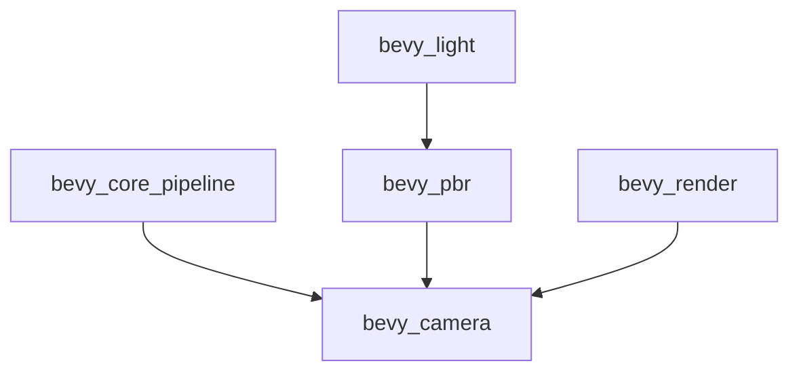

+++
title = "#20479 Use bevy_camera in pbr, core pipelines, render instead of bevy_render::camera re-export"
date = "2025-08-09T00:00:00"
draft = false
template = "pull_request_page.html"
in_search_index = false

[extra]
current_language = "zh-cn"
available_languages = {"en" = { name = "English", url = "/pull_request/bevy/2025-08/pr-20479-en-20250809" }, "zh-cn" = { name = "中文", url = "/pull_request/bevy/2025-08/pr-20479-zh-cn-20250809" }}
+++

# 分析报告：PR #20479 - 在 PBR、核心管线及渲染模块中使用 bevy_camera 替代 bevy_render::camera 的重新导出

## 基本信息
- **标题**: Use bevy_camera in pbr, core pipelines, render instead of bevy_render::camera re-export
- **PR 链接**: https://github.com/bevyengine/bevy/pull/20479
- **作者**: atlv24
- **状态**: 已合并 (MERGED)
- **标签**: A-Rendering, S-Ready-For-Final-Review
- **创建时间**: 2025-08-09T20:54:23Z
- **合并时间**: 2025-08-09T21:39:04Z
- **合并者**: alice-i-cecile

## 描述翻译
### 目标
- 为移除重新导出做准备

### 解决方案
- 标题所述修改

### 测试
- cargo check --examples

---

## 本次 PR 的技术分析

### 问题背景
在 Bevy 引擎的代码结构中，`bevy_render::camera` 模块一直通过重新导出（re-export）的方式提供来自 `bevy_camera` 的功能。这种设计虽然简化了导入路径，但也导致了两个关键问题：
1. **模块边界模糊**：重新导出掩盖了类型和功能的实际来源，增加了代码理解的难度
2. **重构障碍**：阻碍了未来移除重新导出的计划，因为依赖关系遍布整个渲染管线

这个问题在以下模块中尤为明显：
- 核心渲染管线 (`bevy_core_pipeline`)
- 物理渲染模块 (`bevy_pbr`)
- 底层渲染逻辑 (`bevy_render`)

### 解决方案
本次修改采取了直接而系统的重构方案：
1. **移除重新导出依赖**：将所有 `bevy_render::camera` 的引用替换为直接导入 `bevy_camera`
2. **精确类型导入**：针对每个使用场景，显式导入所需的具体类型而非通配符
3. **保持功能不变**：整个重构过程不引入新功能或行为变更

### 具体实现
重构涉及 36 个文件的修改，主要分为三种类型：

#### 1. 相机基础属性迁移
将相机基础属性（如 `Camera`、`Camera3d`）的导入路径从渲染模块迁移到专用相机模块：

```diff
// crates/bevy_core_pipeline/src/bloom/settings.rs
+ use bevy_camera::Camera;
- use bevy_render::{..., prelude::Camera, ...}
```

#### 2. 渲染相关组件迁移
将渲染专用组件（如 `Viewport`、`MainPassResolutionOverride`）归入相机模块：

```diff
// crates/bevy_core_pipeline/src/core_3d/main_opaque_pass_3d_node.rs
+ use bevy_camera::{MainPassResolutionOverride, Viewport};
- use bevy_render::camera::{ExtractedCamera, MainPassResolutionOverride};
```

#### 3. 可见性系统重构
将可见性系统相关类型（如 `ViewVisibility`、`RenderLayers`）整合到相机模块：

```diff
// crates/bevy_pbr/src/render/light.rs
+ use bevy_camera::visibility::{..., ViewVisibility, ...};
- use bevy_render::view::ViewVisibility;
```

### 关键修改文件分析

#### 1. `crates/bevy_pbr/src/render/light.rs` (+8/-3)
- **修改原因**：统一可见性系统的导入路径
- **关键变更**：
  ```diff
  + use bevy_camera::primitives::{CascadesFrusta, CubemapFrusta, Frustum, HalfSpace};
  + use bevy_camera::visibility::{..., ViewVisibility};
  - use bevy_render::primitives::{...};
  - use bevy_render::view::ViewVisibility;
  ```
- **影响**：明确了视锥体和可见性计算属于相机系统的职责范畴

#### 2. `crates/bevy_core_pipeline/src/oit/mod.rs` (+3/-5)
- **修改原因**：分离相机配置与渲染实现
- **关键变更**：
  ```diff
  + use bevy_camera::{Camera, Camera3d};
  - use bevy_render::camera::{Camera, ExtractedCamera};
  - use crate::core_3d::Camera3d;
  ```
- **影响**：消除了核心管线与渲染模块间的循环依赖

#### 3. `crates/bevy_pbr/src/ssr/mod.rs` (+4/-4)
- **修改原因**：修复环境光照的导入路径
- **关键变更**：
  ```diff
  + use bevy_light::EnvironmentMapLight;
  - use crate::prelude::EnvironmentMapLight;
  ```
- **影响**：保持屏幕空间反射功能正常运作的同时清理了模块依赖

#### 4. `crates/bevy_render/src/view/mod.rs` (+2/-5)
- **修改原因**：规范渲染目标定义
- **关键变更**：
  ```diff
  + use bevy_camera::{..., NormalizedRenderTarget};
  - use crate::camera::{..., NormalizedRenderTarget};
  ```
- **影响**：将渲染目标定义从渲染器实现层移到相机抽象层

### 架构影响
本次重构通过清晰的模块边界划分带来以下优势：
1. **依赖关系透明化**：显式声明 `bevy_camera` 依赖，避免隐含的模块耦合
2. **职责分离**：相机相关功能集中到专用模块，渲染模块专注底层实现
3. **未来兼容**：为完全移除 `bevy_render::camera` 重新导出奠定基础

### 组件关系图


### 经验总结
1. **显式优于隐式**：直接导入比重新导出更能清晰表达模块依赖
2. **渐进式重构**：大规模修改可通过系统化的路径替换安全实现
3. **架构边界**：基础组件与渲染实现的分离有助于长期维护

## 延伸阅读
- [Rust 模块系统最佳实践](https://doc.rust-lang.org/book/ch07-02-defining-modules-to-control-scope-and-privacy.html)
- [Bevy 架构设计原则](https://bevyengine.org/learn/book/getting-started/architecture/)
- [依赖反转在实际项目中的应用](https://en.wikipedia.org/wiki/Dependency_inversion_principle)