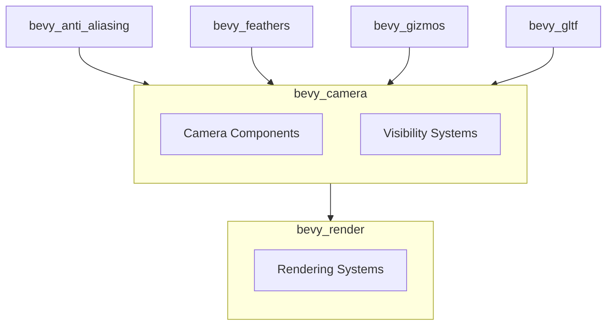

+++
title = "#20480 Use bevy_camera in aa, feathers, gizmos, gltf instead of bevy_render::camera re-export"
date = "2025-08-09T00:00:00"
draft = false
template = "pull_request_page.html"
in_search_index = true

[taxonomies]
list_display = ["show"]

[extra]
current_language = "en"
available_languages = {"en" = { name = "English", url = "/pull_request/bevy/2025-08/pr-20480-en-20250809" }, "zh-cn" = { name = "中文", url = "/pull_request/bevy/2025-08/pr-20480-zh-cn-20250809" }}
labels = ["A-Rendering"]
+++

## Pull Request Analysis: Use bevy_camera in aa, feathers, gizmos, gltf instead of bevy_render::camera re-export

### Basic Information
- **Title**: Use bevy_camera in aa, feathers, gizmos, gltf instead of bevy_render::camera re-export
- **PR Link**: https://github.com/bevyengine/bevy/pull/20480
- **Author**: atlv24
- **Status**: MERGED
- **Labels**: A-Rendering, S-Ready-For-Final-Review
- **Created**: 2025-08-09T20:59:44Z
- **Merged**: 2025-08-09T21:38:09Z
- **Merged By**: alice-i-cecile

### Description Translation
# Objective
- Prepare for removing re-exports

## Solution
- title

## Testing
- cargo check --examples

### The Story of This Pull Request

This PR addresses a structural issue in Bevy's crate dependencies by eliminating indirect imports of camera-related components through `bevy_render`. Previously, several crates accessed camera functionality via re-exports from `bevy_render::camera` and `bevy_render::view`. As part of ongoing efforts to clean up Bevy's architecture and reduce dependency indirection, these imports needed migration to the canonical source: the `bevy_camera` crate.

The changes are straightforward but widespread, affecting 14 files across 4 crates. Each modification follows a consistent pattern: replacing `bevy_render` imports with direct references to `bevy_camera` while preserving identical functionality. The primary motivation is preparation for future removal of re-exports from `bevy_render`, which will simplify Bevy's dependency graph and make imports more explicit.

For anti-aliasing features (`bevy_anti_aliasing`), the PR updates imports for core camera components like `Camera` and `Projection`. Where previously these were accessed via `bevy_render::prelude`, they now come directly from `bevy_camera`. The TAA module additionally switches from using `bevy_core_pipeline::prelude::Camera3d` to `bevy_camera::Camera3d`, demonstrating the cleanup of cross-crate re-exports.

In the UI framework (`bevy_feathers`), visibility components are migrated from `bevy_render::view` to `bevy_camera::visibility`. This affects checkbox and radio button implementations, which now directly reference `bevy_camera::visibility::Visibility` instead of the render-based equivalent. No behavioral changes occur - this is purely an import path update.

The gizmos system (`bevy_gizmos`) undergoes more significant adjustments. First, it adds `bevy_camera` as an explicit dependency in its Cargo.toml. The AABB visualization system now references `bevy_camera::primitives::Aabb` instead of the render-based version. System ordering is updated to use `bevy_camera::visibility::VisibilitySystems` rather than the render equivalent. Configuration handling and rendering pipelines are similarly updated to use `bevy_camera::visibility::RenderLayers`.

Finally, the GLTF loader (`bevy_gltf`) completes the set by replacing a single `bevy_core_pipeline::prelude::Camera3d` import with `bevy_camera::Camera3d`. This change aligns with the overall goal of using canonical sources for camera-related components.

All changes were validated with `cargo check --examples`, confirming compilation without behavioral changes. This PR is a foundational step toward simplifying Bevy's render module and establishing clearer boundaries between camera management and rendering systems.

### Visual Representation



### Key Files Changed

1. **`crates/bevy_anti_aliasing/src/taa/mod.rs`**  
   Updated camera imports to use canonical source:
   ```rust
   // Before:
   use bevy_render::prelude::{Camera, Projection};
   
   // After:
   use bevy_camera::{Camera, Camera3d, Projection};
   ```

2. **`crates/bevy_feathers/src/controls/checkbox.rs`**  
   Migrated visibility component:
   ```rust
   // Before:
   use bevy_render::view::Visibility;
   
   // After:
   use bevy_camera::visibility::Visibility;
   ```

3. **`crates/bevy_gizmos/src/aabb.rs`**  
   Updated AABB import and system ordering:
   ```rust
   // Before:
   use bevy_render::primitives::Aabb;
   after(bevy_render::view::VisibilitySystems::CalculateBounds)
   
   // After:
   use bevy_camera::primitives::Aabb;
   after(bevy_camera::visibility::VisibilitySystems::CalculateBounds)
   ```

4. **`crates/bevy_gizmos/src/config.rs`**  
   Updated render layers import:
   ```rust
   // Before:
   pub render_layers: bevy_render::view::RenderLayers;
   
   // After:
   pub render_layers: bevy_camera::visibility::RenderLayers;
   ```

5. **`crates/bevy_gizmos/src/pipeline_2d.rs`**  
   Fixed render layers import:
   ```rust
   // Before:
   use bevy_render::view::RenderLayers;
   
   // After:
   use bevy_camera::visibility::RenderLayers;
   ```

### Further Reading
1. [Bevy's Module Structure Guidelines](https://github.com/bevyengine/bevy/blob/main/docs/plugins_guidelines.md#module-structure)
2. [Rust's Use Declarations](https://doc.rust-lang.org/reference/items/use-declarations.html)
3. [Bevy Camera System Documentation](https://github.com/bevyengine/bevy/tree/main/crates/bevy_camera)