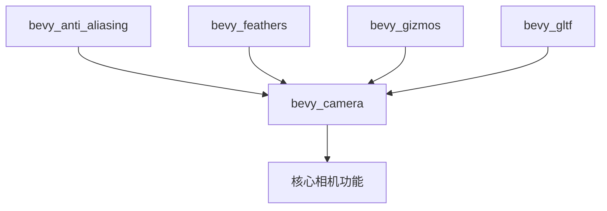

+++
title = "#20480 Use bevy_camera in aa, feathers, gizmos, gltf instead of bevy_render::camera re-export"
date = "2025-08-09T00:00:00"
draft = false
template = "pull_request_page.html"
in_search_index = false

[extra]
current_language = "zh-cn"
available_languages = {"en" = { name = "English", url = "/pull_request/bevy/2025-08/pr-20480-en-20250809" }, "zh-cn" = { name = "中文", url = "/pull_request/bevy/2025-08/pr-20480-zh-cn-20250809" }}
+++

# 分析报告：PR #20480 - Use bevy_camera in aa, feathers, gizmos, gltf instead of bevy_render::camera re-export

## 基础信息
- **标题**: Use bevy_camera in aa, feathers, gizmos, gltf instead of bevy_render::camera re-export
- **PR 链接**: https://github.com/bevyengine/bevy/pull/20480
- **作者**: atlv24
- **状态**: 已合并
- **标签**: A-Rendering, S-Ready-For-Final-Review
- **创建时间**: 2025-08-09T20:59:44Z
- **合并时间**: 2025-08-09T21:38:09Z
- **合并人**: alice-i-cecile

## 描述翻译
# 目标

- 为移除重新导出做准备

## 解决方案

- 标题

## 测试

- cargo check --examples

## PR 技术分析

### 问题背景
Bevy 引擎正在进行模块化重构，目标是减少内部 crate 之间的耦合。具体到本 PR，核心问题是多个 crate (`bevy_anti_aliasing`, `bevy_feathers`, `bevy_gizmos`, `bevy_gltf`) 通过 `bevy_render::camera` 的重新导出(re-export)来访问相机相关功能。这种设计导致：
1. 不必要的依赖传递：crate 被迫依赖完整的 `bevy_render`，而实际只需要相机功能
2. 架构不清晰：相机逻辑应属于专用模块而非渲染模块
3. 阻碍未来重构：直接依赖使移除重新导出变得困难

### 解决方案
PR 采用直接路径替换策略：
1. 在相关 crate 的 Cargo.toml 添加 `bevy_camera` 依赖
2. 将代码中所有 `bevy_render::prelude::Camera` 的引用替换为 `bevy_camera::Camera`
3. 将相机相关类型（`Aabb`, `Visibility`, `RenderLayers` 等）的导入路径更新到正确模块
4. 保持功能完全不变，仅修改导入路径

这种改动是机械性的，但为未来彻底移除 `bevy_render` 中的相机重新导出奠定了基础。

### 关键实现细节
#### 依赖管理
每个受影响 crate 的 Cargo.toml 显式添加了 `bevy_camera` 依赖：
```diff
# crates/bevy_anti_aliasing/Cargo.toml
+bevy_camera = { path = "../bevy_camera", version = "0.17.0-dev" }
```
这确保编译时能正确解析 `bevy_camera` 路径。

#### 类型路径更新
所有相机核心类型都更新到直接使用 `bevy_camera`：
```diff
# crates/bevy_anti_aliasing/src/taa/mod.rs
- use bevy_core_pipeline::prelude::Camera3d;
- use bevy_render::prelude::{Camera, Projection};
+ use bevy_camera::{Camera, Camera3d, Projection};
```
这种改动消除了对 `bevy_render` 内部模块的隐式依赖。

#### 可见性系统调整
`bevy_gizmos` 中与可见性计算相关的系统顺序依赖更新：
```diff
# crates/bevy_gizmos/src/aabb.rs
- .after(bevy_render::view::VisibilitySystems::CalculateBounds)
+ .after(bevy_camera::visibility::VisibilitySystems::CalculateBounds)
```
这反映 `VisibilitySystems` 已迁移到 `bevy_camera`。

#### 渲染层类型更新
`RenderLayers` 类型的使用位置全部更新路径：
```diff
# crates/bevy_gizmos/src/config.rs
- pub render_layers: bevy_render::view::RenderLayers,
+ pub render_layers: bevy_camera::visibility::RenderLayers,
```
保持类型一致性同时消除对渲染模块的依赖。

### 技术影响
1. **依赖简化**：各 crate 现在只声明实际需要的依赖
2. **架构清晰化**：相机相关功能集中到专用模块
3. **编译优化**：减少不必要的编译依赖链
4. **未来兼容**：为彻底移除重新导出做准备

### 测试验证
作者通过 `cargo check --examples` 验证了编译通过。考虑到这是纯重构（无逻辑变更），编译检查足以保证功能不变性。

## 组件关系图



## 关键文件变更

### crates/bevy_gizmos/src/aabb.rs
**变更原因**：更新 AABB 类型和可见性系统的导入路径  
**代码变更**：
```diff
use bevy_app::{Plugin, PostUpdate};
+use bevy_camera::primitives::Aabb;
use bevy_color::{Color, Oklcha};
...
- use bevy_render::primitives::Aabb;

impl Plugin for AabbGizmoPlugin {
    ...
        .after(
-            bevy_render::view::VisibilitySystems::CalculateBounds
+            bevy_camera::visibility::VisibilitySystems::CalculateBounds
        )
}
```

### crates/bevy_gizmos/src/config.rs
**变更原因**：RenderLayers 类型路径更新  
**代码变更**：
```diff
- pub render_layers: bevy_render::view::RenderLayers,
+ pub render_layers: bevy_camera::visibility::RenderLayers,
```

### crates/bevy_gizmos/src/retained.rs
**变更原因**：RenderLayers 类型路径更新  
**代码变更**：
```diff
+ #[cfg(feature = "bevy_render")]
+ use bevy_camera::visibility::RenderLayers;
...
- use bevy_render::view::RenderLayers;
```

### crates/bevy_anti_aliasing/src/taa/mod.rs
**变更原因**：相机类型路径集中化  
**代码变更**：
```diff
+ use bevy_camera::{Camera, Camera3d, Projection};
...
- use bevy_core_pipeline::prelude::Camera3d;
- use bevy_render::prelude::{Camera, Projection};
```

### crates/bevy_gizmos/src/pipeline_2d.rs
**变更原因**：RenderLayers 类型路径更新  
**代码变更**：
```diff
+ use bevy_camera::visibility::RenderLayers;
...
- use bevy_render::view::{ExtractedView, Msaa, RenderLayers, ViewTarget};
+ use bevy_render::view::{ExtractedView, Msaa, ViewTarget};
```

## 延伸阅读
1. [Bevy 模块化设计文档](https://github.com/bevyengine/bevy/blob/main/docs/architecture/modularity.md)
2. [Rust 可见性系统最佳实践](https://doc.rust-lang.org/book/ch07-03-paths-for-referring-to-an-item-in-the-module-tree.html)
3. [Cargo 依赖管理指南](https://doc.rust-lang.org/cargo/reference/specifying-dependencies.html)

## 完整代码变更
```diff
diff --git a/crates/bevy_anti_aliasing/Cargo.toml b/crates/bevy_anti_aliasing/Cargo.toml
index 8c32d70fff0bb..f17b3796429e8 100644
--- a/crates/bevy_anti_aliasing/Cargo.toml
+++ b/crates/bevy_anti_aliasing/Cargo.toml
@@ -19,6 +19,7 @@ smaa_luts = ["bevy_render/ktx2", "bevy_image/ktx2", "bevy_image/zstd"]
 bevy_asset = { path = "../bevy_asset", version = "0.17.0-dev" }
 bevy_reflect = { path = "../bevy_reflect", version = "0.17.0-dev" }
 bevy_render = { path = "../bevy_render", version = "0.17.0-dev" }
+bevy_camera = { path = "../bevy_camera", version = "0.17.0-dev" }
 bevy_math = { path = "../bevy_math", version = "0.17.0-dev" }
 bevy_utils = { path = "../bevy_utils", version = "0.17.0-dev" }
 bevy_app = { path = "../bevy_app", version = "0.17.0-dev" }
diff --git a/crates/bevy_anti_aliasing/src/contrast_adaptive_sharpening/mod.rs b/crates/bevy_anti_aliasing/src/contrast_adaptive_sharpening/mod.rs
index 845f4c98dd462..8b4d745cb4599 100644
--- a/crates/bevy_anti_aliasing/src/contrast_adaptive_sharpening/mod.rs
+++ b/crates/bevy_anti_aliasing/src/contrast_adaptive_sharpening/mod.rs
@@ -1,5 +1,6 @@
 use bevy_app::prelude::*;
 use bevy_asset::{embedded_asset, load_embedded_asset, AssetServer, Handle};
+use bevy_camera::Camera;
 use bevy_core_pipeline::{
     core_2d::graph::{Core2d, Node2d},
     core_3d::graph::{Core3d, Node3d},
@@ -10,7 +11,6 @@ use bevy_image::BevyDefault as _;
 use bevy_reflect::{std_traits::ReflectDefault, Reflect};
 use bevy_render::{
     extract_component::{ExtractComponent, ExtractComponentPlugin, UniformComponentPlugin},
-    prelude::Camera,
     render_graph::RenderGraphExt,
     render_resource::{
         binding_types::{sampler, texture_2d, uniform_buffer},
diff --git a/crates/bevy_anti_aliasing/src/fxaa/mod.rs b/crates/bevy_anti_aliasing/src/fxaa/mod.rs
index 6b67770230684..8453526d2b971 100644
--- a/crates/bevy_anti_aliasing/src/fxaa/mod.rs
+++ b/crates/bevy_anti_aliasing/src/fxaa/mod.rs
@@ -1,5 +1,6 @@
 use bevy_app::prelude::*;
 use bevy_asset::{embedded_asset, load_embedded_asset, AssetServer, Handle};
+use bevy_camera::Camera;
 use bevy_core_pipeline::{
     core_2d::graph::{Core2d, Node2d},
     core_3d::graph::{Core3d, Node3d},
@@ -10,7 +11,6 @@ use bevy_image::BevyDefault as _;
 use bevy_reflect::{std_traits::ReflectDefault, Reflect};
 use bevy_render::{
     extract_component::{ExtractComponent, ExtractComponentPlugin},
-    prelude::Camera,
     render_graph::{RenderGraphExt, ViewNodeRunner},
     render_resource::{
         binding_types::{sampler, texture_2d},
diff --git a/crates/bevy_anti_aliasing/src/taa/mod.rs b/crates/bevy_anti_aliasing/src/taa/mod.rs
index d32b28251bc23..b3e75cfe7643e 100644
--- a/crates/bevy_anti_aliasing/src/taa/mod.rs
+++ b/crates/bevy_anti_aliasing/src/taa/mod.rs
@@ -1,8 +1,8 @@
 use bevy_app::{App, Plugin};
 use bevy_asset::{embedded_asset, load_embedded_asset, AssetServer, Handle};
+use bevy_camera::{Camera, Camera3d, Projection};
 use bevy_core_pipeline::{
     core_3d::graph::{Core3d, Node3d},
-    prelude::Camera3d,
     prepass::{DepthPrepass, MotionVectorPrepass, ViewPrepassTextures},
     FullscreenShader,
 };
@@ -21,7 +21,6 @@ use bevy_reflect::{std_traits::ReflectDefault, Reflect};
 use bevy_render::{
     camera::{ExtractedCamera, MipBias, TemporalJitter},
     diagnostic::RecordDiagnostics,
-    prelude::{Camera, Projection},
     render_graph::{NodeRunError, RenderGraphContext, RenderGraphExt, ViewNode, ViewNodeRunner},
     render_resource::{
         binding_types::{sampler, texture_2d, texture_depth_2d},
diff --git a/crates/bevy_feathers/Cargo.toml b/crates/bevy_feathers/Cargo.toml
index aee34f5158655..305a88f203deb 100644
--- a/crates/bevy_feathers/Cargo.toml
+++ b/crates/bevy_feathers/Cargo.toml
@@ -13,6 +13,7 @@ keywords = ["bevy"]
 bevy_a11y = { path = "../bevy_a11y", version = "0.17.0-dev" }
 bevy_app = { path = "../bevy_app", version = "0.17.0-dev" }
 bevy_asset = { path = "../bevy_asset", version = "0.17.0-dev" }
+bevy_camera = { path = "../bevy_camera", version = "0.17.0-dev" }
 bevy_color = { path = "../bevy_color", version = "0.17.0-dev" }
 bevy_core_widgets = { path = "../bevy_core_widgets", version = "0.17.0-dev" }
 bevy_ecs = { path = "../bevy_ecs", version = "0.17.0-dev" }
diff --git a/crates/bevy_feathers/src/controls/checkbox.rs b/crates/bevy_feathers/src/controls/checkbox.rs
index 328098eeb2578..c28cbea5600a5 100644
--- a/crates/bevy_feathers/src/controls/checkbox.rs
+++ b/crates/bevy_feathers/src/controls/checkbox.rs
@@ -1,4 +1,5 @@
 use bevy_app::{Plugin, PreUpdate};
+use bevy_camera::visibility::Visibility;
 use bevy_core_widgets::{Callback, CoreCheckbox, ValueChange};
 use bevy_ecs::{
     bundle::Bundle,
@@ -17,7 +18,6 @@ use bevy_input_focus::tab_navigation::TabIndex;
 use bevy_math::Rot2;
 use bevy_picking::{hover::Hovered, PickingSystems};
 use bevy_reflect::{prelude::ReflectDefault, Reflect};
-use bevy_render::view::Visibility;
 use bevy_ui::{
     AlignItems, BorderRadius, Checked, Display, FlexDirection, InteractionDisabled, JustifyContent,
     Node, PositionType, UiRect, UiTransform, Val,
diff --git a/crates/bevy_feathers/src/controls/radio.rs b/crates/bevy_feathers/src/controls/radio.rs
index 0b13069158919..9b9b0d06cdd77 100644
--- a/crates/bevy_feathers/src/controls/radio.rs
+++ b/crates/bevy_feathers/src/controls/radio.rs
@@ -1,4 +1,5 @@
 use bevy_app::{Plugin, PreUpdate};
+use bevy_camera::visibility::Visibility;
 use bevy_core_widgets::CoreRadio;
 use bevy_ecs::{
     bundle::Bundle,
@@ -16,7 +17,6 @@ use bevy_ecs::{
 use bevy_input_focus::tab_navigation::TabIndex;
 use bevy_picking::{hover::Hovered, PickingSystems};
 use bevy_reflect::{prelude::ReflectDefault, Reflect};
-use bevy_render::view::Visibility;
 use bevy_ui::{
     AlignItems, BorderRadius, Checked, Display, FlexDirection, InteractionDisabled, JustifyContent,
     Node, UiRect, Val,
diff --git a/crates/bevy_gizmos/Cargo.toml b/crates/bevy_gizmos/Cargo.toml
index e29dea96869b2..c78608c2c1dfe 100644
--- a/crates/bevy_gizmos/Cargo.toml
+++ b/crates/bevy_gizmos/Cargo.toml
@@ -18,6 +18,7 @@ bevy_render = ["dep:bevy_render", "bevy_core_pipeline"]
 bevy_pbr = { path = "../bevy_pbr", version = "0.17.0-dev", optional = true }
 bevy_sprite = { path = "../bevy_sprite", version = "0.17.0-dev", optional = true }
 bevy_app = { path = "../bevy_app", version = "0.17.0-dev" }
+bevy_camera = { path = "../bevy_camera", version = "0.17.0-dev" }
 bevy_color = { path = "../bevy_color", version = "0.17.0-dev" }
 bevy_ecs = { path = "../bevy_ecs", version = "0.17.0-dev" }
 bevy_image = { path = "../bevy_image", version = "0.17.0-dev" }
diff --git a/crates/bevy_gizmos/src/aabb.rs b/crates/bevy_gizmos/src/aabb.rs
index 97b4f3e9ebd4c..64e66f57e3188 100644
--- a/crates/bevy_gizmos/src/aabb.rs
+++ b/crates/bevy_gizmos/src/aabb.rs
@@ -1,6 +1,7 @@
 //! A module adding debug visualization of [`Aabb`]s.
 
 use bevy_app::{Plugin, PostUpdate};
+use bevy_camera::primitives::Aabb;
 use bevy_color::{Color, Oklcha};
 use bevy_ecs::{
     component::Component,
@@ -11,7 +12,6 @@ use bevy_ecs::{
     system::{Query, Res},
 };
 use bevy_reflect::{std_traits::ReflectDefault, Reflect};
-use bevy_render::primitives::Aabb;
 use bevy_transform::{
     components::{GlobalTransform, Transform},
     TransformSystems,
@@ -36,7 +36,7 @@ impl Plugin for AabbGizmoPlugin {
                     config.config::<AabbGizmoConfigGroup>().1.draw_all
                 }),
             )
-                .after(bevy_render::view::VisibilitySystems::CalculateBounds)
+                .after(bevy_camera::visibility::VisibilitySystems::CalculateBounds)
                 .after(TransformSystems::Propagate),
         );
     }
diff --git a/crates/bevy_gizmos/src/config.rs b/crates/bevy_gizmos/src/config.rs
index 973fa1cf0fbce..3fcc45deb440c 100644
--- a/crates/bevy_gizmos/src/config.rs
+++ b/crates/bevy_gizmos/src/config.rs
@@ -196,7 +196,7 @@ pub struct GizmoConfig {
     ///
     /// Gizmos will only be rendered to cameras with intersecting layers.
     #[cfg(feature = "bevy_render")]
-    pub render_layers: bevy_render::view::RenderLayers,
+    pub render_layers: bevy_camera::visibility::RenderLayers,
 }
 
 impl Default for GizmoConfig {
@@ -253,6 +253,6 @@ pub(crate) struct GizmoMeshConfig {
     pub line_perspective: bool,
     pub line_style: GizmoLineStyle,
     pub line_joints: GizmoLineJoint,
-    pub render_layers: bevy_render::view::RenderLayers,
+    pub render_layers: bevy_camera::visibility::RenderLayers,
     pub handle: Handle<GizmoAsset>,
 }
diff --git a/crates/bevy_gizmos/src/pipeline_2d.rs b/crates/bevy_gizmos/src/pipeline_2d.rs
index 4fc75e63b7370..8709e23f56625 100644
--- a/crates/bevy_gizmos/src/pipeline_2d.rs
+++ b/crates/bevy_gizmos/src/pipeline_2d.rs
@@ -6,6 +6,7 @@ use crate::{
 };
 use bevy_app::{App, Plugin};
 use bevy_asset::{load_embedded_asset, AssetServer, Handle};
+use bevy_camera::visibility::RenderLayers;
 use bevy_core_pipeline::core_2d::{Transparent2d, CORE_2D_DEPTH_FORMAT};
 
 use bevy_ecs::{
@@ -23,7 +24,7 @@ use bevy_render::{
         ViewSortedRenderPhases,
     },
     render_resource::*,
-    view::{ExtractedView, Msaa, RenderLayers, ViewTarget},
+    view::{ExtractedView, Msaa, ViewTarget},
     Render, RenderApp, RenderSystems,
 };
 use bevy_render::{sync_world::MainEntity, RenderStartup};
diff --git a/crates/bevy_gizmos/src/pipeline_3d.rs b/crates/bevy_gizmos/src/pipeline_3d.rs
index 66f2050e558e6..c2372d8e60e42 100644
--- a/crates/bevy_gizmos/src/pipeline_3d.rs
+++ b/crates/bevy_gizmos/src/pipeline_3d.rs
@@ -6,6 +6,7 @@ use crate::{
 };
 use bevy_app::{App, Plugin};
 use bevy_asset::{load_embedded_asset, AssetServer, Handle};
+use bevy_camera::visibility::RenderLayers;
 use bevy_core_pipeline::{
     core_3d::{Transparent3d, CORE_3D_DEPTH_FORMAT},
     oit::OrderIndependentTransparencySettings,
@@ -28,7 +29,7 @@ use bevy_render::{
         ViewSortedRenderPhases,
     },
     render_resource::*,
-    view::{ExtractedView, Msaa, RenderLayers, ViewTarget},
+    view::{ExtractedView, Msaa, ViewTarget},
     Render, RenderApp, RenderSystems,
 };
 use bevy_render::{sync_world::MainEntity, RenderStartup};
diff --git a/crates/bevy_gizmos/src/retained.rs b/crates/bevy_gizmos/src/retained.rs
index 4cc75f236da13..2046c7a268fa6 100644
--- a/crates/bevy_gizmos/src/retained.rs
+++ b/crates/bevy_gizmos/src/retained.rs
@@ -3,6 +3,8 @@
 use core::ops::{Deref, DerefMut};
 
 use bevy_asset::Handle;
+#[cfg(feature = "bevy_render")]
+use bevy_camera::visibility::RenderLayers;
 use bevy_ecs::{component::Component, reflect::ReflectComponent};
 use bevy_reflect::{std_traits::ReflectDefault, Reflect};
 use bevy_transform::components::Transform;
@@ -14,7 +16,7 @@ use {
         entity::