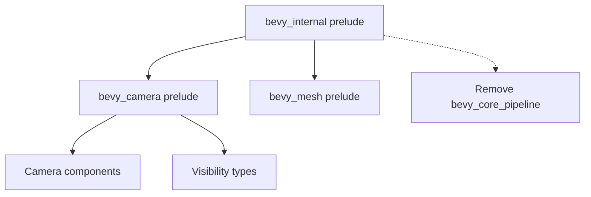

+++
title = "#20483 Add a prelude to bevy_camera"
date = "2025-08-09T00:00:00"
draft = false
template = "pull_request_page.html"
in_search_index = true

[taxonomies]
list_display = ["show"]

[extra]
current_language = "en"
available_languages = {"en" = { name = "English", url = "/pull_request/bevy/2025-08/pr-20483-en-20250809" }, "zh-cn" = { name = "中文", url = "/pull_request/bevy/2025-08/pr-20483-zh-cn-20250809" }}
labels = ["D-Trivial", "A-Rendering", "C-Usability"]
+++

# PR Analysis: Add a prelude to bevy_camera

## Basic Information
- **Title**: Add a prelude to bevy_camera
- **PR Link**: https://github.com/bevyengine/bevy/pull/20483
- **Author**: atlv24
- **Status**: MERGED
- **Labels**: D-Trivial, A-Rendering, C-Usability, S-Ready-For-Final-Review
- **Created**: 2025-08-09T21:31:49Z
- **Merged**: 2025-08-09T22:44:22Z
- **Merged By**: alice-i-cecile

## Description Translation
# Objective

- title. this is the exact set of prelude re-exports bevy_render provides of bevy_mesh. We will soon be ready to yeet the re-exports.
- also fix an oversight with bevy mesh prelude

## Solution

- do it

## Testing

- cargo check --examples

## The Story of This Pull Request

This PR addresses two related issues in Bevy's module structure. First, the camera crate lacked a prelude module, making it inconsistent with other core Bevy crates like `bevy_mesh` that already provided preludes. Without a prelude, developers needed to manually import multiple camera-related types, which was cumbersome and error-prone. Second, there was an oversight in Bevy's internal prelude where `bevy_core_pipeline` types were still being re-exported despite being moved to other crates.

The solution implemented a standard prelude pattern for `bevy_camera`, following the same approach used in `bevy_mesh`. The new prelude consolidates essential camera components and visibility types into a single module. This allows developers to import all common camera functionality with one line:

```rust
use bevy::prelude::*;
```

Concurrently, the PR cleaned up Bevy's internal prelude by removing outdated `bevy_core_pipeline` re-exports and properly including the new camera prelude. This correction ensures Bevy's top-level prelude only contains currently relevant components.

The implementation required minimal changes but significantly improves developer ergonomics. By standardizing the prelude pattern across crates, the change makes Bevy's API more consistent and reduces import boilerplate. The PR maintains backward compatibility while preparing for future refactoring where mesh re-exports can be removed.

Testing was straightforward using `cargo check --examples` to verify no regressions in example projects. The changes are purely organizational and don't affect runtime behavior.

## Visual Representation



## Key Files Changed

1. `crates/bevy_camera/src/lib.rs` (+12/-0)
   - Added camera prelude module with core component re-exports

```rust
// File: crates/bevy_camera/src/lib.rs
// After:
/// The camera prelude.
///
/// This includes the most common types in this crate, re-exported for your convenience.
pub mod prelude {
    #[doc(hidden)]
    pub use crate::{
        visibility::{InheritedVisibility, ViewVisibility, Visibility},
        Camera, Camera2d, Camera3d, ClearColor, ClearColorConfig, OrthographicProjection,
        PerspectiveProjection, Projection,
    };
}
```

2. `crates/bevy_internal/src/prelude.rs` (+5/-5)
   - Added camera prelude import and removed deprecated core pipeline re-exports

```rust
// File: crates/bevy_internal/src/prelude.rs
// Before:
#[doc(hidden)]
#[cfg(feature = "bevy_image")]
pub use crate::image::prelude::*;

#[doc(hidden)]
#[cfg(feature = "bevy_mesh")]
pub use crate::mesh::prelude::*;

// ... other imports ...

#[doc(hidden)]
#[cfg(feature = "bevy_core_pipeline")]
pub use crate::core_pipeline::prelude::*;

// After:
#[doc(hidden)]
#[cfg(feature = "bevy_image")]
pub use crate::image::prelude::*;

#[doc(hidden)]
#[cfg(feature = "bevy_mesh")]
pub use crate::mesh::prelude::*;

#[doc(hidden)]
#[cfg(feature = "bevy_camera")]
pub use crate::camera::prelude::*;

// ... other imports ...
// Note: bevy_core_pipeline import was removed
```

## Further Reading
- [Rust Prelude Pattern Documentation](https://doc.rust-lang.org/std/prelude/index.html)
- [Bevy Engine Prelude Structure](https://github.com/bevyengine/bevy/tree/main/crates/bevy_internal/src/prelude.rs)
- [Module Re-export Guidelines](https://rust-lang.github.io/api-guidelines/visibility.html)