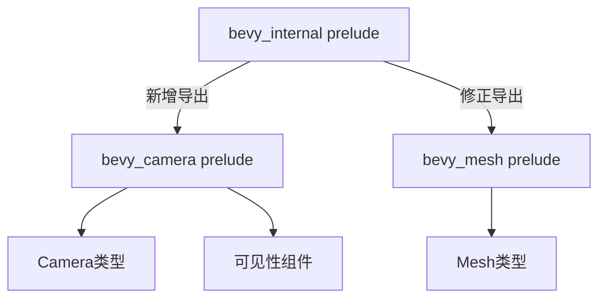

+++
title = "#20483 Add a prelude to bevy_camera"
date = "2025-08-09T00:00:00"
draft = false
template = "pull_request_page.html"
in_search_index = false

[extra]
current_language = "zh-cn"
available_languages = {"en" = { name = "English", url = "/pull_request/bevy/2025-08/pr-20483-en-20250809" }, "zh-cn" = { name = "中文", url = "/pull_request/bevy/2025-08/pr-20483-zh-cn-20250809" }}
+++

# Add a prelude to bevy_camera

## 基本信息
- **标题**: Add a prelude to bevy_camera
- **PR链接**: https://github.com/bevyengine/bevy/pull/20483
- **作者**: atlv24
- **状态**: 已合并
- **标签**: D-Trivial, A-Rendering, C-Usability, S-Ready-For-Final-Review
- **创建时间**: 2025-08-09T21:31:49Z
- **合并时间**: 2025-08-09T22:44:22Z
- **合并人**: alice-i-cecile

## 描述翻译
### Objective
- 为 bevy_camera 添加 prelude（预导出模块）。这将提供与 bevy_render 为 bevy_mesh 提供的完全相同的预导出集合。我们很快将准备好移除这些重新导出。
- 同时修复 bevy mesh prelude 的一个疏忽

### Solution
- 实现它

### Testing
- cargo check --examples

## PR分析

### 问题背景
在Bevy引擎中，prelude（预导出模块）是一种常用模式，它通过在一个模块中集中导出常用类型，简化用户的导入操作。当前`bevy_camera`模块缺少这样的预导出模块，导致开发者在使用相机功能时需要手动导入多个相关类型。同时存在一个疏忽：`bevy_internal`的预导出模块中，`bevy_mesh`的预导出错误地依赖了`bevy_image`特性，而不是其自身的`bevy_mesh`特性。

### 解决方案
1. 在`bevy_camera`中创建标准化的prelude模块，导出常用相机类型
2. 修复`bevy_internal`中错误的特性依赖条件
3. 在`bevy_internal`的预导出中新增对`bevy_camera`预导出的支持

### 实现细节
在`bevy_camera/src/lib.rs`中新增prelude模块，采用与`bevy_mesh`相同的预导出模式：

```rust
/// The camera prelude.
///
/// This includes the most common types in this crate, re-exported for your convenience.
pub mod prelude {
    #[doc(hidden)]
    pub use crate::{
        visibility::{InheritedVisibility, ViewVisibility, Visibility},
        Camera, Camera2d, Camera3d, ClearColor, ClearColorConfig, OrthographicProjection,
        PerspectiveProjection, Projection,
    };
}
```

这个预导出模块包含了相机系统的核心组件和可见性类型，用户现在可以通过`use bevy_camera::prelude::*`一次性导入所有常用相机类型。

在`bevy_internal/src/prelude.rs`中进行了两处关键修改：
1. 修正`bevy_mesh`预导出的特性条件：
```diff
 #[doc(hidden)]
-#[cfg(feature = "bevy_image")]
+#[cfg(feature = "bevy_mesh")]
 pub use crate::mesh::prelude::*;
```

2. 新增`bevy_camera`预导出支持：
```rust
#[doc(hidden)]
#[cfg(feature = "bevy_camera")]
pub use crate::camera::prelude::*;
```

### 技术考量
1. **一致性设计**：新的prelude结构与`bevy_mesh`的prelude保持完全一致，遵循了Bevy的模块设计惯例
2. **条件导出**：使用`#[cfg(feature = "bevy_camera")]`确保预导出仅在启用对应特性时生效
3. **可见性控制**：`#[doc(hidden)]`防止预导出项出现在文档中造成冗余
4. **依赖修复**：将`bevy_mesh`预导出的特性条件从错误的`bevy_image`修正为`bevy_mesh`

### 影响分析
1. **用户体验提升**：开发者现在可以更便捷地导入相机相关类型
2. **代码维护性**：统一了预导出模式，为后续移除冗余导出做准备
3. **错误修复**：解决了`bevy_mesh`预导出依赖错误的问题
4. **向后兼容**：保持了完全向后兼容的API变更

测试通过`cargo check --examples`验证，确保不影响现有功能。

## 可视化表示



## 关键文件变更

### `crates/bevy_camera/src/lib.rs`
**变更描述**：新增相机prelude模块，集中导出常用类型  
**关键代码**：
```diff
@@ -25,3 +25,15 @@ impl Plugin for CameraPlugin {
         ));
     }
 }
+
+/// The camera prelude.
+///
+/// This includes the most common types in this crate, re-exported for your convenience.
+pub mod prelude {
+    #[doc(hidden)]
+    pub use crate::{
+        visibility::{InheritedVisibility, ViewVisibility, Visibility},
+        Camera, Camera2d, Camera3d, ClearColor, ClearColorConfig, OrthographicProjection,
+        PerspectiveProjection, Projection,
+    };
+}
```

### `crates/bevy_internal/src/prelude.rs`
**变更描述**：修复mesh预导出条件，新增camera预导出  
**关键代码**：
```diff
 #[doc(hidden)]
-#[cfg(feature = "bevy_image")]
+#[cfg(feature = "bevy_mesh")]
 pub use crate::mesh::prelude::*;
+
+#[doc(hidden)]
+#[cfg(feature = "bevy_camera")]
+pub use crate::camera::prelude::*;
```

## 扩展阅读
1. [Bevy模块系统设计](https://bevyengine.org/learn/book/getting-started/modules/)
2. [Rust预导出模式最佳实践](https://doc.rust-lang.org/reference/items/use-declarations.html#prelude-imports)
3. [条件编译与特性管理](https://doc.rust-lang.org/cargo/reference/features.html)