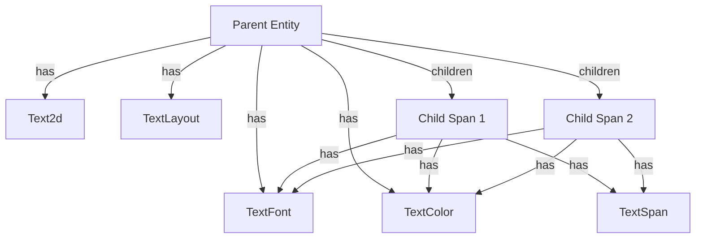

+++
title = "#20484 Improve TextSpan documentation"
date = "2025-08-14T00:00:00"
draft = false
template = "pull_request_page.html"
in_search_index = true

[taxonomies]
list_display = ["show"]

[extra]
current_language = "en"
available_languages = {"en" = { name = "English", url = "/pull_request/bevy/2025-08/pr-20484-en-20250814" }, "zh-cn" = { name = "中文", url = "/pull_request/bevy/2025-08/pr-20484-zh-cn-20250814" }}
labels = ["C-Docs", "A-Text"]
+++

## Improve TextSpan Documentation

### Basic Information
- **Title**: Improve TextSpan documentation
- **PR Link**: https://github.com/bevyengine/bevy/pull/20484
- **Author**: gwafotapa
- **Status**: MERGED
- **Labels**: C-Docs, S-Ready-For-Final-Review, A-Text
- **Created**: 2025-08-09T22:20:10Z
- **Merged**: 2025-08-13T17:33:50Z
- **Merged By**: alice-i-cecile

### Description Translation
The original description is in English, so it's preserved as-is:

**Objective**

The example in the documentation of `TextSpan` is wrong. It correctly states that `Text` or `Text2d` must be present but won't use either leading to no rendering. It also states that `TextLayout`, `TextFont` and `TextColor` of the first span will all set default values for the children, which is not true. `TextLayout` determines the layout of the block but each node has its own `TextFont` and `TextColor` which are both required components of `TextSpan`.

The type description is not clear about `Text` or `Text2d` being mandatory.

**Solution**

- Fix the documentation

### The Story of This Pull Request

#### The Problem
The existing documentation for `TextSpan` contained two significant issues. First, the code example incorrectly demonstrated how to use `TextSpan` by omitting the required `Text` or `Text2d` component on the parent entity. Without either of these components, the text wouldn't render at all, making the example misleading. Second, the documentation incorrectly claimed that the parent's `TextFont` and `TextColor` components would propagate default values to child spans. In reality, each `TextSpan` requires its own `TextFont` and `TextColor` components, and the parent's components only affect the root text segment.

#### The Solution Approach
The solution involved rewriting both the explanatory text and the code example to accurately reflect how the text rendering system works. Key corrections include:
1. Explicitly stating that `Text` or `Text2d` must be present on the parent entity
2. Clarifying that `TextLayout` controls the entire text block's layout
3. Emphasizing that each `TextSpan` requires its own `TextFont` and `TextColor`
4. Demonstrating correct component composition through a working example

#### Implementation Details
The documentation was restructured to provide clear technical specifications before the example. The new documentation:
- Opens with a precise statement about parent requirements
- Explains the relationship between parent layout and child styling
- Shows a complete, functional example using `Text2d`
- Demonstrates how defaults are applied when components are missing

The example now correctly:
1. Uses `Text2d` as the root component
2. Shows `TextLayout` configuration on the parent
3. Includes `TextFont` and `TextColor` on both parent and children
4. Demonstrates the `children!` macro for hierarchy construction
5. Shows default component insertion when required components are omitted

#### Technical Insights
This correction highlights three important Bevy text system characteristics:
1. **Component Requirements**: `TextSpan` only functions when attached to an entity with either `Text` or `Text2d`
2. **Styling Isolation**: Font and color settings don't cascade - each span needs explicit components
3. **Default Behavior**: Missing required components trigger default insertion (black text, default font size)

The update clarifies the separation of concerns:
- `TextLayout` controls global layout (alignment, wrapping)
- `TextFont` manages per-span typography
- `TextColor` handles per-span coloring

#### Impact
These documentation improvements:
- Prevent user confusion about required components
- Eliminate misleading information about style inheritance
- Provide a working reference implementation
- Reduce potential debugging time for text rendering issues

The changes maintain backward compatibility while significantly improving the developer experience for anyone working with Bevy's text system.

### Visual Representation


### Key Files Changed
**File**: `crates/bevy_text/src/text.rs`  
**Changes**: Documentation rewrite for `TextSpan` with corrected explanations and working example

**Before**:
```rust
/// A span of text in a tree of spans.
///
/// `TextSpan` is only valid as a child of an entity with [`TextLayout`], which is provided by `Text`
/// for text in `bevy_ui` or `Text2d` for text in 2d world-space.
///
/// Spans are collected in hierarchy traversal order into a [`ComputedTextBlock`] for layout.
///
/// ```
/// # use bevy_asset::Handle;
/// # use bevy_color::Color;
/// # use bevy_color::palettes::basic::{RED, BLUE};
/// # use bevy_ecs::world::World;
/// # use bevy_text::{Font, TextLayout, TextFont, TextSpan, TextColor};
///
/// # let font_handle: Handle<Font> = Default::default();
/// # let mut world = World::default();
/// #
/// world.spawn((
///     // `Text` or `Text2d` are needed, and will provide default instances
///     // of the following components.
///     TextLayout::default(),
///     TextFont {
///         font: font_handle.clone().into(),
///         font_size: 60.0,
///         ..Default::default()
///     },
///     TextColor(BLUE.into()),
/// ))
/// .with_child((
///     // Children must be `TextSpan`, not `Text` or `Text2d`.
///     TextSpan::new("Hello!"),
///     TextFont {
///         font: font_handle.into(),
///         font_size: 60.0,
///         ..Default::default()
///     },
///     TextColor(RED.into()),
/// ));
/// ```
```

**After**:
```rust
/// A span of text in a tree of spans.
///
/// A `TextSpan` is only valid when it exists as a child of a parent that has either `Text` or
/// `Text2d`. The parent's `Text` / `Text2d` component contains the base text content. Any children
/// with `TextSpan` extend this text by appending their content to the parent's text in sequence to
/// form a [`ComputedTextBlock`]. The parent's [`TextLayout`] determines the layout of the block
/// but each node has its own [`TextFont`] and [`TextColor`].
///
/// ```
/// # use bevy_asset::Handle;
/// # use bevy_color::Color;
/// # use bevy_color::palettes::basic::{BLUE, GREEN, RED};
/// # use bevy_ecs::{children, spawn::SpawnRelated, world::World};
/// # use bevy_text::{Font, Justify, Text2d, TextColor, TextLayout, TextFont, TextSpan};
///
/// # let font_handle: Handle<Font> = Default::default();
/// # let mut world = World::default();
/// #
/// world.spawn((
///     // `Text` or `Text2d` is needed.
///     Text2d::new("Bevy\n"),
///     // Layout of the entire block of text.
///     TextLayout::new_with_justify(Justify::Center),
///     // TextFont of this node. Won't apply to children.
///     TextFont::from_font_size(50.0),
///     // TextColor of this node. Won't apply to children.
///     TextColor(BLUE.into()),
///     // Children must be `TextSpan`, not `Text` or `Text2d`.
///     children![
///         (
///             TextSpan::new("Bevy\n"),
///             TextFont::from_font_size(40.0),
///             TextColor(RED.into()),
///         ),
///         (
///             TextSpan::new("Bevy\n"),
///             TextFont::from_font_size(30.0),
///             // Default TextColor will be inserted because TextSpan requires it.
///         ),
///         (
///             TextSpan::new("Bevy"),
///             TextColor(GREEN.into()),
///             // Default TextFont will be inserted because TextSpan requires it.
///         )
///     ],
/// ));
/// ```
```

### Further Reading
1. [Bevy Text Component Documentation](https://docs.rs/bevy_text/latest/bevy_text/)
2. [ECS Hierarchy in Bevy](https://bevyengine.org/learn/book/next/ecs/hierarchy/)
3. [Text Rendering Internals Discussion](https://github.com/bevyengine/bevy/discussions/8992)