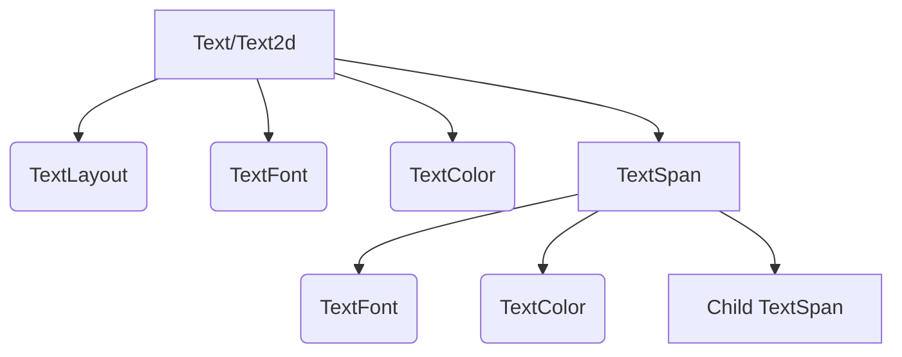

+++
title = "#20484 Improve TextSpan documentation"
date = "2025-08-14T00:00:00"
draft = false
template = "pull_request_page.html"
in_search_index = false

[extra]
current_language = "zh-cn"
available_languages = {"en" = { name = "English", url = "/pull_request/bevy/2025-08/pr-20484-en-20250814" }, "zh-cn" = { name = "中文", url = "/pull_request/bevy/2025-08/pr-20484-zh-cn-20250814" }}
+++

## 技术分析报告：Improve TextSpan documentation

### 基本信息
- **标题**: Improve TextSpan documentation
- **PR链接**: https://github.com/bevyengine/bevy/pull/20484
- **作者**: gwafotapa
- **状态**: 已合并
- **标签**: C-Docs, S-Ready-For-Final-Review, A-Text
- **创建时间**: 2025-08-09T22:20:10Z
- **合并时间**: 2025-08-13T17:33:50Z
- **合并人**: alice-i-cecile

### 描述翻译
**目标**  
`TextSpan`的文档示例存在错误。它正确地指出必须存在`Text`或`Text2d`，但示例中未使用它们导致无法渲染。同时它声称第一个span的`TextLayout`、`TextFont`和`TextColor`会为子节点设置默认值，这是不正确的。`TextLayout`决定文本块的布局，但每个节点有自己的`TextFont`和`TextColor`，它们都是`TextSpan`的必要组件。

类型描述未明确说明`Text`或`Text2d`是必需的。

**解决方案**  
修复文档。

---

### PR分析叙述

#### 问题与背景
`TextSpan`是Bevy引擎文本系统中的核心组件，用于构建富文本层次结构。原始文档存在两个关键问题：

1. **错误示例**：
   - 文档示例错误地声称`TextLayout`、`TextFont`和`TextColor`会继承到子节点
   - 实际实现中，`TextFont`和`TextColor`是每个`TextSpan`节点的独立组件
   - 示例缺少必需的`Text`/`Text2d`父组件，导致无法渲染

2. **模糊要求**：
   - 未明确说明`TextSpan`必须作为`Text`/`Text2d`的子节点存在
   - 缺少对组件依赖关系的精确描述

这些问题导致开发者容易误解API使用方式，可能产生运行时错误或不正确的文本渲染效果。

#### 解决方案实现
PR通过重构文档注释和示例代码解决上述问题：

1. **明确组件依赖**：
   - 开篇强调`TextSpan`必须作为`Text`/`Text2d`的子节点
   - 澄清`TextLayout`只控制整体布局而非样式继承

```rust
// 修改后文档节选
- `TextSpan` is only valid as a child of an entity with [`TextLayout`]...
+ A `TextSpan` is only valid when it exists as a child of a parent that has either `Text` or `Text2d`.
```

2. **重写示例代码**：
   - 添加必需的`Text2d`父组件
   - 展示独立样式组件的实际用法
   - 演示默认组件插入机制

```rust
// 新示例核心结构
world.spawn((
    Text2d::new("Bevy\n"),  // 必需父组件
    TextLayout::new_with_justify(Justify::Center),
    TextFont::from_font_size(50.0),  // 父节点独立样式
    TextColor(BLUE.into()),
    children![  // 子节点树
        (
            TextSpan::new("Bevy\n"),
            TextFont::from_font_size(40.0),  // 独立字体
            TextColor(RED.into()),  // 独立颜色
        ),
        // ...其他子节点
    ],
));
```

3. **澄清组件职责**：
   - 说明`TextLayout`只作用于文本块整体布局
   - 强调每个`TextSpan`需要自己的`TextFont`和`TextColor`

```rust
// 添加的关键说明
The parent's [`TextLayout`] determines the layout of the block
but each node has its own [`TextFont`] and [`TextColor`].
```

#### 技术洞察
1. **组件关系修正**：
   - 原文档错误暗示样式继承，实际是组合模式
   - 每个`TextSpan`维护独立样式状态
   - 父节点仅提供内容容器和整体布局

2. **默认行为说明**：
   - 新增注释说明缺失组件时的默认插入行为
   - 明确`TextFont`和`TextColor`是必需组件

3. **示例完整性**：
   - 使用`children!`宏展示实际层级结构
   - 包含多个子节点展示不同配置场景
   - 添加换行符`\n`演示实际文本拼接效果

#### 影响分析
1. **开发体验提升**：
   - 消除API误解导致的运行时错误
   - 提供可直接复用的正确示例
   
2. **文档准确性**：
   - 精确描述组件依赖关系
   - 明确样式组件的作用范围

3. **维护性增强**：
   - 澄清设计意图避免未来误修改
   - 示例代码覆盖核心使用场景

### 组件关系图


### 关键文件变更
**文件路径**: `crates/bevy_text/src/text.rs` (+32/-24)  

**变更说明**：  
重构`TextSpan`文档注释，修正概念描述并提供正确使用示例。

**代码对比**：
```rust
// 修改前文档节选
/// A span of text in a tree of spans.
///
/// `TextSpan` is only valid as a child of an entity with [`TextLayout`], which is provided by `Text`
/// for text in `bevy_ui` or `Text2d` for text in 2d world-space.
///
/// Spans are collected in hierarchy traversal order into a [`ComputedTextBlock`] for layout.
///
/// ```
/// # use bevy_asset::Handle;
/// # use bevy_color::Color;
/// # use bevy_color::palettes::basic::{RED, BLUE};
/// # use bevy_ecs::world::World;
/// # use bevy_text::{Font, TextLayout, TextFont, TextSpan, TextColor};
///
/// # let font_handle: Handle<Font> = Default::default();
/// # let mut world = World::default();
/// #
/// world.spawn((
///     // `Text` or `Text2d` are needed, and will provide default instances
///     // of the following components.
///     TextLayout::default(),
///     TextFont {
///         font: font_handle.clone().into(),
///         font_size: 60.0,
///         ..Default::default()
///     },
///     TextColor(BLUE.into()),
/// ))
/// .with_child((
///     // Children must be `TextSpan`, not `Text` or `Text2d`.
///     TextSpan::new("Hello!"),
///     TextFont {
///         font: font_handle.into(),
///         font_size: 60.0,
///         ..Default::default()
///     },
///     TextColor(RED.into()),
/// ));
/// ```

// 修改后文档节选
/// A span of text in a tree of spans.
///
/// A `TextSpan` is only valid when it exists as a child of a parent that has either `Text` or
/// `Text2d`. The parent's `Text` / `Text2d` component contains the base text content. Any children
/// with `TextSpan` extend this text by appending their content to the parent's text in sequence to
/// form a [`ComputedTextBlock`]. The parent's [`TextLayout`] determines the layout of the block
/// but each node has its own [`TextFont`] and [`TextColor`].
///
/// ```
/// # use bevy_asset::Handle;
/// # use bevy_color::Color;
/// # use bevy_color::palettes::basic::{BLUE, GREEN, RED};
/// # use bevy_ecs::{children, spawn::SpawnRelated, world::World};
/// # use bevy_text::{Font, Justify, Text2d, TextColor, TextLayout, TextFont, TextSpan};
///
/// # let font_handle: Handle<Font> = Default::default();
/// # let mut world = World::default();
/// #
/// world.spawn((
///     // `Text` or `Text2d` is needed.
///     Text2d::new("Bevy\n"),
///     // Layout of the entire block of text.
///     TextLayout::new_with_justify(Justify::Center),
///     // TextFont of this node. Won't apply to children.
///     TextFont::from_font_size(50.0),
///     // TextColor of this node. Won't apply to children.
///     TextColor(BLUE.into()),
///     // Children must be `TextSpan`, not `Text` or `Text2d`.
///     children![
///         (
///             TextSpan::new("Bevy\n"),
///             TextFont::from_font_size(40.0),
///             TextColor(RED.into()),
///         ),
///         (
///             TextSpan::new("Bevy\n"),
///             TextFont::from_font_size(30.0),
///             // Default TextColor will be inserted because TextSpan requires it.
///         ),
///         (
///             TextSpan::new("Bevy"),
///             TextColor(GREEN.into()),
///             // Default TextFont will be inserted because TextSpan requires it.
///         )
///     ],
/// ));
/// ```
```

### 延伸阅读
1. [Bevy文本系统架构](https://bevyengine.org/learn/book/features/text/)
2. [ECS组件设计模式](https://github.com/bevyengine/bevy/blob/main/docs/plugins_guidelines.md#component-design)
3. [TextSpan实际应用案例](https://github.com/bevyengine/bevy/blob/latest/examples/ui/text.rs)