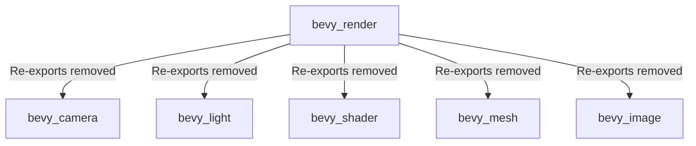

+++
title = "#20485 Yeet re-exports"
date = "2025-08-11T00:00:00"
draft = false
template = "pull_request_page.html"
in_search_index = true

[taxonomies]
list_display = ["show"]

[extra]
current_language = "en"
available_languages = {"en" = { name = "English", url = "/pull_request/bevy/2025-08/pr-20485-en-20250811" }, "zh-cn" = { name = "中文", url = "/pull_request/bevy/2025-08/pr-20485-zh-cn-20250811" }}
labels = ["A-Rendering", "X-Blessed", "D-Straightforward"]
+++

# Technical Analysis of PR #20485: Yeet re-exports

## Basic Information
- **Title**: Yeet re-exports
- **PR Link**: https://github.com/bevyengine/bevy/pull/20485
- **Author**: atlv24
- **Status**: MERGED
- **Labels**: A-Rendering, S-Ready-For-Final-Review, M-Needs-Migration-Guide, X-Blessed, D-Straightforward
- **Created**: 2025-08-09T22:58:18Z
- **Merged**: 2025-08-11T00:01:49Z
- **Merged By**: alice-i-cecile

## The Story of This Pull Request

This PR completes a series of architectural changes that moved several core rendering components out of `bevy_render` into dedicated crates. The primary goal was to remove re-exports from `bevy_render` that were previously kept for backward compatibility after moving camera, light, shader, mesh, and image types to their own crates. 

The problem stemmed from previous reorganization PRs that moved functionality but maintained re-exports in `bevy_render` to avoid breaking changes. While this maintained backward compatibility, it created unnecessary dependencies and made the codebase harder to navigate. The technical constraint was that removing these re-exports would break existing code that relied on them, requiring a major version bump (targeted for Bevy 0.18).

The solution approach was straightforward but extensive: systematically remove all re-export statements across the codebase and update import paths to reference the new crate locations directly. The implementation required:
1. Removing `pub use` statements for types that had been moved to other crates
2. Updating import paths to reference the new crate locations
3. Modifying documentation to point to the new locations
4. Updating migration guides to help users transition

The implementation touches multiple crates but follows a consistent pattern. For example, in `bevy_render/src/lib.rs`, we removed the re-exports and added direct imports from the new crates:

```rust
// Before:
pub use bevy_camera::primitives;
pub use bevy_shader::load_shader_library;

// After:
// These are now imported directly from their respective crates
```

Similarly, in `bevy_pbr/src/lib.rs`, light-related re-exports were removed:

```rust
// Before:
pub use bevy_light::{
    light_consts, AmbientLight, CascadeShadowConfig, CascadeShadowConfigBuilder, Cascades,
    ClusteredDecal, DirectionalLight, DirectionalLightShadowMap, DirectionalLightTexture,
    FogVolume, IrradianceVolume, LightPlugin, LightProbe, NotShadowCaster, NotShadowReceiver,
    PointLight, PointLightShadowMap, PointLightTexture, ShadowFilteringMethod, SpotLight,
    SpotLightTexture, TransmittedShadowReceiver, VolumetricFog, VolumetricLight,
};

// After:
use bevy_light::{
    AmbientLight, DirectionalLight, LightPlugin, PointLight, ShadowFilteringMethod,
    SimulationLightSystems, SpotLight,
};
```

The key technical insight is that by removing these re-exports, we:
1. Reduce compile times by eliminating unnecessary dependencies
2. Clarify module boundaries and responsibilities
3. Make it easier for alternative renderers to integrate with Bevy
4. Simplify the API surface of `bevy_render`

The impact is significant but focused on import paths. Existing code using re-exports from `bevy_render` will break and need to be updated to import from the appropriate crates (`bevy_camera`, `bevy_light`, `bevy_shader`, `bevy_mesh`, `bevy_image`). The migration guide was updated to help with this transition.

## Visual Representation



## Key Files Changed

### `release-content/migration-guides/bevy_render_reorganization.md`
Updated migration guide reflecting the final removal of re-exports:

```markdown
- Camera types such as `Camera`, `Camera3d`, `Camera2d`... have been moved to `bevy_camera`
- Visibility types... have been moved to `bevy_camera::visibility`
- Culling primitives... have been moved to `bevy_camera::primitives`
- Import them directly or from `bevy::camera` now
```

### `crates/bevy_render/src/lib.rs`
Removed re-exports and updated imports:

```rust
// Before:
pub use bevy_camera::primitives;
pub use bevy_shader::load_shader_library;

// After:
mod extract_impls;
// ...
use bevy_shader::{load_shader_library, Shader, ShaderLoader};
```

### `crates/bevy_pbr/src/lib.rs`
Updated light imports:

```rust
// Before:
pub use bevy_light::{ ... };

// After:
use bevy_light::{
    AmbientLight, DirectionalLight, LightPlugin, PointLight, ShadowFilteringMethod,
    SimulationLightSystems, SpotLight,
};
```

### `crates/bevy_core_pipeline/src/lib.rs`
Removed prelude module containing camera re-exports:

```rust
// Removed entirely:
pub mod prelude {
    #[doc(hidden)]
    pub use crate::{core_2d::Camera2d, core_3d::Camera3d};
}
```

### `crates/bevy_core_pipeline/src/core_3d/mod.rs`
Updated camera imports:

```rust
// Before:
pub use bevy_camera::{ ... };

// After:
use bevy_camera::{Camera, Camera3d, Camera3dDepthLoadOp};
```

## Further Reading
- [Bevy Engine Documentation](https://docs.rs/bevy/latest/bevy/)
- [Rust Module System Explained](https://doc.rust-lang.org/book/ch07-00-managing-growing-projects-with-packages-crates-and-modules.html)
- [Bevy ECS Guide](https://bevy-cheatbook.github.io/programming/ecs-intro.html)