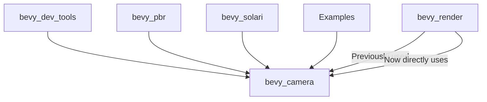

+++
title = "#20486 Use bevy_camera in solari, meshlets, dev_tools, clustering, pcss instead of bevy_render::camera re-export"
date = "2025-08-10T00:00:00"
draft = false
template = "pull_request_page.html"
in_search_index = true

[taxonomies]
list_display = ["show"]

[extra]
current_language = "en"
available_languages = {"en" = { name = "English", url = "/pull_request/bevy/2025-08/pr-20486-en-20250810" }, "zh-cn" = { name = "中文", url = "/pull_request/bevy/2025-08/pr-20486-zh-cn-20250810" }}
labels = ["A-Rendering"]
+++

# Analysis of PR #20486: Use bevy_camera in solari, meshlets, dev_tools, clustering, pcss instead of bevy_render::camera re-export

## Basic Information
- **Title**: Use bevy_camera in solari, meshlets, dev_tools, clustering, pcss instead of bevy_render::camera re-export
- **PR Link**: https://github.com/bevyengine/bevy/pull/20486
- **Author**: atlv24
- **Status**: MERGED
- **Labels**: A-Rendering, S-Ready-For-Final-Review
- **Created**: 2025-08-10T01:54:41Z
- **Merged**: 2025-08-10T03:42:51Z
- **Merged By**: alice-i-cecile

## Description Translation
# Objective

- Prepare for removing re-exports
- I missed these because they were in feature-gated code

## Solution

- title

## Testing

- cargo check --examples

## The Story of This Pull Request

### The Problem and Context
Bevy has been moving towards a more modular architecture by eliminating re-exports between crates. This PR addresses remaining instances where camera-related functionality was being accessed through `bevy_render::camera` re-exports instead of directly from the `bevy_camera` crate. These cases were missed in previous cleanup efforts because they existed in feature-gated or experimental code paths. Using direct imports improves code clarity and prepares for the eventual removal of these re-exports.

### The Solution Approach
The approach was straightforward but required careful auditing of camera-related imports across the codebase. The developer:
1. Identified all files still using `bevy_render::camera` re-exports
2. Added `bevy_camera` dependencies where missing
3. Replaced re-exported imports with direct imports from `bevy_camera`
4. Maintained all functionality while cleaning up import paths

No alternatives were considered since this was a direct continuation of established patterns from previous refactors. The changes are purely organizational with no functional impact.

### The Implementation
The changes fall into three main categories:

1. **Adding missing dependencies**: Crates like `bevy_dev_tools` and `bevy_solari` needed explicit `bevy_camera` dependencies since they were previously relying on transitive imports through `bevy_render`.

```toml
# crates/bevy_dev_tools/Cargo.toml
bevy_camera = { path = "../bevy_camera", version = "0.17.0-dev" }
```

2. **Updating import paths**: Camera-related components and systems were updated to use direct imports. For example:

```rust
// Before:
use bevy_render::view::Visibility;

// After:
use bevy_camera::visibility::Visibility;
```

3. **Correcting visibility classifications**: The `add_visibility_class` function was moved to `bevy_camera::visibility`:

```rust
// Before:
#[component(on_add = view::add_visibility_class::<MeshletMesh3d>)]

// After:
#[component(on_add = visibility::add_visibility_class::<MeshletMesh3d>)]
```

### Technical Insights
The changes demonstrate Bevy's ongoing architectural improvements:
- **Decoupling concerns**: Separating camera functionality from rendering core
- **Explicit dependencies**: Making crate relationships clear in Cargo.toml
- **Feature-gate awareness**: Ensuring experimental features follow core patterns

The PR required understanding Bevy's visibility system architecture, particularly how `Visibility`, `VisibilityClass`, and `RenderLayers` interact across different rendering pipelines.

### The Impact
These changes:
1. Prepare for complete removal of camera re-exports
2. Improve long-term maintainability
3. Reduce potential import confusion
4. Keep feature-gated code aligned with core patterns

Testing was minimal (`cargo check --examples`) since this was a non-functional refactor.

## Visual Representation



## Key Files Changed

### `crates/bevy_dev_tools/Cargo.toml`
Added explicit dependency on `bevy_camera` to replace transitive dependency through `bevy_render`:
```toml
bevy_camera = { path = "../bevy_camera", version = "0.17.0-dev" }
```

### `crates/bevy_pbr/src/meshlet/mod.rs`
Updated visibility system imports and component attributes:
```rust
// Before:
use bevy_render::view::{self, prepare_view_targets, Msaa, Visibility, VisibilityClass};
#[component(on_add = view::add_visibility_class::<MeshletMesh3d>)]

// After:
use bevy_camera::visibility::{self, Visibility, VisibilityClass};
use bevy_render::view::{prepare_view_targets, Msaa};
#[component(on_add = visibility::add_visibility_class::<MeshletMesh3d>)]
```

### `examples/3d/pcss.rs`
Updated camera primitive imports:
```rust
// Before:
use bevy_render::primitives::{CubemapFrusta, Frustum};

// After:
use bevy_camera::primitives::{CubemapFrusta, Frustum};
```

### `examples/3d/clustered_decals.rs`
Corrected import path after previous reorganization:
```rust
// Before:
use bevy_pbr::decal::clustered::ClusteredDecal;

// After:
use bevy_pbr::light::ClusteredDecal;
```

### `crates/bevy_pbr/src/meshlet/resource_manager.rs`
Updated render layer imports:
```rust
// Before:
use bevy_render::view::RenderLayers;

// After:
use bevy_camera::visibility::RenderLayers;
```

## Further Reading
1. [Bevy's Module Structure Documentation](https://github.com/bevyengine/bevy/blob/main/docs/plugins_guidelines.md#project-structure)
2. [Visibility System Architecture](https://github.com/bevyengine/bevy/blob/main/crates/bevy_camera/src/visibility.rs)
3. [Rendering Pipeline Organization](https://github.com/bevyengine/bevy/blob/main/crates/bevy_pbr/README.md)

This PR demonstrates the importance of consistent import patterns across a large codebase, especially when dealing with feature-gated functionality.