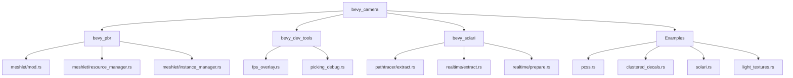

+++
title = "#20486 Use bevy_camera in solari, meshlets, dev_tools, clustering, pcss instead of bevy_render::camera re-export"
date = "2025-08-10T00:00:00"
draft = false
template = "pull_request_page.html"
in_search_index = false

[extra]
current_language = "zh-cn"
available_languages = {"en" = { name = "English", url = "/pull_request/bevy/2025-08/pr-20486-en-20250810" }, "zh-cn" = { name = "中文", url = "/pull_request/bevy/2025-08/pr-20486-zh-cn-20250810" }}
labels = ["A-Rendering"]
+++

# 技术分析报告：PR #20486 - Use bevy_camera in solari, meshlets, dev_tools, clustering, pcss instead of bevy_render::camera re-export

## Basic Information
- **Title**: Use bevy_camera in solari, meshlets, dev_tools, clustering, pcss instead of bevy_render::camera re-export
- **PR Link**: https://github.com/bevyengine/bevy/pull/20486
- **Author**: atlv24
- **Status**: MERGED
- **Labels**: A-Rendering, S-Ready-For-Final-Review
- **Created**: 2025-08-10T01:54:41Z
- **Merged**: 2025-08-10T03:42:51Z
- **Merged By**: alice-i-cecile

## Description Translation
### 目标
- 为移除重新导出做准备
- 之前遗漏了这些代码，因为它们位于特性门控的代码中

### 解决方案
- 标题所示（即在这些模块中使用 `bevy_camera` 而非 `bevy_render::camera` 的重新导出）

### 测试
- 运行 `cargo check --examples`

## The Story of This Pull Request

该 PR 的核心目标是清理代码库中对 `bevy_render::camera` 模块重新导出的依赖，转而直接使用 `bevy_camera` crate 中的定义。这是 Bevy 引擎代码库重构工作的一部分，旨在解耦模块并提高代码的模块化程度。

### 问题背景
在 Bevy 引擎的架构中，相机相关功能最初通过 `bevy_render::camera` 模块重新导出。这种设计导致了不必要的耦合，使相机系统与渲染管线的其他部分紧密绑定。随着引擎发展，团队决定将相机功能分离到独立的 `bevy_camera` crate 中，但部分代码仍在使用旧的重新导出路径。

作者在之前的重构中遗漏了一些位于特性门控（feature-gated）代码中的使用点，这些代码只在特定条件下编译，因此未在初始清理中被发现。本次 PR 的目标就是修正这些遗漏的导入。

### 解决方案实现
PR 采用了直接但全面的方法：在 17 个文件中系统性地替换导入路径。主要修改模式为：
1. 在 crate 的 Cargo.toml 中添加 `bevy_camera` 依赖
2. 将 `bevy_render::camera` 的导入替换为 `bevy_camera` 中的对应项
3. 调整相关类型（如 `Visibility`, `RenderLayers`）到新的模块路径

这些修改不涉及功能变更，纯粹是导入路径的调整。作者通过运行 `cargo check --examples` 验证了修改的正确性，确保没有引入编译错误。

### 技术洞察
关键的技术决策在于如何处理可见性系统：
```rust
// 修改前
use bevy_render::view::{self, prepare_view_targets, Msaa, Visibility, VisibilityClass};

// 修改后
use bevy_camera::visibility::{self, Visibility, VisibilityClass};
use bevy_render::view::{prepare_view_targets, Msaa};
```
这种调整反映了 Bevy 的架构演进 - 将可见性系统从渲染模块分离到相机模块，因为可见性计算与相机视锥体裁切紧密相关。

另一个值得注意的修改是组件定义中的回调函数：
```rust
// 修改前
#[component(on_add = view::add_visibility_class::<MeshletMesh3d>)]

// 修改后
#[component(on_add = visibility::add_visibility_class::<MeshletMesh3d>)]
```
这里保留了相同的行为，但使用了 `bevy_camera::visibility` 模块中的实现，保持了组件功能的一致性。

### 影响与收益
这些修改带来了以下好处：
1. **减少耦合**：解除了相机系统与渲染管线的直接依赖
2. **提高可维护性**：明确了模块职责边界
3. **准备未来重构**：为完全移除 `bevy_render` 中的重新导出铺平道路
4. **统一代码风格**：使特性门控代码与主代码库风格一致

由于修改范围仅限于导入路径，且通过基础编译检查验证，风险较低。合并后，这些变更使代码库更接近完全使用模块化相机系统的目标状态。

## Visual Representation



## Key Files Changed

### 1. `crates/bevy_pbr/src/meshlet/mod.rs` (+3/-2)
**修改原因**：将可见性系统从 `bevy_render::view` 迁移到 `bevy_camera::visibility`

**代码片段**：
```diff
 use crate::{
     irradiance_volume::IrradianceVolume, meshlet_bounding_spheres::MeshletBoundingSpheres,
     meshlet_culling::MeshletViewCulling, meshlet_gpu_culling::MeshletGpuCulling,
     meshlet_mesh::MeshletMesh, meshlet_morph::MeshletMorph, MeshViewBindGroup, MeshletMesh3d,
     MeshletMeshManager, MeshletViewMaterialsBindGroup, RenderMeshletInstances,
 };
 use bevy_app::{App, Plugin};
 use bevy_asset::{embedded_asset, AssetApp, AssetId, Handle};
+use bevy_camera::visibility::{self, Visibility, VisibilityClass};
 use bevy_core_pipeline::{
     core_3d::graph::{Core3d, Node3d},
     prepass::{DeferredPrepass, MotionVectorPrepass, NormalPrepass},
@@ -81,7 +82,7 @@ use bevy_render::{
     render_graph::{RenderGraphExt, ViewNodeRunner},
     renderer::RenderDevice,
     settings::WgpuFeatures,
-    view::{self, prepare_view_targets, Msaa, Visibility, VisibilityClass},
+    view::{prepare_view_targets, Msaa},
     ExtractSchedule, Render, RenderApp, RenderStartup, RenderSystems,
 };
 use bevy_transform::components::Transform;
@@ -259,7 +260,7 @@ fn check_meshlet_features(render_device: Res<RenderDevice>) {
 #[derive(Component, Clone, Debug, Default, Deref, DerefMut, Reflect, PartialEq, Eq, From)]
 #[reflect(Component, Default, Clone, PartialEq)]
 #[require(Transform, PreviousGlobalTransform, Visibility, VisibilityClass)]
-#[component(on_add = view::add_visibility_class::<MeshletMesh3d>)]
+#[component(on_add = visibility::add_visibility_class::<MeshletMesh3d>)]
 pub struct MeshletMesh3d(pub Handle<MeshletMesh>);
```

### 2. `examples/3d/pcss.rs` (+6/-5)
**修改原因**：将相机原语和可见性组件迁移到 `bevy_camera`

**代码片段**：
```diff
 use bevy::{
     anti_aliasing::taa::TemporalAntiAliasing,
+    camera::{
+        primitives::{CubemapFrusta, Frustum},
+        visibility::{CubemapVisibleEntities, VisibleMeshEntities},
+    },
     core_pipeline::{
         prepass::{DepthPrepass, MotionVectorPrepass},
         Skybox,
     },
     math::vec3,
-    pbr::{CubemapVisibleEntities, ShadowFilteringMethod, VisibleMeshEntities},
+    pbr::ShadowFilteringMethod,
     prelude::*,
-    render::{
-        camera::TemporalJitter,
-        primitives::{CubemapFrusta, Frustum},
-    },
+    render::camera::TemporalJitter,
 };
```

### 3. `crates/bevy_dev_tools/src/fps_overlay.rs` (+1/-1)
**修改原因**：迁移 `Visibility` 组件到 `bevy_camera`

**代码片段**：
```diff
 use bevy_app::{Plugin, Startup, Update};
 use bevy_asset::{Assets, Handle};
+use bevy_camera::visibility::Visibility;
 use bevy_color::Color;
 use bevy_diagnostic::{DiagnosticsStore, FrameTimeDiagnosticsPlugin};
 use bevy_ecs::{
@@ -14,7 +15,7 @@ use bevy_ecs::{
     schedule::{common_conditions::resource_changed, IntoScheduleConfigs},
     system::{Commands, Query, Res, ResMut},
 };
-use bevy_render::{storage::ShaderStorageBuffer, view::Visibility};
+use bevy_render::storage::ShaderStorageBuffer;
```

### 4. `crates/bevy_solari/src/realtime/prepare.rs` (+1/-1)
**修改原因**：迁移 `MainPassResolutionOverride` 到 `bevy_camera`

**代码片段**：
```diff
 use super::SolariLighting;
+use bevy_camera::MainPassResolutionOverride;
 use bevy_core_pipeline::{core_3d::CORE_3D_DEPTH_FORMAT, deferred::DEFERRED_PREPASS_FORMAT};
 use bevy_ecs::{
     component::Component,
@@ -9,7 +10,7 @@ use bevy_ecs::{
 use bevy_image::ToExtents;
 use bevy_math::UVec2;
 use bevy_render::{
-    camera::{ExtractedCamera, MainPassResolutionOverride},
+    camera::ExtractedCamera,
     render_resource::{
         Buffer, BufferDescriptor, BufferUsages, Texture, TextureDescriptor, TextureDimension,
         TextureUsages, TextureView, TextureViewDescriptor,
```

### 5. `crates/bevy_pbr/src/meshlet/resource_manager.rs` (+2/-2)
**修改原因**：迁移 `RenderLayers` 和 `Camera3d` 到 `bevy_camera`

**代码片段**：
```diff
 use super::{instance_manager::InstanceManager, meshlet_mesh_manager::MeshletMeshManager};
 use crate::ShadowView;
+use bevy_camera::{visibility::RenderLayers, Camera3d};
 use bevy_core_pipeline::{
-    core_3d::Camera3d,
     experimental::mip_generation::{self, ViewDepthPyramid},
     prepass::{PreviousViewData, PreviousViewUniforms},
 };
@@ -18,7 +18,7 @@ use bevy_render::{
     render_resource::*,
     renderer::{RenderDevice, RenderQueue},
     texture::{CachedTexture, TextureCache},
-    view::{ExtractedView, RenderLayers, ViewUniform, ViewUniforms},
+    view::{ExtractedView, ViewUniform, ViewUniforms},
 };
 use binding_types::*;
 use core::iter;
```

## Further Reading
1. Bevy 模块化架构设计文档：
   https://github.com/bevyengine/bevy/blob/main/docs/architecture/modularity.md
   
2. Rust 模块系统最佳实践：
   https://doc.rust-lang.org/book/ch07-02-defining-modules-to-control-scope-and-privacy.html
   
3. Bevy 相机系统文档：
   https://github.com/bevyengine/bevy/blob/main/crates/bevy_camera/README.md

4. 特性门控（feature gating）在 Rust 中的使用：
   https://doc.rust-lang.org/cargo/reference/features.html