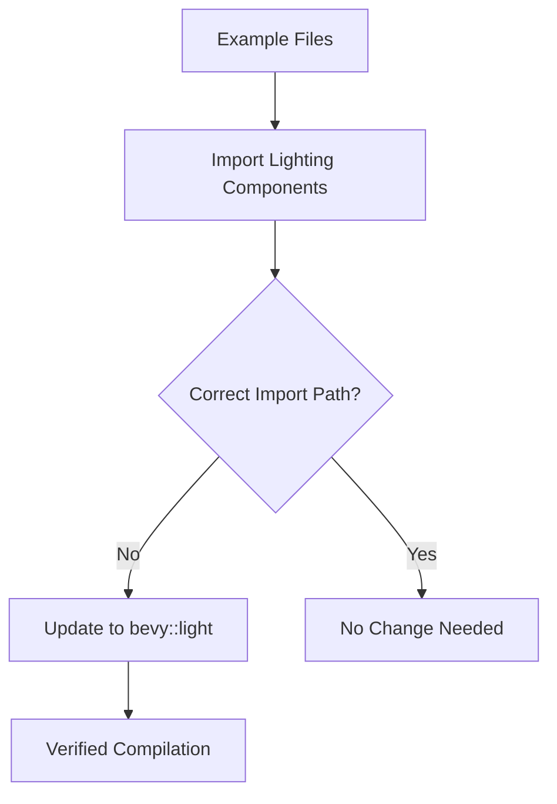

+++
title = "#20487 Use bevy::light in examples instead of bevy::pbr::light re-export"
date = "2025-08-10T00:00:00"
draft = false
template = "pull_request_page.html"
in_search_index = true

[taxonomies]
list_display = ["show"]

[extra]
current_language = "en"
available_languages = {"en" = { name = "English", url = "/pull_request/bevy/2025-08/pr-20487-en-20250810" }, "zh-cn" = { name = "中文", url = "/pull_request/bevy/2025-08/pr-20487-zh-cn-20250810" }}
labels = ["A-Rendering", "C-Code-Quality"]
+++

# Technical Analysis: PR #20487 - Use bevy::light in examples instead of bevy::pbr::light re-export

## Basic Information
- **Title**: Use bevy::light in examples instead of bevy::pbr::light re-export
- **PR Link**: https://github.com/bevyengine/bevy/pull/20487
- **Author**: atlv24
- **Status**: MERGED
- **Labels**: A-Rendering, C-Code-Quality, S-Ready-For-Final-Review
- **Created**: 2025-08-10T05:02:47Z
- **Merged**: 2025-08-10T05:43:22Z
- **Merged By**: alice-i-cecile

## Description Translation
The original description is in English and requires no translation:

# Objective
- Prepare for removing re-exports

## Solution
- title

## Testing
- cargo check --examples --all-features

## The Story of This Pull Request

This PR addresses a code quality improvement in Bevy's example codebase. The core issue relates to how lighting components were being imported in examples. Previously, many examples were using re-exports from `bevy::pbr` (Physically Based Rendering) module to access lighting functionality, even though these components had been moved to a dedicated `bevy::light` module. 

The problem stemmed from historical organization where lighting components were part of the PBR module. As Bevy's architecture evolved, lighting was extracted into its own module (`bevy::light`) to better organize the rendering code. However, examples still referenced the old import paths through PBR re-exports. This created inconsistency and would cause breakages when the re-exports were eventually removed.

The solution approach was straightforward but required wide-ranging changes: systematically update all example files to import lighting components from their canonical location in `bevy::light` instead of through `bevy::pbr` re-exports. This involved modifying import statements in 32 example files. The changes are mechanical but important for maintaining code clarity and preparing for future architectural changes.

Here's a typical change pattern seen throughout the PR:
```diff
- use bevy::pbr::CascadeShadowConfigBuilder;
+ use bevy::light::CascadeShadowConfigBuilder;
```

For files that imported multiple items from PBR, the imports were restructured to separate lighting from PBR-specific components:
```diff
- use bevy::pbr::{CascadeShadowConfigBuilder, Atmosphere, AtmosphereSettings};
+ use bevy::light::CascadeShadowConfigBuilder;
+ use bevy::pbr::{Atmosphere, AtmosphereSettings};
```

The implementation carefully preserved all non-lighting imports from `bevy::pbr` while moving lighting-related imports to `bevy::light`. Components affected included:
- `CascadeShadowConfigBuilder`
- `DirectionalLight`
- `NotShadowCaster`
- `NotShadowReceiver`
- `IrradianceVolume`
- `VolumetricFog`
- `VolumetricLight`
- `ShadowFilteringMethod`
- And others

The testing approach was efficient: running `cargo check --examples --all-features` verified that all examples still compiled correctly with the updated import paths. Since this was purely a refactoring with no functional changes, no runtime testing was needed.

The impact of these changes is significant for code maintainability:
1. Examples now use the canonical import paths for lighting components
2. Prepares for safely removing the re-exports from `bevy::pbr`
3. Improves code clarity by showing the actual module structure
4. Reduces confusion about where lighting components are defined
5. Makes the codebase more resilient to future architectural changes

This PR demonstrates a common pattern in large codebases: when core modules are reorganized, it's important to update dependent code to use the new canonical paths rather than relying on legacy re-exports. The changes here follow Bevy's API conventions and improve the consistency of the example code.

## Visual Representation



## Key Files Changed

1. `examples/3d/deferred_rendering.rs` (+4/-4)
   - Updated multiple lighting-related imports to use `bevy::light`
   - Separated lighting imports from PBR-specific ones
```diff
@@ -6,11 +6,11 @@ use bevy::{
     anti_aliasing::fxaa::Fxaa,
     core_pipeline::prepass::{DeferredPrepass, DepthPrepass, MotionVectorPrepass, NormalPrepass},
     image::ImageLoaderSettings,
-    math::ops,
-    pbr::{
-        CascadeShadowConfigBuilder, DefaultOpaqueRendererMethod, DirectionalLightShadowMap,
-        NotShadowCaster, NotShadowReceiver, OpaqueRendererMethod,
+    light::{
+        CascadeShadowConfigBuilder, DirectionalLightShadowMap, NotShadowCaster, NotShadowReceiver,
     },
+    math::ops,
+    pbr::{DefaultOpaqueRendererMethod, OpaqueRendererMethod},
     prelude::*,
 };
```

2. `examples/3d/meshlet.rs` (+2/-4)
   - Moved lighting imports to `bevy::light` while keeping meshlet-specific imports in PBR
```diff
@@ -6,10 +6,8 @@
 mod camera_controller;
 
 use bevy::{
-    pbr::{
-        experimental::meshlet::{MeshletMesh3d, MeshletPlugin},
-        CascadeShadowConfigBuilder, DirectionalLightShadowMap,
-    },
+    light::{CascadeShadowConfigBuilder, DirectionalLightShadowMap},
+    pbr::experimental::meshlet::{MeshletMesh3d, MeshletPlugin},
     prelude::*,
     render::render_resource::AsBindGroup,
 };
```

3. `examples/3d/irradiance_volumes.rs` (+2/-3)
   - Updated imports for irradiance volume and shadow components
```diff
@@ -16,10 +16,9 @@
 use bevy::{
     color::palettes::css::*,
     core_pipeline::Skybox,
+    light::{IrradianceVolume, NotShadowCaster},
     math::{uvec3, vec3},
-    pbr::{
-        irradiance_volume::IrradianceVolume, ExtendedMaterial, MaterialExtension, NotShadowCaster,
-    },
+    pbr::{ExtendedMaterial, MaterialExtension},
     prelude::*,
     render::render_resource::{AsBindGroup, ShaderRef, ShaderType},
     window::PrimaryWindow,
```

4. `examples/3d/post_processing.rs` (+2/-2)
   - Updated cascade shadow config import
```diff
@@ -5,8 +5,8 @@
 use std::f32::consts::PI;
 
 use bevy::{
-    core_pipeline::post_process::ChromaticAberration, pbr::CascadeShadowConfigBuilder, prelude::*,
-    render::view::Hdr,
+    core_pipeline::post_process::ChromaticAberration, light::CascadeShadowConfigBuilder,
+    prelude::*, render::view::Hdr,
 };
```

5. `examples/3d/split_screen.rs` (+3/-1)
   - Updated import while maintaining other functionality
```diff
@@ -2,7 +2,9 @@
 
 use std::f32::consts::PI;
 
-use bevy::{camera::Viewport, pbr::CascadeShadowConfigBuilder, prelude::*, window::WindowResized};
+use bevy::{
+    camera::Viewport, light::CascadeShadowConfigBuilder, prelude::*, window::WindowResized,
+};
```

## Further Reading
1. Bevy's Module Organization: [Bevy API Guidelines](https://github.com/bevyengine/bevy/blob/main/docs/plugins_guidelines.md#module-organization)
2. Rust Module System: [The Rust Programming Language - Modules](https://doc.rust-lang.org/book/ch07-02-defining-modules-to-control-scope-and-privacy.html)
3. Bevy Lighting Documentation: [Bevy Lighting](https://docs.rs/bevy/latest/bevy/light/index.html)