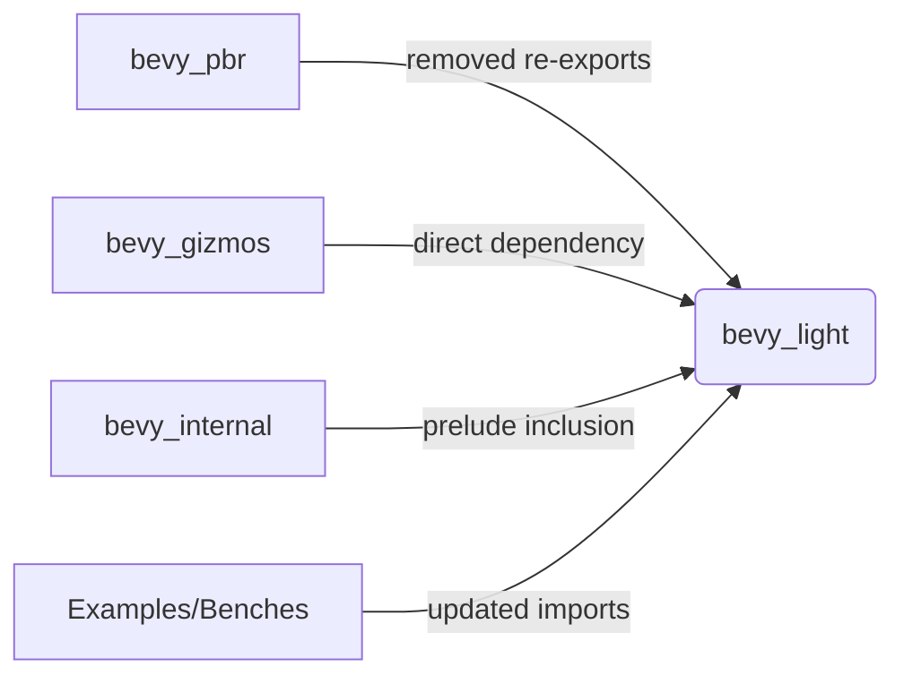

+++
title = "#20488 Use bevy_light in pbr instead of bevy_pbr::light re-export + add bevy_light prelude"
date = "2025-08-10T00:00:00"
draft = false
template = "pull_request_page.html"
in_search_index = true

[taxonomies]
list_display = ["show"]

[extra]
current_language = "en"
available_languages = {"en" = { name = "English", url = "/pull_request/bevy/2025-08/pr-20488-en-20250810" }, "zh-cn" = { name = "中文", url = "/pull_request/bevy/2025-08/pr-20488-zh-cn-20250810" }}
labels = ["A-Rendering", "C-Code-Quality"]
+++

# Analysis of PR #20488: Use bevy_light in pbr instead of bevy_pbr::light re-export + add bevy_light prelude

## Basic Information
- **Title**: Use bevy_light in pbr instead of bevy_pbr::light re-export + add bevy_light prelude
- **PR Link**: https://github.com/bevyengine/bevy/pull/20488
- **Author**: atlv24
- **Status**: MERGED
- **Labels**: A-Rendering, C-Code-Quality, S-Ready-For-Final-Review
- **Created**: 2025-08-10T05:06:32Z
- **Merged**: 2025-08-10T06:48:24Z
- **Merged By**: james7132

## Description Translation
# Objective

- Prepare for removing re-exports

## Solution

- title

## Testing

- cargo check --examples

## The Story of This Pull Request

This PR addresses technical debt related to module organization in Bevy's rendering system. The core issue was unnecessary re-exports of lighting components from `bevy_pbr` that originally came from `bevy_light`. This pattern created implicit dependencies and made the codebase harder to navigate. The primary goal was to eliminate these re-exports and establish proper direct dependencies on `bevy_light`.

The changes began by adding a prelude module to `bevy_light` to maintain ergonomics while removing re-exports. The new prelude provides centralized access to common lighting components:

```rust
// crates/bevy_light/src/lib.rs
pub mod prelude {
    pub use crate::{
        light_consts, AmbientLight, DirectionalLight, EnvironmentMapLight,
        GeneratedEnvironmentMapLight, LightProbe, PointLight, SpotLight,
    };
}
```

With the prelude established, the PR systematically replaced all instances of `bevy_pbr` lighting imports with direct `bevy_light` imports across the codebase. For example, in the deferred rendering module:

```rust
// crates/bevy_pbr/src/deferred/mod.rs
// Before:
use crate::irradiance_volume::IrradianceVolume;

// After:
use bevy_light::{EnvironmentMapLight, IrradianceVolume, ShadowFilteringMethod};
```

This pattern was consistently applied to 13 files across multiple crates including `bevy_pbr`, `bevy_gizmos`, and `bevy_internal`. The changes required updating several type references and import paths, but didn't alter any functional logic. 

A key technical decision was updating `bevy_internal`'s prelude to include `bevy_light`'s prelude when the feature flag is enabled:

```rust
// crates/bevy_internal/src/prelude.rs
#[cfg(feature = "bevy_light")]
pub use crate::light::prelude::*;
```

This ensures downstream users can still access lighting components conveniently through Bevy's main prelude. The PR also fixed benchmarks that relied on outdated import paths, such as updating `RenderLayers` imports to come from `bevy_camera` instead of `bevy_render`:

```rust
// benches/benches/bevy_render/render_layers.rs
use bevy_camera::visibility::RenderLayers;  // Fixed import
```

The implementation required updating Cargo.toml files to add explicit dependencies on `bevy_light` where needed. For example, `bevy_gizmos` now directly depends on `bevy_light` for its light gizmo functionality:

```toml
# crates/bevy_gizmos/Cargo.toml
bevy_light = { path = "../bevy_light", version = "0.17.0-dev" }
```

Throughout the changes, special attention was paid to preserve existing functionality. The `cargo check --examples` verification confirmed no functionality was broken during the refactor. The changes improve code discoverability by making the source of lighting components explicit while maintaining the same API surface through preludes.

## Visual Representation



## Key Files Changed

1. `crates/bevy_light/src/lib.rs` (+11/-0)
   - Added prelude module for ergonomic light component access
   - Key change:
     ```rust
     pub mod prelude {
         pub use crate::{
             light_consts, AmbientLight, /*...*/ SpotLight
         };
     }
     ```

2. `crates/bevy_pbr/src/deferred/mod.rs` (+5/-6)
   - Replaced internal irradiance volume import with direct bevy_light import
   - Key change:
     ```rust
     use bevy_light::{EnvironmentMapLight, IrradianceVolume, ShadowFilteringMethod};
     ```

3. `crates/bevy_pbr/src/volumetric_fog/render.rs` (+3/-3)
   - Updated fog-related imports to use bevy_light directly
   - Key change:
     ```rust
     use bevy_light::{FogVolume, VolumetricFog, VolumetricLight};
     ```

4. `crates/bevy_pbr/src/render/light.rs` (+3/-2)
   - Consolidated light component imports from bevy_light
   - Key change:
     ```rust
     use bevy_light::{AmbientLight, CascadeShadowConfig, /*...*/ VolumetricLight};
     ```

5. `crates/bevy_pbr/src/render/mesh_view_bindings.rs` (+2/-3)
   - Updated irradiance volume import path
   - Key change:
     ```rust
     use bevy_light::{EnvironmentMapLight, IrradianceVolume};
     ```

## Further Reading
- Rust Module System: https://doc.rust-lang.org/book/ch07-02-defining-modules-to-control-scope-and-privacy.html
- Bevy Prelude Pattern: https://bevyengine.org/learn/book-best-practices/prelude/
- PR Discussion: https://github.com/bevyengine/bevy/pull/20488