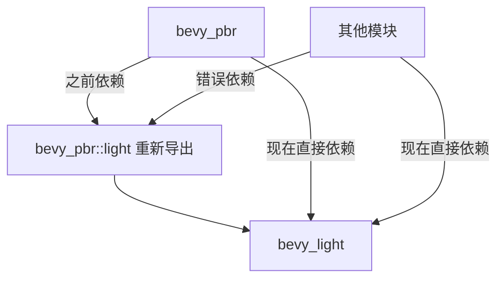

+++
title = "#20488 Use bevy_light in pbr instead of bevy_pbr::light re-export + add bevy_light prelude"
date = "2025-08-10T00:00:00"
draft = false
template = "pull_request_page.html"
in_search_index = false

[extra]
current_language = "zh-cn"
available_languages = {"en" = { name = "English", url = "/pull_request/bevy/2025-08/pr-20488-en-20250810" }, "zh-cn" = { name = "中文", url = "/pull_request/bevy/2025-08/pr-20488-zh-cn-20250810" }}
+++

# 使用 bevy_light 替代 bevy_pbr::light 的重新导出 + 添加 bevy_light 预导入模块分析报告

## 基本信息
- **标题**: Use bevy_light in pbr instead of bevy_pbr::light re-export + add bevy_light prelude
- **PR 链接**: https://github.com/bevyengine/bevy/pull/20488
- **作者**: atlv24
- **状态**: 已合并
- **标签**: A-Rendering, C-Code-Quality, S-Ready-For-Final-Review
- **创建时间**: 2025-08-10T05:06:32Z
- **合并时间**: 2025-08-10T06:48:24Z
- **合并人**: james7132

## 描述翻译
### 目标
- 为移除重新导出做准备

### 解决方案
- 在 PBR 中使用 bevy_light 替代 bevy_pbr::light 的重新导出 + 添加 bevy_light 预导入模块

### 测试
- cargo check --examples

## 这个 PR 的故事

### 问题背景
在 Bevy 渲染系统的演进过程中，模块间的依赖关系逐渐显露出优化空间。PR #20488 主要解决的是 `bevy_pbr` 模块对光照类型(light types)的重新导出问题。原先的设计中，`bevy_pbr` 通过重新导出 `bevy_light` 中的类型（如 `PointLight`, `DirectionalLight` 等）来简化使用：
```rust
// 旧的重新导出方式
use bevy_pbr::light::PointLight;
```
这种设计导致模块间耦合度增加，且不符合 Rust 的最佳实践——应当直接使用定义这些类型的模块（即 `bevy_light`）。随着代码库扩大，这种间接引用增加了维护成本和理解难度。

### 解决方案
该 PR 的核心策略是：
1. 移除 `bevy_pbr` 中对 `bevy_light` 类型的重新导出
2. 在需要光照类型的模块中直接导入 `bevy_light`
3. 在 `bevy_light` 中添加预导入模块(prelude)简化使用

这种改动符合 Rust 的模块设计哲学：类型应当在其定义的模块中被直接引用，而非通过中间模块重新导出。这不仅减少了间接依赖，还明确了模块职责边界。

### 具体实施
实施过程涉及多个关键步骤：

**1. 添加 bevy_light 预导入模块**
在 `bevy_light` 中创建预导入模块，集中导出常用类型：
```rust
// crates/bevy_light/src/lib.rs
+ pub mod prelude {
+     #[doc(hidden)]
+     pub use crate::{
+         light_consts, AmbientLight, DirectionalLight, EnvironmentMapLight,
+         GeneratedEnvironmentMapLight, LightProbe, PointLight, SpotLight,
+     };
+ }
```
这使得其他模块可以通过统一路径导入光照类型：`use bevy_light::prelude::*`

**2. 更新 bevy_internal 预导入**
确保主引擎预导入包含新的 light 预导入：
```rust
// crates/bevy_internal/src/prelude.rs
+ #[doc(hidden)]
+ #[cfg(feature = "bevy_light")]
+ pub use crate::light::prelude::*;
```

**3. 重构 PBR 模块导入**
在 PBR 相关文件中，将所有从 `bevy_pbr::light` 的导入替换为直接从 `bevy_light` 导入。例如在延迟渲染模块中：
```diff
// crates/bevy_pbr/src/deferred/mod.rs
- use crate::irradiance_volume::IrradianceVolume;
+ use bevy_light::{EnvironmentMapLight, IrradianceVolume, ShadowFilteringMethod};
```
这个改动涉及 10 多个文件，包括核心渲染逻辑、网格处理和光照探针等模块。

**4. 修复依赖关系**
更新 Cargo.toml 确保正确依赖：
```toml
// benches/Cargo.toml
+ bevy_camera = { path = "../crates/bevy_camera" }

// crates/bevy_gizmos/Cargo.toml
+ bevy_light = { path = "../bevy_light", version = "0.17.0-dev" }
```

**5. 修正测试和示例**
更新基准测试中因模块结构调整而失效的导入：
```diff
// benches/benches/bevy_render/render_layers.rs
- use bevy_render::view::RenderLayers;
+ use bevy_camera::visibility::RenderLayers;
```

### 技术考量
1. **边界清晰化**：通过消除重新导出，明确了 `bevy_light` 作为光照类型权威定义模块的职责
2. **编译影响**：由于只是导入路径变更，不影响运行时性能
3. **兼容性处理**：通过预导入模块保持开发者体验一致
4. **逐步迁移**：为完全移除重新导出做准备，避免大规模破坏性变更

### 影响与价值
1. **代码质量提升**：减少间接依赖，模块边界更清晰
2. **维护性增强**：直接导入使类型溯源更直观
3. **架构优化**：为光照系统进一步解耦奠定基础
4. **开发者体验**：预导入模块保持使用便捷性

## 可视化关系


## 关键文件变更

### crates/bevy_light/src/lib.rs
添加预导入模块，集中导出常用光照类型：
```diff
+ /// The light prelude.
+ ///
+ /// This includes the most common types in this crate, re-exported for your convenience.
+ pub mod prelude {
+     #[doc(hidden)]
+     pub use crate::{
+         light_consts, AmbientLight, DirectionalLight, EnvironmentMapLight,
+         GeneratedEnvironmentMapLight, LightProbe, PointLight, SpotLight,
+     };
+ }
```

### crates/bevy_pbr/src/deferred/mod.rs
重构导入，直接使用 bevy_light 类型：
```diff
- use crate::{
-     graph::NodePbr, irradiance_volume::IrradianceVolume, MeshPipeline, MeshViewBindGroup,
-     RenderViewLightProbes, ScreenSpaceAmbientOcclusion, ScreenSpaceReflectionsUniform,
-     ViewEnvironmentMapUniformOffset, ViewLightProbesUniformOffset,
-     ViewScreenSpaceReflectionsUniformOffset, TONEMAPPING_LUT_SAMPLER_BINDING_INDEX,
-     TONEMAPPING_LUT_TEXTURE_BINDING_INDEX,
- };
+ use crate::{
+     graph::NodePbr, MeshPipeline, MeshViewBindGroup, RenderViewLightProbes,
+     ScreenSpaceAmbientOcclusion, ScreenSpaceReflectionsUniform, ViewEnvironmentMapUniformOffset,
+     ViewLightProbesUniformOffset, ViewScreenSpaceReflectionsUniformOffset,
+     TONEMAPPING_LUT_SAMPLER_BINDING_INDEX, TONEMAPPING_LUT_TEXTURE_BINDING_INDEX,
+ };
- use bevy_light::{EnvironmentMapLight, ShadowFilteringMethod};
+ use bevy_light::{EnvironmentMapLight, IrradianceVolume, ShadowFilteringMethod};
```

### crates/bevy_pbr/src/volumetric_fog/render.rs
更新体积雾模块的导入路径：
```diff
+ use bevy_light::{FogVolume, VolumetricFog, VolumetricLight};
- use crate::{
-     FogVolume, MeshPipelineViewLayoutKey, MeshPipelineViewLayouts, MeshViewBindGroup,
-     ViewEnvironmentMapUniformOffset, ViewFogUniformOffset, ViewLightProbesUniformOffset,
-     ViewLightsUniformOffset, ViewScreenSpaceReflectionsUniformOffset, VolumetricFog,
-     VolumetricLight,
- };
+ use crate::{
+     MeshPipelineViewLayoutKey, MeshPipelineViewLayouts, MeshViewBindGroup,
+     ViewEnvironmentMapUniformOffset, ViewFogUniformOffset, ViewLightProbesUniformOffset,
+     ViewLightsUniformOffset, ViewScreenSpaceReflectionsUniformOffset,
+ };
```

### crates/bevy_pbr/src/render/light.rs
直接导入光照类型而非通过中间模块：
```diff
+ use bevy_light::{
+     spot_light_clip_from_view, spot_light_world_from_view, AmbientLight, CascadeShadowConfig,
+     Cascades, DirectionalLight, DirectionalLightShadowMap, NotShadowCaster, PointLight,
+     PointLightShadowMap, SpotLight, VolumetricLight,
+ };
- use bevy_light::{
-     spot_light_clip_from_view, spot_light_world_from_view, DirectionalLightShadowMap,
-     NotShadowCaster, PointLightShadowMap,
- };
```

### crates/bevy_pbr/src/render/mesh_view_bindings.rs
更新辐照度体积导入路径：
```diff
- use bevy_light::EnvironmentMapLight;
+ use bevy_light::{EnvironmentMapLight, IrradianceVolume};
- use crate::irradiance_volume::IrradianceVolume;
```

## 延伸阅读
1. [Rust 模块系统最佳实践](https://doc.rust-lang.org/book/ch07-02-defining-modules-to-control-scope-and-privacy.html)
2. [Bevy 架构指南](https://bevyengine.org/learn/book/introduction/)
3. [游戏引擎中的光照系统设计](https://developer.nvidia.com/gpugems/gpugems3/part-iii-rendering/chapter-20-gpu-based-importance-sampling)
4. [预导入模块模式](https://rust-lang-nursery.github.io/api-guidelines/