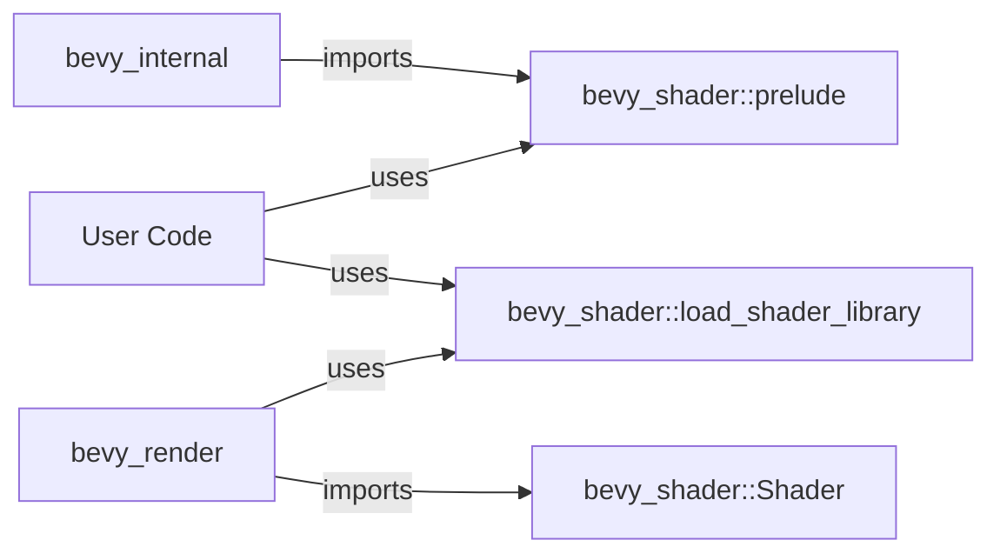

+++
title = "#20491 Add bevy_shader prelude and move load_shader_library"
date = "2025-08-10T00:00:00"
draft = false
template = "pull_request_page.html"
in_search_index = true

[taxonomies]
list_display = ["show"]

[extra]
current_language = "en"
available_languages = {"en" = { name = "English", url = "/pull_request/bevy/2025-08/pr-20491-en-20250810" }, "zh-cn" = { name = "中文", url = "/pull_request/bevy/2025-08/pr-20491-zh-cn-20250810" }}
labels = ["A-Rendering"]
+++

## Analysis of PR #20491: Add bevy_shader prelude and move load_shader_library

### Basic Information
- **Title**: Add bevy_shader prelude and move load_shader_library
- **PR Link**: https://github.com/bevyengine/bevy/pull/20491
- **Author**: atlv24
- **Status**: MERGED
- **Labels**: A-Rendering, S-Needs-Review
- **Created**: 2025-08-10T14:06:41Z
- **Merged**: 2025-08-10T16:16:51Z
- **Merged By**: james7132

### Description Translation
# Objective

- Prepare for removing re-exports
- We want to use load_shader_library without bevy_render, so put it in bevy_shader

## Solution

- title

## Testing

- cargo check --examples --all-features

### The Story of This Pull Request

The core problem addressed in this PR was the tight coupling between shader-related functionality and the rendering system. The `load_shader_library` macro was originally implemented within `bevy_render`, creating an unnecessary dependency chain. This made it impossible to use shader loading functionality without importing the entire rendering system, which violates modular design principles and increases compile times.

The developer approached this by identifying that shader-related utilities should live in the `bevy_shader` crate. The solution involved two main technical changes: relocating the `load_shader_library` macro to its logical home in `bevy_shader`, and establishing a new prelude module in `bevy_shader` for convenient access to shader-related types.

Implementation required careful dependency management. The macro relies on `bevy_asset` internals, so a private `_macro` module was created in `bevy_shader` to maintain the required re-exports without exposing implementation details. This demonstrates good encapsulation practices - the macro's internal dependencies are hidden while its functionality remains accessible.

The changes also required updating import paths across the codebase. `bevy_render` now imports `Shader` and `ShaderLoader` from `bevy_shader` instead of its local modules, reinforcing the proper crate boundaries. The addition of `bevy_shader`'s prelude to `bevy_internal`'s prelude ensures downstream users get convenient access to shader types without extra imports.

This refactor improves code organization by:
1. Reducing renderer-specific dependencies for shader operations
2. Creating clearer separation between rendering and shader concerns
3. Establishing a foundation for future removal of re-exports
4. Improving compile times by breaking unnecessary dependencies

The solution maintains backward compatibility through careful re-exports and path updates. The testing approach (`cargo check --examples --all-features`) was appropriate for this refactor since it validates that all paths resolve correctly without changing runtime behavior.

### Visual Representation



### Key Files Changed

1. **crates/bevy_shader/src/lib.rs**
   - Added prelude module and moved macro implementation
   - Changes enable standalone shader usage without render dependencies

```rust
// Before: No prelude or macro in this crate
mod shader;
mod shader_cache;
pub use shader::*;
pub use shader_cache::*;

// After: Added prelude and macro
mod shader;
mod shader_cache;
pub use shader::*;
pub use shader_cache::*;

pub mod prelude {
    #[doc(hidden)]
    pub use crate::Shader;
}

#[doc(hidden)]
pub mod _macro {
    pub use bevy_asset;
}

#[macro_export]
macro_rules! load_shader_library {
    // Macro implementation unchanged
}
```

2. **crates/bevy_render/src/lib.rs**
   - Removed local macro implementation and updated imports
   - Changes reduce crate responsibilities and dependencies

```rust
// Before: Macro defined locally
pub mod _macro {
    pub use bevy_asset;
}
#[macro_export]
macro_rules! load_shader_library { /* ... */ }

// After: Uses shader crate's implementation
pub use bevy_shader::load_shader_library;
use bevy_shader::{Shader, ShaderLoader};
```

3. **crates/bevy_internal/src/prelude.rs**
   - Added shader prelude to internal prelude
   - Changes improve ergonomics for downstream users

```rust
// Added to prelude:
#[cfg(feature = "bevy_shader")]
pub use crate::shader::prelude::*;
```

### Further Reading
- [Bevy Engine Shader System Documentation](https://bevyengine.org/learn/book/getting-started/shaders/)
- [Rust Macro Reference](https://doc.rust-lang.org/reference/macros.html)
- [Crate Organization Best Practices](https://doc.rust-lang.org/book/ch07-02-defining-modules-to-control-scope-and-privacy.html)