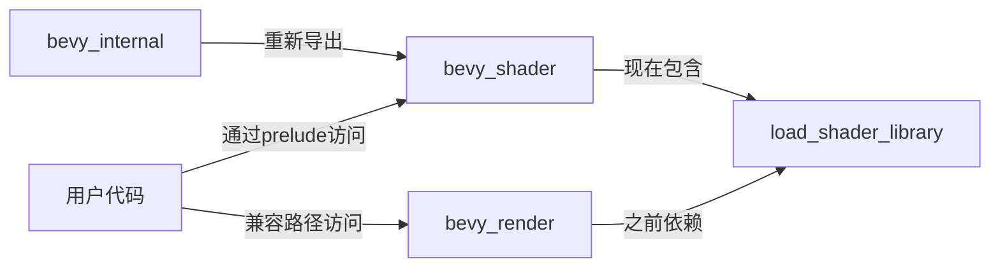

+++
title = "#20491 Add bevy_shader prelude and move load_shader_library"
date = "2025-08-10T00:00:00"
draft = false
template = "pull_request_page.html"
in_search_index = false

[extra]
current_language = "zh-cn"
available_languages = {"en" = { name = "English", url = "/pull_request/bevy/2025-08/pr-20491-en-20250810" }, "zh-cn" = { name = "中文", url = "/pull_request/bevy/2025-08/pr-20491-zh-cn-20250810" }}
+++

# Add bevy_shader prelude and move load_shader_library

## 基本信息
- **标题**: Add bevy_shader prelude and move load_shader_library
- **PR 链接**: https://github.com/bevyengine/bevy/pull/20491
- **作者**: atlv24
- **状态**: MERGED
- **标签**: A-Rendering, S-Needs-Review
- **创建时间**: 2025-08-10T14:06:41Z
- **合并时间**: 2025-08-10T16:16:51Z
- **合并者**: james7132

## 描述翻译
**目标**

- 为移除重新导出(re-exports)做准备
- 我们希望在不使用 bevy_render 的情况下使用 load_shader_library，因此将其放入 bevy_shader

**解决方案**

- 如标题所示

**测试**

- cargo check --examples --all-features

## 这个PR的故事

### 问题和背景
在 Bevy 引擎的代码结构中，`load_shader_library` 宏原本位于 `bevy_render` 模块中。这导致了两个问题：
1. 该宏与渲染模块强耦合，而着色器加载功能实际属于更基础的 `bevy_shader` 模块的职责范畴
2. 无法在不引入整个 `bevy_render` 依赖的情况下使用着色器加载功能

这种结构违反了关注点分离原则，阻碍了代码解耦计划。具体来说，团队计划移除模块间的重新导出(re-exports)，这要求将功能移动到更合适的模块中。

### 解决方案方法
作者采用了直接的代码重组方案：
1. 将 `load_shader_library` 宏从 `bevy_render` 迁移到 `bevy_shader`
2. 在 `bevy_shader` 中创建新的 prelude 模块
3. 更新相关模块的导入路径和重新导出声明

这种方法的优势是：
- 保持向后兼容性（通过 `bevy_render` 的重新导出）
- 最小化改动范围
- 明确模块职责边界

### 具体实现
核心改动发生在三个文件中：

**1. `bevy_shader/src/lib.rs`**
```rust
// 新增 prelude 模块
pub mod prelude {
    #[doc(hidden)]
    pub use crate::Shader;
}

// 新增内部宏支持模块
#[doc(hidden)]
pub mod _macro {
    pub use bevy_asset;
}

// 迁移 load_shader_library 宏
#[macro_export]
macro_rules! load_shader_library {
    ($asset_server_provider: expr, $path: literal $(, $settings: expr)?) => {
        $crate::_macro::bevy_asset::embedded_asset!($asset_server_provider, $path);
        let handle: $crate::_macro::bevy_asset::prelude::Handle<$crate::prelude::Shader> =
            $crate::_macro::bevy_asset::load_embedded_asset!(
                $asset_server_provider,
                $path
                $(,$settings)?
            );
        core::mem::forget(handle);
    }
}
```
这里的关键点：
- 创建 `prelude` 模块规范地重新导出核心 `Shader` 类型
- 引入 `_macro` 模块处理宏所需的资产系统依赖
- 完整迁移宏定义，保持原有功能不变

**2. `bevy_render/src/lib.rs`**
```diff
+ pub use bevy_shader::load_shader_library;
- pub mod _macro {
-     pub use bevy_asset;
- }

- use crate::render_resource::{init_empty_bind_group_layout, PipelineCache, Shader, ShaderLoader};
+ use crate::render_resource::{init_empty_bind_group_layout, PipelineCache};
+ use bevy_shader::{Shader, ShaderLoader};
```
这里的变化包括：
1. 移除原有的 `_macro` 模块和宏定义
2. 添加对 `bevy_shader::load_shader_library` 的重新导出，保持接口兼容
3. 更新 `Shader` 和 `ShaderLoader` 的导入路径

**3. `bevy_internal/src/prelude.rs`**
```diff
+#[doc(hidden)]
+#[cfg(feature = "bevy_shader")]
+pub use crate::shader::prelude::*;
```
这个新增项确保当启用 `bevy_shader` 特性时，其 prelude 会自动包含在 bevy_internal 的预导入中。

### 技术洞察
这个 PR 展示了几个重要的工程实践：
1. **模块边界优化**：将功能移动到最合适的模块（着色器加载 → bevy_shader）
2. **渐进式重构**：通过重新导出保持向后兼容
3. **Prelude 模式**：使用标准化的预导入模块简化常用类型的访问
4. **依赖解耦**：打破 bevy_render 和着色器加载之间的硬依赖

宏迁移时特别注意保持原有行为：
- 保留 `core::mem::forget(handle)` 防止句柄被立即释放
- 维持相同的宏参数和功能签名
- 内部继续使用 `bevy_asset` 的嵌入式资产功能

### 影响和结果
这些变更带来了以下改进：
1. **架构清晰化**：着色器相关功能集中到 bevy_shader 模块
2. **依赖简化**：现在可以在不依赖整个渲染系统的情况下使用着色器加载
3. **更好的工程实践**：引入 prelude 模块遵循 Rust 生态的通用约定
4. **为未来优化铺路**：为计划中的重新导出清理工作做好准备

测试验证方面，作者使用 `cargo check --examples --all-features` 确保所有示例在不同特性组合下仍能编译通过，这是验证跨模块重构安全性的有效方法。

## 视觉表示



## 关键文件变更

1. **crates/bevy_shader/src/lib.rs** (+31/-0)
   - 新增 prelude 模块导出核心 Shader 类型
   - 添加 _macro 模块支持资产系统访问
   - 迁移 load_shader_library 宏定义

```rust
// 新增部分
pub mod prelude {
    #[doc(hidden)]
    pub use crate::Shader;
}

#[doc(hidden)]
pub mod _macro {
    pub use bevy_asset;
}

#[macro_export]
macro_rules! load_shader_library {
    // ... 宏实现保持不变 ...
}
```

2. **crates/bevy_render/src/lib.rs** (+3/-24)
   - 移除原有的宏定义和支撑模块
   - 添加对 bevy_shader 版本的重新导出
   - 更新 Shader/ShaderLoader 导入路径

```diff
+ pub use bevy_shader::load_shader_library;
- #[doc(hidden)]
- pub mod _macro {
-     pub use bevy_asset;
- }

- use crate::render_resource::{init_empty_bind_group_layout, PipelineCache, Shader, ShaderLoader};
+ use crate::render_resource::{init_empty_bind_group_layout, PipelineCache};
+ use bevy_shader::{Shader, ShaderLoader};
```

3. **crates/bevy_internal/src/prelude.rs** (+4/-0)
   - 条件导出 bevy_shader 的 prelude

```rust
#[doc(hidden)]
#[cfg(feature = "bevy_shader")]
pub use crate::shader::prelude::*;
```

## 延伸阅读

1. Rust 模块系统最佳实践:  
   https://doc.rust-lang.org/book/ch07-02-defining-modules-to-control-scope-and-privacy.html
2. Prelude 模式在 Rust 生态中的应用:  
   https://rust-lang.github.io/api-guidelines/naming.html#prelude-modules-re-export-the-most-common-items-c-prelude
3. Bevy 资产系统工作原理:  
   https://bevyengine.org/learn/book/assets/