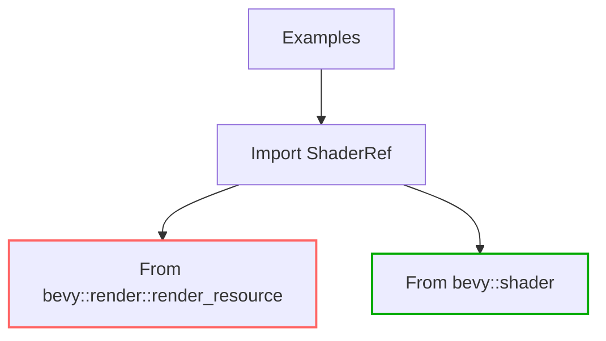

+++
title = "#20492 Use bevy::shader in examples instead of bevy::render::shader re-export"
date = "2025-08-10T00:00:00"
draft = false
template = "pull_request_page.html"
in_search_index = true

[taxonomies]
list_display = ["show"]

[extra]
current_language = "en"
available_languages = {"en" = { name = "English", url = "/pull_request/bevy/2025-08/pr-20492-en-20250810" }, "zh-cn" = { name = "中文", url = "/pull_request/bevy/2025-08/pr-20492-zh-cn-20250810" }}
labels = ["A-Rendering"]
+++

## Title  
Use bevy::shader in examples instead of bevy::render::shader re-export  

### Basic Information  
- **Title**: Use bevy::shader in examples instead of bevy::render::shader re-export  
- **PR Link**: https://github.com/bevyengine/bevy/pull/20492  
- **Author**: atlv24  
- **Status**: MERGED  
- **Labels**: A-Rendering, S-Ready-For-Final-Review  
- **Created**: 2025-08-10T14:50:18Z  
- **Merged**: 2025-08-10T18:27:54Z  
- **Merged By**: mockersf  

### Description Translation  
# Objective  

- Prepare for removing re-exports  
- Probably depends on #20491 merging first  

## Solution  

- title  

## Testing  

- cargo check --examples --all-features  

### The Story of This Pull Request  

This PR addresses a straightforward but important refactoring task in the Bevy engine's examples. The core issue relates to import paths for shader-related components. Previously, many examples used the re-exported `ShaderRef` from `bevy::render::render_resource` instead of importing directly from its canonical location in `bevy::shader`. While this worked due to Bevy's re-export patterns, it created two maintainability issues:  

1. **Re-export cleanup preparation**: The Bevy team plans to remove unnecessary re-exports to simplify the API surface. Keeping examples tied to re-exports would break them when these exports are removed.  

2. **Consistency and discoverability**: Direct imports improve code clarity and help developers understand where components originate. Using the canonical path (`bevy::shader`) makes dependencies explicit and aligns with Rust's best practices.  

The solution involved systematically updating import statements across 26 example files. The changes follow a consistent pattern:  
1. Remove `ShaderRef` (and related types) from `bevy::render::render_resource` imports  
2. Add explicit imports from `bevy::shader` for these components  
3. Reorganize imports for better readability where applicable  

For example, consider the `shader_material_wesl.rs` file:  
```rust
// Before
use bevy::render::render_resource::{
    AsBindGroup, RenderPipelineDescriptor, ShaderDefVal, ShaderRef, SpecializedMeshPipelineError,
};

// After
use bevy::render::render_resource::{
    AsBindGroup, RenderPipelineDescriptor, SpecializedMeshPipelineError,
};
use bevy::shader::{ShaderDefVal, ShaderRef};
```

This change preserves all functionality while making imports more resilient to future architectural changes. The modifications are mechanical but require careful attention to each file's existing import structure.  

Testing was minimal since this is purely a refactoring of import paths. The validation command `cargo check --examples --all-features` confirmed no compilation errors were introduced. This approach ensures the examples remain functional while preparing them for upcoming changes in Bevy's rendering module structure.  

The PR was merged quickly (within 4 hours) since it's a low-risk change that aligns with ongoing efforts to clean up Bevy's public API. By decoupling examples from internal re-exports, we reduce future maintenance burden and improve the quality of example code that new Bevy users will reference.  

### Visual Representation  


### Key Files Changed  

1. **`examples/shader/shader_material_wesl.rs`**  
   - Updated imports to use `bevy::shader` for shader-related components  
   - Key changes:  
```diff
 use bevy::{
+    mesh::MeshVertexBufferLayoutRef,
     pbr::{MaterialPipeline, MaterialPipelineKey},
     prelude::*,
     reflect::TypePath,
-    render::{
-        mesh::MeshVertexBufferLayoutRef,
-        render_resource::{
-            AsBindGroup, RenderPipelineDescriptor, ShaderDefVal, ShaderRef,
-            SpecializedMeshPipelineError,
-        },
+    render::render_resource::{
+        AsBindGroup, RenderPipelineDescriptor, SpecializedMeshPipelineError,
     },
+    shader::{ShaderDefVal, ShaderRef},
 };
```

2. **`examples/shader/automatic_instancing.rs`**  
   - Simplified imports by separating shader components  
```diff
 use bevy::{
-    mesh::MeshTag,
-    prelude::*,
-    reflect::TypePath,
-    render::render_resource::{AsBindGroup, ShaderRef},
+    mesh::MeshTag, prelude::*, reflect::TypePath, render::render_resource::AsBindGroup,
+    shader::ShaderRef,
 };
```

3. **`examples/shader/storage_buffer.rs`**  
   - Isolated shader import from render resource imports  
```diff
 use bevy::{
     mesh::MeshTag,
     prelude::*,
     reflect::TypePath,
-    render::{
-        render_resource::{AsBindGroup, ShaderRef},
-        storage::ShaderStorageBuffer,
-    },
+    render::{render_resource::AsBindGroup, storage::ShaderStorageBuffer},
+    shader::ShaderRef,
 };
```

4. **`examples/3d/lines.rs`**  
   - Moved shader import to dedicated line  
```diff
@@ -8,10 +8,10 @@ use bevy::{
     render::{
         render_asset::RenderAssetUsages,
         render_resource::{
-            AsBindGroup, PolygonMode, RenderPipelineDescriptor, ShaderRef,
-            SpecializedMeshPipelineError,
+            AsBindGroup, PolygonMode, RenderPipelineDescriptor, SpecializedMeshPipelineError,
         },
     },
+    shader::ShaderRef,
 };
```

5. **`examples/shader/animate_shader.rs`**  
   - Consolidated imports while fixing source  
```diff
@@ -2,9 +2,7 @@
 //! The time data is in the globals binding which is part of the `mesh_view_bindings` shader import.
 
 use bevy::{
-    prelude::*,
-    reflect::TypePath,
-    render::render_resource::{AsBindGroup, ShaderRef},
+    prelude::*, reflect::TypePath, render::render_resource::AsBindGroup, shader::ShaderRef,
 };
```

### Further Reading  
- [Rust Module System Best Practices](https://doc.rust-lang.org/book/ch07-04-bringing-paths-into-scope.html)  
- [Bevy Shader Module Documentation](https://docs.rs/bevy/latest/bevy/shader/index.html)  
- [API Guideline: Re-exports](https://rust-lang.github.io/api-guidelines/naming.html#c-reexport)  

This change exemplifies how small, focused refactorings can improve codebase maintainability and prepare for larger architectural changes.