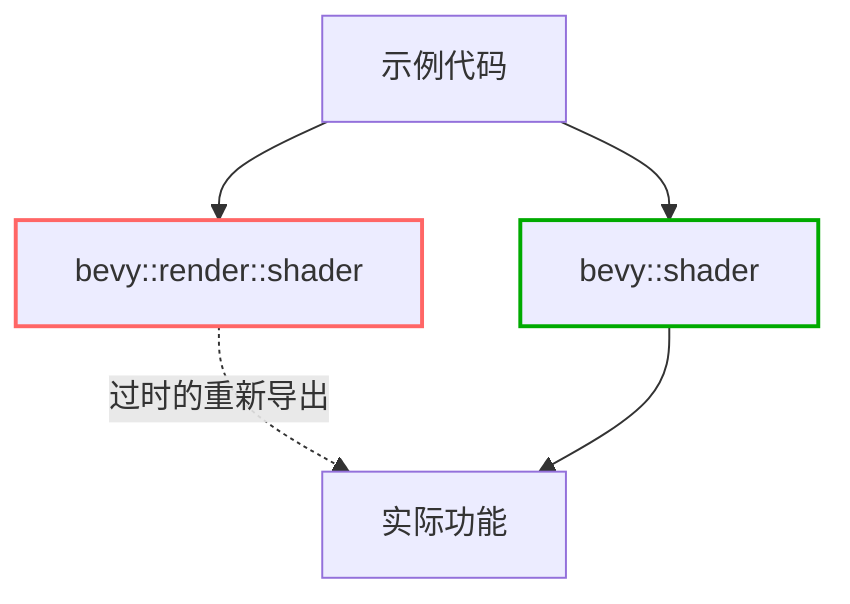

+++
title = "#20492 Use bevy::shader in examples instead of bevy::render::shader re-export"
date = "2025-08-10T00:00:00"
draft = false
template = "pull_request_page.html"
in_search_index = false

[extra]
current_language = "zh-cn"
available_languages = {"en" = { name = "English", url = "/pull_request/bevy/2025-08/pr-20492-en-20250810" }, "zh-cn" = { name = "中文", url = "/pull_request/bevy/2025-08/pr-20492-zh-cn-20250810" }}
labels = ["A-Rendering"]
+++

# 分析报告：PR #20492 - Use bevy::shader in examples instead of bevy::render::shader re-export

## Basic Information
- **Title**: Use bevy::shader in examples instead of bevy::render::shader re-export
- **PR Link**: https://github.com/bevyengine/bevy/pull/20492
- **Author**: atlv24
- **Status**: MERGED
- **Labels**: A-Rendering, S-Ready-For-Final-Review
- **Created**: 2025-08-10T14:50:18Z
- **Merged**: 2025-08-10T18:27:54Z
- **Merged By**: mockersf

## Description Translation
**目标**
- 为移除重新导出(re-exports)做准备
- 可能依赖于#20491先合并

**解决方案**
- 标题(指PR标题的内容)

**测试**
- cargo check --examples --all-features

## The Story of This Pull Request

### 问题背景
Bevy 引擎正在进行模块重构，计划移除不必要的重新导出(re-exports)。当前代码库中，多个示例文件通过`bevy::render::shader`路径访问着色器功能，而实际上这些功能是定义在`bevy::shader`模块中并通过渲染模块重新导出的。这种间接访问方式：
1. 增加了代码维护复杂度
2. 在未来的重构中可能导致断裂
3. 使模块边界变得模糊

### 解决方案
PR #20492 通过系统性地更新示例代码中的导入路径来解决这个问题：
1. 将所有`bevy::render::shader`的导入替换为`bevy::shader`
2. 保持功能不变，仅修改模块访问路径
3. 更新26个示例文件确保一致性

这种修改是更大规模模块重构的前置工作，使代码库能更平滑地过渡到移除重新导出的版本。

### 实现细节
修改主要涉及两种模式：
1. **合并导入**：当文件中已存在`bevy::shader`导入时，扩展该导入
2. **新增导入**：当文件中不存在`bevy::shader`时，添加新导入语句

关键修改点是`ShaderRef`和`ShaderDefVal`等类型的导入路径变更。这些类型在着色器系统中起核心作用，用于定义材质与着色器的关联关系。

### 技术验证
验证通过简单而有效的命令完成：
```bash
cargo check --examples --all-features
```
这个命令确保所有示例在修改后仍然能成功编译，且没有引入新的编译错误或警告。

### 影响分析
1. **代码健康度提升**：明确了`bevy::shader`作为着色器功能的主入口点
2. **重构准备**：为后续移除重新导出扫清了障碍
3. **开发者体验**：示例代码展示了推荐的最佳实践
4. **零功能变更**：纯路径修改不影响运行时行为

## Visual Representation



## Key Files Changed

### 1. examples/shader/shader_material_wesl.rs
**修改原因**：统一着色器相关功能的导入路径  
**关键变更**：
```rust
// 修改前：
use bevy::{
    render::render_resource::{
        AsBindGroup, RenderPipelineDescriptor, ShaderDefVal, ShaderRef,
        SpecializedMeshPipelineError,
    },
};

// 修改后：
use bevy::{
    render::render_resource::{
        AsBindGroup, RenderPipelineDescriptor, SpecializedMeshPipelineError,
    },
    shader::{ShaderDefVal, ShaderRef},
};
```

### 2. examples/shader/automatic_instancing.rs
**修改原因**：简化材质系统导入  
**关键变更**：
```rust
// 修改前：
use bevy::{
    render::render_resource::{AsBindGroup, ShaderRef},
};

// 修改后：
use bevy::{
    render::render_resource::AsBindGroup,
    shader::ShaderRef,
};
```

### 3. examples/3d/lines.rs
**修改原因**：保持3D示例的一致性  
**关键变更**：
```rust
// 修改前：
use bevy::render::render_resource::{
    AsBindGroup, PolygonMode, RenderPipelineDescriptor, ShaderRef,
    SpecializedMeshPipelineError,
};

// 修改后：
use bevy::render::render_resource::{
    AsBindGroup, PolygonMode, RenderPipelineDescriptor, SpecializedMeshPipelineError,
};
use bevy::shader::ShaderRef;
```

### 4. examples/shader/animate_shader.rs
**修改原因**：优化材质系统导入结构  
**关键变更**：
```rust
// 修改前：
use bevy::{
    prelude::*,
    reflect::TypePath,
    render::render_resource::{AsBindGroup, ShaderRef},
};

// 修改后：
use bevy::{
    prelude::*, 
    reflect::TypePath, 
    render::render_resource::AsBindGroup, 
    shader::ShaderRef,
};
```

### 5. examples/shader/storage_buffer.rs
**修改原因**：修复存储缓冲区示例的导入  
**关键变更**：
```rust
// 修改前：
use bevy::{
    render::{
        render_resource::{AsBindGroup, ShaderRef},
    },
};

// 修改后：
use bevy::{
    render::render_resource::AsBindGroup,
    shader::ShaderRef,
};
```

## Further Reading
1. [Rust模块系统文档](https://doc.rust-lang.org/book/ch07-00-managing-growing-projects-with-packages-crates-and-modules.html)
2. [Bevy着色器系统架构](https://bevyengine.org/learn/book/getting-started/shaders/)
3. [PR #20491 - 前置重构](https://github.com/bevyengine/bevy/pull/20491)