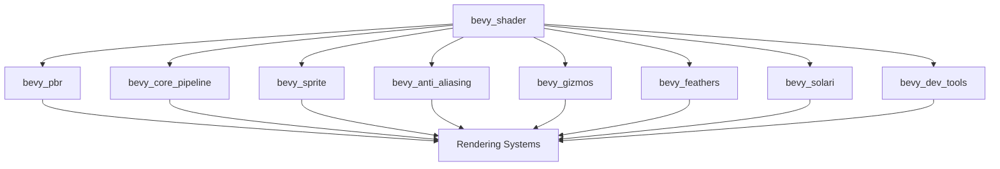

+++
title = "#20493 Use bevy_shader in pbr, core pipelines, sprite, aa, gizmos, feathers, solari, dev_tools instead of bevy_render::shader re-export"
date = "2025-08-10T00:00:00"
draft = false
template = "pull_request_page.html"
in_search_index = true

[taxonomies]
list_display = ["show"]

[extra]
current_language = "en"
available_languages = {"en" = { name = "English", url = "/pull_request/bevy/2025-08/pr-20493-en-20250810" }, "zh-cn" = { name = "中文", url = "/pull_request/bevy/2025-08/pr-20493-zh-cn-20250810" }}
labels = ["A-Rendering"]
+++

# Analysis of PR #20493: Use bevy_shader in pbr, core pipelines, sprite, aa, gizmos, feathers, solari, dev_tools instead of bevy_render::shader re-export

## Basic Information
- **Title**: Use bevy_shader in pbr, core pipelines, sprite, aa, gizmos, feathers, solari, dev_tools instead of bevy_render::shader re-export
- **PR Link**: https://github.com/bevyengine/bevy/pull/20493
- **Author**: atlv24
- **Status**: MERGED
- **Labels**: A-Rendering, S-Needs-Review
- **Created**: 2025-08-10T14:50:41Z
- **Merged**: 2025-08-10T17:27:19Z
- **Merged By**: mockersf

## Description Translation
# Objective

- Prepare for removing re-exports
- Probably depends on #20491 merging first

## Solution

- title

## Testing

- cargo check --examples --all-features

## The Story of This Pull Request

### The Problem and Context
Bevy's rendering system uses a `bevy_shader` crate for shader management, but several modules were accessing shader functionality through re-exports from `bevy_render::shader`. This created an unnecessary indirection and made the dependency graph less clear. As part of ongoing efforts to clean up Bevy's internal structure and remove re-exports, we needed to migrate these modules to directly use `bevy_shader` instead.

The technical constraints included:
- Maintaining compatibility with existing shader functionality
- Ensuring all shader-related imports were correctly updated
- Preserving existing rendering behavior while changing import paths
- Handling cases where `load_shader_library` was also re-exported

### The Solution Approach
The solution was straightforward but widespread: replace all imports of `bevy_render::shader` items with direct imports from `bevy_shader`. This involved:

1. Adding `bevy_shader` as a dependency to affected crates
2. Replacing import paths in source files
3. Moving `load_shader_library` from `bevy_render` to `bevy_shader`
4. Updating benchmark code to use proper mesh imports

No alternatives were seriously considered since this was a mechanical but necessary refactor to improve code organization. The engineering decision was to make these changes in a single PR to minimize disruption.

### The Implementation
The implementation involved updating 78 files across the codebase. Key changes included:

**Adding bevy_shader dependencies**  
Each affected crate's Cargo.toml was updated to include `bevy_shader`:
```toml
# Example from bevy_anti_aliasing/Cargo.toml
[dependencies]
bevy_shader = { path = "../bevy_shader", version = "0.17.0-dev" }
```

**Updating shader imports**  
Shader imports were changed from:
```rust
use bevy_render::render_resource::Shader;
```
to:
```rust
use bevy_shader::Shader;
```

**Moving load_shader_library**  
The `load_shader_library` function was migrated to `bevy_shader`:
```rust
// Before in bevy_render
use bevy_render::load_shader_library;

// After
use bevy_shader::load_shader_library;
```

**Benchmark cleanup**  
Benchmarks were updated to use proper mesh imports:
```rust
// Before
use bevy_render::mesh::{Indices, Mesh, PrimitiveTopology};

// After
use bevy_mesh::{Indices, Mesh, PrimitiveTopology};
use bevy_asset::RenderAssetUsages;
```

### Technical Insights
The changes demonstrate:
1. **Explicit dependencies**: Directly depending on `bevy_shader` makes dependencies clearer
2. **Decoupling**: Separates shader management from rendering internals
3. **Code hygiene**: Removes unnecessary re-exports that complicate tracing
4. **Consistent patterns**: All shader-related functionality now lives in `bevy_shader`

No performance impact was expected since this is purely an import restructuring. The changes fit into Bevy's evolving architecture by clarifying module responsibilities.

### The Impact
These changes:
1. Prepare for complete removal of shader re-exports
2. Simplify dependency graphs for affected crates
3. Improve code navigation by reducing indirection
4. Set a precedent for cleaning up other re-exports
5. Make future refactors easier by establishing direct dependencies

The main technical lesson is that systematic cleanup of re-exports improves long-term maintainability, even when changes are widespread but mechanically simple.

## Visual Representation



## Key Files Changed

1. `crates/bevy_anti_aliasing/src/smaa/mod.rs` (+6/-5)
```rust
// Before:
use bevy_render::render_resource::{
    // ...
    Shader,
    ShaderDefVal,
    // ...
};

// After:
use bevy_shader::{Shader, ShaderDefVal};
```
Changes: Updated shader imports to come directly from bevy_shader instead of through bevy_render re-exports.

2. `crates/bevy_core_pipeline/src/experimental/mip_generation/mod.rs` (+4/-4)
```rust
// Before:
use bevy_render::render_resource::Shader;

// After:
use bevy_shader::Shader;
```
Changes: Replaced bevy_render shader import with direct bevy_shader import.

3. `crates/bevy_core_pipeline/src/post_process/mod.rs` (+4/-4)
```rust
// Before:
use bevy_render::{
    load_shader_library,
    render_resource::Shader,
    // ...
};

// After:
use bevy_shader::{load_shader_library, Shader};
```
Changes: Migrated both load_shader_library and Shader to come from bevy_shader.

4. `crates/bevy_pbr/src/meshlet/material_pipeline_prepare.rs` (+2/-6)
```rust
// Before:
use bevy_render::{
    mesh::{Mesh, MeshVertexBufferLayout, MeshVertexBufferLayoutRef, MeshVertexBufferLayouts},
    render_resource::Shader,
    // ...
};

// After:
use bevy_mesh::{Mesh, MeshVertexBufferLayout, MeshVertexBufferLayoutRef, MeshVertexBufferLayouts};
// Shader import removed since it wasn't directly used
```
Changes: Cleaned up imports by removing unused shader import and using proper mesh imports.

5. `crates/bevy_pbr/src/ssr/mod.rs` (+4/-4)
```rust
// Before:
use bevy_render::render_resource::Shader;

// After:
use bevy_shader::Shader;
```
Changes: Standard migration to direct bevy_shader import.

## Further Reading
1. [Bevy's Module Structure Documentation](https://github.com/bevyengine/bevy/blob/main/docs/plugins_guidelines.md)
2. [Rust's Module System](https://doc.rust-lang.org/book/ch07-02-defining-modules-to-control-scope-and-privacy.html)
3. [Cargo Workspaces](https://doc.rust-lang.org/book/ch14-03-cargo-workspaces.html)