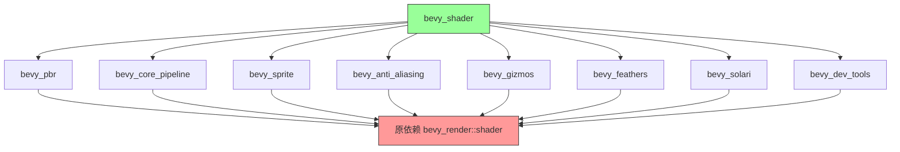

+++
title = "#20493 Use bevy_shader in pbr, core pipelines, sprite, aa, gizmos, feathers, solari, dev_tools instead of bevy_render::shader re-export"
date = "2025-08-10T00:00:00"
draft = false
template = "pull_request_page.html"
in_search_index = false

[extra]
current_language = "zh-cn"
available_languages = {"en" = { name = "English", url = "/pull_request/bevy/2025-08/pr-20493-en-20250810" }, "zh-cn" = { name = "中文", url = "/pull_request/bevy/2025-08/pr-20493-zh-cn-20250810" }}
+++

# PR 分析报告: Use bevy_shader in pbr, core pipelines, sprite, aa, gizmos, feathers, solari, dev_tools instead of bevy_render::shader re-export

## 基础信息
- **标题**: Use bevy_shader in pbr, core pipelines, sprite, aa, gizmos, feathers, solari, dev_tools instead of bevy_render::shader re-export
- **PR 链接**: https://github.com/bevyengine/bevy/pull/20493
- **作者**: atlv24
- **状态**: 已合并
- **标签**: A-Rendering, S-Needs-Review
- **创建时间**: 2025-08-10T14:50:41Z
- **合并时间**: 2025-08-10T17:27:19Z
- **合并人**: mockersf

## 描述翻译
### 目标
- 为移除重新导出(re-exports)做准备
- 可能依赖于 #20491 先合并

### 解决方案
- 标题所述方案

### 测试
- `cargo check --examples --all-features`

## PR 技术分析

### 问题背景
Bevy 引擎的渲染系统存在一个结构性问题：多个核心模块（包括 PBR、核心管线、精灵、抗锯齿等）通过 `bevy_render::shader` 的重新导出(re-export)来访问着色器功能。这种设计导致：
1. **模块耦合度高**：`bevy_render` 成为中心依赖点
2. **重构困难**：修改着色器系统需要跨多个模块协调
3. **编译效率低**：不必要的依赖关系增加编译时间

### 解决方案
PR 的核心策略是将着色器依赖从 `bevy_render` 转移到专门的 `bevy_shader` crate：
1. **移除重新导出**：替换 `bevy_render::shader` 为直接导入 `bevy_shader`
2. **依赖更新**：在 78 个文件中修改 Cargo.toml 和 use 语句
3. **功能解耦**：分离渲染核心逻辑与着色器管理

### 实现细节
#### 依赖结构调整
在 10+ 个 crate 的 Cargo.toml 中添加 `bevy_shader` 依赖：
```toml
# 示例: crates/bevy_anti_aliasing/Cargo.toml
[dependencies]
bevy_shader = { path = "../bevy_shader", version = "0.17.0-dev" }
```

#### 导入路径替换
典型修改模式是将：
```rust
use bevy_render::shader::Shader;
```
替换为：
```rust
use bevy_shader::Shader;
```

#### 复杂用例处理
在涉及着色器定义值(ShaderDefVal)的场景，同时导入多个类型：
```rust
// 修改前
use bevy_render::render_resource::{Shader, ShaderDefVal};

// 修改后
use bevy_shader::{Shader, ShaderDefVal};
```

#### 模块特定调整
在 `meshlet` 模块中，着色器加载逻辑被重构：
```rust
// crates/bevy_pbr/src/meshlet/mod.rs
// 修改前
use bevy_render::load_shader_library;

// 修改后
use bevy_shader::load_shader_library;
```

### 技术洞察
1. **依赖隔离**：将 `bevy_shader` 作为独立 crate 减少核心渲染模块的复杂性
2. **编译优化**：通过减少不必要的依赖项间接改善增量编译时间
3. **架构清晰化**：明确区分渲染资源管理和着色器处理责任
4. **模式统一**：所有渲染相关模块现在使用一致的着色器引用方式

### 影响分析
1. **正向影响**：
   - 减少 `bevy_render` 的公共接口复杂度
   - 为未来着色器系统优化奠定基础
   - 提升代码可维护性（减少跨模块依赖）
2. **潜在影响**：
   - 第三方插件需要更新导入路径
   - 后续 PR 可安全移除 `bevy_render` 中的重新导出

## 可视化关系


## 关键文件变更

### `crates/bevy_anti_aliasing/src/smaa/mod.rs`
**修改原因**：统一着色器导入路径  
**变更内容**：
```rust
// 修改前
use bevy_render::render_resource::{
    Shader,
    ShaderDefVal,
    // ... 其他导入
};

// 修改后
use bevy_shader::{Shader, ShaderDefVal};
use bevy_render::render_resource::{
    // ... 其他导入（不含 Shader/ShaderDefVal）
};
```

### `crates/bevy_core_pipeline/src/experimental/mip_generation/mod.rs`
**修改原因**：解耦着色器依赖  
**变更内容**：
```rust
// 修改前
use bevy_render::render_resource::Shader;

// 修改后
use bevy_shader::Shader;
```

### `crates/bevy_core_pipeline/src/post_process/mod.rs`
**修改原因**：分离着色器加载逻辑  
**变更内容**：
```rust
// 修改前
use bevy_render::load_shader_library;
use bevy_render::render_resource::Shader;

// 修改后
use bevy_shader::{load_shader_library, Shader};
```

### `crates/bevy_pbr/src/meshlet/material_pipeline_prepare.rs`
**修改原因**：清理冗余导入  
**变更内容**：
```rust
// 修改前
use bevy_render::mesh::{MeshVertexBufferLayout, MeshVertexBufferLayoutRef};
use bevy_render::render_resource::ShaderDefVal;

// 修改后
use bevy_shader::ShaderDefVal;
use bevy_mesh::{MeshVertexBufferLayout, MeshVertexBufferLayoutRef};
```

### `crates/bevy_pbr/src/ssr/mod.rs`
**修改原因**：统一着色器管理  
**变更内容**：
```rust
// 修改前
use bevy_render::load_shader_library;
use bevy_render::render_resource::Shader;

// 修改后
use bevy_shader::{load_shader_library, Shader};
```

## 延伸阅读
1. [Rust 模块系统最佳实践](https://doc.rust-lang.org/book/ch07-02-defining-modules-to-control-scope-and-privacy.html)
2. [Bevy 引擎架构概览](https://bevyengine.org/learn/book/introduction/)
3. [游戏引擎中的着色器管理](https://developer.nvidia.com/gpugems/gpugems3/part-iv-image-effects/chapter-16-real-time-global-illumination-using-precomputed-light)
4. [Cargo 工作区优化技巧](https://doc.rust-lang.org/cargo/reference/workspaces.html)