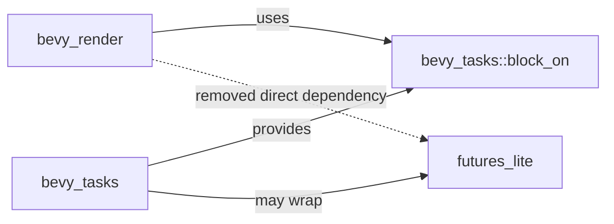

+++
title = "#20495 Depend on bevy_tasks::block_on instead of futures_lite::block_on"
date = "2025-08-11T00:00:00"
draft = false
template = "pull_request_page.html"
in_search_index = true

[taxonomies]
list_display = ["show"]

[extra]
current_language = "en"
available_languages = {"en" = { name = "English", url = "/pull_request/bevy/2025-08/pr-20495-en-20250811" }, "zh-cn" = { name = "中文", url = "/pull_request/bevy/2025-08/pr-20495-zh-cn-20250811" }}
labels = ["D-Trivial", "C-Dependencies", "C-Code-Quality", "A-Tasks"]
+++

## Depend on bevy_tasks::block_on instead of futures_lite::block_on

### Basic Information
- **Title**: Depend on bevy_tasks::block_on instead of futures_lite::block_on
- **PR Link**: https://github.com/bevyengine/bevy/pull/20495
- **Author**: james7132
- **Status**: MERGED
- **Labels**: D-Trivial, C-Dependencies, C-Code-Quality, S-Ready-For-Final-Review, A-Tasks
- **Created**: 2025-08-10T17:38:41Z
- **Merged**: 2025-08-11T07:56:47Z
- **Merged By**: james7132

### Description Translation
# Objective  
`bevy_tasks::block_on` is aliased depending on the features enabled on the crate. If a Bevy-specific version of a `block_on` is implemented, it should be using it as well. The rest of the engine should use the version bevy_tasks exposes.  

## Solution  
Remove the direct dependencies on `futures_lite::block_on` and use `bevy_tasks::block_on` instead.  

## Testing  
CI should pass.

### The Story of This Pull Request

The core issue addressed in this PR was inconsistent usage of blocking mechanisms across Bevy's codebase. While Bevy provides its own `bevy_tasks::block_on` function that abstracts platform-specific implementations, several modules were directly using `futures_lite::block_on`. This created two problems: First, it introduced unnecessary dependencies on `futures_lite` in crates that didn't require it. Second, it bypassed Bevy's task system which might include optimizations or special handling for different execution environments.

The solution was straightforward: replace all direct calls to `futures_lite::block_on` with `bevy_tasks::block_on` throughout the codebase. This change centralizes blocking behavior through Bevy's task system while reducing external dependencies. The implementation required modifications in four key locations across the `bevy_render` and `bevy_tasks` crates.

In `bevy_render`, the main initialization logic was updated to use Bevy's blocking function. This is particularly important for WebAssembly targets where Bevy might implement custom blocking behavior. The render pipeline cache handling saw similar updates in its synchronous pipeline creation paths, ensuring consistent blocking behavior during asset processing.

A notable change occurred in `bevy_tasks` tests, where imports were refactored to access `futures_lite` functionality through Bevy's re-exported module. This maintains test functionality while aligning with the new dependency structure.

The dependency cleanup in `bevy_render`'s Cargo.toml removes `futures-lite` entirely since it's no longer directly used, reducing compile times and potential version conflicts. This change demonstrates how small, focused updates can improve code consistency and maintainability while reducing external dependencies.

### Visual Representation



### Key Files Changed

1. **crates/bevy_render/Cargo.toml**  
   Removed unnecessary dependency:  
   ```diff
   -futures-lite = "2.0.1"
   ```

2. **crates/bevy_render/src/lib.rs**  
   Updated main thread blocking:  
   ```diff
   -                    futures_lite::future::block_on(async_renderer);
   +                    bevy_tasks::block_on(async_renderer);
   ```

3. **crates/bevy_render/src/render_resource/pipeline_cache.rs**  
   Updated pipeline creation blocking:  
   ```diff
   -    match futures_lite::future::block_on(task) {
   +    match bevy_tasks::block_on(task) {
   ```
   (Two occurrences updated)

4. **crates/bevy_tasks/src/edge_executor.rs**  
   Updated test imports:  
   ```diff
   -    use futures_lite::future::{block_on, pending, poll_once};
   +    use bevy_tasks::{block_on, futures_lite::{pending, poll_once}};
   ```

### Further Reading
- [Bevy Tasks Documentation](https://docs.rs/bevy_tasks/latest/bevy_tasks/)
- [Async Rust in Embedded Systems](https://rust-embedded.github.io/book/async/index.html)
- [Rust Futures Explained](https://rust-lang.github.io/async-book/01_getting_started/02_why_async.html)