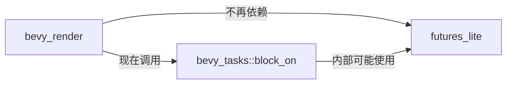

+++
title = "#20495 Depend on bevy_tasks::block_on instead of futures_lite::block_on"
date = "2025-08-11T00:00:00"
draft = false
template = "pull_request_page.html"
in_search_index = false

[extra]
current_language = "zh-cn"
available_languages = {"en" = { name = "English", url = "/pull_request/bevy/2025-08/pr-20495-en-20250811" }, "zh-cn" = { name = "中文", url = "/pull_request/bevy/2025-08/pr-20495-zh-cn-20250811" }}
+++

# PR 分析报告：Depend on bevy_tasks::block_on instead of futures_lite::block_on

## 基本信息
- **标题**: Depend on bevy_tasks::block_on instead of futures_lite::block_on
- **PR 链接**: https://github.com/bevyengine/bevy/pull/20495
- **作者**: james7132
- **状态**: MERGED
- **标签**: D-Trivial, C-Dependencies, C-Code-Quality, S-Ready-For-Final-Review, A-Tasks
- **创建时间**: 2025-08-10T17:38:41Z
- **合并时间**: 2025-08-11T07:56:47Z
- **合并者**: james7132

## 描述翻译
### Objective
`bevy_tasks::block_on` 的别名取决于 crate 启用的功能。如果实现了 Bevy 特定版本的 `block_on`，则应使用它。引擎的其余部分应使用 bevy_tasks 公开的版本。

### Solution
删除对 `futures_lite::block_on` 的直接依赖，改用 `bevy_tasks::block_on`。

### Testing
CI 应通过。

## 本次 PR 的技术背景与实现

在 Bevy 引擎的异步任务处理中，存在一个依赖管理问题需要解决。问题核心在于：当 Bevy 提供了自己封装的异步阻塞函数 `bevy_tasks::block_on` 时，部分引擎模块仍然直接依赖第三方库 `futures_lite` 中的 `block_on` 实现。这种实现方式带来了两个主要问题：

首先，它违背了抽象层设计原则。`bevy_tasks::block_on` 的实现会根据平台特性（如是否在 WASM 环境中运行）自动选择最优策略，而直接使用 `futures_lite::block_on` 则绕过了这层抽象，可能导致平台兼容性问题或性能次优解。其次，不必要的依赖增加了构建复杂性和二进制体积，特别是当 Bevy 内部已提供等效功能时。

解决方案直截了当：将 `futures_lite::block_on` 的调用点统一替换为 `bevy_tasks::block_on`，并移除冗余依赖。这个修改涉及四个文件中的具体实现：

在渲染器初始化逻辑中（`lib.rs`），WASM 环境使用异步渲染器，而非 WASM 环境需要阻塞等待渲染器完成。原实现使用 `futures_lite::future::block_on` 进行阻塞，现改用 `bevy_tasks::block_on` 保持行为一致但依赖更合理：

```rust
// 文件: crates/bevy_render/src/lib.rs
// 修改前:
#[cfg(not(target_arch = "wasm32"))]
futures_lite::future::block_on(async_renderer);

// 修改后:
#[cfg(not(target_arch = "wasm32"))]
bevy_tasks::block_on(async_renderer);
```

在管线缓存模块（`pipeline_cache.rs`）中，同步创建管线任务的处理函数存在同样问题。该函数负责阻塞等待异步管线创建任务完成，原实现直接调用 `futures_lite::future::block_on`，现替换为引擎提供的阻塞方法：

```rust
// 文件: crates/bevy_render/src/render_resource/pipeline_cache.rs
// 修改前:
match futures_lite::future::block_on(task) {
    Ok(pipeline) => CachedPipelineState::Ok(pipeline),
    Err(err) => CachedPipelineState::Err(err),
}

// 修改后:
match bevy_tasks::block_on(task) {
    Ok(pipeline) => CachedPipelineState::Ok(pipeline),
    Err(err) => CachedPipelineState::Err(err),
}
```

值得注意的是，在 `bevy_tasks` 自身的测试代码中（`edge_executor.rs`），也存在对 `futures_lite::block_on` 的直接引用。这被同步更新为从 `bevy_tasks` 导出的 `block_on`，保持测试代码与实现的一致性：

```rust
// 文件: crates/bevy_tasks/src/edge_executor.rs
// 修改前:
use futures_lite::future::{block_on, pending, poll_once};

// 修改后:
use bevy_tasks::{block_on, futures_lite::{pending, poll_once}};
```

最后，在依赖声明文件（`Cargo.toml`）中，`futures-lite` 依赖项被移除，因为 `bevy_render` 不再需要直接引用这个库：

```toml
// 文件: crates/bevy_render/Cargo.toml
// 修改前:
futures-lite = "2.0.1"

// 修改后:
// futures-lite 依赖项被完全移除
```

这些修改带来两个主要技术收益：一是统一了异步阻塞接口，确保整个引擎使用相同的阻塞策略，便于未来优化和平台适配；二是简化了依赖树，减少了不必要的间接依赖，使构建更高效。从代码质量角度看，这种修改遵循了 DRY（Don't Repeat Yourself）原则，消除重复功能实现。

## 组件关系图



## 关键文件变更

### crates/bevy_render/Cargo.toml
- **变更说明**：移除对 futures-lite 的直接依赖
- **代码示例**：
```diff
 derive_more = { version = "2", default-features = false, features = ["from"] }
-futures-lite = "2.0.1"
 encase = { version = "0.11", features = ["glam"] }
```

### crates/bevy_render/src/lib.rs
- **变更说明**：将 futures_lite::future::block_on 替换为 bevy_tasks::block_on
- **代码示例**：
```diff
 // 否则直接阻塞等待完成
 #[cfg(not(target_arch = "wasm32"))]
-futures_lite::future::block_on(async_renderer);
+bevy_tasks::block_on(async_renderer);
```

### crates/bevy_render/src/render_resource/pipeline_cache.rs
- **变更说明**：两处 futures_lite::future::block_on 调用替换为 bevy_tasks::block_on
- **代码示例**：
```diff
- match futures_lite::future::block_on(task) {
+ match bevy_tasks::block_on(task) {
     Ok(pipeline) => CachedPipelineState::Ok(pipeline),
     Err(err) => CachedPipelineState::Err(err),
 }
```

### crates/bevy_tasks/src/edge_executor.rs
- **变更说明**：测试代码改用 bevy_tasks 导出的 block_on
- **代码示例**：
```diff
- use futures_lite::future::{block_on, pending, poll_once};
+ use bevy_tasks::{block_on, futures_lite::{pending, poll_once}};
```

## 延伸阅读

1. Bevy 任务系统设计文档：[Bevy Tasks Architecture](https://bevyengine.org/learn/book/plugins/tasks/)
2. Rust 异步编程基础：[Asynchronous Programming in Rust](https://rust-lang.github.io/async-book/)
3. 依赖管理最佳实践：[Cargo Reference](https://doc.rust-lang.org/cargo/reference/index.html)