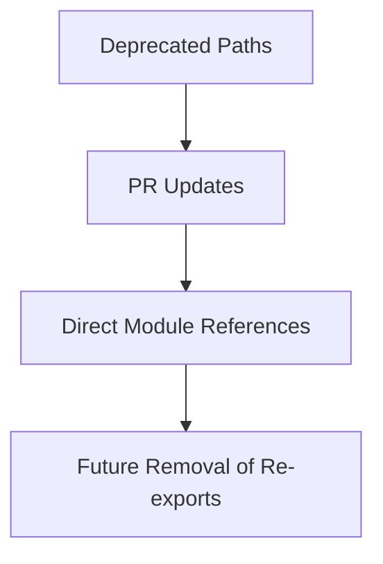

+++
title = "#20496 Fix doc paths to not use deprecated re-exports"
date = "2025-08-10T00:00:00"
draft = false
template = "pull_request_page.html"
in_search_index = true

[taxonomies]
list_display = ["show"]

[extra]
current_language = "en"
available_languages = {"en" = { name = "English", url = "/pull_request/bevy/2025-08/pr-20496-en-20250810" }, "zh-cn" = { name = "中文", url = "/pull_request/bevy/2025-08/pr-20496-zh-cn-20250810" }}
labels = ["C-Docs", "D-Trivial", "A-Rendering"]
+++

# Analysis of PR #20496: Fix doc paths to not use deprecated re-exports

## Basic Information
- **Title**: Fix doc paths to not use deprecated re-exports
- **PR Link**: https://github.com/bevyengine/bevy/pull/20496
- **Author**: atlv24
- **Status**: MERGED
- **Labels**: C-Docs, D-Trivial, A-Rendering, S-Ready-For-Final-Review
- **Created**: 2025-08-10T19:38:33Z
- **Merged**: 2025-08-10T21:05:58Z
- **Merged By**: mockersf

## Description Translation
**Objective**
- Prepare for removing re-exports

**Solution**
- Update documentation paths to use direct module references instead of deprecated re-exports

**Testing**
- `cargo check --examples --all-features`

## The Story of This Pull Request

This PR addresses an issue where documentation comments throughout the Bevy codebase were referencing types through deprecated re-exports. The problem stems from Bevy's ongoing module reorganization, where types were moved to new crates but old re-exports were maintained for backward compatibility. These re-exports are now being deprecated and will eventually be removed.

The primary goal was to update all documentation references to use the new canonical paths rather than the deprecated re-exports. This is important because:
1. It ensures documentation remains accurate after the re-exports are removed
2. It helps users find types in their new locations
3. It reduces confusion about where types are actually defined

The solution approach was straightforward: systematically update doc comments to reference the new module paths instead of the old re-exports. The developer identified all instances where documentation used paths like:
- `bevy_render::camera::Camera`
- `bevy_render::mesh::Mesh`
- `crate::prelude::Camera3d`

And replaced them with their canonical equivalents:
- `bevy_camera::Camera`
- `bevy_mesh::Mesh`
- `bevy_camera::Camera3d`

The implementation involved updating doc paths across 27 files in the `crates` directory and 1 example file. Key changes include:
- Camera-related types now reference `bevy_camera` instead of `bevy_render::camera`
- Mesh-related types now reference `bevy_mesh` instead of `bevy_render::mesh`
- Lighting-related types now reference `bevy_light` instead of `bevy_pbr`
- Removed unnecessary module nesting in paths (e.g., `bevy_render::camera::camera::Camera` → `bevy_camera::Camera`)

Technical insights:
1. This is a documentation-only change with no runtime impact
2. Changes are mechanical but require careful verification of each update
3. Updates help clarify module boundaries in Bevy's architecture
4. The PR prepares the codebase for future removal of deprecated re-exports

The impact of these changes:
- Improves documentation accuracy
- Reduces confusion for developers reading docs
- Facilitates future code cleanup by removing dependencies on deprecated paths
- Makes the codebase more resilient to module reorganization

## Visual Representation



## Key Files Changed

### `crates/bevy_remote/src/lib.rs` (+9/-9)
Updated JSON examples to use new module paths:
```diff
-        "bevy_render::camera::camera::Camera": {
+        "bevy_camera::Camera": {
```

### `crates/bevy_pbr/src/pbr_material.rs` (+7/-7)
Updated mesh references and camera paths:
```diff
-    /// [`Mesh`]: bevy_render::mesh::Mesh
+    /// [`Mesh`]: bevy_mesh::Mesh
```

### `crates/bevy_core_pipeline/src/prepass/mod.rs` (+5/-5)
Updated camera component documentation:
```diff
-/// If added to a [`crate::prelude::Camera3d`] then depth values...
+/// If added to a [`bevy_camera::Camera3d`] then depth values...
```

### `crates/bevy_pbr/src/volumetric_fog/mod.rs` (+4/-4)
Updated lighting component references:
```diff
-/// To add volumetric fog to a scene, add [`crate::VolumetricFog`]...
+/// To add volumetric fog to a scene, add [`bevy_light::VolumetricFog`]...
```

### `crates/bevy_mesh/src/components.rs` (+3/-3)
Fixed mesh import examples:
```diff
-/// # use bevy_render::mesh::Mesh;
+/// # use bevy_mesh::Mesh;
```

## Further Reading
- [Bevy Module Organization RFC](https://github.com/bevyengine/rfcs/blob/main/rfcs/45-module-organization.md)
- [Rust Documentation Guidelines](https://rust-lang.github.io/rfcs/1574-more-api-documentation-conventions.html)
- [Bevy Camera System Documentation](https://docs.rs/bevy_camera/latest/bevy_camera/)

## Full Code Diff
<details>
<summary>View full diff</summary>

```diff
diff --git a/crates/bevy_anti_aliasing/src/fxaa/mod.rs b/crates/bevy_anti_aliasing/src/fxaa/mod.rs
index 7bb71d1f1e88b..69b26ffa8abc7 100644
--- a/crates/bevy_anti_aliasing/src/fxaa/mod.rs
+++ b/crates/bevy_anti_aliasing/src/fxaa/mod.rs
@@ -50,7 +50,7 @@ impl Sensitivity {
 }
 
 /// A component for enabling Fast Approximate Anti-Aliasing (FXAA)
-/// for a [`bevy_render::camera::Camera`].
+/// for a [`bevy_camera::Camera`].
 #[derive(Reflect, Component, Clone, ExtractComponent)]
 #[reflect(Component, Default, Clone)]
 #[extract_component_filter(With<Camera>)]
diff --git a/crates/bevy_anti_aliasing/src/smaa/mod.rs b/crates/bevy_anti_aliasing/src/smaa/mod.rs
index cf875252ad06e..3a65f6ce6c593 100644
--- a/crates/bevy_anti_aliasing/src/smaa/mod.rs
+++ b/crates/bevy_anti_aliasing/src/smaa/mod.rs
@@ -11,7 +11,7 @@
 //! which have made SMAA less popular when advanced photorealistic rendering
 //! features are used in recent years.
 //!
-//! To use SMAA, add [`Smaa`] to a [`bevy_render::camera::Camera`]. In a
+//! To use SMAA, add [`Smaa`] to a [`bevy_camera::Camera`]. In a
 //! pinch, you can simply use the default settings (via the [`Default`] trait)
 //! for a high-quality, high-performance appearance. When using SMAA, you will
 //! likely want set [`bevy_render::view::Msaa`] to [`bevy_render::view::Msaa::Off`]
@@ -83,7 +83,7 @@ use bevy_utils::prelude::default;
 pub struct SmaaPlugin;
 
 /// A component for enabling Subpixel Morphological Anti-Aliasing (SMAA)
-/// for a [`bevy_render::camera::Camera`].
+/// for a [`bevy_camera::Camera`].
 #[derive(Clone, Copy, Default, Component, Reflect, ExtractComponent)]
 #[reflect(Component, Default, Clone)]
 #[doc(alias = "SubpixelMorphologicalAntiAliasing")]
diff --git a/crates/bevy_anti_aliasing/src/taa/mod.rs b/crates/bevy_anti_aliasing/src/taa/mod.rs
index 570a182aa9748..fa477daf42472 100644
--- a/crates/bevy_anti_aliasing/src/taa/mod.rs
+++ b/crates/bevy_anti_aliasing/src/taa/mod.rs
@@ -108,7 +108,7 @@ impl Plugin for TemporalAntiAliasPlugin {
 ///
 /// Any camera with this component must also disable [`Msaa`] by setting it to [`Msaa::Off`].
 ///
-/// [Currently](https://github.com/bevyengine/bevy/issues/8423), TAA cannot be used with [`bevy_render::camera::OrthographicProjection`].
+/// [Currently](https://github.com/bevyengine/bevy/issues/8423), TAA cannot be used with [`bevy_camera::OrthographicProjection`].
 ///
 /// TAA also does not work well with alpha-blended meshes, as it requires depth writing to determine motion.
 ///
diff --git a/crates/bevy_core_pipeline/src/dof/mod.rs b/crates/bevy_core_pipeline/src/dof/mod.rs
index 5d2678f4f3125..7f6a84beccae6 100644
--- a/crates/bevy_core_pipeline/src/dof/mod.rs
+++ b/crates/bevy_core_pipeline/src/dof/mod.rs
@@ -491,7 +491,7 @@ impl DepthOfField {
     /// [`PhysicalCameraParameters`].
     ///
     /// By passing the same [`PhysicalCameraParameters`] object to this function
-    /// and to [`bevy_render::camera::Exposure::from_physical_camera`], matching
+    /// and to [`bevy_camera::Exposure::from_physical_camera`], matching
     /// results for both the exposure and depth of field effects can be
     /// obtained.
     ///
diff --git a/crates/bevy_core_pipeline/src/msaa_writeback.rs b/crates/bevy_core_pipeline/src/msaa_writeback.rs
index f1a833047fbb1..15f5a03c5ac6b 100644
--- a/crates/bevy_core_pipeline/src/msaa_writeback.rs
+++ b/crates/bevy_core_pipeline/src/msaa_writeback.rs
@@ -17,7 +17,7 @@ use bevy_render::{
 };
 
 /// This enables "msaa writeback" support for the `core_2d` and `core_3d` pipelines, which can be enabled on cameras
-/// using [`bevy_render::camera::Camera::msaa_writeback`]. See the docs on that field for more information.
+/// using [`bevy_camera::Camera::msaa_writeback`]. See the docs on that field for more information.
 pub struct MsaaWritebackPlugin;
 
 impl Plugin for MsaaWritebackPlugin {
diff --git a/crates/bevy_core_pipeline/src/prepass/mod.rs b/crates/bevy_core_pipeline/src/prepass/mod.rs
index 880e2b6892163..89b09c88b3f09 100644
--- a/crates/bevy_core_pipeline/src/prepass/mod.rs
+++ b/crates/bevy_core_pipeline/src/prepass/mod.rs
@@ -3,7 +3,7 @@
 //!
 //! The prepass only runs for opaque meshes or meshes with an alpha mask. Transparent meshes are ignored.
 //!
-//! To enable the prepass, you need to add a prepass component to a [`crate::prelude::Camera3d`].
+//! To enable the prepass, you need to add a prepass component to a [`bevy_camera::Camera3d`].
 //!
 //! [`DepthPrepass`]
 //! [`NormalPrepass`]
@@ -52,23 +52,23 @@ use bevy_render::{
 pub const NORMAL_PREPASS_FORMAT: TextureFormat = TextureFormat::Rgb10a2Unorm;
 pub const MOTION_VECTOR_PREPASS_FORMAT: TextureFormat = TextureFormat::Rg16Float;
 
-/// If added to a [`crate::prelude::Camera3d`] then depth values will be copied to a separate texture available to the main pass.
+/// If added to a [`bevy_camera::Camera3d`] then depth values will be copied to a separate texture available to the main pass.
 #[derive(Component, Default, Reflect, Clone)]
 #[reflect(Component, Default, Clone)]
 pub struct DepthPrepass;
 
-/// If added to a [`crate::prelude::Camera3d`] then vertex world normals will be copied to a separate texture available to the main pass.
+/// If added to a [`bevy_camera::Camera3d`] then vertex world normals will be copied to a separate texture available to the main pass.
 /// Normals will have normal map textures already applied.
 #[derive(Component, Default, Reflect, Clone)]
 #[reflect(Component, Default, Clone)]
 pub struct NormalPrepass;
 
-/// If added to a [`crate::prelude::Camera3d`] then screen space motion vectors will be copied to a separate texture available to the main pass.
+/// If added to a [`bevy_camera::Camera3d`] then screen space motion vectors will be copied to a separate texture available to the main pass.
 #[derive(Component, Default, Reflect, Clone)]
 #[reflect(Component, Default, Clone)]
 pub struct MotionVectorPrepass;
 
-/// If added to a [`crate::prelude::Camera3d`] then deferred materials will be rendered to the deferred gbuffer texture and will be available to subsequent passes.
+/// If added to a [`bevy_camera::Camera3d`] then deferred materials will be rendered to the deferred gbuffer texture and will be available to subsequent passes.
 /// Note the default deferred lighting plugin also requires `DepthPrepass` to work correctly.
 #[derive(Component, Default, Reflect)]
 #[reflect(Component, Default)]
diff --git a/crates/bevy_mesh/src/components.rs b/crates/bevy_mesh/src/components.rs
index cff5eab7e477f..b175be5f86903 100644
--- a/crates/bevy_mesh/src/components.rs
+++ b/crates/bevy_mesh/src/components.rs
@@ -18,9 +18,9 @@ use derive_more::derive::From;
 /// # Example
 ///
 /// ```ignore
-/// # use bevy_sprite::{ColorMaterial, Mesh2d, MeshMaterial2d};
+/// # use bevy_sprite::{ColorMaterial, MeshMaterial2d};
 /// # use bevy_ecs::prelude::*;
-/// # use bevy_render::mesh::Mesh;
+/// # use bevy_mesh::{Mesh, Mesh2d};
 /// # use bevy_color::palettes::basic::RED;
 /// # use bevy_asset::Assets;
 /// # use bevy_math::primitives::Circle;
@@ -72,7 +72,7 @@ impl AsAssetId for Mesh2d {
 /// ```ignore
 /// # use bevy_pbr::{Material, MeshMaterial3d, StandardMaterial};
 /// # use bevy_ecs::prelude::*;
-/// # use bevy_render::mesh::{Mesh, Mesh3d};
+/// # use bevy_mesh::{Mesh, Mesh3d};
 /// # use bevy_color::palettes::basic::RED;
 /// # use bevy_asset::Assets;
 /// # use bevy_math::primitives::Capsule3d;
diff --git a/crates/bevy_pbr/src/light_probe/environment_map.rs b/crates/bevy_pbr/src/light_probe/environment_map.rs
index b7b5a104da460..bd1ba1aeeb663 100644
--- a/crates/bevy_pbr/src/light_probe/environment_map.rs
+++ b/crates/bevy_pbr/src/light_probe/environment_map.rs
@@ -11,11 +11,11 @@
 //! 1. If attached to a view, they represent the objects located a very far
 //!    distance from the view, in a similar manner to a skybox. Essentially, these
 //!    *view environment maps* represent a higher-quality replacement for
-//!    [`AmbientLight`](crate::AmbientLight) for outdoor scenes. The indirect light from such
+//!    [`AmbientLight`](bevy_light::AmbientLight) for outdoor scenes. The indirect light from such
 //!    environment maps are added to every point of the scene, including
 //!    interior enclosed areas.
 //!
-//! 2. If attached to a [`crate::LightProbe`], environment maps represent the immediate
+//! 2. If attached to a [`bevy_light::LightProbe`], environment maps represent the immediate
 //!    surroundings of a specific location in the scene. These types of
 //!    environment maps are known as *reflection probes*.
 //!
diff --git a/crates/bevy_pbr/src/lightmap/mod.rs b/crates/bevy_pbr/src/lightmap/mod.rs
index 57fa05e158eaa..f4adb94738c48 100644
--- a/crates/bevy_pbr/src/lightmap/mod.rs
+++ b/crates/bevy_pbr/src/lightmap/mod.rs
@@ -26,7 +26,7 @@
 //! set the `uv_rect` field on [`Lightmap`] appropriately.
 //!
 //! [The Lightmapper]: https://github.com/Naxela/The_Lightmapper
-//! [`Mesh3d`]: bevy_render::mesh::Mesh3d
+//! [`Mesh3d`]: bevy_mesh::Mesh3d
 //! [`MeshMaterial3d<StandardMaterial>`]: crate::StandardMaterial
 //! [`StandardMaterial`]: crate::StandardMaterial
 //! [`bevy-baked-gi`]: https://github.com/pcwalton/bevy-baked-gi
@@ -79,9 +79,9 @@ pub struct LightmapPlugin;
 /// A component that applies baked indirect diffuse global illumination from a
 /// lightmap.
 ///
-/// When assigned to an entity that contains a [`Mesh3d`](bevy_render::mesh::Mesh3d) and a
+/// When assigned to an entity that contains a [`Mesh3d`](bevy_mesh::Mesh3d) and a
 /// [`MeshMaterial3d<StandardMaterial>`](crate::StandardMaterial), if the mesh
-/// has a second UV layer ([`ATTRIBUTE_UV_1`](bevy_render::mesh::Mesh::ATTRIBUTE_UV_1)),
+/// has a second UV layer ([`ATTRIBUTE_UV_1`](bevy_mesh::Mesh::ATTRIBUTE_UV_1)),
 /// then the lightmap will render using those UVs.
 #[derive(Component, Clone, Reflect)]
 #[reflect(Component, Default, Clone)]
diff --git a/crates/bevy_pbr/src/material.rs b/crates/bevy_pbr/src/material.rs
index 4b246bd06e2b2..059c37db0cb83 100644
--- a/crates/bevy_pbr/src/material.rs
+++ b/crates/bevy_pbr/src/material.rs
@@ -81,7 +81,9 @@ pub const MATERIAL_BIND_GROUP_INDEX: usize = 3;
 /// # use bevy_ecs::prelude::*;
 /// # use bevy_image::Image;
 /// # use bevy_reflect::TypePath;
-/// # use bevy_render::{mesh::{Mesh, Mesh3d}, render_resource::{AsBindGroup, ShaderRef}};
+/// # use bevy_mesh::{Mesh, Mesh3d};
+/// # use bevy_render::render_resource::AsBindGroup;
+/// # use bevy_shader::ShaderRef;
 /// # use bevy_color::LinearRgba;
 /// # use bevy_color::palettes::basic::RED;
 /// # use bevy_asset::{Handle, AssetServer, Assets, Asset};
diff --git a/crates/bevy_pbr/src/mesh_material.rs b/crates/bevy_pbr/src/mesh_material.rs
index 027f2073ec179..46520ccdb5d83 100644
--- a/crates/bevy_pbr/src/mesh_material.rs
+++ b/crates/bevy_pbr/src/mesh_material.rs
@@ -9,14 +9,14 @@ use derive_more::derive::From;
 ///
 /// See [`Material`] for general information about 3D materials and how to implement your own materials.
 ///
-/// [`Mesh3d`]: bevy_render::mesh::Mesh3d
+/// [`Mesh3d`]: bevy_mesh::Mesh3d
 ///
 /// # Example
 ///
 /// ```
 /// # use bevy_pbr::{Material, MeshMaterial3d, StandardMaterial};
 /// # use bevy_ecs::prelude::*;
-/// # use bevy_render::mesh::{Mesh, Mesh3d};
+/// # use bevy_mesh::{Mesh, Mesh3d};
 /// # use bevy_color::palettes::basic::RED;
 /// # use bevy_asset::Assets;
 /// # use bevy_math::primitives::Capsule3d;
diff --git a/crates/bevy_pbr/src/meshlet/asset.rs b/crates/bevy_pbr/src/meshlet/asset.rs
index 584ea345e3ecf..2f70c3276dffe 100644
--- a/crates/bevy_pbr/src/meshlet/asset.rs
+++ b/crates/bevy_p