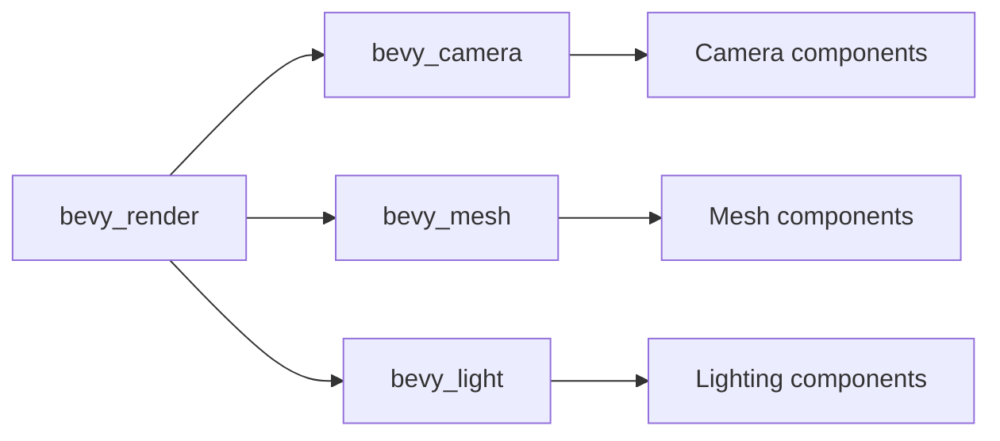

+++
title = "#20496 Fix doc paths to not use deprecated re-exports"
date = "2025-08-10T00:00:00"
draft = false
template = "pull_request_page.html"
in_search_index = false

[extra]
current_language = "zh-cn"
available_languages = {"en" = { name = "English", url = "/pull_request/bevy/2025-08/pr-20496-en-20250810" }, "zh-cn" = { name = "中文", url = "/pull_request/bevy/2025-08/pr-20496-zh-cn-20250810" }}
+++

# PR 分析报告: Fix doc paths to not use deprecated re-exports

## 基本信息
- **标题**: Fix doc paths to not use deprecated re-exports
- **PR 链接**: https://github.com/bevyengine/bevy/pull/20496
- **作者**: atlv24
- **状态**: MERGED
- **标签**: C-Docs, D-Trivial, A-Rendering, S-Ready-For-Final-Review
- **创建时间**: 2025-08-10T19:38:33Z
- **合并时间**: 2025-08-10T21:05:58Z
- **合并者**: mockersf

## 描述翻译
### 目标
- 为移除重新导出(re-exports)做准备

### 解决方案
- 标题

### 测试
- cargo check --examples --all-features

## PR 技术分析

### 问题背景
在 Bevy 引擎的持续演进过程中，部分模块通过重新导出(re-exports)提供快捷访问路径。这些重新导出路径已被标记为废弃(deprecated)，计划在未来版本中移除。当前文档中多处仍引用这些废弃路径，存在两个主要问题：
1. 文档准确性：开发者查阅文档时会看到废弃路径，与实际模块结构不符
2. 未来兼容性：废弃路径移除后，文档链接将失效

该 PR 属于准备工作，确保在废弃路径被移除前，文档指向正确的当前路径，避免破坏开发者体验。

### 解决方案
解决方案直接明确：系统性地扫描整个代码库，将文档注释中所有引用废弃重新导出的路径更新为直接引用目标模块的路径。关键工程决策包括：
1. 仅修改文档注释，不影响实际功能代码
2. 保持原有代码结构和格式不变
3. 确保所有更新后的路径指向正确的目标模块

### 具体实现
修改主要涉及文档注释中的模块路径引用，以下是典型修改模式：

**相机模块路径更新**  
将 `bevy_render::camera::Camera` 更新为 `bevy_camera::Camera`：
```diff
// crates/bevy_anti_aliasing/src/fxaa/mod.rs
- /// for a [`bevy_render::camera::Camera`].
+ /// for a [`bevy_camera::Camera`].
```

**网格模块路径更新**  
将 `bevy_render::mesh::Mesh` 更新为 `bevy_mesh::Mesh`：
```diff
// crates/bevy_pbr/src/pbr_material.rs
- /// [`Mesh::generate_tangents`]: bevy_render::mesh::Mesh::generate_tangents
- /// [`Mesh::with_generated_tangents`]: bevy_render::mesh::Mesh::with_generated_tangents
+ /// [`Mesh::generate_tangents`]: bevy_mesh::Mesh::generate_tangents
+ /// [`Mesh::with_generated_tangents`]: bevy_mesh::Mesh::with_generated_tangents
```

**组件文档更新**  
预处理组件文档更新为使用新路径：
```diff
// crates/bevy_core_pipeline/src/prepass/mod.rs
- /// If added to a [`crate::prelude::Camera3d`] then depth values...
+ /// If added to a [`bevy_camera::Camera3d`] then depth values...
```

### 技术洞察
1. **模块化演进**：修改反映 Bevy 从单体模块向更细粒度模块结构的演进
2. **文档维护**：保持文档与代码结构同步是大型项目的基本要求
3. **机械性修改**：所有修改属于机械性替换，不涉及逻辑变更
4. **影响范围**：共修改 28 个文件，证明废弃路径在代码库中广泛使用

### 影响分析
1. **开发者体验**：提升文档准确性，避免开发者困惑
2. **迁移准备**：为完全移除废弃重新导出铺平道路
3. **零运行时影响**：纯文档修改不影响引擎运行时行为
4. **代码质量**：提升长期维护性，减少技术债务

## 关键文件变更

### crates/bevy_remote/src/lib.rs (+9/-9)
更新示例 JSON 中的路径引用，反映新模块结构：
```diff
 {
      "components": {
-        "bevy_core_pipeline::core_3d::camera_3d::Camera3d": {
+        "bevy_camera::Camera3d": {
           "depth_load_op": {
             "Clear": 0.0
           },
         },
         "bevy_core_pipeline::tonemapping::DebandDither": "Enabled",
         "bevy_core_pipeline::tonemapping::Tonemapping": "TonyMcMapface",
-        "bevy_pbr::cluster::ClusterConfig": {
+        "bevy_light::cluster::ClusterConfig": {
           "FixedZ": {
```

### crates/bevy_pbr/src/pbr_material.rs (+7/-7)
更新材质文档中相机和网格的引用路径：
```diff
- /// - [`Camera3d::screen_space_specular_transmission_steps`](bevy_core_pipeline::core_3d::Camera3d::screen_space_specular_transmission_steps)
+ /// - [`Camera3d::screen_space_specular_transmission_steps`](bevy_camera::Camera3d::screen_space_specular_transmission_steps)
   ///   to be seen through other transmissive objects...
- ///     [`Camera3d::screen_space_specular_transmission_steps`](bevy_core_pipeline::core_3d::Camera3d::screen_space_specular_transmission_steps)
+ ///     [`Camera3d::screen_space_specular_transmission_steps`](bevy_camera::Camera3d::screen_space_specular_transmission_steps)
```

### crates/bevy_core_pipeline/src/prepass/mod.rs (+5/-5)
统一预处理组件文档使用新相机路径：
```diff
- /// If added to a [`crate::prelude::Camera3d`] then depth values...
+ /// If added to a [`bevy_camera::Camera3d`] then depth values...
```

### crates/bevy_mesh/src/components.rs (+3/-3)
更新网格组件示例代码引用：
```diff
- # use bevy_render::mesh::Mesh;
+ # use bevy_mesh::Mesh;
```

### crates/bevy_pbr/src/volumetric_fog/mod.rs (+4/-4)
修正体积雾文档中的组件路径：
```diff
- /// To add volumetric fog to a scene, add [`crate::VolumetricFog`] to the
- /// camera, and add [`crate::VolumetricLight`] to directional lights...
+ /// To add volumetric fog to a scene, add [`bevy_light::VolumetricFog`] to the
+ /// camera, and add [`bevy_light::VolumetricLight`] to directional lights...
```

## 模块关系图


## 延伸阅读
1. [Rust 文档注释指南](https://doc.rust-lang.org/rustdoc/how-to-write-documentation.html)
2. [Bevy 模块结构演进](https://bevyengine.org/news/bevy-0.13/)
3. [语义化版本与废弃管理](https://semver.org/)