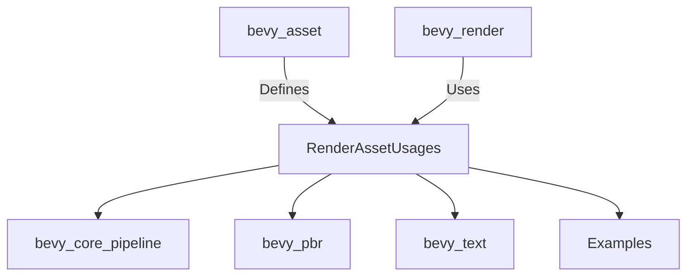

+++
title = "#20498 Yeet RenderAssetUsages re-export"
date = "2025-08-11T00:00:00"
draft = false
template = "pull_request_page.html"
in_search_index = true

[taxonomies]
list_display = ["show"]

[extra]
current_language = "en"
available_languages = {"en" = { name = "English", url = "/pull_request/bevy/2025-08/pr-20498-en-20250811" }, "zh-cn" = { name = "中文", url = "/pull_request/bevy/2025-08/pr-20498-zh-cn-20250811" }}
labels = ["D-Trivial", "A-Rendering"]
+++

# Analysis of PR #20498: Yeet RenderAssetUsages re-export

## Basic Information
- **Title**: Yeet RenderAssetUsages re-export
- **PR Link**: https://github.com/bevyengine/bevy/pull/20498
- **Author**: atlv24
- **Status**: MERGED
- **Labels**: D-Trivial, A-Rendering, S-Ready-For-Final-Review
- **Created**: 2025-08-11T00:09:58Z
- **Merged**: 2025-08-11T02:01:28Z
- **Merged By**: alice-i-cecile

## Description Translation
# Objective

- Forgot to remove this

## Solution

- Remove it

## Testing

cargo check --examples --all-features

## The Story of This Pull Request

This PR addresses a minor but widespread inconsistency in Bevy's import structure. The core issue was redundant re-exporting of `RenderAssetUsages` from `bevy_render::render_asset` instead of using the canonical export from `bevy_asset`. While functionally identical, this created unnecessary indirection and import complexity.

The cleanup started by removing the re-export in `bevy_render/src/render_asset.rs`. The original code contained:
```rust
pub use bevy_asset::RenderAssetUsages;
```
This was replaced with a direct import from `bevy_asset`:
```rust
use bevy_asset::{Asset, AssetEvent, AssetId, Assets, RenderAssetUsages};
```

This change rippled through the codebase, requiring updates in 28 files across crates and examples. The pattern was consistent: replace `bevy_render::render_asset::RenderAssetUsages` imports with `bevy_asset::RenderAssetUsages`. For example, in `bevy_core_pipeline`:

```rust
// Before:
use bevy_render::render_asset::RenderAssetUsages;

// After:
use bevy_asset::RenderAssetUsages;
```

The primary technical insight is that `RenderAssetUsages` is fundamentally an asset-related enum (defining how assets are used in rendering contexts) and belongs in the asset crate. This aligns with Bevy's architectural principle of keeping rendering-specific concerns separate from core asset management.

No functional changes occurred - this was purely an import cleanup. The PR demonstrates good hygiene in:
1. Removing unnecessary indirection
2. Simplifying dependency graphs
3. Maintaining consistency across the codebase
4. Reducing cognitive load for contributors

Testing was minimal (`cargo check --examples --all-features`) since no behavior was modified. The trivial nature (D-Trivial label) and rapid merge (under 2 hours) reflect the low-risk nature of these changes.

## Visual Representation



## Key Files Changed

1. `crates/bevy_render/src/render_asset.rs` (+2/-5)
   - Removed re-export to simplify import paths
   ```rust
   // Before:
   pub use bevy_asset::RenderAssetUsages;
   use bevy_asset::{Asset, AssetEvent, AssetId, Assets};
   
   // After:
   use bevy_asset::{Asset, AssetEvent, AssetId, Assets, RenderAssetUsages};
   ```

2. `crates/bevy_text/src/font_atlas.rs` (+2/-5)
   - Updated import source
   ```rust
   // Before:
   use bevy_render::{
     render_asset::RenderAssetUsages,
     render_resource::{TextureDimension, TextureFormat},
   };
   
   // After:
   use bevy_asset::{Assets, Handle, RenderAssetUsages};
   use bevy_render::render_resource::{TextureDimension, TextureFormat};
   ```

3. `examples/3d/lines.rs` (+3/-5)
   - Typical example update
   ```rust
   // Before:
   use bevy::{
     render::{
       render_asset::RenderAssetUsages,
       render_resource::{
         AsBindGroup, PolygonMode, /* ... */},
     },
   };
   
   // After:
   use bevy::{
     asset::RenderAssetUsages,
     render::render_resource::{
       AsBindGroup, PolygonMode, /* ... */},
   };
   ```

4. `crates/bevy_core_pipeline/src/post_process/mod.rs` (+4/-2)
   - Added missing direct import
   ```rust
   // Added:
   use bevy_asset::RenderAssetUsages;
   ```

5. `crates/bevy_core_pipeline/src/tonemapping/mod.rs` (+4/-2)
   - Similar to post_process changes
   ```rust
   // Before:
   use bevy_render::render_asset::RenderAssetUsages;
   
   // After:
   use bevy_asset::RenderAssetUsages;
   ```

## Further Reading
1. [Bevy Assets Documentation](https://bevyengine.org/learn/book/getting-started/assets/)
2. [Rust Module System](https://doc.rust-lang.org/book/ch07-02-defining-modules-to-control-scope-and-privacy.html)
3. [Bevy Render Architecture](https://github.com/bevyengine/bevy/blob/main/crates/bevy_render/README.md)