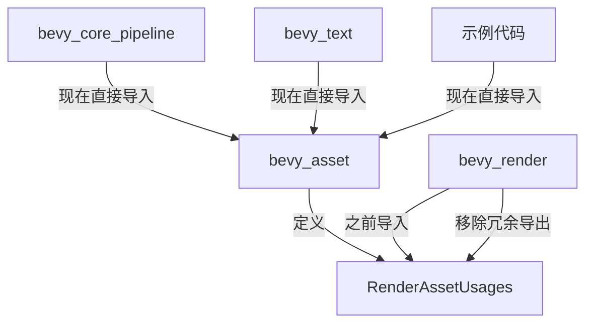

+++
title = "#20498 Yeet RenderAssetUsages re-export"
date = "2025-08-11T00:00:00"
draft = false
template = "pull_request_page.html"
in_search_index = false

[extra]
current_language = "zh-cn"
available_languages = {"en" = { name = "English", url = "/pull_request/bevy/2025-08/pr-20498-en-20250811" }, "zh-cn" = { name = "中文", url = "/pull_request/bevy/2025-08/pr-20498-zh-cn-20250811" }}
+++

# 技术分析报告：Yeet RenderAssetUsages re-export

## 基础信息
- **标题**: Yeet RenderAssetUsages re-export
- **PR链接**: https://github.com/bevyengine/bevy/pull/20498
- **作者**: atlv24
- **状态**: MERGED
- **标签**: D-Trivial, A-Rendering, S-Ready-For-Final-Review
- **创建时间**: 2025-08-11T00:09:58Z
- **合并时间**: 2025-08-11T02:01:28Z
- **合并人**: alice-i-cecile

## 描述翻译
### 目标
- 忘记移除这个了

### 解决方案
- 记起来并移除

### 测试
cargo check --examples --all-features

## PR技术分析

### 问题背景
在Bevy渲染系统的实现中，`RenderAssetUsages` 枚举被定义在`bevy_asset` crate中，用于控制渲染资源的生命周期和使用方式。然而历史实现中，这个类型被额外通过`bevy_render::render_asset`模块进行了再导出（re-export）。这种冗余导出增加了维护成本，可能导致开发者混淆导入路径，并且不符合Rust的最佳实践——优先使用原始定义路径。

### 解决方案
该PR移除了`bevy_render::render_asset`模块中对`RenderAssetUsages`的冗余再导出，并统一了所有引用此类型的导入路径，改为直接从`bevy_asset`导入。这种修改属于典型的代码清理（code cleanup）操作，核心目标是通过消除不必要的间接层来简化项目结构。

### 实现细节
修改涉及28个文件，主要分为三类变化：

1. **移除冗余导出**：
   ```rust
   // crates/bevy_render/src/render_asset.rs
   // 修改前：
   pub use bevy_asset::RenderAssetUsages;
   use bevy_asset::{Asset, AssetEvent, AssetId, Assets};
   
   // 修改后：
   use bevy_asset::{Asset, AssetEvent, AssetId, Assets, RenderAssetUsages};
   ```

2. **统一导入路径**：
   所有从`bevy_render::render_asset`导入`RenderAssetUsages`的代码被更新为直接从`bevy_asset`导入：
   ```rust
   // 典型修改模式：
   // 修改前：
   use bevy_render::render_asset::RenderAssetUsages;
   
   // 修改后：
   use bevy_asset::RenderAssetUsages;
   ```

3. **模块结构调整**：
   在`bevy_render`内部模块中，移除了与`RenderAssetUsages`相关的冗余导入，保持代码整洁：
   ```rust
   // crates/bevy_render/src/texture/fallback_image.rs
   // 修改前：
   use crate::render_asset::RenderAssetUsages;
   
   // 修改后：
   use bevy_asset::RenderAssetUsages;
   ```

### 技术影响
1. **代码一致性提升**：统一了`RenderAssetUsages`的导入路径，消除了"相同类型多个来源"的歧义
2. **维护成本降低**：减少了一层间接引用，使依赖关系更清晰
3. **编译检查**：通过`cargo check --examples --all-features`确保所有示例仍能正常编译
4. **无功能变化**：纯重构操作，不影响运行时行为

### 关键文件变更
以下是主要修改文件及示例：

1. **渲染管线核心修改**  
   `crates/bevy_core_pipeline/src/post_process/mod.rs`：
   ```rust
   // 修改前：
   use bevy_render::render_asset::RenderAssetUsages;
   
   // 修改后：
   use bevy_asset::RenderAssetUsages;
   ```

2. **文本渲染系统**  
   `crates/bevy_text/src/font_atlas.rs`：
   ```rust
   // 修改前：
   use bevy_render::render_asset::RenderAssetUsages;
   
   // 修改后：
   use bevy_asset::RenderAssetUsages;
   ```

3. **3D示例更新**  
   `examples/3d/lines.rs`：
   ```rust
   // 修改前：
   use bevy::render::render_asset::RenderAssetUsages;
   
   // 修改后：
   use bevy::asset::RenderAssetUsages;
   ```

4. **资源处理逻辑**  
   `crates/bevy_render/src/texture/gpu_image.rs`：
   ```rust
   // 修改前：
   use crate::render_asset::{..., RenderAssetUsages};
   
   // 修改后：
   use bevy_asset::{..., RenderAssetUsages};
   ```

## 组件关系图



## 延伸阅读
1. [Rust模块系统最佳实践](https://doc.rust-lang.org/book/ch07-04-bringing-paths-into-scope.html)
2. [Bevy资产系统文档](https://bevyengine.org/learn/book/assets/)
3. [Rust 2018路径简化改进](https://blog.rust-lang.org/2018/12/06/Rust-1.31-and-rust-2018.html#simpler-modules)