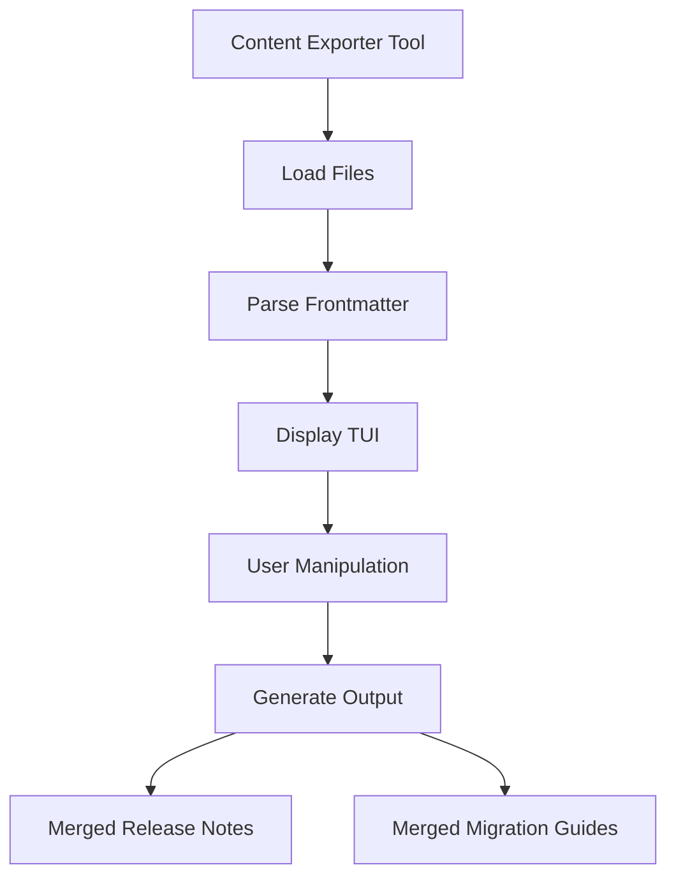

+++
title = "#20500 Release content export tool"
date = "2025-08-15T00:00:00"
draft = false
template = "pull_request_page.html"
in_search_index = true

[taxonomies]
list_display = ["show"]

[extra]
current_language = "en"
available_languages = {"en" = { name = "English", url = "/pull_request/bevy/2025-08/pr-20500-en-20250815" }, "zh-cn" = { name = "中文", url = "/pull_request/bevy/2025-08/pr-20500-zh-cn-20250815" }}
labels = ["C-Feature", "A-Meta", "X-Contentious"]
+++

## Release Content Export Tool Analysis

### Basic Information
- **Title**: Release content export tool
- **PR Link**: https://github.com/bevyengine/bevy/pull/20500
- **Author**: NthTensor
- **Status**: MERGED
- **Labels**: C-Feature, A-Meta, S-Ready-For-Final-Review, X-Contentious
- **Created**: 2025-08-11T01:26:49Z
- **Merged**: 2025-08-15T16:45:52Z
- **Merged By**: alice-i-cecile

## The Story of This Pull Request

### Problem and Context
Managing release content for a large project like Bevy involves collating numerous migration guides and release notes stored as individual markdown files. Before this PR, this process was manual, requiring maintainers to:
1. Collect files from separate directories
2. Manually order them
3. Apply consistent formatting
4. Combine them into single documents for each release

This process was time-consuming, error-prone, and difficult to standardize across releases. The lack of tooling made it challenging to ensure consistent formatting and metadata handling.

### Solution Approach
The author implemented a terminal-based tool that:
1. Automatically discovers release content files
2. Provides a TUI for organizing content
3. Generates properly formatted merged documents

Key engineering decisions:
1. **TUI Interface**: Used Ratatui for terminal UI instead of CLI arguments to provide visual feedback during content organization
2. **Metadata Extraction**: Implemented frontmatter parsing using regex and serde_yml
3. **Content Organization**: Designed a stateful system to track both file content and manual sections
4. **Error Handling**: Integrated Miette for rich diagnostic reporting

### Implementation
The tool consists of three main components:
1. **File Loading**: Scans `release-content` directory and parses frontmatter
2. **TUI Interface**: Provides interactive list management
3. **Output Generation**: Writes organized content to markdown files

The core architecture uses:
- A dual-list system for release notes vs migration guides
- State machines for tracking selections and modes
- Pattern matching for different entry types

```rust
// File: tools/export-content/src/app.rs
enum Entry {
    Section { title: String },
    File { metadata: Metadata, content: String },
}
```

The file loading implementation uses regex to split frontmatter from content:

```rust
// File: tools/export-content/src/app.rs
let re = Regex::new(r"(?s)^---\s*\n(?<frontmatter>.*?)\s*\n---\s*\n(?<content>.*)").unwrap();
```

The TUI handles key events for navigation and manipulation:

```rust
// File: tools/export-content/src/app.rs
match key.code {
    KeyCode::Esc => self.exit = true,
    KeyCode::Tab => match self.mode { ... },
    KeyCode::Down => { ... },
    // Other key handlers
}
```

### Technical Insights
1. **Frontmatter Parsing**: The solution handles YAML frontmatter using serde_yml, but implements custom error reporting with source highlighting
2. **Terminal Safety**: The panic hook ensures terminal state is restored on crashes
3. **Content Organization**: The implementation distinguishes between:
   - Auto-loaded files (with metadata)
   - Manual sections (user-defined headings)
4. **Output Formatting**: Uses Zola shortcodes for consistent metadata rendering:

```rust
write!(file, "## {title}\n{}\n{content}\n\n")
```

### Impact
This tool provides:
1. **Time Savings**: Reduces manual content aggregation from hours to minutes
2. **Consistency**: Ensures uniform formatting across releases
3. **Flexibility**: Allows maintainers to insert custom sections and reorder content
4. **Error Reduction**: Handles metadata extraction consistently

Potential improvements:
- Add validation for PR numbers
- Support nested sections
- Implement file watching during editing

## Visual Representation



## Key Files Changed

### `tools/export-content/src/app.rs` (+352/-0)
Implements core application logic including file loading, TUI rendering, and output generation.

Key additions:
```rust
// File loading implementation
fn load_content(dir: path::PathBuf, kind: &'static str) -> Result<Vec<Entry>> {
    // Regex parsing and error handling
}

// TUI rendering
fn render(&mut self, frame: &mut Frame) {
    // Layout management and widget rendering
}

// Output generation
fn write_output(self) -> Result<()> {
    // Markdown formatting with Zola shortcodes
}
```

### `tools/export-content/src/main.rs` (+64/-0)
Handles terminal setup/teardown and application execution.

Key terminal management:
```rust
fn init_terminal() -> Result<Terminal<impl Backend>> {
    enable_raw_mode()?;
    execute!(io::stdout(), EnterAlternateScreen, EnableMouseCapture)?;
    // ...
}

fn restore_terminal() -> Result<()> {
    disable_raw_mode()?;
    execute!(io::stdout(), LeaveAlternateScreen, DisableMouseCapture)?;
    Ok(())
}
```

### `tools/export-content/Cargo.toml` (+15/-0)
Adds new binary crate with dependencies:

```toml
[package]
name = "export-content"
version = "0.1.0"
edition = "2024"

[dependencies]
miette = { version = "7.6.0", features = ["fancy"] }
ratatui = "0.29.0"
regex = "1.11.1"
serde = { version = "1.0", features = ["derive"] }
serde_yml = "0.0.12"
thiserror = "2.0.12"
```

### Markdown File Updates
Fixed frontmatter formatting for consistency:

```markdown
# Before:
title: `CloneBehavior` is no longer `PartialEq` or `Eq`

# After:
title: "`CloneBehavior` is no longer `PartialEq` or `Eq`"
```

## Further Reading
1. Ratatui Documentation: https://ratatui.rs/
2. Miette Error Reporting: https://miette.rs/
3. Zola Shortcodes: https://www.getzola.org/documentation/content/shortcodes/
4. Serde YAML: https://docs.rs/serde_yml/latest/serde_yml/