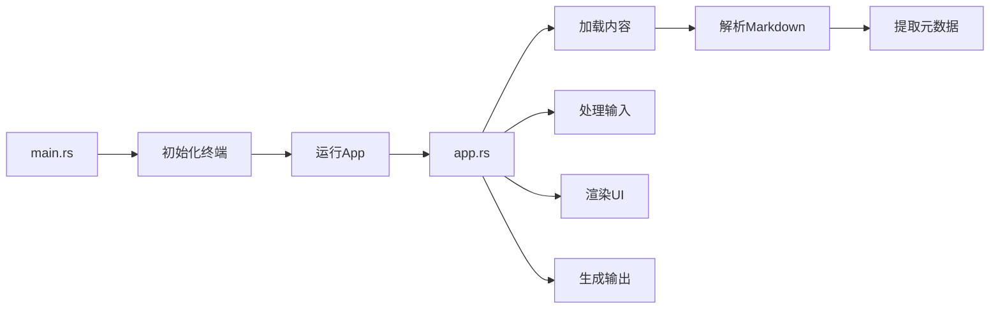

+++
title = "#20500 Release content export tool"
date = "2025-08-15T00:00:00"
draft = false
template = "pull_request_page.html"
in_search_index = false

[extra]
current_language = "zh-cn"
available_languages = {"en" = { name = "English", url = "/pull_request/bevy/2025-08/pr-20500-en-20250815" }, "zh-cn" = { name = "中文", url = "/pull_request/bevy/2025-08/pr-20500-zh-cn-20250815" }}
labels = ["C-Feature", "A-Meta", "X-Contentious"]
+++

# Release content export tool

## Basic Information
- **Title**: Release content export tool
- **PR Link**: https://github.com/bevyengine/bevy/pull/20500
- **Author**: NthTensor
- **Status**: MERGED
- **Labels**: C-Feature, A-Meta, S-Ready-For-Final-Review, X-Contentious
- **Created**: 2025-08-11T01:26:49Z
- **Merged**: 2025-08-15T16:45:52Z
- **Merged By**: alice-i-cecile

## Description Translation
添加一个简单的工具来排序和合并发布说明和迁移指南。

使用方法：进入 `tools/export-content` 并使用 `cargo run`。

输出的格式可能需要调整，我们可能还需要添加/修改一些zola短代码。

## The Story of This Pull Request

### 问题和背景
在Bevy引擎的版本发布过程中，需要整理和合并多个发布说明(release notes)和迁移指南(migration guides)文件。这些内容分散在`release-content`目录下的Markdown文件中，每个文件包含YAML格式的前言元数据(frontmatter)和内容主体。手动整理这些文件既耗时又容易出错，特别是在需要调整内容顺序或添加分组标题时。因此，需要一个自动化工具来简化这个过程。

### 解决方案
开发者创建了一个基于终端的交互式工具，使用户能够：
1. 查看所有发布说明和迁移指南条目
2. 通过键盘导航调整条目顺序
3. 添加自定义的分组标题
4. 删除不需要的分组
5. 最终生成合并后的Markdown文件

工具采用Rust的ratatui库构建文本用户界面(TUI)，使用serde_yml解析文件的前言元数据，并用正则表达式分割文件内容。核心设计选择包括：
- 状态机管理UI模式和用户选择
- 分离数据加载、渲染和输出逻辑
- 详细的错误处理与诊断信息
- 终端原始模式(raw mode)处理确保跨平台兼容性

### 实现细节
工具的核心是`App`结构体，它管理两种内容类型的状态：
```rust
pub struct App {
    content_dir: path::PathBuf,
    release_notes: Vec<Entry>,
    release_notes_state: ListState,
    migration_guides: Vec<Entry>,
    migration_guide_state: ListState,
    text_entry: Option<String>,
    mode: Mode,
    exit: bool,
}
```
文件加载过程使用正则表达式解析Markdown文件结构：
```rust
let re = Regex::new(r"(?s)^---\s*\n(?<frontmatter>.*?)\s*\n---\s*\n(?<content>.*)").unwrap();
```
用户交互处理包括：
- 上下键导航列表
- Shift+上下键交换条目顺序
- '+'键添加新分组
- 'd'键删除分组
- Tab键切换内容类型
- Esc键保存并退出

### 技术洞察
1. **元数据解析**：使用serde_yml将YAML格式的前言反序列化为Metadata结构体：
```rust
#[derive(Deserialize, Debug)]
struct Metadata {
    title: String,
    authors: Option<Vec<String>>,
    pull_requests: Vec<u32>,
}
```
2. **错误处理**：miette库提供带源代码定位的错误诊断：
```rust
#[derive(Diagnostic, Debug, Error)]
#[error("failed to parse metadata in {kind} file {file_name}")]
pub struct ParseError {
    #[source_code]
    src: NamedSource<String>,
    // ...
}
```
3. **终端安全**：panic钩子确保异常时恢复终端状态：
```rust
fn init_panic_hook() {
    let original_hook = take_hook();
    set_hook(Box::new(move |panic_info| {
        let _ = restore_terminal();
        original_hook(panic_info);
    }));
}
```
4. **输出格式化**：合并后的文件使用不同的标题层级：
```rust
// 发布说明
write!(file, "# {title}\n\n")?;
// 迁移指南
write!(file, "## {title}\n\n")?;
```

### 影响
1. 简化了发布内容管理流程，减少了手动操作错误
2. 提供了交互式界面进行内容排序和分组
3. 生成的合并文件可直接用于文档发布
4. 为未来扩展提供了基础框架（如添加更多内容类型）

## Visual Representation



## Key Files Changed

### 1. `tools/export-content/src/app.rs` (+352/-0)
实现了核心应用逻辑：内容加载、UI渲染、用户输入处理和文件输出。

关键代码：
```rust
// 内容加载
let re = Regex::new(r"(?s)^---\s*\n(?<frontmatter>.*?)\s*\n---\s*\n(?<content>.*)").unwrap();
let caps = re.captures(&file_content)?;
let frontmatter = caps.name("frontmatter").unwrap().as_str();
let metadata = serde_yml::from_str::<Metadata>(frontmatter)?;

// 用户输入处理
if key.modifiers.contains(KeyModifiers::SHIFT) {
    mode_entries.swap(index, index + 1); // 交换条目位置
}

// 文件输出
write!(file, "## {title}\n{}\n{content}\n\n")?;
```

### 2. `tools/export-content/src/main.rs` (+64/-0)
处理终端初始化和程序主循环。

关键代码：
```rust
// 初始化终端
enable_raw_mode()?;
execute!(io::stdout(), EnterAlternateScreen, EnableMouseCapture)?;

// panic安全处理
let original_hook = take_hook();
set_hook(Box::new(move |panic_info| {
    let _ = restore_terminal();
    original_hook(panic_info);
}));

// 主循环
let app = App::new()?;
app.run(terminal)
```

### 3. `tools/export-content/Cargo.toml` (+15/-0)
定义了工具依赖和配置。

关键内容：
```toml
[dependencies]
miette = { version = "7.6.0", features = ["fancy"] }
ratatui = "0.29.0"
regex = "1.11.1"
serde = { version = "1.0", features = ["derive"] }
serde_yml = "0.0.12"
```

### 4. Markdown文件标题格式修正
统一了多个迁移指南和发布说明文件的标题格式，将标题包裹在双引号中以确保YAML解析正确性。

修改示例：
```markdown
---  # 修改前
title: `Val` helper functions
---  # 修改后
title: "`Val` helper functions"
```

## Further Reading
1. [ratatui文档](https://docs.rs/ratatui) - 终端用户界面库
2. [miette错误处理](https://docs.rs/miette) - 友好的诊断错误报告
3. [serde_yml](https://docs.rs/serde_yml) - YAML序列化/反序列化
4. 正则表达式语法 - 用于文本解析的模式匹配