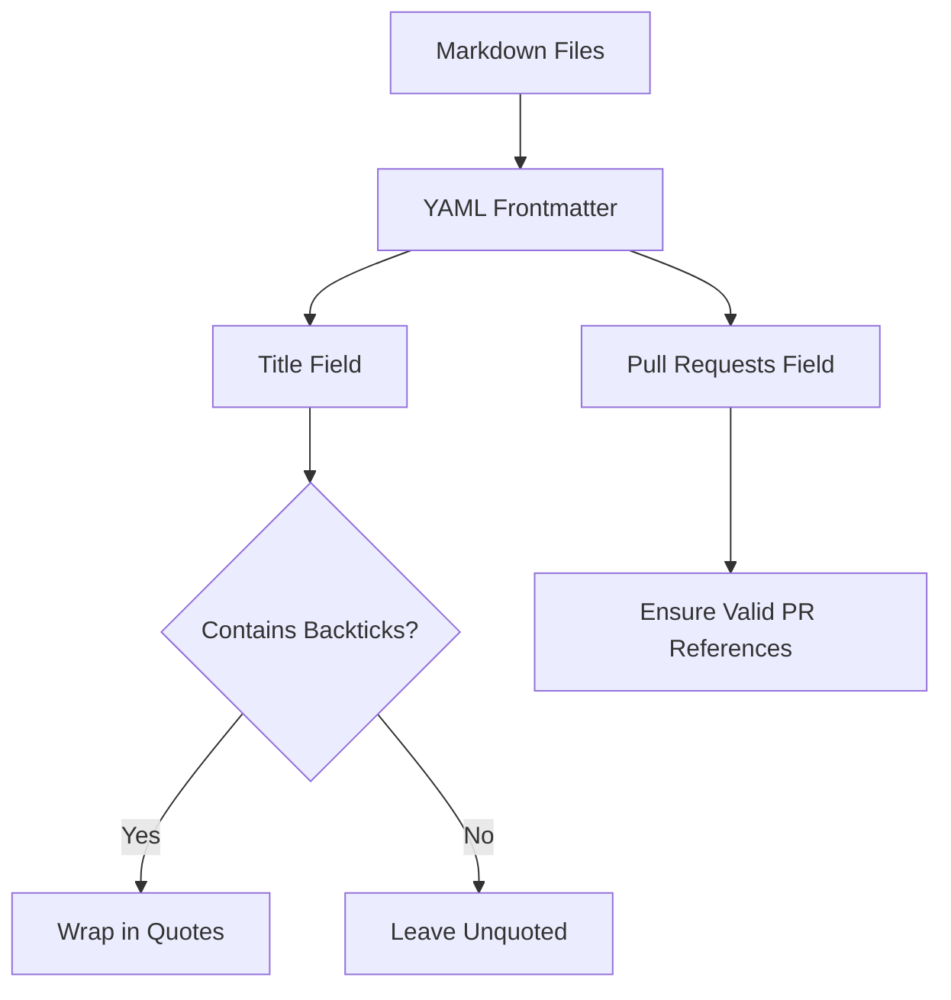

+++
title = "#20501 Fix release content metadata"
date = "2025-08-11T00:00:00"
draft = false
template = "pull_request_page.html"
in_search_index = true

[taxonomies]
list_display = ["show"]

[extra]
current_language = "en"
available_languages = {"en" = { name = "English", url = "/pull_request/bevy/2025-08/pr-20501-en-20250811" }, "zh-cn" = { name = "中文", url = "/pull_request/bevy/2025-08/pr-20501-zh-cn-20250811" }}
labels = ["C-Bug", "D-Trivial", "A-Meta"]
+++

# Fix release content metadata

## Basic Information
- **Title**: Fix release content metadata
- **PR Link**: https://github.com/bevyengine/bevy/pull/20501
- **Author**: NthTensor
- **Status**: MERGED
- **Labels**: C-Bug, D-Trivial, A-Meta, S-Ready-For-Final-Review
- **Created**: 2025-08-11T01:36:05Z
- **Merged**: 2025-08-11T02:15:06Z
- **Merged By**: alice-i-cecile

## Description Translation
Fix mistakes with the yaml frontmatter. Biggest issue was people forgetting to use quotes when strings contain backticks. 

Yaml is a very silly format.

## The Story of This Pull Request

### The Problem and Context
The Bevy project maintains release documentation using markdown files with YAML frontmatter for metadata. Several files contained titles with backticks that weren't properly quoted in their YAML frontmatter. This violates YAML syntax rules since unquoted strings containing special characters like backticks can cause parsing errors. The issue was particularly problematic because:
1. Unquoted strings with backticks are invalid YAML
2. Multiple contributors had made this mistake across documentation files
3. The invalid syntax could break automated documentation tooling
4. Consistency in metadata formatting was lacking

### The Solution Approach
The fix involved systematically reviewing all markdown files in the release-content directories and applying two types of corrections:
1. Wrapping titles containing backticks in double quotes
2. Fixing incomplete pull request references where needed

This approach was straightforward since the changes were purely syntactic and didn't require functional modifications. The key engineering decision was to use double quotes instead of single quotes for consistency with existing conventions.

### The Implementation
The changes were applied to 25 markdown files across migration guides and release notes. Each fix followed the same pattern of adding quotes around titles containing special characters. For example:

```markdown
# Before:
title: `LightVisibilityClass` renamed to `ClusterVisibilityClass`

# After:
title: "`LightVisibilityClass` renamed to `ClusterVisibilityClass`"
```

Additionally, some files had incomplete `pull_requests` metadata that was corrected by adding missing PR numbers. This ensures all documentation references are properly linked to their corresponding code changes.

### Technical Insights
The core issue stems from YAML's string quoting requirements. When strings contain special characters like backticks, they must be quoted to be parsed as string literals. Without quotes, YAML parsers may interpret the content as a different data type or fail entirely. The solution demonstrates good practice for YAML metadata management:
- Always quote strings containing special characters
- Maintain consistent quoting style throughout a project
- Validate metadata syntax as part of documentation reviews

### The Impact
These changes ensure:
1. All documentation metadata is valid YAML
2. Automated tooling can reliably parse frontmatter
3. Documentation remains consistent and maintainable
4. Pull request references are complete and accurate

The fixes prevent potential breakages in documentation pipelines and make it easier for contributors to add new content correctly.

## Visual Representation



## Key Files Changed

1. `release-content/migration-guides/component_entry.md` (+2/-2)
   - Fixed title quoting and added missing PR reference
   - Before:
```markdown
---
title: `Entry` enum is now `ComponentEntry`
pull_requests: [TODO]
---
```
   - After:
```markdown
---
title: "`Entry` enum is now `ComponentEntry`"
pull_requests: [19517]
---
```

2. `release-content/migration-guides/remove_cosmic_text_reexports.md` (+2/-2)
   - Added quotes to title and completed PR reference
   - Before:
```markdown
---
title: Removed `cosmic_text` re-exports
pull_requests: [TODO]
---
```
   - After:
```markdown
---
title: "Removed `cosmic_text` re-exports"
pull_requests: [19516]
---
```

3. `release-content/migration-guides/LightVisibilityClass_rename.md` (+1/-1)
   - Fixed title quoting
   - Before:
```markdown
---
title: `LightVisibilityClass` renamed to `ClusterVisibilityClass`
---
```
   - After:
```markdown
---
title: "`LightVisibilityClass` renamed to `ClusterVisibilityClass`"
---
```

4. `release-content/migration-guides/UI_scroll_position_is_now_logical.md` (+1/-1)
   - Fixed title quoting
   - Before:
```markdown
---
title: `ScrollPosition` now uses logical pixel units and is no longer overwritten during layout updates
---
```
   - After:
```markdown
---
title: "`ScrollPosition` now uses logical pixel units and is no longer overwritten during layout updates"
---
```

5. `release-content/migration-guides/anchor_is_removed_from_sprite.md` (+1/-1)
   - Fixed title quoting
   - Before:
```markdown
---
title: `Anchor` is now a required component on `Sprite`
---
```
   - After:
```markdown
---
title: "`Anchor` is now a required component on `Sprite`"
---
```

## Further Reading
- YAML Specification: https://yaml.org/spec/
- Common YAML Pitfalls: https://github.com/cblp/yaml-sucks
- Bevy Documentation Guide: https://github.com/bevyengine/bevy/blob/main/docs/DOCUMENTATION_GUIDELINES.md