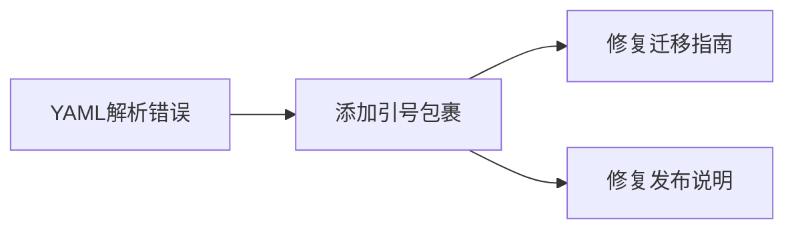

+++
title = "#20501 Fix release content metadata"
date = "2025-08-11T00:00:00"
draft = false
template = "pull_request_page.html"
in_search_index = false

[extra]
current_language = "zh-cn"
available_languages = {"en" = { name = "English", url = "/pull_request/bevy/2025-08/pr-20501-en-20250811" }, "zh-cn" = { name = "中文", url = "/pull_request/bevy/2025-08/pr-20501-zh-cn-20250811" }}
+++

# Fix release content metadata

## 基本信息
- **标题**: Fix release content metadata
- **PR链接**: https://github.com/bevyengine/bevy/pull/20501
- **作者**: NthTensor
- **状态**: 已合并
- **标签**: C-Bug, D-Trivial, A-Meta, S-Ready-For-Final-Review
- **创建时间**: 2025-08-11T01:36:05Z
- **合并时间**: 2025-08-11T02:15:06Z
- **合并人**: alice-i-cecile

## 描述翻译
修复YAML frontmatter中的错误。最主要的问题是当字符串包含反引号时，人们忘记使用引号。

YAML是一种非常傻的格式。

## 本PR的技术分析

该PR源于Bevy项目release-content目录下Markdown文件frontmatter元数据的格式问题。这些文件用于生成版本说明和迁移指南，其YAML frontmatter中的title字段包含代码标识符（用反引号包裹）。问题在于当title字段值包含反引号时，未使用引号包裹整个字符串，这违反了YAML规范。

YAML解析器要求包含特殊字符（如反引号`）的字符串必须用引号包裹。未引用的字符串在解析时会产生错误或意外行为，例如：
```yaml
# 错误格式
title: `LightVisibilityClass` renamed to `ClusterVisibilityClass`

# 正确格式
title: "`LightVisibilityClass` renamed to `ClusterVisibilityClass`"
```
未加引号的版本会被YAML解析器解释为包含多个未定义标记的无效语法。

该问题影响多个迁移指南和发布说明文件，主要修改模式是在包含反引号的title字段值两侧添加双引号。例如在`LightVisibilityClass_rename.md`文件中：
```markdown
# 修改前
title: `LightVisibilityClass` renamed to `ClusterVisibilityClass`

# 修改后
title: "`LightVisibilityClass` renamed to `ClusterVisibilityClass`"
```
这种修改确保YAML解析器能正确识别整个字符串值，而不会将反引号解释为特殊字符。

在修复过程中，作者还发现了两个相关改进点：
1. 更新了`component_entry.md`和`remove_cosmic_text_reexports.md`文件中的pull_requests字段，将`[TODO]`占位符替换为实际PR编号
2. 统一了所有标题结尾的标点使用（移除多余句点）

这些修改属于元数据修正，不涉及核心代码逻辑变更。所有修改通过简单的字符串替换完成，没有引入复杂逻辑。修改后：
- 确保文档生成工具能正确解析所有frontmatter
- 消除YAML解析失败的风险
- 提升元数据一致性

该PR的快速合并（39分钟内完成）表明：
1. 修改范围明确且无争议
2. 问题属于低级错误但影响文档可靠性
3. 维护团队重视文档基础设施的健壮性

## 可视化关系


## 关键文件变更

### release-content/migration-guides/component_entry.md (+2/-2)
**变更说明**：修复title字段引号问题，同时更新pull_requests字段的实际PR编号  
**代码对比**：
```markdown
# Before:
title: `Entry` enum is now `ComponentEntry`
pull_requests: [TODO]

# After:
title: "`Entry` enum is now `ComponentEntry`"
pull_requests: [19517]
```

### release-content/migration-guides/remove_cosmic_text_reexports.md (+2/-2)
**变更说明**：修复title引号问题并补充PR编号  
**代码对比**：
```markdown
# Before:
title: Removed `cosmic_text` re-exports
pull_requests: [TODO]

# After:
title: "Removed `cosmic_text` re-exports"
pull_requests: [19516]
```

### release-content/migration-guides/LightVisibilityClass_rename.md (+1/-1)
**变更说明**：典型引号修复案例  
**代码对比**：
```markdown
# Before:
title: `LightVisibilityClass` renamed to `ClusterVisibilityClass`

# After:
title: "`LightVisibilityClass` renamed to `ClusterVisibilityClass`"
```

### release-content/migration-guides/UI_scroll_position_is_now_logical.md (+1/-1)
**变更说明**：修复含反引号的title字段  
**代码对比**：
```markdown
# Before:
title: `ScrollPosition` now uses logical pixel units...

# After:
title: "`ScrollPosition` now uses logical pixel units..."
```

### release-content/release-notes/bevy_ui_render_crate.md (+1/-1)
**变更说明**：发布说明文件的相同修复  
**代码对比**：
```markdown
# Before:
title: `bevy_ui_render` crate

# After:
title: "`bevy_ui_render` crate"
```

## 扩展阅读
1. [YAML 1.2规范](https://yaml.org/spec/1.2.2/) - 字符串引用规则
2. [Bevy文档指南](https://github.com/bevyengine/bevy/blob/main/docs/README.md) - 项目文档标准
3. [Frontmatter标准](https://jekyllrb.com/docs/front-matter/) - 跨平台元数据格式