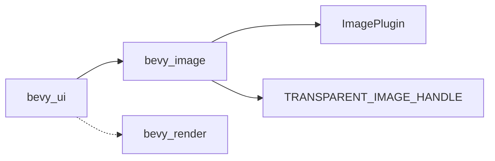

+++
title = "#20502 Make bevy_ui not depend on bevy_render"
date = "2025-08-12T00:00:00"
draft = false
template = "pull_request_page.html"
in_search_index = true

[taxonomies]
list_display = ["show"]

[extra]
current_language = "en"
available_languages = {"en" = { name = "English", url = "/pull_request/bevy/2025-08/pr-20502-en-20250812" }, "zh-cn" = { name = "中文", url = "/pull_request/bevy/2025-08/pr-20502-zh-cn-20250812" }}
labels = ["A-Rendering", "C-Usability"]
+++

### Make bevy_ui not depend on bevy_render

## Basic Information
- **Title**: Make bevy_ui not depend on bevy_render
- **PR Link**: https://github.com/bevyengine/bevy/pull/20502
- **Author**: atlv24
- **Status**: MERGED
- **Labels**: A-Rendering, C-Usability, S-Ready-For-Final-Review, M-Needs-Migration-Guide
- **Created**: 2025-08-11T02:27:40Z
- **Merged**: 2025-08-12T03:41:04Z
- **Merged By**: alice-i-cecile

## Description Translation
# Objective
- Reduce coupling between UI and rendering subsystems
- Improve codebase modularity and separation of concerns

## Solution
- Move ImagePlugin and related initialization to bevy_image crate
- Rename TexturePlugin to clarify responsibilities
- Migrate TRANSPARENT_IMAGE_HANDLE to bevy_image
- Update system set naming conventions (InheritWeights → InheritWeightSystems)
- Refactor dependency chains across multiple crates

## Testing
- Verified existing UI functionality remains intact
- Ensured image loading and rendering works as expected
- Confirmed system ordering constraints are maintained

## The Story of This Pull Request

The primary goal of this PR was to decouple the bevy_ui crate from bevy_render, improving architectural separation. This allows UI systems to function without requiring a full renderer dependency, which is valuable for headless applications or alternative rendering backends.

The core problem was that bevy_ui depended on bevy_render primarily for image handling functionality. This created unnecessary coupling and limited flexibility. The solution involved relocating image-related responsibilities to the more appropriate bevy_image crate.

First, we moved the TRANSPARENT_IMAGE_HANDLE constant from bevy_render to bevy_image. This handle is used throughout the UI system for placeholder textures, so moving it eliminated a key dependency:

```rust
// Before in bevy_render:
pub const TRANSPARENT_IMAGE_HANDLE: Handle<Image> = ...;

// After in bevy_image:
pub const TRANSPARENT_IMAGE_HANDLE: Handle<Image> = ...;
```

Next, we migrated the ImagePlugin from bevy_render to bevy_image. This plugin handles critical image initialization tasks like registering asset loaders and inserting default images:

```rust
// New in bevy_image/src/image.rs
pub struct ImagePlugin { ... }

impl Plugin for ImagePlugin {
    fn build(&self, app: &mut App) {
        // Asset loader registration
        // Default image insertion
    }
}
```

The renderer's texture handling was simplified and renamed to TexturePlugin to better reflect its responsibilities. This plugin now focuses solely on GPU texture management while delegating asset handling to bevy_image:

```rust
// Before:
pub struct ImagePlugin { ... }

// After:
pub struct TexturePlugin;

impl Plugin for TexturePlugin {
    fn build(&self, app: &mut App) {
        // Texture cache initialization
        // Manual texture view handling
    }
}
```

We also updated system set naming conventions for consistency. The InheritWeights system set was renamed to InheritWeightSystems to follow Bevy's naming standards:

```rust
// Before:
pub struct InheritWeights;

// After:
pub struct InheritWeightSystems;
```

Dependency trees were refactored across multiple crates. For example, bevy_ui's Cargo.toml was updated to remove the bevy_render dependency entirely, replacing it with bevy_image where needed:

```toml
# Before:
bevy_render = { path = "../bevy_render", version = "0.17.0-dev" }

# After:
# bevy_render dependency removed
```

The changes required careful adjustment of feature flags across the ecosystem. Features like compressed texture support were migrated to depend on bevy_image instead of bevy_render:

```toml
# Before in bevy_anti_aliasing:
smaa_luts = ["bevy_render/ktx2", "bevy_image/ktx2", "bevy_image/zstd"]

# After:
smaa_luts = ["bevy_image/ktx2", "bevy_image/zstd"]
```

Finally, we updated the migration guide and release notes to document these architectural changes. The key impact is that projects can now use UI components without pulling in the entire rendering stack, reducing binary size and improving compilation times for non-graphical applications.

## Visual Representation



## Key Files Changed

### crates/bevy_image/src/image.rs (+82/-1)
Centralized image handling functionality:
```rust
pub const TRANSPARENT_IMAGE_HANDLE: Handle<Image> = ...;

pub struct ImagePlugin { ... }

impl Plugin for ImagePlugin {
    fn build(&self, app: &mut App) {
        app.init_asset::<Image>();
        let mut image_assets = app.world_mut().resource_mut::<Assets<Image>>();
        image_assets.insert(&TRANSPARENT_IMAGE_HANDLE, Image::transparent())?;
        // Asset loader initialization
    }
}
```

### crates/bevy_render/src/texture/mod.rs (+10/-91)
Simplified texture management:
```rust
#[derive(Default)]
pub struct TexturePlugin;

impl Plugin for TexturePlugin {
    fn build(&self, app: &mut App) {
        app.add_plugins((
            RenderAssetPlugin::<GpuImage>::default(),
            ExtractResourcePlugin::<ManualTextureViews>::default(),
        ))
        .init_resource::<ManualTextureViews>();
    }
}
```

### crates/bevy_internal/Cargo.toml (+12/-14)
Updated feature dependencies:
```toml
# Before:
compressed_image_saver = [
  "bevy_image/compressed_image_saver",
  "bevy_render/compressed_image_saver",
]

# After:
compressed_image_saver = ["bevy_image/compressed_image_saver"]
```

### crates/bevy_ui/Cargo.toml
Removed renderer dependency:
```toml
# Removed:
# bevy_render = { path = "../bevy_render", version = "0.17.0-dev" }
```

### crates/bevy_mesh/src/lib.rs
Updated system set naming:
```rust
// Before:
pub struct InheritWeights;

// After:
pub struct InheritWeightSystems;
```

## Further Reading
- [Bevy Plugin System Documentation](https://bevyengine.org/learn/book/getting-started/plugins/)
- [ECS System Ordering Constraints](https://bevyengine.org/learn/book/getting-started/system-order/)
- [Asset Handling in Bevy](https://bevyengine.org/learn/book/assets/)