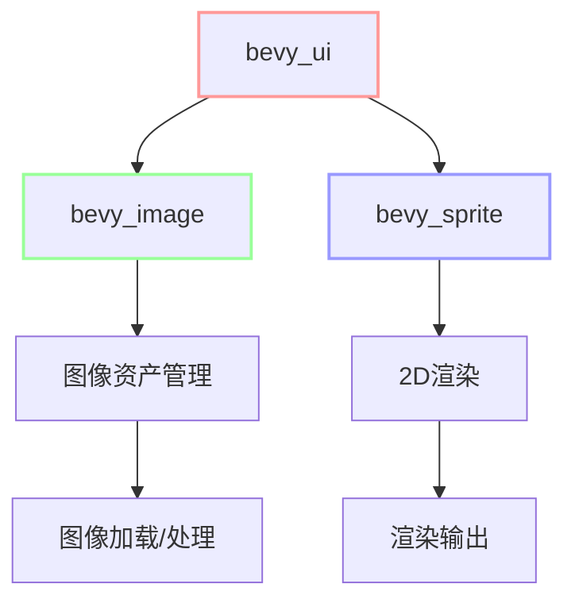

+++
title = "#20502 Make bevy_ui not depend on bevy_render"
date = "2025-08-12T00:00:00"
draft = false
template = "pull_request_page.html"
in_search_index = false

[extra]
current_language = "zh-cn"
available_languages = {"en" = { name = "English", url = "/pull_request/bevy/2025-08/pr-20502-en-20250812" }, "zh-cn" = { name = "中文", url = "/pull_request/bevy/2025-08/pr-20502-zh-cn-20250812" }}
labels = ["A-Rendering", "C-Usability"]
+++

# Make bevy_ui not depend on bevy_render

## Basic Information
- **Title**: Make bevy_ui not depend on bevy_render
- **PR Link**: https://github.com/bevyengine/bevy/pull/20502
- **Author**: atlv24
- **Status**: MERGED
- **Labels**: A-Rendering, C-Usability, S-Ready-For-Final-Review, M-Needs-Migration-Guide
- **Created**: 2025-08-11T02:27:40Z
- **Merged**: 2025-08-12T03:41:04Z
- **Merged By**: alice-i-cecile

## Description Translation
# Objective
- 标题（让 bevy_ui 不再依赖 bevy_render）

## Solution
- 使用系统集（system set）
- 修复 InheritWeights 系统集命名规范
- 将透明图像句柄 UUID 移动到 bevy_image
- 将 ImagePlugin 移动到 bevy_image 以初始化透明图像等
- 将剩余插件重命名为 TexturePlugin
- 技术上它仍然是开发依赖（dev-dep）
- 抱歉这个 PR 本可以拆分得更好

## Testing

## The Story of This Pull Request

### 问题背景
Bevy UI 模块（bevy_ui）长期以来直接依赖渲染模块（bevy_render），这导致两个核心问题：
1. **不必要的依赖关系**：UI 系统本应独立于渲染后端，但当前架构强制 UI 与渲染实现耦合
2. **场景定义限制**：用户无法在非渲染场景（如服务器端或离线处理）中使用 UI 组件，因为它们硬性依赖渲染模块

这种依赖关系尤其体现在：
- UI 组件直接引用渲染模块中的资源（如 `TRANSPARENT_IMAGE_HANDLE`）
- UI 渲染系统依赖渲染模块的初始化逻辑
- 模块边界模糊导致职责不清晰

### 解决方案
核心策略是将渲染相关功能解耦到独立模块：
1. **系统集重命名**：统一系统集命名规范，将 `InheritWeights` 改为 `InheritWeightSystems` 保持一致性
   
   ```diff
   - .before(bevy_mesh::InheritWeights)
   + .before(bevy_mesh::InheritWeightSystems)
   ```

2. **图像资源迁移**：将图像相关资源从渲染模块移到专用图像模块
   - 透明图像句柄 `TRANSPARENT_IMAGE_HANDLE` 迁移到 bevy_image
   - `ImagePlugin` 完全迁移到 bevy_image

3. **插件重构**：
   - 重命名 `bevy_render::texture::ImagePlugin` 为 `TexturePlugin`
   - 确保 `TexturePlugin` 仅处理 GPU 纹理资源，不管理图像资产

4. **依赖清理**：移除 bevy_ui 对 bevy_render 的直接依赖
   - 调整 Cargo.toml 文件
   - 更新导入路径使用 bevy_image 而非 bevy_render

### 关键实现细节
**图像插件迁移**：
- 在 bevy_image 中创建新的 ImagePlugin 实现：
  ```rust
  pub struct ImagePlugin {
      pub default_sampler: ImageSamplerDescriptor,
  }
  
  impl Plugin for ImagePlugin {
      fn build(&self, app: &mut App) {
          // 初始化图像资源和加载器
          app.init_asset::<Image>();
          let mut image_assets = app.world_mut().resource_mut::<Assets<Image>>();
          image_assets.insert(&TRANSPARENT_IMAGE_HANDLE, Image::transparent());
      }
  }
  ```

**渲染模块重构**：
- 创建新的 TexturePlugin 专责 GPU 资源管理：
  ```rust
  #[derive(Default)]
  pub struct TexturePlugin;
  
  impl Plugin for TexturePlugin {
      fn build(&self, app: &mut App) {
          app.add_plugins((
              RenderAssetPlugin::<GpuImage>::default(),
              ExtractResourcePlugin::<ManualTextureViews>::default(),
          ))
          .init_resource::<ManualTextureViews>();
      }
  }
  ```

**依赖调整**：
- 在 bevy_ui 的 Cargo.toml 中移除 bevy_render 依赖：
  ```diff
  - bevy_render = { path = "../bevy_render", version = "0.17.0-dev" }
  ```

- UI 组件改为从 bevy_image 导入资源：
  ```diff
  - use bevy_render::texture::TRANSPARENT_IMAGE_HANDLE;
  + use bevy_image::{prelude::*, TRANSPARENT_IMAGE_HANDLE};
  ```

### 技术洞察
1. **模块边界清晰化**：
   - `bevy_image`: 负责图像资产管理、加载和处理
   - `bevy_render`: 专责 GPU 资源管理和渲染管线
   - `bevy_ui`: 纯 UI 逻辑，无渲染依赖

2. **初始化顺序调整**：
   - 默认插件初始化顺序更新：
     ```rust
     #[cfg(feature = "bevy_image")]
     bevy_image:::ImagePlugin,
     ```

3. **特性标志解耦**：
   - 图像格式支持（如 ktx2/basis）完全移至 bevy_image
   - 渲染模块不再直接依赖图像处理特性

### 影响与收益
1. **架构改进**：
   - bevy_ui 不再依赖 bevy_render，减少 91 行渲染模块代码
   - 模块职责分离符合单一职责原则

2. **使用场景扩展**：
   - UI 系统可在无渲染环境下使用（服务器/离线处理）
   - 自定义渲染器集成更简单

3. **迁移需求**：
   - 用户需更新图像相关导入路径：
     ```diff
     - use bevy_render::texture::{ImagePlugin, Image};
     + use bevy_image::{ImagePlugin, Image};
     ```
   - 系统集名称更新：`InheritWeights` → `InheritWeightSystems`

## Visual Representation



## Key Files Changed

1. **`crates/bevy_image/src/image.rs` (+82/-1)**
   - 添加 ImagePlugin 实现和透明图像句柄
   - 关键代码：
     ```rust
     pub const TRANSPARENT_IMAGE_HANDLE: Handle<Image> = ...;
     
     pub struct ImagePlugin { ... }
     
     impl Plugin for ImagePlugin {
         fn build(&self, app: &mut App) {
             app.init_asset::<Image>();
             // 初始化透明图像
         }
     }
     ```

2. **`crates/bevy_render/src/texture/mod.rs` (+10/-91)**
   - 删除 ImagePlugin，创建 TexturePlugin
   - 关键代码：
     ```rust
     #[derive(Default)]
     pub struct TexturePlugin;
     
     impl Plugin for TexturePlugin {
         fn build(&self, app: &mut App) {
             // GPU 纹理管理
         }
     }
     ```

3. **`crates/bevy_internal/Cargo.toml` (+12/-14)**
   - 重构特性依赖关系
   - 关键修改：
     ```diff
     - basis-universal = ["bevy_image/basis-universal", "bevy_render/basis-universal"]
     + basis-universal = ["bevy_image/basis-universal"]
     ```

4. **`crates/bevy_ui/Cargo.toml`**
   - 移除 bevy_render 依赖：
     ```diff
     - bevy_render = { path = "../bevy_render", version = "0.17.0-dev" }
     ```

5. **`crates/bevy_ui_render/src/lib.rs` (+10/-18)**
   - 更新资源导入路径：
     ```diff
     - use bevy_render::texture::TRANSPARENT_IMAGE_HANDLE;
     + use bevy_image::{prelude::*, TRANSPARENT_IMAGE_HANDLE};
     ```

## Further Reading
1. Bevy 模块架构设计原则:  
   [Bevy Engine Architecture Guide](https://bevyengine.org/learn/book/development/architecture/)
2. ECS 系统排序最佳实践:  
   [Bevy System Ordering Documentation](https://bevyengine.org/learn/book/development/system-order/)
3. 资源管理解耦模式:  
   [Decoupling Patterns in Game Engines](https://gameprogrammingpatterns.com/component.html)