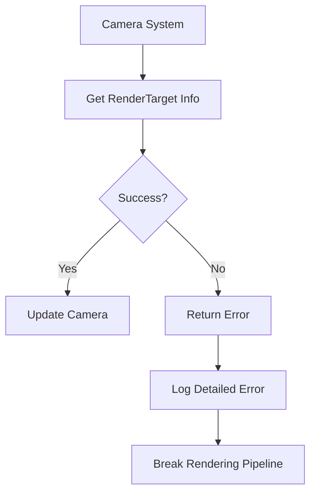

+++
title = "#20503 Error on unloaded ImageRenderTarget"
date = "2025-08-14T00:00:00"
draft = false
template = "pull_request_page.html"
in_search_index = true

[taxonomies]
list_display = ["show"]

[extra]
current_language = "en"
available_languages = {"en" = { name = "English", url = "/pull_request/bevy/2025-08/pr-20503-en-20250814" }, "zh-cn" = { name = "中文", url = "/pull_request/bevy/2025-08/pr-20503-zh-cn-20250814" }}
labels = ["C-Bug", "A-Rendering"]
+++

# Error on unloaded ImageRenderTarget

## Basic Information
- **Title**: Error on unloaded ImageRenderTarget
- **PR Link**: https://github.com/bevyengine/bevy/pull/20503
- **Author**: ecoskey
- **Status**: MERGED
- **Labels**: C-Bug, A-Rendering, S-Ready-For-Final-Review, M-Needs-Migration-Guide
- **Created**: 2025-08-11T02:30:20Z
- **Merged**: 2025-08-14T20:40:14Z
- **Merged By**: alice-i-cecile

## Description Translation
# Objective

When using `RenderTarget::Image` with an image set to use in the render world only, the `camera_system` is unable to get its render target info and fails silently, breaking things down the line. From what I saw the view uniforms stopped updating, but there might be other things it broke as well.

## Solution

At least make it fail loudly :)

Not sure if it should panic here, or return a better error enum that the caller can decide what to do with. Should all failures to update the render target info be hard errors?

## Testing

Error gets printed when running the project I found the bug with

## The Story of This Pull Request

This PR addresses a silent failure in Bevy's rendering pipeline when working with `RenderTarget::Image`. The core issue occurs when an image configured for render-world-only usage is used as a render target. In this scenario, the `camera_system` would fail to retrieve the render target's metadata but continue execution without signaling an error, leading to downstream rendering issues like stale view uniforms.

The original implementation used `Option<RenderTargetInfo>` as the return type for `get_render_target_info`. When metadata lookup failed (e.g., because the image wasn't loaded in the main world), it would simply return `None`, which the `camera_system` ignored:

```rust
// Before
fn get_render_target_info(...) -> Option<RenderTargetInfo> {
    match self {
        NormalizedRenderTarget::Window(...) => ...,
        NormalizedRenderTarget::Image(...) => images.get(...).map(...),
        NormalizedRenderTarget::TextureView(...) => ...,
    }
}
```

This silent failure was problematic because it broke rendering invariants without clear feedback. The solution replaces the `Option` with a `Result<RenderTargetInfo, MissingRenderTargetInfoError>`, introducing explicit error cases for each render target type:

```rust
#[derive(Debug, thiserror::Error)]
pub enum MissingRenderTargetInfoError {
    #[error("RenderTarget::Window missing ({window:?}): Make sure the provided entity has a Window component.")]
    Window { window: Entity },
    #[error("RenderTarget::Image missing ({image:?}): Make sure the Image's usages include RenderAssetUsages::MAIN_WORLD.")]
    Image { image: AssetId<Image> },
    #[error("RenderTarget::TextureView missing ({texture_view:?}): make sure the texture view handle was not removed.")]
    TextureView { texture_view: ManualTextureViewHandle },
}
```

The error enum provides targeted diagnostic information, specifying exactly which resource type (Window, Image, or TextureView) is missing and its identifier. This helps developers quickly identify the root cause of configuration errors.

In the `camera_system`, error handling is added to propagate these failures. The system now returns a `Result<(), BevyError>` and uses the `?` operator to handle errors:

```rust
// After
pub fn camera_system(...) -> Result<(), BevyError> {
    // ...
    let new_computed_target_info = normalized_target.get_render_target_info(
        windows,
        &images,
        &manual_texture_views,
    )?; // Propagates error
    // ...
}
```

This change ensures that when render target metadata is unavailable, the system fails immediately and logs a detailed error message rather than proceeding with invalid state. The error messages explicitly guide developers toward solutions, such as ensuring images have `RenderAssetUsages::MAIN_WORLD` when used as render targets.

The PR includes a migration guide that explains the change:

```markdown
---
title: "RenderTarget error handling"
pull_requests: [20503]
---

`NormalizedRenderTargetExt::get_render_target_info` now returns a `Result`,
with the `Err` variant indicating which render target (image, window, etc)
failed to load its metadata.

This should mostly be treated as a hard error, since it indicates the rendering
state of the app is broken.
```

## Visual Representation



## Key Files Changed

### `crates/bevy_render/src/camera.rs` (+45/-30)
This file contains the core logic changes. The `get_render_target_info` method now returns a `Result` with detailed error information, and the `camera_system` propagates these errors.

Key changes:
```rust
// Before: Returning Option
fn get_render_target_info(...) -> Option<RenderTargetInfo> {
    match self {
        NormalizedRenderTarget::Window(window_ref) => ...,
        NormalizedRenderTarget::Image(image_target) => images.get(...).map(...),
        // ...
    }
}

// After: Returning Result with error cases
fn get_render_target_info(...) -> Result<RenderTargetInfo, MissingRenderTargetInfoError> {
    match self {
        NormalizedRenderTarget::Window(window_ref) => ... 
            .ok_or(MissingRenderTargetInfoError::Window { ... }),
        NormalizedRenderTarget::Image(image_target) => images
            .get(...)
            .map(...)
            .ok_or(MissingRenderTargetInfoError::Image { ... }),
        // ...
    }
}

// System now returns Result
pub fn camera_system(...) -> Result<(), BevyError> {
    // ...
    let target_info = normalized_target.get_render_target_info(...)?;
    // ...
}
```

### `release-content/migration-guides/render_target_info_error.md` (+11/-0)
This new file provides migration guidance for the breaking change:

```markdown
---
title: "RenderTarget error handling"
pull_requests: [20503]
---

`NormalizedRenderTargetExt::get_render_target_info` now returns a `Result`,
with the `Err` variant indicating which render target (image, window, etc)
failed to load its metadata.

This should mostly be treated as a hard error, since it indicates the rendering
state of the app is broken.
```

## Further Reading
1. [Bevy Render Targets Documentation](https://bevyengine.org/learn/book/features/rendering/render-targets/)
2. [Error Handling in Bevy Systems](https://bevyengine.org/learn/book/features/ecs/error-handling/)
3. [thiserror Crate Documentation](https://docs.rs/thiserror/latest/thiserror/) (used for error enum implementation)