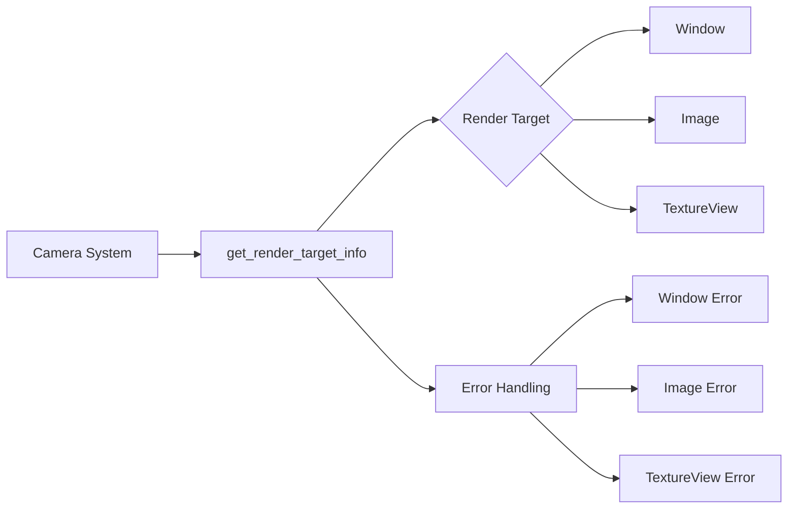

+++
title = "#20503 Error on unloaded ImageRenderTarget"
date = "2025-08-14T00:00:00"
draft = false
template = "pull_request_page.html"
in_search_index = false

[extra]
current_language = "zh-cn"
available_languages = {"en" = { name = "English", url = "/pull_request/bevy/2025-08/pr-20503-en-20250814" }, "zh-cn" = { name = "中文", url = "/pull_request/bevy/2025-08/pr-20503-zh-cn-20250814" }}
+++

# 分析报告：PR #20503 - Error on unloaded ImageRenderTarget

## 基本信息
- **标题**: Error on unloaded ImageRenderTarget
- **PR链接**: https://github.com/bevyengine/bevy/pull/20503
- **作者**: ecoskey
- **状态**: 已合并
- **标签**: C-Bug, A-Rendering, S-Ready-For-Final-Review, M-Needs-Migration-Guide
- **创建时间**: 2025-08-11T02:30:20Z
- **合并时间**: 2025-08-14T20:40:14Z
- **合并人**: alice-i-cecile

## 描述翻译
### 目标
当使用 `RenderTarget::Image` 且图像仅在渲染世界(render world)中使用时，`camera_system` 无法获取其渲染目标信息并静默失败，导致下游功能中断。根据观察，视图 uniforms 停止更新，但可能还存在其他问题。

### 解决方案
至少使其失败时发出明确错误提示 :)

不确定此处是否应 panic，或返回更完善的错误枚举供调用方处理。所有更新渲染目标信息失败的情况都应视为硬错误吗？

### 测试
在发现该问题的项目中运行时可打印错误信息

---

## PR技术分析

### 问题背景
当开发者在 Bevy 中使用 `RenderTarget::Image` 时，如果目标图像仅在渲染世界可用（未加载到主世界），`camera_system` 无法获取渲染目标信息。这会导致静默失败：
1. 视图 uniforms 停止更新
2. 后续渲染流程出现未定义行为
3. 难以诊断的渲染问题

根本原因是 `get_render_target_info` 方法返回 `Option`，失败时静默返回 `None`，系统继续执行但使用无效数据。

### 解决方案
核心思路是将静默失败转为显式错误处理：
1. 将返回类型从 `Option<RenderTargetInfo>` 改为 `Result<RenderTargetInfo, MissingRenderTargetInfoError>`
2. 定义详细的错误枚举，区分失败场景
3. 在 `camera_system` 中传播错误

### 实现细节
首先引入错误枚举，明确区分三种失败场景：
```rust
#[derive(Debug, thiserror::Error)]
pub enum MissingRenderTargetInfoError {
    #[error("RenderTarget::Window missing ({window:?}): Make sure the provided entity has a Window component.")]
    Window { window: Entity },
    #[error("RenderTarget::Image missing ({image:?}): Make sure the Image's usages include RenderAssetUsages::MAIN_WORLD.")]
    Image { image: AssetId<Image> },
    #[error("RenderTarget::TextureView missing ({texture_view:?}): make sure the texture view handle was not removed.")]
    TextureView {
        texture_view: ManualTextureViewHandle,
    },
}
```

接着修改 `get_render_target_info` 实现，将 `Option` 转换为 `Result`：
```rust
// 修改前返回 Option
fn get_render_target_info(...) -> Option<RenderTargetInfo> 

// 修改后返回 Result
fn get_render_target_info(...) -> Result<RenderTargetInfo, MissingRenderTargetInfoError>
```

具体匹配分支改为返回错误而非 `None`：
```rust
match self {
    NormalizedRenderTarget::Window(window_ref) => {
        // 原实现
        .map(...)
        // 改为错误返回
        .ok_or(MissingRenderTargetInfoError::Window { ... })
    }
    // 其他分支类似处理
}
```

在 `camera_system` 中处理错误传播：
```rust
// 修改前：静默处理
let new_computed_target_info = ...; // Option 类型

// 修改后：使用 ? 操作符传播错误
let new_computed_target_info = normalized_target.get_render_target_info(...)?;
```

系统签名改为返回 `Result`：
```rust
// 修改前
pub fn camera_system(...) 

// 修改后
pub fn camera_system(...) -> Result<(), BevyError>
```

### 技术考量
1. **错误传播设计**：使用 `Result` 而非 `panic!` 保持系统弹性，允许上层处理
2. **错误信息价值**：每个错误变体包含具体资源ID，便于诊断：
   - Window 错误包含实体ID
   - Image 错误包含资源ID
   - TextureView 错误包含句柄
3. **视口处理优化**：错误传播后，视口尺寸计算可直接使用有效数据：
```rust
// 错误传播后无需空值检查
viewport.clamp_to_size(new_computed_target_info.physical_size);
```

### 影响与最佳实践
1. **调试体验**：开发者会收到明确错误信息而非静默失败
2. **迁移要求**：需要更新处理渲染目标的代码，处理可能的错误
3. **错误处理建议**：
   - 多数情况应视为硬错误，中断渲染流程
   - 特殊场景可尝试恢复，但需谨慎

### 迁移指南
新增迁移文档 `render_target_info_error.md` 明确说明：
```markdown
`NormalizedRenderTargetExt::get_render_target_info` now returns a `Result`,
with the `Err` variant indicating which render target (image, window, etc)
failed to load its metadata.

This should mostly be treated as a hard error, since it indicates the rendering
state of the app is broken.
```

## 组件关系图



## 关键文件变更

### crates/bevy_render/src/camera.rs
**变更原因**：实现渲染目标错误处理机制  
**主要修改**：
1. 引入错误枚举 `MissingRenderTargetInfoError`
2. 修改 `get_render_target_info` 返回类型为 `Result`
3. 更新 `camera_system` 错误处理逻辑

**代码对比**：
```rust
// 修改前：返回 Option
fn get_render_target_info(...) -> Option<RenderTargetInfo> {
    match self {
        NormalizedRenderTarget::Window(window_ref) => {
            // ...
            Some(RenderTargetInfo { ... })
        }
    }
}

// 修改后：返回 Result
fn get_render_target_info(...) -> Result<RenderTargetInfo, MissingRenderTargetInfoError> {
    match self {
        NormalizedRenderTarget::Window(window_ref) => {
            // ...
            .ok_or(MissingRenderTargetInfoError::Window { ... })
        }
    }
}

// 修改前：无错误处理
pub fn camera_system(...) {
    let new_computed_target_info = ...; // Option
    if let Some(target) = target_info {
        // ...
    }
}

// 修改后：错误传播
pub fn camera_system(...) -> Result<(), BevyError> {
    let new_computed_target_info = ...?; // 错误传播
    // 直接使用有效数据
    viewport.clamp_to_size(new_computed_target_info.physical_size);
}
```

### release-content/migration-guides/render_target_info_error.md
**变更原因**：为新错误处理机制提供迁移指南  
**新增内容**：
```markdown
`NormalizedRenderTargetExt::get_render_target_info` now returns a `Result`,
with the `Err` variant indicating which render target (image, window, etc)
failed to load its metadata.

This should mostly be treated as a hard error, since it indicates the rendering
state of the app is broken.
```

## 延伸阅读
1. Bevy 错误处理指南：[Error Handling in Bevy](https://bevyengine.org/learn/book/error-handling/)
2. Rust 错误处理最佳实践：[Rust Error Handling](https://doc.rust-lang.org/book/ch09-00-error-handling.html)
3. Bevy 渲染管线文档：[Bevy Render Pipeline](https://bevyengine.org/learn/book/render-pipeline/)