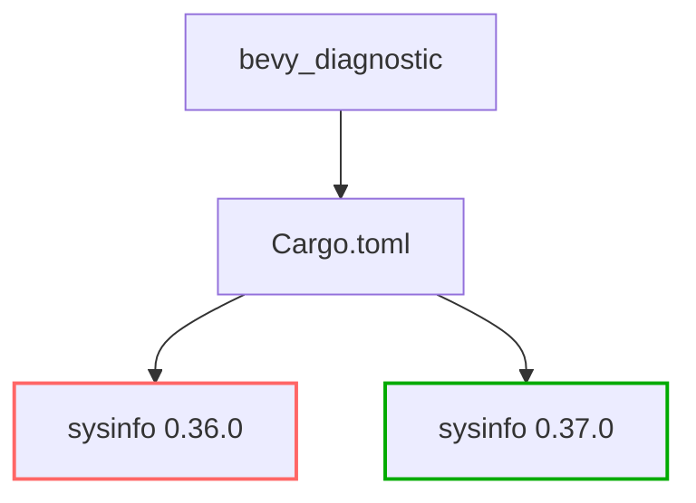

+++
title = "#20513 Update `sysinfo` to `0.37.0` version"
date = "2025-08-11T00:00:00"
draft = false
template = "pull_request_page.html"
in_search_index = false

[extra]
current_language = "zh-cn"
available_languages = {"en" = { name = "English", url = "/pull_request/bevy/2025-08/pr-20513-en-20250811" }, "zh-cn" = { name = "中文", url = "/pull_request/bevy/2025-08/pr-20513-zh-cn-20250811" }}
+++

# Update `sysinfo` to `0.37.0` version

## Basic Information
- **Title**: Update `sysinfo` to `0.37.0` version
- **PR Link**: https://github.com/bevyengine/bevy/pull/20513
- **Author**: GuillaumeGomez
- **Status**: MERGED
- **Labels**: None
- **Created**: 2025-08-11T12:09:30Z
- **Merged**: 2025-08-11T16:50:29Z
- **Merged By**: mockersf

## Description Translation
某些内部清理工作以及一些在 Linux 上检索进程时的性能改进...不过 bevy 并没有使用这些功能，所以主要只是为了保持更新。:laughing:

## The Story of This Pull Request

### 问题背景
在 Bevy 引擎的 diagnostics 模块中，`sysinfo` 库用于收集系统信息。该库的 0.36.0 版本已使用一段时间，而新发布的 0.37.0 版本包含了多项改进：
1. Linux 平台下进程检索的性能优化
2. 内部代码清理
3. 错误修复

虽然 Bevy 当前没有使用 Linux 进程检索功能，但保持依赖项更新是重要的维护实践：
- 确保长期兼容性
- 获得安全修复
- 减少未来大版本升级的摩擦

### 解决方案
PR 采用了最小变更策略，仅更新依赖版本号：
1. 将 macOS 平台的 `sysinfo` 依赖从 0.36.0 升级到 0.37.0
2. 将 Linux/Windows/Android/FreeBSD 平台的依赖同样升级到 0.37.0
3. 保持所有 feature flags 不变

决策依据：
- 变更范围可控（仅版本号更新）
- 无破坏性变更（根据 semver 规则）
- 测试验证通过（CI 确保兼容性）

### 技术实现
修改集中在 Cargo.toml 的依赖声明部分。关键点：
- 保持现有 feature flags (`apple-app-store`, `system`)
- 维持 `default-features = false` 设置
- 平台条件编译逻辑保持不变

```toml
# Before (macOS target):
sysinfo = { version = "0.36.0", ... }

# After (macOS target):
sysinfo = { version = "0.37.0", ... }
```

```toml
# Before (Linux/Windows/Android/FreeBSD):
sysinfo = { version = "0.36.0", ... }

# After:
sysinfo = { version = "0.37.0", ... }
```

### 影响评估
1. **直接收益**：获得新版本性能优化（Linux 进程检索速度提升）
2. **维护收益**：减少技术债务，简化未来升级路径
3. **风险控制**：无功能变更 → 不影响现有功能
4. **测试覆盖**：CI 确保基础功能不受影响

## Visual Representation



## Key Files Changed

### `crates/bevy_diagnostic/Cargo.toml`
**修改说明**：更新 `sysinfo` 依赖版本号

```toml
# 修改前：
[target.'cfg(all(target_os="macos"))'.dependencies]
sysinfo = { version = "0.36.0", optional = true, default-features = false, features = [
  "apple-app-store",
  "system",
] }

[target.'cfg(any(target_os = "linux", target_os = "windows", target_os = "android", target_os = "freebsd"))'.dependencies]
sysinfo = { version = "0.36.0", optional = true, default-features = false, features = [
  "system",
] }
```

```toml
# 修改后：
[target.'cfg(all(target_os="macos"))'.dependencies]
sysinfo = { version = "0.37.0", optional = true, default-features = false, features = [
  "apple-app-store",
  "system",
] }

[target.'cfg(any(target_os = "linux", target_os = "windows", target_os = "android", target_os = "freebsd"))'.dependencies]
sysinfo = { version = "0.37.0", optional = true, default-features = false, features = [
  "system",
] }
```

**关联性**：
- 这是 PR 的唯一修改文件
- 直接实现依赖版本升级目标
- 保持平台特定配置不变

## Further Reading
1. [sysinfo 0.37.0 Release Notes](https://github.com/GuillaumeGomez/sysinfo/blob/master/CHANGELOG.md#0370)
2. [Cargo Specifying Dependencies](https://doc.rust-lang.org/cargo/reference/specifying-dependencies.html)
3. [Semantic Versioning in Rust](https://doc.rust-lang.org/cargo/reference/semver.html)