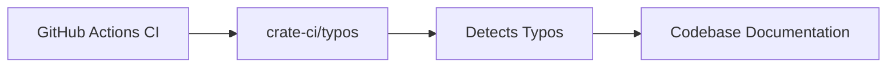

+++
title = "#20514 Bump crate-ci/typos from 1.34.0 to 1.35.3"
date = "2025-08-11T00:00:00"
draft = false
template = "pull_request_page.html"
in_search_index = true

[taxonomies]
list_display = ["show"]

[extra]
current_language = "en"
available_languages = {"en" = { name = "English", url = "/pull_request/bevy/2025-08/pr-20514-en-20250811" }, "zh-cn" = { name = "中文", url = "/pull_request/bevy/2025-08/pr-20514-zh-cn-20250811" }}
labels = ["C-Docs", "D-Trivial", "A-Build-System"]
+++

# Analysis of PR #20514: Bump crate-ci/typos from 1.34.0 to 1.35.3

## Basic Information
- **Title**: Bump crate-ci/typos from 1.34.0 to 1.35.3
- **PR Link**: https://github.com/bevyengine/bevy/pull/20514
- **Author**: greeble-dev
- **Status**: MERGED
- **Labels**: C-Docs, D-Trivial, A-Build-System, S-Needs-Review
- **Created**: 2025-08-11T14:13:57Z
- **Merged**: 2025-08-11T16:37:05Z
- **Merged By**: mockersf

## Description Translation
Adopted from #20507. Bumps crate-ci/typos from 1.34.0 to 1.35.3.

## The Story of This Pull Request
This PR addresses two related maintenance tasks: updating a dependency in the CI pipeline and fixing a typo detected by that updated dependency. The primary change updates the `crate-ci/typos` action in GitHub Actions from version 1.34.0 to 1.35.3. This dependency bump brings improvements to the spell-checking tool used in Bevy's continuous integration pipeline, including better detection capabilities and potentially new dictionaries.

The second change fixes a typo in a documentation comment within the ECS module. The typo ("requiremensts" → "requirements") was either detected by the updated typos tool or identified during manual review. This correction maintains the professionalism and readability of Bevy's documentation.

The changes are straightforward but important for maintaining code quality. Keeping CI tools updated ensures the project benefits from the latest bug fixes and improvements in external dependencies. Fixing documentation typos improves codebase maintainability by making comments and documentation more readable and accurate.

## Visual Representation


## Key Files Changed

1. `.github/workflows/ci.yml`
   - **Change**: Updated typos action version
   - **Why**: To leverage improvements in the spell-checking tool
   - **Code Change**:
```yaml
# Before:
      - name: Check for typos
        uses: crate-ci/typos@v1.34.0

# After:
      - name: Check for typos
        uses: crate-ci/typos@v1.35.3
```

2. `crates/bevy_ecs/src/system/builder.rs`
   - **Change**: Fixed typo in documentation comment
   - **Why**: To maintain documentation quality and accuracy
   - **Code Change**:
```rust
// Before:
// Note that the exact safety requiremensts depend on the implementation of [`SystemParam`],

// After:
// Note that the exact safety requirements depend on the implementation of [`SystemParam`],
```

## Further Reading
1. [typos GitHub Action Documentation](https://github.com/crate-ci/typos)
2. [Bevy Engine CI Workflow Documentation](https://github.com/bevyengine/bevy/blob/main/.github/workflows/ci.yml)
3. [SystemParamBuilder Documentation](https://docs.rs/bevy-ecs/latest/bevy_ecs/system/struct.SystemParamBuilder.html)